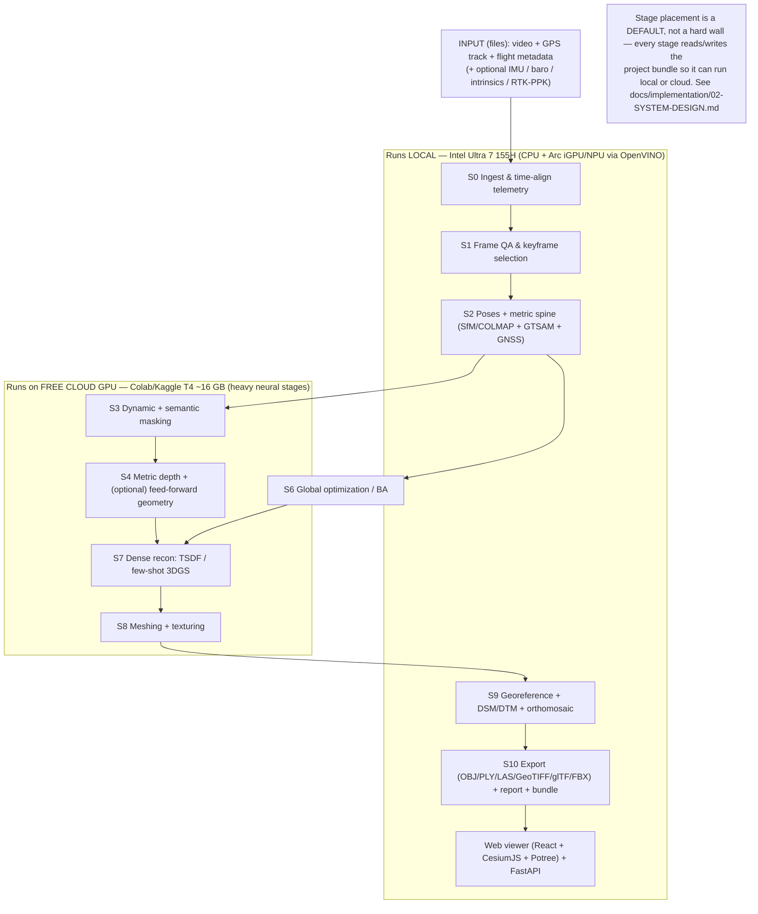

# AGENTS.md — DRISHTI project context for AI agents

**Purpose:** The single file an AI agent (or a new human contributor) reads *first* to understand the
whole DRISHTI project — what we are building now, the scope it was narrowed to, the hard constraints,
how the code is organized, what is done, what is next, and the rules for working here. If you are an AI
agent picking up this project, **read this file top to bottom before doing anything**, then follow the
pointers into `docs/`.

**Audience:** AI coding agents (Claude Code and others) and human contributors. This is an operational
context file, not a pitch — for the evaluator-facing story see [`docs/00-MASTER-OVERVIEW.md`](docs/00-MASTER-OVERVIEW.md).

**Status:** Living document. **Last updated:** 2026-09-09 · **Current phase:** Phase 0 (Foundations) —
*planning complete, implementation not started*. Keep the [Project status](#8-project-status-keep-this-current)
and [Decision log](#9-decision-log-append-only) sections current on every meaningful change.

---

## 0. TL;DR for a new agent

- **What:** DRISHTI turns a **single-pass drone video + GPS + flight metadata** (a *recording handed to
  us after the flight*) into a **georeferenced, metrically accurate, textured 3D model** plus point
  cloud, DSM/DTM, orthomosaic, semantic layers, an accuracy report, and a web viewer.
- **Big scope change (read [§2](#2-scope-what-changed-and-why-it-matters)):** we do **NOT** deploy
  anything on the drone. **No Jetson/edge tier, no on-UAV compute, no live/streaming path.** Input is a
  *recorded* clip; everything runs **on the ground, offline, after the fact**, producing **one
  full-quality final 3D output** (not a live coarse map + refine).
- **Compute reality (read [§4](#4-compute-model-the-binding-constraint)):** the dev machine is an
  **Intel Core Ultra 7 155H** (16 cores, Arc iGPU, NPU — used via **OpenVINO**) with **no discrete
  GPU**. Heavy neural stages run on **free cloud GPU (Google Colab / Kaggle T4, ~16 GB)**. The system
  must stay **offline-capable**. This constraint drives every model choice — pick T4-/OpenVINO-friendly
  components, tile/chunk for 16 GB, and split stages **local vs cloud**.
- **Non-negotiables (read [§5](#5-non-negotiable-principles)):** **no hardcoded data / no stub
  outputs** (real footage → real models → real artifacts), **honesty policy** (never fabricate accuracy
  numbers; flag inferred vs measured geometry; label design targets), **confidence on every stage**,
  **permissive licenses only** in the shipped path.
- **How work is organized:** a **7-phase plan** (Phase 0–6), planned in full in
  [`docs/implementation/01-IMPLEMENTATION-PLAN.md`](docs/implementation/01-IMPLEMENTATION-PLAN.md).
  Build phase by phase; do not skip ahead without updating the plan.
- **The authoritative architecture** (pipeline stages S0–S10, model registry, spines) is
  [`docs/_internal/CANONICAL-ARCHITECTURE-SPEC.md`](docs/_internal/CANONICAL-ARCHITECTURE-SPEC.md).
  This build is a **ground-only realization** of it — see the scope delta in [§2](#2-scope-what-changed-and-why-it-matters).

---

## 1. What DRISHTI is

DRISHTI ("vision" / *dṛṣṭi*) is the response to **NTRO / Smart India Hackathon PS-17 · SIH26158 —
*Single-Pass Drone Video to Accurate 3D Model Generation System.*** The hard problem: classical
photogrammetry needs many overlapping passes and hours of offline Structure-from-Motion + Multi-View
Stereo; the target scenario gives **one pass, one chance**. DRISHTI reframes it as a
**prior-assisted, sensor-fused reconstruction** problem: a single pass yields weak multi-view geometry
but a strong **GPS + temporal** signal and strong **learned priors**, fused behind a **metric spine**
(scale + georeference without Ground Control Points) with **confidence carried end to end**.

The official bar (from the problem statement, authoritative):

| Parameter | Official target |
|-----------|-----------------|
| Reconstruction type | 3D mesh / point cloud |
| Spatial accuracy | **≤ 1 m** absolute |
| Processing time | **< 15 min for a 10-min video** (see the honesty note in [§5](#5-non-negotiable-principles)) |
| Coverage | Entire visible scene |
| Output formats | **OBJ · PLY · LAS · GeoTIFF · .glb/.gltf · .fbx** (required set) |
| Visualization | Web-based or desktop viewer |
| Evaluation weights | Accuracy 30% · Completeness 20% · Speed 20% · Innovation 15% · Scalability 10% · UI 5% |

Mandatory inputs: **video (1080p/4K) + GPS + flight metadata**. Optional (tighten accuracy when
present, never assumed): IMU, barometric altitude, camera intrinsics, RTK/PPK.

---

## 2. Scope: what changed, and why it matters

> **This section overrides the deployment assumptions of the canonical architecture spec for the
> current build.** The spec describes the *full-system vision* (three tiers, two output paths, on-UAV
> edge compute). The build we are actually doing is a **ground-only, offline, footage-in realization**
> of that vision. This is a sanctioned narrowing, recorded here per the style guide's rule to document
> divergence explicitly rather than contradict the spec silently.

**What we are building now:**

- **Input:** a *pre-recorded* single-pass drone clip **plus** its GPS track and flight metadata (and
  the optional streams if the dataset includes them). We receive files, not a live feed.
- **Processing:** **100% on the ground**, offline, after the flight. **No drone-side payload, no
  Jetson, no edge tier, no live streaming, no in-flight coverage HUD.**
- **Output:** **one full-quality final result** — the complete deliverable set — not a fast live
  preview followed by a refine. There is a single reconstruction pipeline.

**Scope delta vs. the canonical spec (map the S0–S10 stages onto this build):**

| Canonical concept | In this build |
|-------------------|---------------|
| **Edge Tier (on-UAV Jetson)** | **Removed.** No on-drone compute at all. |
| **Live path (S0–S5, near-real-time)** | **Removed as a live path.** Its *algorithms* survive as ordinary offline stages. |
| **Two output paths (Live + Refine)** | **Collapsed to one** offline pipeline producing the full model. |
| **S0 Capture & Sync** | Becomes **"Ingest recorded footage + parse & time-align telemetry"** — no hardware clock; align frames to logged GPS/IMU timestamps from the files. |
| **S1 Ingest & Frame QA** | Same, offline: decode, blur/exposure gating, keyframe selection. |
| **S2 Odometry & Localization** | Offline poses (SfM / feed-forward) + GTSAM factor graph (visual + GNSS) → metric georeferenced trajectory. |
| **S3 Perception & Masking** | Same, offline. |
| **S4 Depth & Geometry** | Same, offline (the *full* models, not the edge-lite ones). |
| **S5 Live Fusion (nvblox on Jetson)** | **Replaced** by ground dense fusion (Open3D TSDF) folded into S7; nvblox is not used (it is a Jetson component). |
| **S6–S10 (Ground Tier)** | **Unchanged in spirit** — this is now the *whole* system: global optimization → dense/3DGS → mesh/texture → georef/semantics → export/serve. |
| **Cloud Tier (optional)** | Repurposed: the **free cloud GPU (Colab/Kaggle)** is where heavy neural stages run — an implementation detail of "the ground tier," not a serving tier. |

**What this does NOT change:** the reconstruction thesis, the metric spine (A2), prior-assisted
geometry (A1), confidence propagation and graceful degradation (A4), the honesty policy, the required
output formats, the ≤ 1 m accuracy goal, and the permissive-licensing posture. All of these remain
fully in force.

---

## 3. The pipeline (offline, ground-only) at a glance



Stage-by-stage detail is in [`docs/02-HOW-IT-WORKS.md`](docs/02-HOW-IT-WORKS.md) (full-vision framing)
and the per-phase breakdown in the implementation plan. **Local vs cloud placement above is the
default**, chosen for the T4/Intel constraint; because every stage exchanges data through the on-disk
**project bundle**, placement is configurable, not wired in.

---

## 4. Compute model (the binding constraint)

There is **no discrete GPU** available. Design and choose models accordingly.

| Environment | Hardware | Runs | Notes |
|-------------|----------|------|-------|
| **Local** | Intel **Core Ultra 7 155H**: 16 cores (6P+8E+2LP), **Arc iGPU** (Xe), **NPU** (AI Boost) | Orchestration, ingest, frame QA, SfM (CPU), factor graph, geospatial I/O, meshing (CPU/Open3D), exports, viewer + API; light inference via **OpenVINO** on iGPU/NPU | 16 GB+ system RAM assumed; no CUDA locally |
| **Cloud (free)** | **Google Colab / Kaggle** T4 (~16 GB VRAM); Kaggle also offers 2×T4 | Heavy neural stages: metric depth (full-res), masking (SAM2/RT-DETR), feed-forward geometry (chunked), 3DGS training, learned meshing | Ephemeral, time-limited; artifacts sync via the project bundle (Drive mount / zip) |
| **Production (aspirational)** | Single RTX-class GPU workstation (per canonical BOM) | Everything in one place, faster | Not required; the free-tier path must work end to end |

**Consequences you must respect:**

- **Fit 16 GB.** Prefer memory-light defaults: **COLMAP/GLOMAP** poses, **Depth Anything V2
  (small/base)** + **Metric3D v2** depth, **gsplat** 3DGS, **Open3D** fusion/meshing. Treat
  billion-parameter feed-forward transformers (MapAnything/Pi3; VGGT is reference-only) as an
  **optional enhancement** run in **chunked windows**, never a hard dependency.
- **Tier by artifact, not by tight coupling.** Each stage reads inputs from and writes outputs to the
  **project bundle** on disk, so a stage can run on Colab and the next locally. No stage assumes the
  previous one shared GPU memory with it.
- **OpenVINO is the local accelerator.** Where a model has an OpenVINO path (e.g. Depth Anything,
  detectors, segmenters), provide it so the Arc iGPU/NPU is used instead of pure CPU.
- **Time budget is honest and hardware-relative.** The official "< 15 min / 10-min video" is a
  **GPU-class target**. On a free T4 or Intel iGPU it will be slower; **measure and report per
  environment** — never claim the official number on weak hardware. See [§5](#5-non-negotiable-principles).

Full detail: [`docs/implementation/02-SYSTEM-DESIGN.md` §Compute tiering](docs/implementation/02-SYSTEM-DESIGN.md).

---

## 5. Non-negotiable principles

1. **No hardcoded data. No stub outputs. Everything live.** The pipeline runs **real footage through
   real models to real artifacts**. Specifically:
   - All inputs come from the provided files; **all parameters come from config** (`configs/*.yaml`) +
     CLI overrides — never magic numbers in code.
   - **CRS/EPSG is derived from the GPS track** (compute the UTM zone from median lon/lat); never
     hardcode a zone or a datum.
   - If a required input field is missing, **fail loudly** with a clear message — do not silently
     substitute a placeholder.
   - **Never fabricate outputs or accuracy numbers.** Mocks are allowed only inside unit tests for
     isolation; they must never appear in the delivered pipeline or a demo.
2. **Honesty policy (from the style guide, binding).**
   - "Real-time" is not claimed; this build is explicitly offline. Report **measured processing time
     per environment**.
   - "Metric without GCPs" = sensor-fused scale/georeference with **configuration-dependent** accuracy;
     **flag any region that exceeds the ≤ 1 m bar** rather than averaging it away.
   - **Inferred geometry** (occlusion completion, low-parallax fills) is **flagged and excluded from
     measurement by default** — never presented as measured.
   - Label every quantitative figure **design target** vs **measured**; label external benchmark
     numbers as reported by their authors.
3. **Confidence everywhere.** Every stage emits a confidence/uncertainty signal that propagates into
   the final artifacts and the accuracy report (anchor A4). A model with no usable confidence must be
   wrapped in one (multi-view agreement, geometric residual).
4. **Permissive licenses only in the shipped path.** Apache/MIT/BSD/CC-BY. Non-commercial or
   military-excluded checkpoints (VGGT commercial ckpt, DUSt3R/MASt3R, UniDepth V2, Ultralytics YOLO)
   are **reference/benchmark only, never shipped**. See the license ledger in
   [`docs/03-TECHNOLOGY-STACK.md` §5](docs/03-TECHNOLOGY-STACK.md).
5. **Reproducible & offline.** Pinned model/library versions with checksums (a model registry), fixed
   seeds, a run manifest hashing inputs→outputs, and no mandatory network call at run time.
6. **Match the docs.** Follow [`docs/_internal/STYLE_GUIDE.md`](docs/_internal/STYLE_GUIDE.md): DRISHTI
   naming, canonical terminology, tables + Mermaid, "Open questions" sections. Cite the canonical spec;
   record divergence here, don't contradict silently.

---

## 6. Tech stack (chosen for this build)

Concrete and buildable on the compute above. Full rationale in
[`docs/implementation/02-SYSTEM-DESIGN.md`](docs/implementation/02-SYSTEM-DESIGN.md); license ledger in
[`docs/03-TECHNOLOGY-STACK.md`](docs/03-TECHNOLOGY-STACK.md).

| Concern | Choice |
|---------|--------|
| Language / runtime | **Python 3.11+** |
| Config | **Pydantic v2 settings + YAML profiles** + CLI/env overrides (no hardcoded values) |
| CLI / orchestration | **Typer** CLI + a lightweight **stage-runner** (typed stages over the project bundle; resumable) |
| Video I/O | **PyAV / ffmpeg** (decode), OpenCV for frame ops |
| Telemetry parsing | Adapters for **DJI SRT**, CSV, **MAVLink** (`.tlog`/`.bin` via pymavlink), EXIF (exiftool/piexif) |
| Poses / SfM | **pycolmap + GLOMAP** (self-calibrated intrinsics) |
| Metric spine | **GTSAM** factor graph (visual + GNSS; IMU/RTK folded in when present); Umeyama/Sim(3) GPS alignment |
| Depth | **Depth Anything V2** (small/base, OpenVINO local) · **Metric3D v2** (T4) |
| Feed-forward geometry (optional) | **MapAnything / Pi3** (permissive), chunked on T4 — enhancement, not required |
| Masking | **RT-DETR + SAM 2 + ByteTrack**; **RAFT** motion residual |
| Dense recon | **Open3D** TSDF/point fusion · **gsplat** few-shot 3DGS (depth/normal/confidence reg) |
| Mesh / texture | **2DGS/SuGaR** or **screened Poisson** (Open3D) · **MVS-Texturing** / best-view |
| Geospatial | **PROJ/pyproj · GDAL/rasterio · PDAL · LAStools/Entwine** |
| Exports | trimesh · pygltflib/Assimp · **Blender headless (`bpy`)** for FBX (out-of-process, GPL isolated) |
| 3D Tiles / viewer | **py3dtiles** · **React (Vite) + CesiumJS + Potree** · **FastAPI** backend |
| Accel runtimes | **OpenVINO** (local iGPU/NPU) · **PyTorch/CUDA** (cloud T4) · ONNX as interchange |
| Packaging | **Docker** (a CUDA image for cloud, a CPU/OpenVINO image for local); `uv`/conda envs |
| Tests / CI | **pytest** + GitHub Actions; determinism via seeds + pinned versions |

---

## 7. Repository layout (target — created during Phase 0)

```text
rtos/                              # repo root
├── AGENTS.md                      # ← you are here (read first)
├── README.md                      # short repo readme (points here + to docs/)
├── pyproject.toml                 # Python project (deps, tooling)
├── configs/                       # ALL tunables live here (no hardcoded values)
│   ├── default.yaml               # base config
│   ├── profiles/{fast,balanced,max}.yaml
│   └── datasets/*.yaml            # per-dataset input descriptors (paths, telemetry format, CRS hints)
├── src/drishti/
│   ├── cli.py                     # `drishti` Typer entrypoint
│   ├── config/                    # pydantic models + loader
│   ├── bundle/                    # project-bundle schema, manifest, hashing, resume
│   ├── stages/                    # S0..S10, each a typed Stage over the bundle
│   ├── models/                    # model registry (pinned + sha256), loaders (OpenVINO/torch)
│   ├── geo/                       # CRS/UTM/geoid, georeferencing
│   ├── io/                        # video decode, telemetry adapters, exporters
│   └── report/                    # accuracy & confidence report
├── viewer/                        # React + Vite + CesiumJS/Potree frontend
├── server/                        # FastAPI app serving artifacts + measurement API
├── docker/                        # cloud (CUDA) + local (CPU/OpenVINO) images
├── notebooks/                     # Colab/Kaggle runners for cloud stages
├── tests/                         # pytest (real small clips; no fabricated outputs)
└── docs/                          # documentation (architecture + implementation)
```

If reality diverges from this tree, **update this section** and the system-design doc.

---

## 8. Project status (keep this current)

Update the "State" column and the "Now / Next" line whenever you finish meaningful work. Phase detail
and exit criteria: [`docs/implementation/01-IMPLEMENTATION-PLAN.md`](docs/implementation/01-IMPLEMENTATION-PLAN.md).

| Phase | Name | State |
|-------|------|-------|
| 0 | Foundations & scaffolding | ☑ done |
| 1 | Ingest, frame QA & metric spine (S0–S2) | ◐ in progress |
| 2 | Depth, masking & prior geometry (S3–S4) | ◐ in progress |
| 3 | Dense reconstruction & meshing (S6–S8) | ◐ in progress |
| 4 | Georeferencing, semantics & exports (S9–S10) | ◐ in progress |
| 5 | Accuracy report & web viewer (S10 + UI) | ◐ in progress |
| 6 | Robustness, performance & production hardening | ◐ in progress |

**What "in progress" means here (honest):** the *code* for all 11 stages (S0–S10 + report) is written
with real tools and guarded imports — **no stubs, no fake outputs**. The pure logic and core machinery
are unit-tested (**112 tests passing, ruff clean**; a pre-existing `test_server` collection error —
the FastAPI `server` package not on this env's `PYTHONPATH` — is unrelated to the pipeline and tracked
separately). What remains is **end-to-end validation on real
footage with the heavy extras installed**, which needs the cloud-T4 / Docker environment (no local
dGPU on the dev machine). Until a full run over real drone video is measured, these phases are not
marked done.

Per-phase done vs. remaining:
- **Phase 0 (done):** `pyproject` + extras, config system (profiles/datasets/overrides), project-bundle
  schema (versioned, content-hashed, resumable), stage runner (manifest persisted after each stage),
  model registry, compute detection + placement policy, CLI (`run`/`resume`/`inspect`/`doctor`/`verify`/`stages`),
  Docker images (local CPU+OpenVINO / cloud CUDA-T4). Core pipeline machinery runs and is test-covered.
- **Phases 1–4 (code complete; E2E pending):** all stage implementations exist and call real tools
  (PyAV/OpenCV, pycolmap/GTSAM, torch/OpenVINO depth+masking, Open3D/trimesh, pyproj/rasterio,
  exporters). Pure numpy logic is unit-tested. Remaining: run the heavy stages on a T4 over real
  footage and record measured accuracy/timing.
- **Phase 5 (partial):** accuracy report stage built + tested; web viewer **scaffolded** (React + Vite
  + TypeScript + CesiumJS, offline) — renders the manifest, doctor, and georeferenced 3D Tiles. Remaining:
  `npm install`/build and validate against a live run; wire optional Potree point-cloud rendering.
- **Phase 6 (partial):** graceful-degradation ladder L0–L6 built + tested + wired into S3; FastAPI
  server (thin, manifest-truthful) built + tested; CI (lint + pytest matrix) written; Docker images
  written. Remaining: wire the ladder into the remaining stages, perf tuning, broader failure-injection tests.

**Now / Next:** The first real `aukerman` full run produced a **fragmented/floating-block mesh** — root-caused
to **two independent run-config bugs** (sequential matcher → pose drift; `depth_trunc` clipped below the
~100 m flying height → ground deleted) and fixed in the Colab notebook §6 (see §9, 2026-09-10). Bug #1 is
measured-proven (RMSE 26.3→6.5 m). The corrected **6B block** (exhaustive + `depth_trunc=150`, 5 cm voxel)
then **OOM-killed (`exit -9`) at s7_dense even on Kaggle's ~30 GB** — root-caused to a **third bug: the dense
stage built one monolithic `ScalableTSDFVolume` over the whole aerial scene and never used the `dense.tile`
config that already existed to bound it.** Fixed in stage code (`recon/tsdf.py` + `stages/s7_dense.py`, see
§9 2026-09-10 #2): `fuse_tsdf_tiled` fuses one ground tile at a time so peak RAM tracks tile extent, not
scene size — voxel stays 5 cm, `depth_trunc` stays 150 m. That fix then needed **two follow-ons** for
real nadir aerial capture, both proven necessary by successive Kaggle OOM logs (§9 2026-09-11): **(a)** a
camera ~100 m AGL sees a ground footprint far wider than a tile, so each depth map is now XY-clipped to
its tile's window before integration (`_clip_depth_to_box`, was `_clip_depth_to_xy`, commit fb97c97);
**(b)** noisy monocular depth over a 150 m truncation still scattered points across a thick **vertical
slab** that OOM'd inside a single tile, so S7 now derives a **ground Z band from S2's metric sparse points**
and clips each depth map to it, and the default `tile_m` dropped **60→40 m** — block count ∝
tile_area × slab_thickness, and these bound both. Voxel and `depth_trunc` untouched; the Z-clip *improves*
the model (drops far-field flyers no real surface produced). Those fixes made every tile *fuse and free*
individually, exposing a **fourth, final** OOM (§9 2026-09-11 #2): `fuse_tsdf_tiled` still **accumulated
every tile's points in RAM** to concatenate at the end, so a large scene's ~100 M-point cloud (~5 GB) plus
the last tile's working volume again crossed 30 GB. Fixed by **streaming each tile's points straight to the
PLY on disk and freeing them** (new `StreamingPlyWriter` in `io/pointcloud.py`, wired into S7 via an optional
`sink` on `fuse_tsdf_tiled`) — peak RAM now tracks **one tile**, proven to fit since every tile completed
individually. Same pass vectorized the PLY color writer (was a per-point Python loop — hours at 100 M pts).
That fix **worked**: `notebooks/6.txt` shows **s7_dense complete** (`✓ done in 467.3s`, 40 tiles, ~103.6 M
points streamed to disk). The kill then moved to **s8_mesh** (SIGKILL at stage start) — the meshing OOM
predicted above. Root-caused (§9 2026-09-11 #3) to Poisson being fed the full 5 cm, ~103.6 M-point cloud:
(a) `orient_normals_consistent_tangent_plane` builds an MST/graph over *every* point (tens of GB at 100 M),
and (b) a 297 m scene at `poisson_depth=11` resolves only ~16 cm, so the 5 cm cloud is ~3× finer than the
mesh can represent — meshing all of it OOMs for detail Poisson smooths away. **Fixed:** S8 now downsamples
the *meshing input* to the octree-leaf size (auto from depth+extent, clamped ≥ dense voxel — the 5 cm
`dense.ply` product is untouched) and orients normals with the O(N) aerial up-prior above a point threshold.
Voxel/`depth_trunc` for the dense product unchanged. Awaits an end-to-end run for verification.
Infrastructure and all stage code are in place and unit-green, and **realistic inputs now
exist on demand** via `scripts/make_sample_dataset.py` (real OpenDroneMap imagery + real GPS EXIF, or a
ground-truth synthetic city) — both are **proven on the cloud T4 through S2 SfM and into the neural stages** (S0 ingest with the CRS
derived from the real track, not hardcoded; S1 frame-QA; S2 COLMAP registered **all 18** brighton_beach
frames to a kept reconstruction — "degraded" there only reflects the logged GTSAM-skip). Three real
drifts surfaced on that run and are now fixed: two pycolmap-4.3 API changes (§9: `image_list`→`image_names`,
and `Image.cam_from_world` now a method) and a transformers negative-stride crash in the S3/S4 neural
wrappers (§9: contiguous BGR→RGB), so the next run pushes past S3 masking + S4 depth into the
dense/mesh/geo/export stages. The next high-value action is a **real end-to-end run on the cloud-T4 tier** — the
no-local-deps path is now `notebooks/drishti_colab_full.ipynb`, which runs **all 11 stages** on the T4
(import → run → export + logs) so the finished bundle only needs to be *viewed* locally; the tier-split
`notebooks/drishti_cloud_t4.ipynb` (or `docker/cloud.Dockerfile`) remains for keeping the CPU stages
local. Use `--dataset aukerman` for real **buildings** (~543 MB, best fetched on the T4 where the full run
happens) — to replace design-target numbers with **measured** accuracy/timing and surface any real
degradation, then mark the stage phases done. A code-accurate usage+internals guide lives at
[`docs/GUIDE.md`](docs/GUIDE.md); a known cleanup is the three "probe-only" honesty gaps (S2 GTSAM / S6
GLOMAP / S9 PDAL) logged in §9.

**Legend:** ☐ not started · ◐ in progress · ☑ done. When a phase is in progress, add a short bullet
list of what's done vs. remaining directly under this table.

---

## 9. Decision log (append-only)

- **2026-09-10 (#2) — s7_dense OOM (`exit -9`) on Kaggle root-caused + fixed with spatial TSDF tiling.**
  The corrected 6B run (exhaustive matcher, `depth_trunc=150`, voxel 5 cm) advanced past S2/S3/S4/S6 and
  then the **OS OOM-killed s7_dense (`exit -9`) even on Kaggle's ~30 GB** (`notebooks/2.txt:2777-2780`).
  **Root cause:** `s7_dense`/`fuse_tsdf` built a **single monolithic** `ScalableTSDFVolume` spanning the
  entire aerial footprint; at 5 cm over a 150 m depth range the hashed surface-block count exhausts host
  RAM. The prior §6 note ("the honest cost of 150 m @ 5 cm is RAM… use a bigger runtime") was **wrong** —
  Kaggle's 30 GB is the bigger runtime and it still died. The real bound already existed in config as
  `DenseCfg.tile` (`TileCfg`: `enabled=True, tile_m=60, overlap_m=8`) but **was never wired into the stage**.
  **Fix (stage code, not just notebook):** added `fuse_tsdf_tiled` in `recon/tsdf.py` — partitions frames
  into `tile_m` ground cells by camera-center XY, fuses each cell in its own volume (freed + `gc.collect()`
  before the next) from frames within `overlap_m` of the cell, extracts, then crops points to the core cell
  (boundary cells extend to ±inf so nothing is dropped at the scene edge) to dedupe overlap. `s7_dense.py`
  now builds re-loadable per-frame specs (`center_xy` + artifact paths + extrinsic, depth/color loaded
  lazily *inside* each tile so only one tile's images are resident) and routes through the tiled fuser when
  `dense.tile.enabled`, else the original single-volume `fuse_tsdf`. **Voxel stays 5 cm, `depth_trunc` stays
  150 m — no quality/resolution loss; peak RAM now tracks one tile, not the scene.** Tested with an injected
  fake Open3D (`tests/test_recon_tsdf_tiled.py`, 4 cases: full coverage + no duplicates, far-field edge kept,
  empty-input raise, `load`→None skip); full suite **102 passed**. **Not yet run end-to-end** (local box has
  no Open3D + insufficient RAM). **Next:** user re-runs 6B on Kaggle; expect s7_dense to complete — report
  s7 `n_points`/`n_frames_fused` and peak RAM. *(Agent.)*

Record every decision that a future agent would otherwise have to reverse-engineer. Newest at the top.

- **2026-09-11 (#3) — s8_mesh OOM: mesh Poisson over the octree-leaf-downsampled cloud + O(N) aerial normals.**
  With S7 streaming in place, `aukerman` 6B on Kaggle **completed s7_dense** (`notebooks/6.txt`: `✓ s7_dense
  — done in 467.3s`, 40 tiles, **~103.6 M points** streamed to disk) and then `[exit -9]` **at s8_mesh** — the
  process was SIGKILLed the instant the stage started (last log line `▶ s8_mesh [local]`, no traceback = OS
  OOM, not a Python error). This is the meshing pressure point flagged in §9 #2. **Root cause:** `s8_mesh`
  fed the *entire* 5 cm, ~103.6 M-point cloud into Open3D Poisson. Two compounding costs: **(1)**
  `orient_normals_consistent_tangent_plane` builds an EMST/Riemannian graph over **every** point — O(N·kNN)
  memory, tens of GB at 100 M points, and the dominant killer; **(2)** the scene is **297 × 160 m** and
  `poisson_depth=11`, so the finest octree leaf is `297·1.1/2^11 ≈ 0.16 m` — the mesh can only represent ~16 cm
  detail, yet the cloud is **5 cm (~3× finer)**, ~5× inflated by monocular-depth "fog" (a 50.6 m Z-band).
  Meshing all 103.6 M points spends ~100 GB of would-be RAM to produce detail Poisson smooths away.
  **Fix (stage + config + tests):**
  (1) `stages/s8_mesh.py` — before meshing, **downsample the working copy to the octree-leaf voxel** (new
  pure helper `meshing_voxel_m(extent, depth, dense_voxel, override)` = `extent·1.1/2^depth`, clamped
  `≥ dense_voxel` so we never invent detail; `POISSON_BBOX_SCALE=1.1` mirrors Open3D's bbox padding). On the
  aukerman scene that's ~0.16 m, collapsing ~103.6 M → a few M points — matched to what depth-11 Poisson
  actually resolves. Normals are then estimated at the new spacing, and **oriented with the O(N)
  `orient_normals_to_align_with_direction([0,0,1])` aerial up-prior** when the (downsampled) cloud still
  exceeds `consistent_normals_max_points` (5 M), else the tangent-plane MST as before. Up-orientation is
  correct for nadir 2.5D terrain (a height field seen from above → outward normal ≈ world-up). `mesh.json`
  now records `n_dense_points`, `n_mesh_input_points`, `mesh_voxel_m`.
  (2) config — `MeshCfg.mesh_voxel_m=0.0` (0=auto octree-leaf; >0 forces a voxel; ≤dense-voxel disables the
  reduction) and `MeshCfg.consistent_normals_max_points=5_000_000`; `configs/default.yaml` updated to match.
  **Why this is not a quality loss:** the **5 cm `dense.ply` deliverable is untouched** — only the S8
  *meshing input* is thinned, and only to the resolution the depth-11 mesh can hold, so the output mesh is
  effectively unchanged while peak RAM drops from ~100 GB-class to a few GB. To recover finer mesh detail,
  *raise* `poisson_depth` (auto-voxel follows it) rather than feeding more points. **On the recurring GPU
  suggestion:** Open3D Poisson is CPU-only and has no drop-in CUDA path; the T4's 15 GB VRAM is < the 30 GB
  host regardless, so — as with S7 — bounding CPU memory is the fix, not the device. **Tests:** +4 pure
  tests for `meshing_voxel_m` (`tests/test_s8_mesh_voxel.py`: octree-leaf match, clamp-to-dense, override,
  linear scaling with extent); the Open3D-coupled stage body runs only on the cloud tier. Full suite **112
  passing, ruff clean**. **Status:** **unverified locally** (no dGPU / insufficient RAM for Open3D). First
  proof is the next Kaggle run *completing* s8_mesh — report `n_mesh_input_points`, `mesh_voxel_m`,
  `n_vertices`/`n_faces`, and peak RAM. Next likely stops if any: S9 DSM/DTM rasterization and S10 export
  both stream the full dense cloud — watch those, but not pre-optimized (avoid engineering unseen failures).
  *(Agent.)*

- **2026-09-11 (#2) — s7_dense OOM, final layer: per-tile point *accumulation* → stream tiles to disk.**
  With the XY-clip (fb97c97) and Z-band + `tile_m` 60→40 fixes in, `aukerman` 6B on Kaggle (~30 GB) got
  **much further** — `notebooks/5.txt` shows the ground Z band derived (`218.5..270.6 m`, 52.1 m thick) and
  tiles **[0,0] through [2,3] all fusing and freeing individually** (largest logged: tile [2,3] = 7 frames
  → 14.4 M pts, 10.1 M after core-crop) — then `[exit -9]` at `tile [3,3] integrating`. **This proves the
  per-tile fix worked** (no single tile blows up; each completes and is freed). **Root cause of the
  remaining death:** `fuse_tsdf_tiled` appended every tile's kept points to in-memory `all_pts`/`all_cols`
  and only `np.concatenate`'d at the very end, so RAM grew with the **whole scene** — ~90–100 M points
  accumulated (~5 GB as float64 xyz+rgb) by tile [3,3], and that plus the tile's own integrate/extract
  working set again crossed 30 GB. The tiling bounded each tile's *volume*; nothing bounded the *output
  cloud*. **Fix (io + stage + tests):**
  (1) `io/pointcloud.py` — new **`StreamingPlyWriter`**: a binary PLY needs its vertex count in the header
  up front, so it streams each chunk to a temp body file while tracking running count + bbox, then on close
  writes the real header and copies the body in (disk-to-disk, buffered — RAM-cheap). Context manager:
  finalizes only on clean exit, discards the temp body on exception (no truncated PLY). Same pass
  **vectorized** the color writer (`_pack_rgb_chunk` via a packed structured dtype identical to the old
  `struct.pack("<fffBBB")` bytes) — the previous per-point Python loop would take *hours* at 100 M+ points.
  (2) `recon/tsdf.py` — `fuse_tsdf_tiled` takes an optional **`sink(points, colors)`** callback; when given,
  each tile's core-cropped points go to the sink and are freed (no accumulation), and the returned arrays are
  empty. `sink=None` keeps the accumulate-and-return behaviour the 12 existing tiled tests rely on. Added a
  per-tile `del pts, cols; gc.collect()`.
  (3) `stages/s7_dense.py` — the tiled path now fuses **into a `StreamingPlyWriter`** (`sink=writer.add`) and
  reads `n_points`/`bbox` from the writer; the non-tiled path still writes arrays via `write_ply_points`.
  Peak RAM now tracks **one tile**, which every tile in 5.txt demonstrably fit. **Voxel stays 5 cm,
  `depth_trunc` stays 150 m — no quality change; this is purely a memory-layout fix.** **Tests:** +6
  (`test_pointcloud.py`: streaming matches one-shot byte-for-byte, count/bbox tracking, empty-chunk skip,
  no-color round-trip, exception-discards-temp; `test_recon_tsdf_tiled.py`: sink receives all points and
  returns empty, matching the accumulate path) → full suite **108 passing, ruff clean**. **Status /
  next:** **unverified locally** (no dGPU + insufficient RAM for Open3D fusion). First proof is the next
  Kaggle run *completing* s7_dense — report `n_points`/`n_frames_fused` and peak RAM. **Heads-up for the
  next failure:** the dense cloud is very large (~100–130 M points; monocular-depth "fog" filling the 52 m
  band at full 4K resolution), so **S8 Poisson meshing may be the next memory pressure point** — not
  pre-optimized here (avoid over-engineering an unseen failure), but the likely next stop. *(Agent.)*

- **2026-09-11 — s7_dense OOM finally bounded: vertical Z-band depth clip (from sparse points) + `tile_m` 60→40.**
  After the XY-clip fix (fb97c97), `aukerman` 6B still `[exit -9]`'d on Kaggle **inside the first tile**
  (`notebooks/4.txt`: `TSDF tiled fusion: 75 frames over 297 x 160 m -> 15 tiles (tile_m=60 … depth_trunc=150)`
  then exit with **no `tile [0,0]` line** — death during that tile's integrate/extract). **Root cause:** the
  XY clip bounds a tile horizontally (~68×68 m) but not vertically. Monocular depth (Depth Anything V2, made
  metric by a per-frame scale+shift fit) is noisy, and at `depth_trunc=150` the unreliable far field scatters
  back-projected points across a thick **vertical Z slab** (~12–25 m). A `ScalableTSDFVolume` allocates 16³
  blocks wherever the surface passes, so a thick slab across every ground column explodes block count — one
  76×76 m tile alone needs ~9–18 GB (before Open3D's ~2× transient during integrate/extract) → OOM. Block
  count ∝ **tile_area × slab_thickness**; the earlier fixes bounded only area's horizontal half.
  **Fix (stage code, config, tests):**
  (1) `recon/tsdf.py` — `_clip_depth_to_xy` → **`_clip_depth_to_box`** with optional `z_lo`/`z_hi`, masking
  back-projected world-Z; new pure helper **`robust_z_band(z, margin)`** (trimmed `[p1,p99]` ± margin, opens
  to `(-inf,inf)` on empty/all-invalid — fail-soft, never delete geometry we can't bound); `fuse_tsdf_tiled`
  takes `z_lo`/`z_hi` (default open) and now logs the z-band and a **per-tile "integrating…" line before
  integration** so a future OOM is attributable to a specific tile.
  (2) `stages/s7_dense.py` — loads `s2_poses/sparse_points.json` (COLMAP-triangulated metric surface, same
  ground CRS as the poses), computes the band from its Z via `robust_z_band(margin=cfg.dense.ground_band_margin_m)`,
  logs it, threads it into `fuse_tsdf_tiled`. Fail-soft to an open band (logged) if sparse points are
  missing/degenerate.
  (3) config — new `DenseCfg.ground_band_margin_m=12.0` (keeps real structure + surface noise, drops
  far-field flyers; config-driven per §5); `TileCfg.tile_m` default **60→40** (the value the notebook already
  recommended on OOM — now the default so aerial runs work without a manual `--set`). `configs/default.yaml`
  updated to match.
  **Why this is a quality gain, not a loss:** sparse points bracket the true ground+structure envelope, so
  only depth *no real geometry supported* (gross flyers tens of metres above roofs / below ground) is
  discarded. Voxel stays **5 cm**, `depth_trunc` stays **150 m** — no resolution or coverage change.
  **On the recurring GPU suggestion (host RAM full, VRAM idle):** Open3D's legacy `ScalableTSDFVolume` is
  CPU-only; the GPU path is `open3d.t.geometry.VoxelBlockGrid` (CUDA), a substantial rewrite. It is **not**
  the fix here: the T4 has **15 GB VRAM < the ~30 GB host**, so an unbounded slab OOMs the GPU *sooner*.
  Bounding the slab (this change) is the prerequisite regardless of device; VoxelBlockGrid stays a possible
  future speedup once memory is bounded, not a shortcut around it. **Tests:** 12 in
  `test_recon_tsdf_tiled.py` (added Z-band keep/drop-flyer clip tests, `robust_z_band` trim/empty tests, and
  a tiled-fusion test proving `z_lo`/`z_hi` are threaded into the per-frame clip); full suite **102 passing,
  ruff clean**. **Status:** memory ceiling and seam quality on real `aukerman` still **unverified locally**
  (Intel Ultra 7 155H, no dGPU, insufficient RAM to run Open3D fusion) — first proof is the next Kaggle
  run's **per-tile log**, which will now show each tile's frame/point counts and pinpoint any remaining OOM.
  *(Agent.)*
- **2026-09-10 — Fragmented/floating-block mesh root-caused to TWO independent bugs; Colab §6 rewritten.**
  The `aukerman` full run (`runs/colab-free-20260909-152600`) produced a smeared mesh of floating blocks
  with DSM coverage **0.003** — not a viewer artifact, a reconstruction failure. Two independent root causes,
  both in the notebook's run config (not the stage code):
  **(1) Matcher.** `poses.matcher` defaulted to `sequential`, which links only consecutive frames. The
  registry datasets are **lawnmower-grid aerial surveys**; without cross-strip matches the strips never
  loop-close and the trajectory drifts. **Proven locally** (`runs/local-verify-exhaustive/`, S2 only,
  runs on free T4): `sequential → exhaustive` moved trajectory **RMSE 26.303 → 6.513 m**, sparse points
  **15 903 → 34 938**, registration **→ 75/75 (100%)**, camera-altitude drift **66.6 → 25.1 m**.
  **(2) Depth clip.** `dense.depth_trunc_m` is Open3D's **max integration depth** (`tsdf.py:38-41`,
  `create_from_color_and_depth(..., depth_trunc=…)`) — every pixel deeper is discarded. Measured aukerman
  flying height **median 101.6 m AGL (min 80.3, max 130.2)** from `poses.json` centre-Z vs. sparse-ground
  median, so the ground sits ~100 m below each camera. Both blocks clipped below that (6A=40 m, 6B=100 m),
  so the ground was deleted → floating fragments. This is **not** the TSDF band (`sdf_trunc`) or resolution
  (`voxel_m`); voxel stays **5 cm**, no quality loss.
  **Fix (notebook only, `notebooks/drishti_colab_full.ipynb` cells 15/16/17):** both blocks now pass
  `--set poses.matcher=exhaustive`; **6B** (now the recommended path for aerial datasets) sets
  `dense.depth_trunc_m=150` (≈1.3× max AGL, clears the 130 m cameras + oblique slant); **6A** keeps the
  40 m clamp but is re-scoped to **low-altitude flights only**, with an explicit "aukerman → use 6B" warning;
  markdown §6 rewritten to explain depth_trunc must exceed AGL and to steer aerial runs to a **~30 GB
  runtime (Kaggle free / Colab High-RAM)** — the honest cost of 150 m @ 5 cm is RAM, not resolution.
  **Status:** bug #1 measured-proven; bug #2 diagnosed from measured AGL vs. clip (full 150 m/5 cm mesh
  **not yet run end-to-end** — local box lacks RAM + heavy extras). **Next:** user runs **6B on a ~30 GB
  runtime** and reports S2 `spine_fit_rmse_m` + S9 `dsm_coverage` for verification before trusting the model.
  No stage code changed; `sfm.py` already dispatched `exhaustive`, `tsdf.py` semantics unchanged. *(Agent.)*
- **2026-09-09 — S3 masking / S4 depth negative-stride crash fixed (contiguous BGR→RGB).** With both
  pycolmap drifts in, the same Colab run drove S2 to a kept reconstruction and advanced to **S3 masking**,
  which downloaded RT-DETR (Apache-2.0) and then failed loudly: `ValueError: At least one stride in the
  given numpy array is negative … tensors with negative strides are not currently supported` at
  `RTDetrDetector.detect` → transformers `image_processing_backends.process_image` → `torch.from_numpy(image)`.
  **Root cause:** the BGR→RGB conversion `img_bgr[..., ::-1]` returns a *negative-stride view*; older
  transformers copied it internally, but the newer image-processor backend (pulled by `-U transformers>=4.45`)
  calls `torch.from_numpy()` on it directly, which rejects negative strides. **Fix:** wrap it in
  `np.ascontiguousarray(...)` in both neural wrappers (`src/drishti/models/detect.py`,
  `src/drishti/models/depth.py`) — the same pattern already in `recon/tsdf.py:35`. Fixed **both**
  proactively (a repo-wide grep found exactly three `[..., ::-1]` sites; tsdf was already correct) so
  **S4 depth won't hit the identical wall** — its `predict()` feeds `rgb` to the same processor call. Real
  model output, no behavior/metrics change, same fail-loud contract. Next: re-run / `drishti resume` to push
  S3→S4→S6+ (dense/mesh/geo/export/report). *(Agent.)*
- **2026-09-09 — `s2_poses` second pycolmap drift fixed (`Image.cam_from_world` is now a *method*).**
  With the `image_names` fix in, a real Colab run drove S2 through **full SfM** — SIFT on all 18
  brighton_beach frames, sequential matching, incremental mapping **registered 17/18 images**, reconstruction
  kept — then failed while extracting poses: `AttributeError: 'builtin_function_or_method' object has no
  attribute 'rotation'` at `cfw.rotation.matrix()`. **Root cause:** the installed pycolmap is the
  **rig/frame-based** build (COLMAP **4.3.0.dev0**; the log shows "Loading rigs…", `num_reg_frames=…`), in
  which `Image.cam_from_world` changed from a pose **property** to a **method** `cam_from_world() -> Rigid3d`.
  The code read it as an attribute, so `cfw` was the bound method (hence `.rotation` missing). **Fix
  (`src/drishti/recon/sfm.py`):** `cfw = image.cam_from_world; if callable(cfw): cfw = cfw()` — calls it on
  the new pycolmap, uses the property on the old. **Verified the rest of the extraction against the same
  4.3.0.dev0 API docs** so S2 won't hit a third wall: `Rigid3d.rotation` (Rotation3d) + `.translation` are
  properties, `Rotation3d.matrix()` → 3×3, `Image.name`, `Camera.model/width/height/params`, `Point3D.xyz`,
  and `Reconstruction.num_reg_images()` are all current. No metrics/behavior change — real SfM, same
  fail-loud contract. Next: re-run / `drishti resume` to push S2 into S3 (masking). *(Agent.)*
- **2026-09-09 — `s2_poses` pycolmap API drift fixed (`image_list` → `image_names`).** The first real
  Colab run past install reached `s2_poses` and failed loudly: `extract_features(): incompatible function
  arguments … Invoked with: … image_list=[…], camera_mode=CameraMode.AUTO`. **Root cause:** `pyproject`
  pins `pycolmap>=0.6` (in the `poses` extra), so a newer pycolmap installed whose `extract_features`
  renamed the image-allowlist **keyword** `image_list` → `image_names` (signature now
  `(database_path, image_path, image_names=[], camera_mode=…, reader_options=…, extraction_options=…,
  device=…, cancellation_token=None)`). **Fix (`src/drishti/recon/sfm.py`):** pass that allowlist
  **positionally** (its position is unchanged across the rename) and keep `camera_mode` as a keyword (stable
  name) — one line, works on both old and new pycolmap, and any *further* drift still fails loudly with
  pycolmap's own error (no masking). **Verified the downstream S2 calls are unaffected** against the
  authoritative pycolmap quickstart: `match_exhaustive(database_path)` / `match_sequential(database_path)`
  (first positional `database_path`) and `incremental_mapping(database_path, image_dir, output_path)` (three
  positionals) match our calls exactly; the `cam_from_world` / `points3D` / `cameras` reconstruction access
  is the current API the installed pycolmap exposes. No behavior/metrics change — same real SfM, same
  fail-loud contract. **Confirmed working:** the follow-up run ran feature extraction + sequential matching
  + incremental mapping to a kept reconstruction (17/18 images); the next break was a *separate* drift
  (see the entry above). *(Agent.)*
- **2026-09-09 — Cloud-notebook install made resilient; Open3D↔Python-3.13 blocker resolved with a
  uv-built 3.12 env.** A real Colab run of `drishti_colab_full.ipynb` failed: `pip install -e ".[…,recon,…]"`
  aborted with `Could not find a version that satisfies the requirement open3d>=0.18 … (from versions:
  none)`, and because that one command bundled every extra atomically, **nothing** installed →
  `drishti: command not found`. **Root cause (verified against PyPI):** Open3D's latest (0.19.0) publishes
  wheels only through **cp312**, but current Colab/Kaggle run **Python 3.13** — no Open3D wheel exists, and
  Open3D is genuinely required by `s7_dense` (TSDF) and `s8_mesh` (Poisson). **Fix (both notebooks' install
  cell):** (1) install DRISHTI **core first** so the CLI always lands, then each heavy group **in isolation**
  (`pipi(..., required=False)`) so one un-buildable wheel can't cascade; (2) if `sys.version_info > (3,12)`,
  build an isolated **Python 3.12** env with `uv` (`uv venv --seed`), install everything there, and prepend
  its `bin` to `PATH` so every later `!drishti` / `!python` / `subprocess` transparently uses it (all later
  cells shell out, so none needed editing); on ≤3.12 it installs in place and keeps the hosted CUDA torch;
  (3) end with an `OK`/`MISSING` capability probe mirroring what `doctor` gates on. **Also fixed a latent
  bug in the tier-split notebook:** its install never added `transformers`, yet `--upto s7_dense` runs
  S3/S4 which load their models through it → would have blocked; now installed. Updated `HOW_TO_USE.md`
  (Step 2 + gotchas) and both READMEs. Honest fallback noted for the user: if `uv` can't fetch a Python in
  a given session, switch to `condacolab`. No stage code changed. *(Agent.)*
- **2026-09-09 — Full-pipeline Colab notebook added; two packaging gaps + the `max`-profile crash fixed
  across the notebooks and GUIDE.** Added `notebooks/drishti_colab_full.ipynb` — runs **all 11 stages**
  (`s0_ingest → report`) on a free T4 for users who lack the heavy deps locally, with a complete
  **import → run → export** flow: generate a dataset on the T4 / bring your own via Drive/upload / resume
  a partial local bundle; run with `DRISHTI_LOG_LEVEL=DEBUG` and the console **tee'd** into
  `logs/run_console.log` (nothing writes there by default); then `inspect`/`verify` and download the whole
  bundle (full or slim zip). Kept the tier-split `drishti_cloud_t4.ipynb` alongside it. **Two real
  packaging gaps** the notebook must fill (verified against `pyproject.toml`): `transformers` is in **no**
  extra though S3/S4 load their models through it (the `depth` extra ships only torch/openvino/onnx
  runtimes), and `laspy` is in **no** extra though S10 writes the LAS deliverable — both are pip-installed
  explicitly (`transformers>=4.45 timm safetensors`, `laspy[lazrs]>=2.5`). FBX needs **Blender ≥ 4.0**
  (`bpy.ops.wm.ply_import` is 4.x-only; apt's is too old) → the notebook fetches portable Blender 4.2, and
  without it FBX is skipped + `s10_export` degraded (not failed). **`--profile max` is a guaranteed crash
  today:** `configs/profiles/max.yaml` sets `dense.method=gaussian` + `mesh.method=2dgs`, which `s7_dense`
  / `s8_mesh` reject with RuntimeError (unimplemented). The full notebook uses `balanced`; the tier-split
  notebook now runs `--profile max --set dense.method=tsdf --set mesh.method=poisson` (its old
  `--profile max --upto s7_dense` would have crashed at s7, and — since `resume` reuses the recorded
  config — the baked `mesh.method=2dgs` would then also crash the local s8). Documented the `max` caveat in
  `docs/GUIDE.md` §5 Profiles and fixed the §6 workflow + key-files table; updated `README.md` and
  `notebooks/README.md` (the latter also had a stale invalid `drishti run mission.yaml --profile max`
  resume example → `drishti resume runs/<id>`). No stage code changed. *(Agent.)*
- **2026-09-08 — Single code-accurate usage+internals guide added (`docs/GUIDE.md`); notebook run/resume
  commands fixed; three "probe-only" honesty gaps found.** Wrote `docs/GUIDE.md` — one comprehensive doc
  covering both *using* DRISHTI (install/extras, dataset descriptor, `make_sample_dataset.py`, run/resume/
  inspect/verify/doctor/stages, local↔T4 tiering, bundle+deliverables, server/viewer, troubleshooting) and
  *how it works* (bundle/manifest, freshness/skip, config precedence, CRS derivation, compute placement,
  the confidence + L0–L6 degradation model, and all 11 stages with their **real** confidence formulas and
  degradation). Linked from `README.md` and `docs/README.md`. Distinct from the aspirational
  `docs/02-HOW-IT-WORKS.md` — it documents only what the shipped code does. Also **fixed
  `notebooks/drishti_cloud_t4.ipynb`:** the run cell used `drishti run "$MISSION"` but `run` takes the
  descriptor via the **required `--dataset/-d` option** (no positional form) → corrected to
  `drishti run --dataset "$MISSION"`; and the resume step wrongly showed `drishti run mission.yaml` →
  corrected to `drishti resume runs/<run_id>` (resume reuses the recorded config, has no `--profile`).
  **⚠ Honesty gaps to resolve (contradict §5):** three stages detect an optional tool and adjust their
  label/confidence **without invoking it** — S6 reports confidence 0.9 vs 0.75 purely on `which(glomap)`
  though poses pass through S2 unchanged; S9 labels `dtm_method=pdal_smrf` when `pdal` imports though the
  DTM is always the morphological result; S2 clears its GTSAM `degraded_reason` when `gtsam`+IMU exist
  though no factor-graph runs. These are documented honestly in GUIDE §18; **fix = either wire the tool or
  make the label/confidence reflect "pending".** *(Agent.)*
- **2026-09-08 — Realistic test inputs are *generated*, never committed; two honest modes.**
  `scripts/make_sample_dataset.py` produces the `video + telemetry` contract S0 expects, from either
  (a) `--dataset <name>` — fetch an openly-licensed OpenDroneMap image set, read each image's **real GPS
  EXIF**, and mux the **real pixels + real coordinates** into `MP4 + DJI-style SRT` (only playback timing
  is synthesized); or (b) `--synthetic` — render a labelled procedural city with **ground-truth** poses/GPS
  (nothing about the real world is fabricated; it is what makes accuracy *checkable*). Downloads are cached
  under `data/.cache/` (git-ignored); outputs land in `data/<name>/` with a `PROVENANCE.txt`. **Proven E2E
  through S0:** `brighton_beach` (18 real DJI images, real EXIF) → CRS **EPSG:32615** derived, conf 0.94;
  `synthetic_city` → **EPSG:32643**, conf 0.98. *Why:* the honesty policy forbids shipping a dataset or
  fabricating a GPS track — but the pipeline still needs real footage to run, so we assemble it from real
  open imagery + real GPS, and clearly label the synthetic alternative as synthetic. Gotcha fixed: DJI
  stores `GPSAltitudeRef` as a **byte** (`b'\x00'`), which broke naive `int()` GPS parsing. *(Agent.)*
- **2026-09-08 — Graceful degradation is a ladder of policy *ceilings*, not measurements.**
  `runtime/reliability.py` defines tiers L0–L6 with fixed confidence **caps** (1.00→0.20); `choose()`
  picks the lowest-level *available* tier and emits an honest `degraded_reason` naming what was
  unavailable; `Decision.blend(measured)` returns `min(measured, cap)` so a fallback can **never**
  claim the replaced method's confidence. Wired into S3 first. *Why:* honesty policy — a degraded path
  must be visibly capped, and caps are design policy, explicitly *not* fabricated accuracy. *(Agent.)*
- **2026-09-08 — API server is a thin layer over the CLI core; the on-disk manifest is the only source
  of truth.** `server/app.py` (FastAPI) starts real runs in a background thread and reports status by
  reading `manifest.json`, so status is truthful and survives a restart; artifact serving is
  path-traversal-protected; it serves `viewer/dist` at `/` when built. *Why:* no parallel status store
  to drift from reality; one code path for CLI and API. *(Agent.)*
- **2026-09-08 — CI runs core + server only; no `ruff format`.** CI installs `.[dev,server]` and runs
  `ruff check` + `pytest` on a matrix (3.11/3.12); heavy extras (GDAL/CUDA/COLMAP/Open3D) are validated
  on the cloud-T4/Docker tiers, not on the runner (the core is import-safe without them). The
  `ruff format --check` step was **removed** after a dry-run showed it would reflow 69 hand-written,
  tested files. *Why:* keep CI fast and deterministic; don't churn working code. *(Agent.)*
- **2026-09-08 — Two Docker images, one package.** `docker/local.Dockerfile` (python-slim, CPU torch +
  OpenVINO) and `docker/cloud.Dockerfile` (CUDA 12.1 runtime, GPU torch) install the *same* package and
  CLI; bundles are byte-compatible so a run can split across tiers and resume. GLOMAP binary and model
  weights are intentionally **not** baked (documented in `docker/README.md`); data and runs are always
  mounted, never copied in. *Why:* reproducible, offline-capable tiers matching the compute constraint. *(Agent.)*
- **2026-09-08 — Viewer ships CesiumJS (offline); Potree deferred, not faked.** *(Refines the earlier
  web-first decision below.)* The React+Vite+TS viewer renders the georeferenced **3D Tiles** mesh in
  Cesium with **no Ion token / no CDN** (assets copied locally). Potree is a separate renderer whose
  format Cesium can't load and whose build must be vendored — so point-cloud output is offered as a
  **download** and Potree embedding is documented as an optional add-on, rather than shipping a broken
  integration. *Why:* honesty — don't claim a renderer that isn't wired; Cesium already covers "view
  the georeferenced model." *(Agent.)*
- **2026-09-08 — Cloud runs happen via a real Colab/Kaggle notebook.** `notebooks/drishti_cloud_t4.ipynb`
  installs the same package into a hosted T4, runs the GPU stages (`--upto s7_dense`), and downloads a
  resumable bundle to finish on the ground station. *Why:* gives the no-dGPU dev machine a real path to
  the heavy stages without fabricating results. *(Agent.)*
- **2026-09-08 — Web-first viewer, exports open in desktop GIS too.** React + CesiumJS + Potree is the
  primary viewer (easy to demo, runs anywhere); required exports also open in QGIS/CloudCompare/MeshLab.
  *Why:* user chose "either way"; web-first maximizes demoability at low cost. *(Decision by user + agent.)*
- **2026-09-08 — Compute is Intel Ultra 7 155H (no dGPU) + free cloud T4.** Heavy neural stages tier to
  Colab/Kaggle; local uses CPU + OpenVINO (Arc iGPU/NPU). Model defaults chosen T4-/16 GB-friendly;
  billion-param feed-forward geometry is optional/chunked, not required. *Why:* user's stated hardware.
- **2026-09-08 — Single full-quality offline pipeline; no live/preview split.** The two-path (live +
  refine) design is collapsed to one offline pipeline producing the full model. *Why:* user wants one
  final 3D output from a recording, not a live experience.
- **2026-09-08 — No drone/edge deployment.** Edge Tier and on-UAV compute (Jetson, nvblox) are
  descoped. Input is recorded footage + telemetry; all processing is ground-side/offline. *Why:*
  changed deployment scenario stated by the user; recorded in [§2](#2-scope-what-changed-and-why-it-matters).
- **2026-09-08 — Build proceeds in 7 planned phases (0–6), planned in full before coding.** *Why:*
  user asked to "plan first all phases," then build phase-wise.

---

## 10. Rules for agents working in this repo

1. **Read before writing.** This file → the relevant `docs/implementation/*` → the canonical spec.
   Do not re-derive architecture that is already documented.
2. **Keep this file honest and current.** After meaningful work, update [§8](#8-project-status-keep-this-current)
   and append to [§9](#9-decision-log-append-only). This is the contract that lets the *next* agent continue.
3. **Never fabricate.** No stub data, no placeholder outputs, no invented accuracy numbers, no "TODO
   return fake result." If something can't run yet, say so and fail loudly. (See [§5](#5-non-negotiable-principles).)
4. **Respect the compute budget.** Assume no local dGPU. If a change needs >16 GB VRAM or CUDA, put it
   behind the cloud-stage boundary and document how it runs on Colab/Kaggle.
5. **Stay license-clean.** Do not add a non-commercial or military-excluded model to the shipped path.
6. **Match the style guide.** DRISHTI naming, canonical terminology, design-target vs measured labels.
7. **Prefer config over code changes** for anything a user might reasonably tune.
8. **Work phase by phase.** Meet a phase's exit criteria (in the implementation plan) before starting
   the next; if you must deviate, update the plan first.

---

## 11. Key files & pointers

| I need to… | Go to |
|------------|-------|
| Understand the product requirements | [`docs/implementation/00-PRD.md`](docs/implementation/00-PRD.md) |
| See the full phased build plan | [`docs/implementation/01-IMPLEMENTATION-PLAN.md`](docs/implementation/01-IMPLEMENTATION-PLAN.md) |
| Understand code architecture / artifact model / compute tiering | [`docs/implementation/02-SYSTEM-DESIGN.md`](docs/implementation/02-SYSTEM-DESIGN.md) |
| Read the authoritative pipeline (S0–S10) & model registry | [`docs/_internal/CANONICAL-ARCHITECTURE-SPEC.md`](docs/_internal/CANONICAL-ARCHITECTURE-SPEC.md) |
| Read the evaluator-facing overview / how-it-works / stack | [`docs/00-MASTER-OVERVIEW.md`](docs/00-MASTER-OVERVIEW.md) · [`docs/02-HOW-IT-WORKS.md`](docs/02-HOW-IT-WORKS.md) · [`docs/03-TECHNOLOGY-STACK.md`](docs/03-TECHNOLOGY-STACK.md) |
| Confirm the exact problem/targets | [`docs/_internal/PROBLEM_STATEMENT.md`](docs/_internal/PROBLEM_STATEMENT.md) |
| Follow authoring conventions | [`docs/_internal/STYLE_GUIDE.md`](docs/_internal/STYLE_GUIDE.md) |

---

## 12. Open questions / risks

- **Aerial domain gap.** Depth/geometry models are trained mostly on ground-level data; metric accuracy
  on nadir/oblique aerial video is unproven and may need fine-tuning/calibration before ≤ 1 m is
  claimed. Treat all accuracy figures as **design targets until measured on a real dataset**.
- **Free-tier compute limits.** Colab/Kaggle T4 sessions are time-limited and memory-bound; large
  scenes may need tiling/chunking and multiple sessions. The end-to-end time will not match the
  GPU-workstation "< 15 min" target — measure and report honestly per environment.
- **Feed-forward geometry on 16 GB.** MapAnything/Pi3 may only fit small windows; the reliable core is
  COLMAP/GLOMAP + metric depth + gsplat. Keep feed-forward optional until proven on the event hardware.
- **Real dataset availability.** The SIH dataset is "provided at the event." Until then, development
  needs a representative real clip with GPS/metadata; do not build against synthetic stand-ins that
  would violate the no-hardcode/live principle.
- **FBX writer.** No mature permissive native FBX writer; we shell out to **Blender headless** (GPL, run
  as an isolated process). Confirm this stays out-of-process so no GPL links into DRISHTI.
