# DRISHTI — Master Overview

**Purpose:** The single entry point to the DRISHTI submission — what the system is, why the problem is hard, how DRISHTI solves it, what it produces, how it is judged, and where every other document lives.

**Audience:** NTRO (National Technical Research Organisation) technical evaluators and Smart India Hackathon judges first; the DRISHTI build team second. No prior reading required — this document links out to everything else.

**TL;DR**

- **The problem** (NTRO · **PS-17 / SIH26158** · Category: Software · Theme: Drone / Robotics): produce a *georeferenced, metrically accurate, textured 3D model* from **one** drone pass — no multi-pass grid, no extensive Ground Control Points (GCPs), near-real-time. Classical photogrammetry structurally cannot do this: it needs 70–80% overlap from many passes and hours of offline compute.
- **The official bar:** spatial accuracy **≤ 1 m**, processing **< 15 minutes for a 10-minute video**, coverage of the entire visible scene, exports in **OBJ · PLY · LAS · GeoTIFF · .glb/.gltf · .fbx**, and a **web-based or desktop viewer**. Only **video (1080p/4K) + GPS + flight metadata are mandatory inputs**; IMU, barometric altitude, camera intrinsics and RTK/PPK are *optional* — so the baseline **self-calibrates intrinsics** and takes scale from GPS baselines + visual structure.
- **DRISHTI's reframing:** a single pass gives *weak multi-view geometry* but a *strong inertial + satellite-positioning + learned-prior signal*. So DRISHTI is a **prior-assisted, sensor-fused, streaming reconstruction system**, not a photogrammetry clone.
- **Four anchors carry the design:** **A1 prior-assisted geometry** (learned depth/pointmaps fill missing views), **A2 metric spine** (a factor graph over **visual + GNSS** factors — IMU, baro and RTK/PPK fused when present — gives scale and georeference without GCPs, from the mandatory inputs alone), **A3 two output paths** (a near-real-time live map, then a minutes-scale metric model), and **A4 reliability spine** (every stage emits confidence, every stage has a fallback, nothing hard-fails).
- **Honest envelope:** "real-time" = near-real-time edge preview + minutes-scale ground refinement, inside the official **< 15 min / 10-min-video** budget — never a full 4K textured mesh in hard real-time on the drone; "never fails" = graceful degradation + a best-effort model plus an uncertainty report; "metric without GCPs" = sensor-fused scale with configuration-dependent numbers measured against the **≤ 1 m** bar (centimetre with RTK/PPK, sub-metre-to-≤ 1 m on the GPS-only mandatory baseline, **any region past 1 m flagged**). Back-facing and occluded surfaces are *inferred and flagged*, never presented as measured.
- **The wedge:** a genuine single linear pass **and** a live map **and** GCP-free georeferenced metric output **and** graceful degradation **and** on-edge, air-gap-ready, made-in-India deployment — an intersection no incumbent occupies.

---

## 1. The problem, and why it is genuinely hard

> Accurate 3D models of terrain, buildings and infrastructure normally require multiple drone passes, heavy image overlap, specialised flight planning and long post-processing. In disaster response, border surveillance, infrastructure inspection and reconnaissance there is often **only one opportunity to capture data**. DRISHTI targets exactly that constraint.

**Traditional multi-pass photogrammetry** flies a dense "lawnmower" grid at 70–80% front/side overlap, adds oblique cross-strips, then runs hours of Structure-from-Motion (SfM) plus Multi-View Stereo (MVS) offline. Its accuracy comes from *redundancy*: every surface is seen from many wide-baseline angles, dynamic objects are averaged out across views, and a large bundle adjustment (BA) with GCPs pins the result to the ground.

**A single pass violates every one of those assumptions.** One flight line down a corridor gives short baselines, a narrow cone of viewing angles, near-zero parallax straight ahead (the epipole sits inside the frame in forward flight), no loop closures to bound drift, and no second look to average away a moving car or a bad frame. Run a classical tool (COLMAP, Agisoft Metashape, Pix4D, OpenDroneMap) on such video and it drifts, holes out, or fails to register.

The problem statement names eight key challenges. DRISHTI treats each as a first-class design driver rather than a caveat:

| # | Challenge | Why single-pass makes it hard |
|---|-----------|-------------------------------|
| i | **Limited viewing angles** | One trajectory → short baselines, narrow cone; triangulation is ill-conditioned exactly where you need it. |
| ii | **Motion blur & compression artifacts** | Continuous motion + H.264/H.265 downlink; no redundant frame to fall back on. |
| iii | **Variable illumination & shadows** | Sun angle and auto-exposure drift over the flight; moving shadows can reconstruct as fake geometry. |
| iv | **Dynamic objects** (vehicles, humans, animals) | Seen once, an un-masked mover is baked in as a permanent ghost — it cannot be out-voted by other passes. |
| v | **GPS inaccuracy & sensor noise** | Plain GNSS is metre-level; multipath and jamming near structures/borders corrupt the very signal we lean on. |
| vi | **Real-time / near-real-time need** | A full textured 4K mesh cannot be built on a drone in hard real-time; the design must split live vs refined. |
| vii | **Occluded surfaces** | Backsides, undersides and shadowed facades are *never imaged* from one direction — physically underdetermined. |
| viii | **Metric accuracy without extensive GCPs** | No dense control network; scale and datum must come from onboard sensors, honestly bounded. |

The honest takeaway: single-pass reconstruction is not "multi-pass, but faster." It is a different problem that demands *learned priors + tight sensor fusion + explicit uncertainty*, plus a deliberate acceptance that some regions will be inferred, not measured.

---

## 2. The DRISHTI thesis — three pillars

A single pass gives weak geometry but a strong temporal, inertial, satellite-positioning and learned-prior signal. DRISHTI is built on three pillars, which map onto the four consistency anchors (A1–A4) used across every document.

**Pillar 1 — Learned geometry fills the missing views (A1).** Feed-forward multi-view models (**Depth Anything 3, MapAnything, Pi3** — the permissive shipped default; VGGT/MASt3R remain **reference-only**, see §12 risk 4) and metric monocular depth (**Metric3D v2**, Depth Anything 3) regress dense geometry directly from frames instead of triangulating it. They stay well-conditioned at the tiny baselines and narrow angles that make classical SfM/MVS degenerate — the single-pass weakness — and every learned output carries a per-pixel confidence signal so weakly-constrained regions are down-weighted, never trusted blindly.

**Pillar 2 — Sensors supply the metric truth GCPs normally would (A2).** One tightly-coupled factor graph fuses Visual-Inertial Odometry (VIO), Inertial Measurement Unit (IMU) pre-integration, Global Navigation Satellite System (GNSS) factors, optional Real-Time / Post-Processed Kinematic (RTK/PPK) corrections and barometer into a metric, gravity-aligned, georeferenced camera trajectory. Scale comes from IMU and GNSS baselines (removing monocular scale ambiguity); georeference comes from GNSS(+RTK/PPK). The continuous flight track acts as thousands of soft control points, so no Ground Control Point network is required.

**Pillar 3 — Everything streams, and everything degrades gracefully (A3 + A4).** A live coarse map is built on the drone during flight for situational awareness; a full metric textured model is refined on the ground in minutes. Every pipeline stage emits a confidence/uncertainty signal and has a defined fallback, and the raw stream is always recorded onboard (store-and-forward), so the system always emits a best-effort model plus an explicit uncertainty report — it never crashes silently or emits unflagged garbage.

---

## 3. System at a glance

DRISHTI runs on **three tiers** and produces **two output paths** across eleven canonical stages, **S0–S10**.

- **Edge Tier** — on the UAV, an NVIDIA Jetson AGX Orin (64 GB) or Orin NX (16 GB). Runs the **Live path**, stages **S0–S5**.
- **Ground Tier** — a station laptop / rugged field server with an RTX-class GPU. Runs the **Refine path**, stages **S6–S10**.
- **Cloud Tier** — *optional*: large-area tiling, batch re-processing, 3D-Tiles / digital-twin serving. Omitted entirely for an air-gapped mission.

```mermaid
flowchart LR
  subgraph EDGE["Edge Tier — on UAV (Jetson Orin)"]
    direction TB
    E0[S0 Capture & Sync]
    E1[S1 Ingest & Frame QA]
    E2[S2 Odometry & Localization]
    E3[S3 Perception & Masking]
    E4[S4 Depth & Geometry]
    E5[S5 Live Fusion TSDF]
  end
  subgraph GROUND["Ground Tier — station GPU"]
    direction TB
    G6[S6 Global Optimization]
    G7[S7 Dense Recon & 3DGS]
    G8[S8 Meshing & Texturing]
    G9[S9 Georeferencing & Semantics]
    G10[S10 Export & Serve]
  end
  subgraph CLOUD["Cloud Tier — optional"]
    C1[Scale-out & tiling]
    C2[3D Tiles serving]
  end
  EDGE -->|keyframes + poses + depth + masks + confidence| GROUND
  GROUND -->|large-area / archive| CLOUD
  EDGE -.->|live coarse map| OP[Operator viewer]
  GROUND -->|final metric model + reports| OP
```

**Two output paths (A3):**

- **Live path (S0–S5, Edge Tier, near-real-time).** Capture & sync → frame quality gating & keyframe selection → VIO+GNSS+IMU localization → dynamic/semantic masking → live depth/geometry → incremental confidence-weighted Truncated Signed Distance Function (TSDF) fusion (NVIDIA nvblox). Emits a **live coarse georeferenced map** (~1–2 s per keyframe) so the operator sees coverage *while the drone flies* and knows what was missed while there is still time to re-capture.
- **Refine path (S6–S10, Ground Tier, minutes-scale).** Global bundle adjustment with GNSS/RTK factors → depth-regularized 3D Gaussian Splatting (3DGS) + dense cloud → meshing & texturing → georeferencing, semantics, DSM/DTM & orthomosaic → export & serve. Emits the **full metric, textured, georeferenced deliverable set** plus an accuracy report. The live path stays available even if the refine path is interrupted.

**What runs where:**

| | Edge Tier (on UAV) | Ground Tier (station GPU) | Cloud Tier (optional) |
|---|---|---|---|
| **Stages** | S0–S5 | S6–S10 | tiling / serving |
| **Job** | Live coarse map + compact keyframe package | Metric textured model + reports | Scale-out, 3D Tiles, digital twin |
| **Latency** | Near-real-time (~1–2 s/keyframe) | Minutes per minute of video / per km² | Batch |
| **Key tools** | Jetson Orin, TensorRT, nvblox, VO/VIO, GStreamer/NVDEC | GTSAM BA, GLOMAP/COLMAP, Depth Anything 3 / MapAnything / Pi3, gsplat/2DGS, GDAL/PDAL | py3dtiles, CesiumJS, Potree |
| **Air-gap** | Required for defense use | Rugged laptop in the field | Omitted |

The Edge/Ground split is a deployment convenience, not a hard boundary: for the hackathon everything can run on one workstation with the split emulated. Full stage-by-stage detail lives in [How It Works](02-HOW-IT-WORKS.md); the authoritative interfaces are in the [Canonical Architecture Spec](_internal/CANONICAL-ARCHITECTURE-SPEC.md).

---

## 4. What DRISHTI produces

Everything below is produced from **one flight** and exported in open, interoperable, GIS/CAD/digital-twin-ready formats. Every artifact carries a per-region **confidence** value.

| # | Deliverable | Primary format(s) | Purpose / use |
|---|-------------|-------------------|----------------|
| 1 | **Georeferenced dense point cloud** | LAS/LAZ, PLY | Measurement, GIS ingest, ground truth for downstream products |
| 2 | **Textured 3D mesh (multi-LOD)** | OBJ+MTL, glTF/GLB, **FBX**, OGC **3D Tiles**, OSGB | Visualization, inspection, digital twin, CAD/DCC interchange |
| 3 | **3D Gaussian-Splat scene** | `.ply` / `.splat` / `.ksplat` | Photorealistic free-viewpoint situational awareness |
| 4 | **Digital Surface Model (DSM) + Digital Terrain Model (DTM)** | GeoTIFF (float32, COG) | Elevation, volumetrics, terrain & slope analysis |
| 5 | **True orthomosaic** | GeoTIFF (COG) | Top-down basemap, planning, change detection |
| 6 | **Semantic layers** | GeoJSON / Shapefile + labeled cloud & mesh | building/roof, road/infra, vegetation, terrain, obstacle; dynamic objects removed |
| 7 | **Measurements & analytics** | JSON + in-viewer tools | Distances, areas, volumes, heights, slopes, clearances |
| 8 | **Accuracy & confidence report** | PDF + JSON | RMSE (horizontal/vertical), GSD, coverage %, per-region confidence, occlusion map |
| 9 | **Live coarse map + telemetry** | Streamed 3D + 2D (WebRTC/RTSP → web viewer) | Near-real-time situational awareness **during** the flight |
| 10 | **Reproducible project bundle** | Archive (video ref, poses, calibration, logs, metadata) | Audit, re-processing, chain-of-custody |

LOD = Level of Detail; COG = Cloud-Optimized GeoTIFF; GSD = Ground Sampling Distance; OGC = Open Geospatial Consortium. Deliverable 8 is what makes the honesty policy operational: coverage, per-region confidence and an occlusion map ship *with* the model so an analyst always knows which surfaces are measured and which are inferred.

---

## 5. How it is evaluated

**The official weighted rubric is what scores us** — we built for the heaviest criteria first:

| Criteria | Weight | Where DRISHTI earns it |
|----------|--------|------------------------|
| **Reconstruction accuracy** | **30%** | **A2** metric spine — GNSS + visual scale, self-calibrated intrinsics, bundle-adjusted against the ≤ 1 m bar |
| **Model completeness** | **20%** | **A1** prior-assisted geometry + the coverage / occlusion report (§4, deliverable 8) |
| **Processing speed** | **20%** | **A3** two paths — live edge preview, ground refine inside < 15 min / 10-min video, TensorRT |
| **Innovation** | **15%** | Prior-assisted single-pass orchestration (§6) |
| **Scalability** | **10%** | Three tiers, swappable permissive models, cloud tiling |
| **User interface** | **5%** | Web/desktop viewer with measurement tools + per-region confidence overlay |

Our own instrumentation below elaborates those six. Targets assume a nadir/oblique single pass at typical Above Ground Level (AGL). Two accuracy regimes are reported because RTK/PPK is an *optional* input: **(A) RTK/PPK available** and **(B) GPS-only** — B being the mandatory-input baseline. RMSE = Root-Mean-Square Error; CI = confidence interval; C2C/C2M = cloud-to-cloud / cloud-to-mesh distance.

| # | Criterion | Metric / how measured | Target (A: RTK/PPK · B: GPS-only) |
|---|-----------|------------------------|------------------------------------|
| 1 | **Absolute geometric accuracy** | H & V RMSE vs independent checkpoints/survey | **Official bar ≤ 1 m.** A: ≤ 2–5 cm + 1×GSD · B: target ≤ 1 m (0.5–2 m envelope by GPS quality; report with CI, **flag > 1 m**) |
| 2 | **Relative accuracy** | Known-distance / scale-bar error; local RMSE | A: < 1% of distance · B: report measured value |
| 3 | **Ground Sampling Distance (GSD)** | cm/pixel from AGL & sensor geometry | ~1.5–3 cm/px at typical mapping altitude |
| 4 | **Completeness / coverage** | % target surface above confidence threshold; occlusion-flagged area | Maximize; **explicitly report** unseen / low-confidence regions |
| 5 | **Reconstruction fidelity** | Point density (pts/m²), mesh detail, texture sharpness, hole ratio | Quantitative + qualitative panel |
| 6 | **Quality vs reference** | C2C, C2M, Chamfer vs COLMAP/Metashape or LiDAR | Minimize distance; report percentiles |
| 7 | **Processing latency** | (a) live-preview latency per keyframe; (b) time-to-final-model per minute of video / km² | **Official bar: < 15 min for a 10-min video** (end-to-end, ground). a: near-real-time (≈1–2 s/keyframe, edge) · b: within the < 15 min / 10-min budget |
| 8 | **Robustness** | Degradation curve under injected blur, illumination change, GPS noise, dynamic-object density | Graceful, monotonic; **no hard failure** |
| 9 | **Dynamic-object rejection** | Precision/recall of masked movers; residual "ghost" density | High recall; near-zero ghosting |
| 10 | **Georeferencing correctness** | Absolute position error of known features; CRS/datum/geoid correctness | Within accuracy budget; correct EPSG + geoid model |
| 11 | **Real-world deployability** | Runs on Jetson Orin + ground GPU; integrates with DJI/PX4; power/thermal within budget | Demonstrated on real hardware |
| 12 | **Reliability / availability** | Recovery from tracking loss, link loss, sensor dropout; % missions yielding a usable model | High; documented fallback ladder |
| 13 | **Usability & interoperability** | Visualization + measurement UX; export into GIS/CAD/twin toolchains | Standards-compliant, tool-agnostic outputs |

CRS = Coordinate Reference System; EPSG = the coordinate-system registry code (e.g. a UTM zone). External benchmark figures cited elsewhere are labeled as reported by the method's authors; DRISHTI's own numbers are **design targets until measured** on the event dataset. Validation methodology (ASPRS Positional Accuracy Standards Edition 2, checkpoint RMSE at 95% confidence) is detailed in the [Geospatial & Accuracy role doc](roles/5-geospatial-accuracy-research.md).

---

## 6. Key innovations / defensible IP

DRISHTI's defensible contribution is the **orchestration**, not any single third-party model — every listed model is swappable. The intellectual property is in how they are fused, scaled, gated and degraded for the single-pass, GCP-free, near-real-time case.

- **Prior + geometry fusion (A1).** Classical multi-view constraints and learned depth/pointmap priors are fused per keyframe window, with multi-view agreement as a consistency check — never triangulation alone, never a blind trust of a neural depth map. This is what keeps the model well-conditioned where a single pass is geometrically thin.
- **GNSS/IMU scale-alignment of learned depth (A2).** Learned depth is metric only up to a biased, drifting per-frame scale. DRISHTI anchors it to the metric factor-graph trajectory (7-DoF Sim(3)/SE(3) alignment of the camera track to the GNSS/RTK path plus IMU pre-integration), turning "roughly metric" priors into a globally consistent metric model without control points.
- **Confidence propagation end-to-end (A4).** Per-pixel depth confidence, pose covariance, mask confidence and multi-view agreement propagate into per-voxel TSDF weights and per-region model confidence, and finally into the accuracy report. Measurement tools exclude low-confidence and completed regions by default.
- **Single-pass tuning.** Keyframing *maximizes* parallax (the opposite of multi-pass redundancy pruning); the pipeline detects near-epipole / low-parallax configurations and routes them to learned priors; occlusion completion uses learned + geometric priors (planarity/symmetry for man-made structure) with completed regions flagged low-confidence.
- **Graceful degradation + georeferenced reporting (A4).** A defined ladder (below) means any lost capability lowers fidelity or widens uncertainty rather than crashing, and every deliverable ships with an explicit CRS, geoid, processing tier and per-region uncertainty — provenance an evaluator can audit.

---

## 7. Why it works in the real world

**Hardware + software integration.** DRISHTI is designed against real, obtainable hardware, not a simulator. The reference UAV is a DJI **Matrice 350 RTK** with a Zenmuse payload (mechanical shutter, built-in RTK, Payload SDK access); the open alternative is a PX4/ArduPilot airframe with a global-shutter machine-vision camera, survey GNSS, an industrial IMU and a Jetson companion via MAVLink. The load-bearing detail is **per-frame georeferencing**: every video frame is hardware-timestamped to GNSS time and the RTK/PPK trajectory plus gimbal/IMU attitude is interpolated onto it, with the camera-to-antenna lever arm corrected. Position error ≈ sync-error × ground-speed, so DRISHTI targets frame-to-GNSS sync under a few milliseconds. Full-resolution video and raw GNSS are always recorded onboard while only a compressed proxy is streamed, so a dropped datalink loses the live preview, never the mission.

**The reliability ladder (A4).** The system always emits (a) a best-effort model and (b) an explicit uncertainty/coverage report.

| Level | Trigger | Behavior | Product impact |
|------|---------|----------|----------------|
| L0 | All sensors nominal (+RTK) | Full path | Best accuracy (cm) |
| L1 | No RTK/PPK | GNSS+IMU+VIO scale | Sub-metre absolute, strong relative |
| L2 | GNSS dropout (canyon/denied) | VIO+IMU dead-reckon; re-anchor on re-acquire | Local metric map; georef on re-acquire |
| L3 | Brief visual loss | IMU inertial propagation | Short gap, flagged high-uncertainty |
| L4 | Bad frames (blur/dark) | Gate out; widen keyframes; mark gaps | Coverage holes flagged, not garbage |
| L5 | Neural model OOM/fail | Fall back to classical MVS/monocular; lower LOD | Reduced fidelity, still valid |
| L6 | Edge saturated | Point-splat preview; defer to ground | Live preview simpler; refine unaffected |
| — | Always | Store-and-forward raw stream; deterministic ground reprocess | Full quality recoverable post-mission |

**The accuracy budget (design targets, to be measured).** GSD figures assume ≈80 m AGL.

| Config | Absolute H | Absolute V | Relative / local | GSD (≈80 m AGL) |
|--------|-----------|-----------|------------------|------------------|
| RTK/PPK (L0) | 3–8 cm | 5–12 cm | <1% of distance | ~2 cm/px |
| GNSS-only (L1) | 0.5–2 m | 0.8–2.5 m | dm-level local | ~2 cm/px |
| GPS-denied (L2) | georef on re-acquire | — | dm-level local | ~2 cm/px |

Honest caveat on the vertical axis: even with RTK/PPK, a systematic geoid/lever-arm bias of ~10–30 cm is common with *zero* ground control; one checkpoint removes it. We therefore report vertical honestly and recommend a single optional checkpoint where cm-grade V is required.

---

## 8. Applications — mapped to all eight NTRO use-cases

DRISHTI's single-pass, near-real-time, degrade-gracefully profile is a direct fit for scenarios where you get one overflight:

1. **Border & strategic-area mapping** — a single standoff pass yields a georeferenced metric terrain-and-structure model with confidence flags, fully on-edge and air-gapped, in GNSS-degraded terrain where VIO bridges dropouts.
2. **Disaster damage assessment** — a live coarse map appears during the first overflight for immediate triage, then a metric model with volumetrics (debris, flooding) follows in minutes on a field laptop, no cloud required.
3. **Urban planning & smart cities** — one corridor pass produces DSM/DTM, true orthomosaic and semantic building/road/vegetation layers ready for GIS and planning workflows.
4. **Infrastructure inspection** — oblique single-pass capture of bridges, transmission corridors or dams gives a measurable textured model with per-region confidence so inspectors trust only well-observed surfaces.
5. **Construction progress monitoring** — repeatable single passes give georeferenced volumes and change detection against prior flights without a full grid survey each visit.
6. **Archaeological documentation** — a rapid non-intrusive pass captures a photorealistic 3DGS scene plus a metric mesh of a site, preserving geometry and texture for measurement and archival.
7. **Digital-twin generation** — standards-compliant OGC 3D Tiles, glTF and CityJSON outputs feed digital-twin platforms directly, with the honest limit that back-facing surfaces are inferred and flagged.
8. **Military reconnaissance & mission planning** — a single covert pass produces a georeferenced 3D model for line-of-sight, route and clearance analysis on-edge and air-gapped, with dynamic movers masked out of the static scene.

---

## 9. Competitive positioning (honest)

No existing product solves the stated problem end-to-end. The market splits into camps that each own one axis and abandon the others; DRISHTI's wedge is the unoccupied intersection. This table is deliberately honest — see the note below on where incumbents genuinely beat us.

| Tool / family | What it is | Single linear pass | Near-real-time / live | Metric + georef **without GCP** | On-edge / air-gap |
|---|---|:--:|:--:|:--:|:--:|
| **Pix4Dmapper** | Offline photogrammetry | No (needs overlap grid) | No | Via GCP/RTK | No |
| **Pix4Dreact** | Rapid 2D response | Partial | Faster, still batch | 2D only | No |
| **Agisoft Metashape / RealityCapture / Bentley ContextCapture** | High-quality offline photogrammetry | No | No | Via GCP/RTK | Desktop |
| **DJI Terra** | DJI-ecosystem mapping | No (expects overlap) | No | RTK-friendly, offline | Ecosystem-tied |
| **OpenDroneMap** | Open-source photogrammetry | No | No | GPS/GCP | Yes (offline) |
| **COLMAP / GLOMAP** | Research SfM/MVS | No (needs overlap) | No | Not by itself | Yes (offline) |
| **RTAB-Map / VINS-Fusion / ORB-SLAM3** | Real-time SLAM/VIO | Yes | Yes | Metric, sparse map | Yes |
| **Luma / Polycam / Nerfstudio** | NeRF / 3DGS capture | No (expects orbits) | No | Not georeferenced/metric | Consumer cloud |
| **DRISHTI** | Prior-assisted streaming reconstruction | **Yes** | **Yes (live map)** | **Yes (sensor-fused)** | **Yes** |

**Where incumbents honestly beat us.** For a *planned* multi-pass mission with good overlap and GCPs, Pix4D / Metashape / RealityCapture / ContextCapture / DJI Terra deliver higher absolute accuracy, more complete facades and cleaner final meshes than any single-pass real-time system — they are our benchmark ceiling and our offline refinement oracle, not a head-to-head competitor on this niche. We do **not** claim survey-grade certification or full 360° building reconstruction from one pass. DRISHTI's value is serving the operational gap they structurally cannot: one pass, right now, on-site, never failing outright, with an honest coverage map. Full analysis in [Design Decisions](05-DESIGN-DECISIONS.md).

---

## 10. Roadmap

**Hackathon MVP (buildable at the event, on the provided dataset).** Video + GPS + metadata (the mandatory inputs only, intrinsics **self-calibrated**) → keyframe QA → poses (GLOMAP/COLMAP, or permissive feed-forward: Depth Anything 3 / MapAnything / Pi3) → metric monocular depth scale-aligned to GPS → fused cloud/TSDF (Open3D) → few-shot 3DGS (gsplat) → mesh (2DGS/Poisson) → georeference to UTM → export the **required set (OBJ · PLY · LAS · GeoTIFF · glTF/GLB · FBX)** + DSM + orthomosaic + an accuracy report vs a COLMAP/Metashape reference (C2C/C2M) + web/desktop viewer, inside the **< 15 min / 10-min-video** budget. Dynamic-object masking (YOLO/SAM2) shown; graceful degradation demonstrated by injecting GPS noise and blur. **Live stretch:** stream a clip through an edge-emulated path with a live nvblox coarse preview.

**Field pilot.** On-UAV Jetson deployment (Payload SDK / MAVLink), live RTK via NTRIP or PPK post-processing, ROS 2 pipeline with the reliability ladder wired to health monitors, real capture SOP (oblique gimbal, slow steady pass, optional lateral weave), validation against survey checkpoints and a reference LiDAR/photogrammetry scan.

**Productized system.** Hardened reliability spine, deterministic resumable ground reprocessing, cloud tiling and 3D-Tiles / digital-twin serving, a licensing-clean component set for defense deployment (permissive weights or retrained/licensed equivalents), and an air-gapped rugged-laptop ground tier for sovereign operation.

---

## 11. Team & roles

Six roles own the pipeline end to end; each has a dedicated document.

- **[3D Reconstruction Research Lead](roles/1-3d-reconstruction-lead.md)** — the reconstruction backbone: S4 depth & geometry, S5 live fusion, S6 global optimization, S7 dense/3DGS, S8 meshing & texturing.
- **[Computer Vision & Video Intelligence](roles/2-computer-vision-video-intelligence.md)** — the front-end: S1 ingest, frame QA and keyframe selection, matching, optical flow, and S3 dynamic + semantic masking.
- **[AI / Deep Learning Research](roles/3-ai-deep-learning-research.md)** — the learned models: metric depth, feed-forward pointmaps, segmentation, occlusion completion, confidence estimation, and on-device (TensorRT) optimization.
- **[Drone & Sensor / Hardware Integration](roles/4-drone-sensor-hardware-integration.md)** — the capture system: S0 capture & sync, platform, sensors, calibration, comms, and Edge Tier compute integration.
- **[Geospatial & Accuracy Research](roles/5-geospatial-accuracy-research.md)** — the metric spine, GNSS/RTK factors (S6), S9 georeferencing / DSM / orthomosaic, accuracy validation and output formats.
- **[Systems & Edge / Compute Optimization](roles/6-systems-edge-compute-optimization.md)** — the runtime: tiering, ROS 2, streaming transport, the reliability spine and deployment.

---

## 12. Risks & mitigations (top 6)

| # | Risk | Mitigation |
|---|------|------------|
| 1 | **Aerial domain gap** — learned depth/geometry models are trained mostly on ground-level/indoor data; nadir/oblique aerial views are out-of-distribution, so metric accuracy at altitude is unproven. | Fine-tune / calibrate on aerial data (UseGeo, ISPRS, synthetic renders); cross-check learned depth against multi-view agreement and IMU/GNSS scale; validate against checkpoints before claiming numbers. |
| 2 | **Hallucinated geometry** — feed-forward models and occlusion completion produce plausible-but-wrong surfaces in unseen regions, dangerous for measurement. | End-to-end confidence gating; completed/occluded regions flagged low-confidence and excluded from measurement by default; separate "measured" vs "inferred" layers. |
| 3 | **Metric accuracy without GCPs, especially vertical** — residual lever-arm/geoid/boresight bias (~10–30 cm V) with zero control. | Tight time-sync (<~3 ms) and lever-arm calibration; correct geoid (EGM2008 or Indian national grid); recommend one optional checkpoint; report vertical honestly with CI. |
| 4 | **Licensing for defense** — military reconnaissance is explicitly in scope, and the strongest checkpoints exclude it (VGGT's commercial checkpoint excludes military use; DUSt3R/MASt3R and UniDepth V2 are CC BY-NC; Ultralytics YOLO is AGPL-3.0). Those are **reference-only**, never shipped. | Ship a permissive-only stack — **Depth Anything 3, MapAnything, Pi3, Metric3D v2, gsplat, GLOMAP/COLMAP, RT-DETR, SAM2** (CC-BY / Apache / BSD). Restricted models stay research/benchmark references; licensing is tracked as an integration constraint in the Technology Stack doc. |

| 5 | **Edge compute / thermal limits** — the heavy pointmap transformers (the ~1B-parameter class) exceed Orin budgets; thermal throttling silently cuts clocks. | Edge/ground split (light nets on drone via TensorRT INT8, heavy backbones on ground); nvpmodel power caps + thermal watchdog wired into the degradation ladder; store-and-forward decouples the accurate model from live compute pressure. |
| 6 | **GNSS jamming / multipath** in border and urban-canyon targets corrupts the signal we depend on. | Robust/switchable GNSS factors (Huber/DCS) + outlier rejection; VIO+IMU dead-reckoning fallback (L2); raw-GNSS fusion contributes with <4 satellites; re-anchor on re-acquire. |

---

## 13. Document map

Read this document first, then follow the path for your role. Links are relative and render on GitHub.

### Core documents

| Doc | What it covers |
|-----|----------------|
| [00 · Master Overview](00-MASTER-OVERVIEW.md) | This document — the whole system at a glance; thesis, architecture, outputs, evaluation, applications, roadmap, risks. |
| [01 · Theory & Scientific Foundations](01-THEORY.md) | The math/science: camera geometry, why single-pass is hard, SfM/BA, monocular & feed-forward depth, VIO fusion, GNSS/RTK, georeferencing, 3DGS, TSDF, accuracy theory. |
| [02 · How It Works](02-HOW-IT-WORKS.md) | End-to-end pipeline stage by stage (S0–S10), the two output paths, a worked example, data flow, challenge→mechanism traceability. |
| [03 · Technology Stack](03-TECHNOLOGY-STACK.md) | Concrete tools/models/hardware with versions, licenses, rationale, alternatives; bill of materials; sovereignty/air-gap notes. |
| [04 · Integration](04-INTEGRATION.md) | How components fit: interfaces, message contracts, coordinate frames, time sync, edge↔ground protocol, hardware/software plumbing, failure handling. |
| [05 · Design Decisions](05-DESIGN-DECISIONS.md) | Every major decision with options considered, rationale, trade-offs and risks. |
| [06 · Pitch & Presentation](06-PITCH-AND-PRESENTATION.md) | Elevator + 3-min scripts, slide-by-slide deck, demo storyboard, judge Q&A. |

### Role documents

| Role | Owns (pipeline stages) |
|------|------------------------|
| [1 · 3D Reconstruction Research Lead](roles/1-3d-reconstruction-lead.md) | Reconstruction backbone: S4 geometry, S5 fusion, S6 global opt, S7 dense/3DGS, S8 mesh/texture |
| [2 · Computer Vision & Video Intelligence](roles/2-computer-vision-video-intelligence.md) | Front-end: S1 ingest/QA/keyframes, matching, flow, S3 dynamic + semantic masking |
| [3 · AI / Deep Learning Research](roles/3-ai-deep-learning-research.md) | Learned models: metric depth, pointmaps, segmentation, completion, confidence, on-device optimization |
| [4 · Drone & Sensor / Hardware Integration](roles/4-drone-sensor-hardware-integration.md) | Capture system: S0 capture/sync, platform, sensors, calibration, comms, edge compute integration |
| [5 · Geospatial & Accuracy Research](roles/5-geospatial-accuracy-research.md) | Metric spine, GNSS/RTK factors (S6), S9 georeferencing/DSM/ortho, accuracy validation, formats |
| [6 · Systems & Edge / Compute Optimization](roles/6-systems-edge-compute-optimization.md) | Runtime: tiering, ROS 2, TensorRT, streaming, reliability spine, deployment |

### Reference (internal)

| File | Purpose |
|------|---------|
| [Problem statement + Output/Evaluation tables](_internal/PROBLEM_STATEMENT.md) | Canonical problem + the two required tables |
| [Canonical architecture spec](_internal/CANONICAL-ARCHITECTURE-SPEC.md) | Single source of truth for tiers, stages, models, spines |
| [Style guide](_internal/STYLE_GUIDE.md) | Authoring conventions & honesty policy |

---

## Open questions / risks

- **Aerial-domain metric accuracy is unproven until measured.** All accuracy-budget figures in §7 are *design targets*; they must be validated on the event dataset and against independent checkpoints before being stated as results. Confidence calibration for learned models is likely optimistic on out-of-distribution aerial content and needs empirical recalibration.
- **Vertical accuracy without a checkpoint** carries a systematic ~10–30 cm bias even with RTK/PPK. Whether the submission budgets for one optional checkpoint (breaking a strict "zero ground control" reading) is a scope decision for evaluators to weigh.
- **Licensing vs the defense context** is the single biggest productization risk: the highest-accuracy checkpoints are non-commercial or exclude military use. The permissive-component path (see §12, risk 4) may trade some accuracy for deployability; this trade must be quantified.
- **Scale drift over long corridors** — a non-revisiting single pass offers no loop closures, so drift is bounded only by GNSS/IMU fusion. Corridor length limits and chunking/stitching (overlapping windows with state carry) need validation, and with the IMU being an *optional* input the GNSS-only case is the one that must hold.
- **Docs 03 and 05 are referenced but not yet on disk** in this working tree; the links above assume the canonical filenames from the [README](README.md) and will resolve once those documents are authored. No conflict with the architecture spec was found while writing this overview.

## Further reading

- Start technical depth with [Theory](01-THEORY.md) and [How It Works](02-HOW-IT-WORKS.md).
- For the concrete stack, versions and licenses, see [Technology Stack](03-TECHNOLOGY-STACK.md).
- For the evaluator-facing narrative and demo, see [Pitch & Presentation](06-PITCH-AND-PRESENTATION.md).
- The authoritative pipeline definition (tiers, stages, model registry, metric & reliability spines) is the [Canonical Architecture Spec](_internal/CANONICAL-ARCHITECTURE-SPEC.md).
