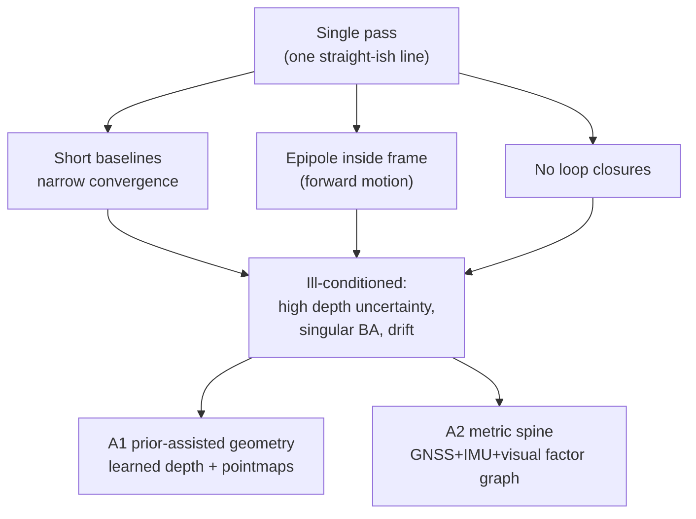
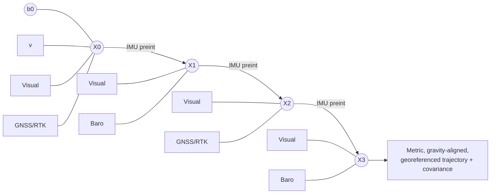
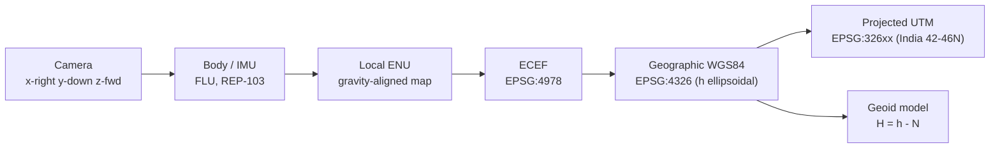

# DRISHTI — theory & scientific foundations

**Purpose.** The rigorous but readable science behind every design choice in DRISHTI (Drone-based
Real-time Imaging for Single-pass High-fidelity Terrain Intelligence) — from camera geometry to
uncertainty reporting — so an evaluator can check that each mechanism rests on sound theory, not
marketing.

**Audience.** NTRO (National Technical Research Organisation) technical evaluators, mapping and
systems engineers, and the DRISHTI build team. Assumes comfort with linear algebra and probability;
no prior photogrammetry expertise required.

**TL;DR.**

- A single drone pass gives **weak multi-view geometry** — short baselines, narrow convergence
  angles, the epipole inside the frame, no loop closures — so triangulation-first reconstruction is
  *mathematically ill-conditioned*. This single fact motivates the whole system.
- DRISHTI answers it with the four anchors: **A1 prior-assisted geometry** (learned depth + pointmaps
  supply structure where triangulation degenerates), **A2 metric spine** (a tightly-coupled
  GNSS+IMU+visual factor graph makes metric scale *observable* without Ground Control Points),
  **A3 two output paths** (near-real-time edge preview + minutes-scale ground refinement), and
  **A4 reliability spine** (every stage emits confidence; nothing hard-fails).
- **Metric scale is the crux.** A single monocular image fixes shape only *up to scale*; the
  Inertial Measurement Unit (IMU) and Global Navigation Satellite System (GNSS) inject the metre.
- **Georeferencing is a datum problem, not a scaling problem** — ellipsoidal-to-orthometric height
  via a geoid model is where naive pipelines silently lose tens of metres.
- Every learned output carries a **confidence signal**; occluded and completed surfaces are flagged
  *inferred*, never presented as measured. Accuracy is reported with ASPRS-style RMSE and confidence
  levels, and depends on sensor configuration (RTK/PPK vs GPS-only).

This document explains *why* each choice is correct. The pipeline itself (tiers, stages S0–S10, model
registry) is defined once in the canonical architecture spec; here we give the mathematics that each
stage implements.

---

## 1. Camera geometry

Everything downstream begins with how a 3-D point becomes a pixel. DRISHTI uses the standard pinhole
camera with lens distortion, in the OpenCV convention (x-right, y-down, z-forward).

A world point `X = [X, Y, Z, 1]ᵀ` projects to a pixel `x = [u, v, 1]ᵀ` by

```
s · x = K [R | t] X
```

where `s` is the (positive) depth along the optical axis, `[R | t]` is the 3×4 **extrinsic** matrix
mapping world→camera (`R ∈ SO(3)` rotation, `t` translation), and `K` is the 3×3 **intrinsic** matrix

```
      | fx   γ   cx |
K  =  |  0  fy   cy |
      |  0   0    1 |
```

with focal lengths `fx, fy` (pixels), principal point `(cx, cy)`, and skew `γ ≈ 0` for modern
sensors. Real lenses deviate from the pinhole by **distortion**, modelled Brown–Conrady style on the
normalized coordinates `(x_n, y_n) = (X_c/Z_c, Y_c/Z_c)`, `r² = x_n² + y_n²`:

```
x_d = x_n (1 + k1 r² + k2 r⁴ + k3 r⁶) + [2 p1 x_n y_n + p2 (r² + 2 x_n²)]   (radial + tangential)
```

then `K` maps `(x_d, y_d)` to pixels. Intrinsics come from EXIF or self-calibration (stage S0/S6);
UniDepthV2 and MoGe can even *predict* focal length when metadata is absent.

**Ground Sampling Distance (GSD)** — the physical size a pixel covers on the ground — falls straight
out of the pinhole similar triangles:

```
GSD = (H_AGL · p_pixel) / f
```

where `H_AGL` is height above ground level, `p_pixel` the physical pixel pitch, and `f` the focal
length (consistent units). For a 4/3" sensor (17.3 mm wide, 5280 px → pitch ≈ 3.28 µm) with a 12 mm
lens at 80 m AGL: `GSD = 80000 mm × 0.00328 mm / 12 mm ≈ 2.2 cm/px`, matching the ~2 cm/px design
target in the accuracy budget. GSD is the **resolution floor** on absolute accuracy: sub-pixel
methods aside, you cannot measure finer than roughly 1×GSD.

---

## 2. Epipolar geometry & triangulation

Two views of the same point are linked by **epipolar geometry**. If `x, x'` are corresponding pixels,
they satisfy the epipolar constraint `x'ᵀ F x = 0`, where `F = K'⁻ᵀ E K⁻¹` is the fundamental matrix
and `E = [t]× R` the essential matrix encoding the relative pose (translation `t`, rotation `R`)
between the two cameras. The camera-centre separation `‖t‖` is the **baseline** `b`.

Given the relative pose, a 3-D point is recovered by **triangulation** — intersecting the two rays.
For a rectified stereo pair with disparity `d`, depth is `Z = f·b / d`. The key result is how depth
error behaves. Differentiating,

```
σ_Z ≈ (Z² / (f · b)) · σ_d
```

Depth uncertainty grows **quadratically with range** and **inversely with baseline**. Equivalently,
for a parallax (convergence) angle `α` between the two rays, `σ_Z ∝ 1/sin α`: small angles give huge
uncertainty. This is why survey flights use wide baselines and cross-strips — and precisely what a
single pass cannot provide. The research dossiers recommend flagging any surface reconstructed with
a convergence angle below ~5–10° or fewer than 3 observing rays as low-confidence (see §13).

---

## 3. Why single-pass is ill-conditioned

This section is the motivation for the entire architecture. A single, roughly straight flight line
produces geometry that is *near-degenerate* for classical reconstruction, in four compounding ways.

1. **Short baselines, narrow convergence.** Consecutive frames are metres apart while the scene is
   tens-to-hundreds of metres away, so parallax angles are small and, by §2, depth uncertainty is
   large.
2. **The epipole sits inside the frame.** In forward flight the direction of motion projects into the
   image; points near that epipole have *near-zero parallax regardless of how far you fly* — their
   depth is essentially unobservable from geometry alone.
3. **No loop closures.** A non-revisiting path never re-observes earlier structure, so Structure-from-
   Motion (SfM) drift cannot be corrected by loop constraints; error accumulates unbounded along the
   corridor.
4. **Poorly-conditioned bundle adjustment (BA).** With weak parallax the BA normal equations
   `H = JᵀΣ⁻¹J` become nearly rank-deficient (beyond the intrinsic 7-DoF gauge freedom of §4). The
   condition number `κ(H)` blows up, so the least-squares solve is unstable: tiny pixel noise maps to
   large scale/pose errors, and the solver may diverge or collapse.



Classical tools (COLMAP, Metashape, Pix4D) assume 70–80% overlap and cross-strips; on single-pass
video they hole out, return wrong scale, or fail to register. DRISHTI therefore **demotes
triangulation to a fallback** and injects two independent kinds of information geometry lacks:
learned priors (A1) and metric sensors (A2). The remaining sections develop both.

---

## 4. Structure-from-Motion & bundle adjustment

SfM jointly estimates camera poses, intrinsics, and 3-D structure from images; **bundle adjustment**
is its optimisation core. BA minimises total **reprojection error** — the pixel distance between each
observed feature and the projection of its estimated 3-D point:

```
min over {K_i, R_i, t_i, X_j}   Σ_{i,j}  v_ij · ρ( ‖ x_ij − π(K_i, R_i, t_i, X_j) ‖_Σ )
```

where `π(·)` is the projection of §1, `v_ij` marks whether point `j` is seen in camera `i`, and `ρ(·)`
is a **robust kernel** that caps the influence of outliers (blur, mismatches, dynamic objects). The
**Huber** kernel is quadratic for small residuals and linear beyond a threshold `δ`
(`ρ(r)=r²/2` for `|r|≤δ`, else `δ(|r|−δ/2)`); **Dynamic Covariance Scaling (DCS)** and Cauchy are
stronger redescending choices. DRISHTI uses Huber/DCS in both the factor graph (S2) and global BA
(S6) to reject GNSS and match outliers.

Two structural facts matter. First, **gauge (datum) freedom**: with images alone the solution is
determined only up to a global **similarity transform** — 3 rotation + 3 translation + 1 scale = 7
DoF. `H` is therefore rank-deficient by 7 and needs external constraints to pin. Monocular SfM cannot
recover absolute scale from images at all (§6). Second, the Hessian is **sparse** (points and cameras
interact only through shared observations), so the Schur complement makes even large problems
tractable. DRISHTI resolves the gauge with the metric spine's GNSS/IMU factors rather than with GCPs,
and keeps the posterior covariance for the accuracy report (§13).

---

## 5. Multi-view stereo

Where SfM gives sparse structure and poses, **multi-view stereo (MVS)** produces *dense* depth by
**photo-consistency**: a hypothesised 3-D point is correct if its projections into several views are
photometrically similar (assuming roughly Lambertian surfaces). Classical MVS sweeps depth
hypotheses and scores each with normalized cross-correlation (NCC) or sum-of-squared-differences over
image patches, building a **cost volume** per pixel and picking the minimum; learned MVS
(CasMVSNet, PatchmatchNet) replaces the hand-crafted volume with a cascaded, learned one.

MVS needs a Goldilocks baseline: **wide enough** that depth changes the matching cost measurably, yet
**narrow enough** that patches still look alike. Single-pass violates the wide-enough condition. With
tiny baselines the cost volume is *flat* — many depths score almost equally — so the minimum is
ambiguous and depth is noisy exactly where §2 predicted. Textureless facades and repetitive
structures make it worse. DRISHTI therefore runs learned MVS only opportunistically, where the pass
genuinely provides parallax (oblique looks, altitude changes), and leans on priors (§6, §7) elsewhere.

---

## 6. Monocular depth & the scale-ambiguity theorem

A single image cannot tell you how big the world is. Formally, the projection `s·x = K(RX + t)` is
invariant under a global rescaling of scene and translation: replacing `X → λX` and `t → λt` gives
`K(R·λX + λt) = λ·K(RX + t)`, which is the *same* pixel `x` in homogeneous coordinates for any
`λ > 0`. So a scene twice as large and twice as far produces an identical image. **Absolute scale is
unobservable from one monocular view** — the scale-ambiguity theorem, and the reason monocular SfM
carries the 7th gauge DoF of §4.

Learned **metric depth** networks break the ambiguity by supplying a prior on real-world size.
Metric3D v2 maps any camera into a *canonical camera space* so it can regress absolute-scale depth
zero-shot; UniDepthV2 predicts a metric point cloud *and* the intrinsics together; Depth Anything V2
(metric variants) does likewise from its large-scale prior. In effect they have learned how big cars,
roads, and buildings usually are. DRISHTI uses these at stage S4.

Two honesty caveats, carried through the design. Per-frame metric depth has a **real domain gap** at
oblique/nadir drone altitudes — the models are trained mostly on ground-level and driving data — so
scale bias of ~5–10% is expected (author-reported on ground benchmarks; unvalidated on aerial views).
And per-frame scale is *noisy and drifts*. The prior is therefore never trusted frame-by-frame; it is
**scale-aligned to the metric trajectory** (§8) and re-anchored globally, and it emits a per-pixel
confidence map that downweights thin, reflective, and far structures.

---

## 7. Feed-forward geometry (pointmaps)

The most direct answer to §3 is to skip correspondence-and-triangulation entirely and *regress
geometry with a network*. The DUSt3R → MASt3R → VGGT (Visual Geometry Grounded Transformer) family
predicts a **pointmap**: for every pixel, a 3-D point expressed in a *common reference frame*.

```
Pointmap  P : (u, v)  →  (X, Y, Z)  in the reference camera's coordinates,  with per-pixel confidence C(u,v)
```

Because two (or many) images are mapped into *one* frame, the network jointly recovers **cameras and
dense geometry without any explicit matching step**: camera pose falls out by aligning a view's
pointmap to the reference (a Procrustes/PnP read-off), depth is the pointmap's z-channel, and
intrinsics follow from the ray directions. VGGT does this for 1-to-hundreds of views in a single
forward pass (reported <1 s per view-set by the authors), emitting intrinsics, extrinsics, depth,
pointmaps, and tracks at once. MASt3R adds a metric matching head and a global-alignment SfM
(MASt3R-SfM) for a careful offline solve.

**Why this is robust to few, wide-baseline views:** the mapping is learned from data, so it stays
well-conditioned precisely where parallax vanishes and the classical Jacobian goes singular — it
*interpolates plausible structure* instead of dividing by a near-zero baseline. That strength is also
its risk: in genuinely unseen regions the network can *hallucinate plausible-but-wrong* geometry
(§14), so its confidence must gate measurement. DRISHTI uses feed-forward geometry to seed depth and
poses (S4), to keep global optimisation consistent (S6), and to initialise Gaussian Splatting (S7).
Note the licensing constraint flagged in Open questions: VGGT's commercial checkpoint excludes
military use, so an NTRO build favours MASt3R/permissive or retrained equivalents.

---

## 8. Visual-inertial fusion theory — where the metre comes from

This is the crux of GCP-free metric accuracy (anchor A2). Vision fixes *shape up to scale*; the IMU
and GNSS make **scale and absolute position observable**.

**IMU model.** A strapdown IMU measures specific force and angular rate, corrupted by slowly-varying
biases and white noise:

```
a_m = R_wbᵀ (a_w − g_w) + b_a + n_a        (accelerometer)
ω_m = ω + b_g + n_g                        (gyroscope)
```

Crucially the accelerometer senses **metric** acceleration in m/s², and gravity `g_w` has a known
magnitude (≈9.81 m/s²). **Preintegration** (Forster et al., on-manifold) summarises all IMU samples
between two keyframes into a single relative-motion factor `(ΔR_ij, Δv_ij, Δp_ij)` that is
independent of the (unknown) absolute pose, so it can be dropped straight into the optimiser without
re-integrating on every iteration.

**MAP estimation on a factor graph.** All measurements combine as a maximum-a-posteriori estimate,
i.e. minimise the sum of squared, covariance-weighted residuals — a bipartite **factor graph** of
variables (poses `X`, velocities `v`, biases `b`) and factors (measurements):

```
X* = argmin  Σ_k ‖ r_k(X) ‖²_{Σk}      (IMU + visual + GNSS + baro factors)
```

DRISHTI solves this incrementally with GTSAM/iSAM2 (S2) and refines it in global BA (S6).



**Why scale becomes observable.** The visual factors constrain the trajectory *shape* in unknown
units; the preintegrated accelerometer constrains the *same* displacement in metres. Consistency
between them can only hold at one scale, so the metre is pinned — provided there is enough **motion
excitation** (translational acceleration; roughly 10–30 s in practice). Gravity further fixes two
rotational degrees of freedom (roll/pitch) and gives a vertical reference. GNSS factors then anchor
the whole solution to an absolute datum and bound drift, with Huber/DCS kernels rejecting multipath
outliers. This is the theoretical statement of "metric without GCPs": scale is recovered *because* of
tightly-fused inertial and satellite measurements — with honest, configuration-dependent accuracy
(§13) — not conjured from imagery.

---

## 9. GNSS & RTK/PPK theory

GNSS anchors the metric spine to an Earth-fixed datum. A receiver forms two kinds of range
measurement to each satellite.

**Pseudorange** (code) — unambiguous but noisy:

```
ρ = r + c(δt_r − δt_s) + I + T + ε        (r = geometric range; I ionosphere, T troposphere)
```

with metre-level noise `ε`. **Carrier phase** — measured to a few millimetres of the ~19 cm L1
wavelength, but ambiguous by an unknown *integer* number of whole cycles `N`:

```
Φ = r + c(δt_r − δt_s) − I + T + λN + ε
```

The precision lives in the carrier; unlocking it requires **integer ambiguity resolution** — solving
for the integer `N` (e.g. the LAMBDA method). **Real-Time Kinematic (RTK)** streams corrections from
a nearby base station (RTCM3 over NTRIP); **double-differencing** between satellites and receivers
cancels the satellite/receiver clock terms and most of the atmosphere, after which `N` can be *fixed*
to integers, yielding **centimetre** positioning. **Post-Processed Kinematic (PPK)** does the same
offline against a base/CORS RINEX log (RTKLIB), which is more robust for a beyond-line-of-sight
mission.

Error sources — ionosphere, troposphere, multipath, ephemeris, receiver clock — are what the
differencing removes. The practical honesty note: a **float** solution (ambiguities not fixed)
degrades from centimetres to decimetres-or-worse, and must be detected and downweighted. Literature
on RTK direct georeferencing without GCPs reports ~1–3 cm horizontal and ~2–7 cm vertical RMSE, with
a common uncorrected **vertical bias of 10–30 cm** that one checkpoint removes (see §13, Open
questions).

---

## 10. Georeferencing math

Georeferencing places the metric reconstruction into a real-world **Coordinate Reference System
(CRS)**. It is two distinct operations, chosen by sensor tier.

**Aligning the trajectory.** If the reconstruction is already metric (metric feed-forward model + RTK),
aligning it to the GNSS track is a **rigid SE(3)** transform (6 DoF: rotation + translation). If the
reconstruction is only up-to-scale (GPS-only, monocular), alignment is a **similarity Sim(3) / 7-DoF
Helmert** transform (rotation + translation + *scale*), computed in closed form by **Umeyama**
least-squares between camera centres and GNSS positions, with RANSAC to reject GNSS outliers. The
7th (scale) parameter is exactly the gauge freedom of §4/§6 that the sensors resolve.

**Frames and heights.** DRISHTI chains a well-defined sequence of coordinate frames:



The subtle, high-impact step is **vertical datum**. GNSS returns **ellipsoidal** height `h`, but every
deliverable and measurement wants **orthometric** height `H` (height above the geoid, "mean sea
level"):

```
H = h − N
```

where `N` is the **geoid undulation** from a model (EGM2008, or a national grid). This is not a
rounding detail: over India `N` reaches roughly **−100 m** in the south, so skipping the geoid injects
tens of metres of vertical error that dwarf the entire cm-level accuracy budget. DRISHTI tags every
product with an explicit EPSG code, WKT2 CRS string, and vertical datum, and validates the CRS/geoid
at startup rather than trusting defaults (stage S9).

---

## 11. 3D Gaussian Splatting

For the photorealistic, free-viewpoint deliverable, DRISHTI uses **3D Gaussian Splatting (3DGS)**. The
scene is represented as a set of anisotropic 3-D Gaussians, each a primitive

```
G(x) = exp( −½ (x − μ)ᵀ Σ⁻¹ (x − μ) ),   Σ = R S Sᵀ Rᵀ
```

with mean `μ` (position), covariance `Σ` factored into rotation `R` and scale `S`, an opacity `α`, and
view-dependent colour (spherical-harmonic coefficients). Rendering is **differentiable
rasterization**: Gaussians are projected ("splatted") to 2-D and composited front-to-back by
alpha-blending,

```
C(pixel) = Σ_i c_i α_i' Π_{j<i} (1 − α_j'),   α_i' = α_i · G_i^{2D}(pixel)
```

Because every step is differentiable, the primitives are optimised by gradient descent against a
photometric **loss** combining L1 and structural similarity:

```
L = (1 − λ) · L1  +  λ · L_D-SSIM
```

**Why few-shot / single-pass 3DGS is under-constrained.** With many views the photometric loss pins
geometry; with few views from a narrow cone, *many* different Gaussian configurations render the
training images almost equally well. The optimiser exploits this to place **floaters** — semi-
transparent blobs that satisfy the seen views but are geometric nonsense from any new angle. This is
overfitting in disguise, and it is the single-pass regime by construction. DRISHTI fights it exactly
as the theory prescribes (stage S7): **depth regularization** (tie Gaussian depth to the metric depth
prior of §6, à la FSGS/DNGaussian), **normal regularization** (2DGS surfel consistency), **per-image
appearance embeddings** (absorb illumination/shadow drift so it is not baked into geometry), and
**confidence-aware** initialisation from feed-forward pointmaps (InstantSplat from VGGT/MASt3R).
Regularised, few-shot GS becomes well-posed enough to yield a measurable surface.

---

## 12. Surface theory

Two complementary routes turn points/Gaussians into surfaces.

**TSDF fusion** (Truncated Signed Distance Function) powers the live map (nvblox, stage S5) and is the
never-fail floor. Space is voxelised; each voxel `v` stores a signed distance `D(v)` to the nearest
surface (negative behind, positive in front), **truncated** to `[−τ, +τ]` so only a band around the
surface is touched, plus a weight `W(v)`. Each depth frame updates voxels by a **running weighted
average**:

```
D(v) ← (W(v)·D(v) + w·d) / (W(v) + w),    W(v) ← W(v) + w
```

The per-observation weight `w = f(confidence, ray-incidence angle, blur)` is where the reliability
spine (A4) enters: weakly-constrained single-pass depth is downweighted, not blindly fused. The
surface is the **zero level set** `D(v)=0`, extracted with marching cubes. Truncation and weighting
make TSDF robust and incremental — ideal for streaming.

**Screened Poisson reconstruction** (stage S8) produces a watertight offline mesh from oriented points
(position + normal `V`). It seeks an indicator function `χ` (inside/outside) whose gradient matches the
point normals, i.e. solves the Poisson equation `Δχ = ∇·V` — the *screened* variant adds a data term
`Σ λ (χ(pᵢ) − ½)²` pulling the isosurface through the samples. The mesh is the `χ = ½` level set.
Poisson excels at smooth, complete surfaces; DRISHTI pairs it with 2DGS/SuGaR surface extraction and
flags reconstructed-vs-inferred regions (§14).

---

## 13. Uncertainty & accuracy theory

Honest accuracy reporting is a first-class deliverable (anchor A4), because single-pass accuracy is
*intrinsically non-uniform*: well-triangulated nadir ground next to barely-seen facades.

**Error propagation.** For any measurement `y = g(x)` with input covariance `Σ_x`, the first-order
output covariance is `Σ_y = J Σ_x Jᵀ` (`J = ∂g/∂x`). In BA the parameter covariance is the inverse of
the information (Hessian) matrix, `Σ_θ ≈ (Jᵀ Σ⁻¹ J)⁻¹`; marginal blocks give per-pose and per-point
uncertainty. DRISHTI additionally derives per-region confidence from the geometric drivers the
research identifies — **convergence angle**, **number of observing rays**, **local GSD**, and the
learned models' **per-pixel confidence** — and publishes it as a confidence raster / per-vertex
attribute.

**RMSE and ASPRS reporting.** Against independent checkpoints, DRISHTI reports horizontal radial RMSE
`RMSE_r` and vertical `RMSE_z`, then converts to 95%-confidence figures per **ASPRS Positional
Accuracy Standards, Edition 2 (2023)**:

```
Horizontal accuracy at 95% = RMSE_r × 1.7308
Vertical   accuracy at 95% = RMSE_z × 1.96
```

RMSE assumes systematic bias has been removed — hence the standing recommendation for at least one
ground checkpoint to strip the 10–30 cm vertical bias of §9. The design-target accuracy budget
(RTK/PPK: ~3–8 cm H, 5–12 cm V; GPS-only: ~0.5–2 m) is a *target*, to be validated on the provided
dataset against a COLMAP/Metashape or LiDAR reference — not a measured claim. A well-known limitation:
covariance *underestimates* error when unmodelled bias is present, so confidence maps are calibrated
against checkpoints where available.

---

## 14. Occlusion & completion priors

A single pass sees each surface from **one direction**. Building backsides, undersides, courtyards,
street canyons, and shadowed facades are simply never imaged — occlusion here is *structural and
permanent*, not a coverage gap you can close by flying again. No amount of triangulation recovers a
surface for which there is zero data.

DRISHTI therefore **completes** occluded regions with priors, and — critically — **flags them
inferred** (stage S7, anchor A4). Two prior families apply:

- **Geometric priors.** Man-made structure is highly regular. **Planarity** (facades and roofs are
  piecewise-planar → RANSAC plane fitting + normal snapping), **symmetry** (repetition and mirror
  structure), and the **Manhattan-world** assumption (dominant orthogonal directions) let a grazingly-
  seen wall be regularised and extended. GIS **footprint extrusion** completes building volumes when
  footprints exist.
- **Learned priors.** Feed-forward models can *query virtual viewpoints* (CUT3R) or inpaint plausible
  geometry/texture, and semantic segmentation drives category-specific completion (planar buildings
  vs point-modelled vegetation).

The theory has a hard limit that the honesty policy makes non-negotiable: **completion is inference,
not measurement.** Over-regularisation erases real detail (ornamentation, curved roofs, disaster
rubble), and learned completion can produce confident-but-wrong surfaces — dangerous for inspection
or mission planning. So DRISHTI renders completed/low-confidence regions in a distinct layer, excludes
them from measurement by default, and never presents inferred geometry as measured. This closes the
loop with the reliability spine: the system always emits a best-effort model **plus** an explicit
uncertainty/completeness report, and degrades gracefully rather than fabricating certainty.

---

## Open questions / risks

- **Aerial domain gap.** Metric depth and feed-forward geometry models (Metric3D v2, UniDepth, VGGT,
  MASt3R) are trained mostly on ground-level/driving/indoor data; nadir/oblique drone views are
  out-of-distribution. Published KITTI/NYU accuracy will not transfer directly — aerial fine-tuning
  and validation are needed before any metric claim.
- **Scale drift & excitation.** IMU scale observability requires motion excitation; smooth,
  constant-velocity survey flight leaves scale weakly observable, and per-frame metric depth (5–10%
  error) drifts. Per-keyframe scale correction in the factor graph is essential and not yet validated
  on real drone data.
- **Vertical bias without a checkpoint.** Residual boresight/lever-arm and calibration error produce a
  10–30 cm systematic vertical bias even with RTK. Sub-decimetre vertical effectively requires one
  checkpoint or a precise geoid + calibrated boresight — this tension between "GCP-free" and
  "cm-vertical" must be stated to evaluators, not hidden.
- **Hallucination vs measurement.** Feed-forward geometry, few-shot 3DGS, and learned completion can
  emit plausible-but-wrong surfaces. The confidence-gating and inferred-region flagging described in
  §13–§14 are load-bearing; their *calibration* on aerial data is an open task.
- **Licensing for defense.** VGGT's commercial checkpoint excludes military use and several strong
  depth checkpoints are non-commercial (CC-BY-NC); Ultralytics YOLO is AGPL-3.0. An NTRO-deployable
  build must favour permissive/BSD components (GTSAM, Metric3D BSD-2, SuperPoint/LightGlue Apache,
  RoMa MIT, DROID-SLAM BSD) or retrained/licensed equivalents. This is flagged consistently with the
  canonical spec's model registry.
- **Rolling shutter & compression.** The theory above largely assumes a global-shutter pinhole; real
  input is rolling-shutter, motion-blurred, H.264/H.265-compressed video. Unmodelled rolling shutter
  biases geometry at UAV speed; rolling-shutter-aware BA or a global-shutter sensor may be required to
  approach the accuracy budget.
- **Ground-truth for validation.** Proving accuracy *without* GCPs still needs an independent check
  (a few survey points, RTK, or reference LiDAR/photogrammetry). Accuracy figures in this document are
  design targets until measured on such a reference.

## Further reading

- **Canonical architecture spec** — tiers, stages S0–S10, model registry, reliability/metric spines,
  accuracy budget. The mathematics here maps stage-by-stage onto that pipeline (S2/S6 → §8, §4; S4 →
  §6, §7; S5/S8 → §12; S7 → §11, §14; S9 → §10; S10 → §13).
- **Problem statement** — Desired Output and Evaluation Criteria tables that these foundations serve.
- Hartley & Zisserman, *Multiple View Geometry in Computer Vision* (pinhole, epipolar, triangulation,
  BA gauge freedom).
- Forster et al., *On-Manifold IMU Preintegration* (T-RO 2017); Dellaert & Kaess, *Factor Graphs for
  Robot Perception* (MAP estimation, GTSAM/iSAM2).
- Wang et al., *VGGT* (CVPR 2025); Leroy et al., *MASt3R* (ECCV 2024); Yin et al., *Metric3D v2*;
  Piccinelli et al., *UniDepthV2* (feed-forward geometry and metric depth).
- Kerbl et al., *3D Gaussian Splatting* (SIGGRAPH 2023); Huang et al., *2D Gaussian Splatting*
  (SIGGRAPH 2024); Kazhdan & Hoppe, *Screened Poisson Surface Reconstruction*.
- Umeyama (1991), least-squares similarity alignment; ASPRS *Positional Accuracy Standards, Edition 2*
  (2023); EGM2008 geoid model.
