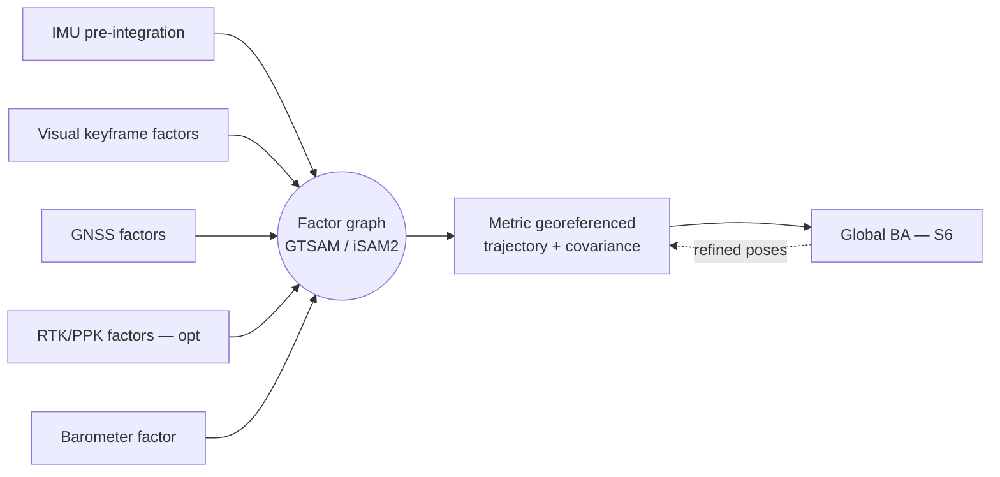

# DRISHTI — How It Works (Architecture & Pipeline)

**Purpose:** The operational narrative of DRISHTI — exactly what happens to the data, stage by stage,
from the first video frame to the final georeferenced deliverables.

**Audience:** NTRO technical evaluators and hackathon judges who want the mechanism rather than the
pitch, and the DRISHTI build team who need one shared picture of the pipeline.

## TL;DR

- DRISHTI runs across **three tiers** — **Edge Tier** (on-UAV, NVIDIA Jetson AGX Orin), **Ground
  Tier** (station/server GPU), and an optional **Cloud Tier** — over **eleven stages, S0–S10**.
- It has **two output paths** (anchor **A3**): a **Live path** (S0–S5, Edge Tier) streaming a
  near-real-time coarse map for situational awareness, and a **Refine path** (S6–S10, Ground Tier)
  producing the minutes-scale metric, textured, georeferenced model. **Store-and-forward** links them.
- **A1 — prior-assisted geometry:** feed-forward multi-view models (VGGT, MASt3R) plus metric
  monocular depth (Metric3D v2, UniDepth V2, Depth Anything V2) supply dense geometry where a single
  pass's short baselines make triangulation degenerate.
- **A2 — metric spine:** one tightly-coupled factor graph fuses Visual-Inertial Odometry (VIO) + GNSS
  (+ RTK/PPK) + Inertial Measurement Unit (IMU) pre-integration + barometer to fix **scale and
  georeference without Ground Control Points (GCPs)**, with honest, sensor-configuration-dependent
  accuracy.
- **A4 — reliability spine:** every stage emits a **confidence** signal and has a **fallback**; the
  system always emits a best-effort model **plus** an uncertainty/coverage report — it never hard-fails.
- Honest framing: "real-time" means **near-real-time edge preview + minutes-scale ground refinement**,
  not a full 4K textured mesh computed on the drone in hard real time.

This document is the operational companion to the [canonical architecture spec](_internal/CANONICAL-ARCHITECTURE-SPEC.md);
it introduces no new stages, tiers, or model choices. The *why* lives in [Theory](01-THEORY.md);
interfaces and wiring in [Integration](04-INTEGRATION.md). Every quantitative figure below is a
**design target** or an **externally reported** number (labeled as such) — never a DRISHTI measured
result until we measure it on the event dataset.

---

## 1. Overview — three tiers and two paths

DRISHTI is a **prior-assisted, sensor-fused, streaming** reconstruction system. It does not clone
classical multi-pass photogrammetry; it accepts that one pass gives **weak multi-view geometry** but a
**strong temporal + inertial + GNSS signal** and **strong learned priors**, and is architected around
that trade. The eleven stages split across tiers so the two paths proceed independently.

```mermaid
flowchart LR
  subgraph EDGE["Edge Tier — on-UAV (Jetson AGX Orin)"]
    direction TB
    S0["S0 Capture & Sync"] --> S1["S1 Ingest & Frame QA"]
    S1 --> S2["S2 Odometry & Localization"]
    S1 --> S3["S3 Perception & Masking"]
    S2 --> S4["S4 Depth & Geometry"]
    S3 --> S4
    S4 --> S5["S5 Live Fusion"]
  end
  subgraph GROUND["Ground Tier — station / server GPU"]
    direction TB
    S6["S6 Global Optimization"] --> S7["S7 Dense Recon & 3DGS"]
    S7 --> S8["S8 Meshing & Texturing"]
    S8 --> S9["S9 Georeferencing & Semantics"]
    S9 --> S10["S10 Export & Serve"]
  end
  subgraph CLOUD["Cloud Tier — optional"]
    C1["Scale-out tiling / reprocess"]
    C2["3D Tiles serving"]
  end
  S5 -.->|"live coarse map + coverage HUD"| OP["Operator viewer"]
  S5 ==>|"keyframes+poses+depth+masks+conf (store-and-forward)"| S6
  S10 -->|"final metric model + reports"| OP
  S10 --> CLOUD
```



- **Edge Tier (on-UAV, Jetson AGX Orin 64 GB / Orin NX 16 GB).** Runs the **Live path** S0–S5 during
  flight: a live coarse georeferenced map for situational awareness, plus a compact per-keyframe
  package for the ground.
- **Ground Tier (RTX-class laptop/workstation or rugged field server).** Runs the **Refine path**
  S6–S10, turning the recorded stream into the metric, textured, georeferenced deliverables in minutes.
- **Cloud Tier (optional).** Large-area tiling, batch reprocessing, and OGC 3D Tiles / digital-twin
  serving. **Not required** for a mission to succeed — the system is air-gap friendly for defense use.

Deployment flexes: for an air-gapped mission the Ground Tier is a field laptop and the Cloud Tier is
omitted; for the hackathon everything runs on one workstation with the edge/ground split emulated.

---

## 2. Stage-by-stage walkthrough (S0–S10)

Each stage follows the canonical spec: **Inputs → Method → Outputs**, plus where it runs, a rough
**latency** target, the **confidence** signal, and the **fallback**. Legend: **[E]** edge, **[G]**
ground, **[E→G]** starts on the edge and is refined on the ground.

### S0 — Capture & Sync **[E]**

The metric spine begins here: every downstream measurement is only as good as the clock tying frames
to sensors.

- **Inputs:** camera frames (1080p/4K H.264/H.265), GNSS, IMU, barometer, gimbal encoders, optional
  RTK correction stream.
- **Method:** hardware time-stamping via Pulse-Per-Second (PPS) / Precision Time Protocol (PTP) and
  GPS-time; align every frame to IMU/GNSS/baro on one monotonic clock; log intrinsics from EXIF or
  trigger self-calibration; apply the measured camera-to-antenna lever arm.
- **Outputs:** time-synchronized sensor streams with per-sample timestamps and quality flags.
- **Runs on / latency:** Edge; continuous, with a frame-to-GNSS sync budget **< 2–3 ms** (at 8 m/s,
  10 ms of skew smears position by ~8 cm).
- **Confidence:** per-sensor validity flags. **Fallback:** if PPS is absent, interpolate timestamps in
  software and flag increased temporal uncertainty.

### S1 — Ingest & Frame QA **[E]**

Single-pass gives no second flight to average out a bad frame, so front-end gating is
disproportionately load-bearing. This stage **inverts** multi-pass keyframing: it *harvests* the scarce
parallax the one trajectory offers.

- **Inputs:** synced video + IMU.
- **Method:** NVDEC/GStreamer hardware decode; **blur gating** (variance-of-Laplacian + IMU angular
  rate); exposure over/under gating; **keyframe selection** maximizing parallax subject to a 60–80%
  overlap floor and a minimum GNSS/IMU-implied translation; optional IMU-aided / learned deblur
  (NAFNet-class) on borderline frames only.
- **Outputs:** a clean keyframe set + per-frame quality scores.
- **Runs on / latency:** Edge; 4K H.265 decode at video rate on NVDEC, gating sub-millisecond per
  frame (it reuses flow/matcher signals already computed).
- **Confidence:** sharpness/exposure score per keyframe. **Fallback:** widen keyframe spacing and mark
  temporal gaps rather than forcing bad frames; never emit an empty set — pass the best-available
  frame flagged low-confidence.

> Policy: heavy learned deblur is **reject-first, not restore-first** — aggressive restoration
> hallucinates texture that poisons matching, so restored frames are not promoted to metric keyframes.

### S2 — Odometry & Localization (metric spine) **[E→G]**

Anchor **A2** in motion: it produces the metric, georeferenced camera trajectory that substitutes for
the GCP network a single pass cannot survey.

- **Inputs:** keyframes + IMU + GNSS (+ RTK/PPK) + baro.
- **Method:** real-time **VIO** (OpenVINS / VINS-Fusion) on the edge feeds a **tightly-coupled factor
  graph** (GTSAM / iSAM2) fusing IMU pre-integration, GNSS factors, barometer, and optional RTK
  double-difference factors; robust kernels (Huber / Dynamic Covariance Scaling) reject GNSS outliers
  and multipath. Global refinement continues in S6.
- **Outputs:** a metric, gravity-aligned, georeferenced 6-DoF camera trajectory + covariance.
- **Runs on / latency:** Edge (online), refined on Ground; VIO at 30–100 Hz, iSAM2 incremental
  keyframe updates in milliseconds.
- **Confidence:** pose covariance. **Fallback (L0–L6 ladder, §8):** GNSS dropout → VIO/IMU
  dead-reckoning with bounded drift; visual loss → inertial propagation with rising uncertainty;
  re-anchor when GNSS is re-acquired.

### S3 — Perception & Masking **[E]**

A mover seen once becomes a permanent "ghost", so masking is high-recall and uses two independent cues.

- **Inputs:** keyframes + optical flow.
- **Method:** **dynamic-object** instance segmentation + tracking (YOLO11-seg / SAM2 + ByteTrack) for
  vehicles/humans/animals; **motion detection** via RAFT optical flow against the epipolar / rigid-flow
  residual (class-agnostic, catches unknown movers); **semantic** labeling (Mask2Former / OneFormer)
  into building/roof, road/infrastructure, vegetation, terrain, obstacle. Dynamic masks are removed
  from geometry, optionally kept as a separate moving-object layer.
- **Outputs:** per-keyframe dynamic masks + semantic label maps.
- **Runs on / latency:** Edge; segmentation ≈30–90 FPS on Orin via TensorRT (SAM2 video propagation
  keeps masks temporally consistent cheaply).
- **Confidence:** mask/segment confidence. **Fallback:** if the segmentation model fails, use the
  motion-residual mask alone with conservative dilation so the static map is never contaminated.

### S4 — Depth & Geometry **[E→G]**

Anchor **A1**: learned geometry fills exactly the low-parallax regions where single-pass triangulation
is ill-conditioned (near-zero parallax at the epipole in forward flight).

- **Inputs:** keyframes + poses + masks.
- **Method:** **metric monocular depth** (Metric3D v2 / UniDepth V2 / Depth Anything V2-metric, Depth
  Pro for crisp edges) **scale-aligned to the S2 trajectory**; **feed-forward multi-view geometry**
  (VGGT / MASt3R pointmaps) over local keyframe windows for cross-view consistency; optional learned
  **MVS** (CasMVSNet / PatchmatchNet) where baselines permit; hard wide-baseline pairs escalate to
  dense matching (RoMa / DKM). Every product carries **per-pixel confidence**.
- **Outputs:** confidence-weighted metric depth/pointmaps per keyframe — a fast model on the edge, the
  full model on the ground.
- **Runs on / latency:** Edge (light) → Ground (full); a light metric-depth net in TensorRT INT8 at
  ~10–30 Hz at reduced resolution on the edge, full-resolution VGGT/MASt3R on the ground.
- **Confidence:** per-pixel depth confidence + multi-view agreement; cross-model disagreement flags
  occlusion or domain-shift failure. **Fallback:** disagreeing regions kept at low confidence;
  monocular-only where multi-view fails.

### S5 — Live Fusion **[E]**

The end of the Live path, and the reliability floor: even if every heavy downstream stage stalls, the
operator still gets a usable live map.

- **Inputs:** depth/pointmaps + poses + masks + confidence.
- **Method:** **incremental confidence-weighted TSDF** (Truncated Signed Distance Function) via NVIDIA
  **nvblox** on the Jetson; dynamic-masked; progressive Level of Detail (LOD); a live colored coarse
  mesh / point cloud streamed to the operator with a coverage/quality heads-up display (HUD).
- **Outputs:** a live coarse georeferenced map + the compact keyframe package for the Ground Tier.
- **Runs on / latency:** Edge; nvblox integration > 30 Hz; end-to-end **≈1–3 s glass-to-glass**, on the
  order of **1–2 s per keyframe** for the preview.
- **Confidence:** per-voxel weight. **Fallback:** if edge compute saturates, drop to a point-splat
  preview and defer meshing to the ground; recording continues at full rate regardless.

### S6 — Global Optimization **[G]**

The Refine path opens by tightening the whole trajectory at once.

- **Inputs:** the full keyframe package (frames, poses + covariance, GNSS/RTK/PPK, depth, masks).
- **Method:** global **bundle adjustment (BA)** / pose-graph optimization with **GNSS + IMU + optional
  RTK/PPK factors** and depth/pointmap constraints (GTSAM / COLMAP-style global mapper à la GLOMAP /
  VGGT-consistent); camera **self-calibration** with intrinsics held as a strong prior; loop / overlap
  closure wherever the single path self-intersects.
- **Outputs:** a globally consistent metric camera set + refined sparse structure + accuracy covariance.
- **Runs on / latency:** Ground; **minutes** for a single-pass scene — global SfM is 1–2 orders of
  magnitude faster than incremental COLMAP.
- **Confidence:** posterior covariance and reprojection RMSE. **Fallback:** if BA diverges, keep the
  VIO+GNSS prior poses from S2 and flag reduced global accuracy.

### S7 — Dense Reconstruction & 3DGS **[G]**

Where the photorealistic, measurable dense scene is built — and where occlusion completion is done
honestly (completed regions are flagged, never presented as measured).

- **Inputs:** optimized poses + keyframes + depth priors + masks.
- **Method:** **few-shot 3D Gaussian Splatting (3DGS)** initialized from feed-forward geometry
  (InstantSplat-style init from VGGT/MASt3R) with **depth + normal + confidence regularization** to
  fight single-pass under-constraint (the fix for floaters); **per-image appearance embeddings** to
  absorb illumination/shadow variation over the flight; **occlusion completion** via learned +
  geometric priors (planarity/symmetry for man-made structure), completed regions flagged
  low-confidence.
- **Outputs:** a dense 3DGS scene + a dense fused point cloud.
- **Runs on / latency:** Ground; feed-forward init in seconds, GS refinement in minutes.
- **Confidence:** per-Gaussian opacity/consistency + a completion flag. **Fallback:** if GS is
  under-constrained, fall back to a TSDF/MVS fused cloud at reduced fidelity.

### S8 — Meshing & Texturing **[G]**

Turns the dense scene into the watertight, textured, multi-LOD mesh measurement needs.

- **Inputs:** the 3DGS scene / fused cloud.
- **Method:** surface extraction via **2DGS / SuGaR** or screened Poisson; watertighting + decimation
  into a multi-**LOD** mesh; **texturing** by photometric best-view selection / MVS-Texturing; an
  optional physically-based material split.
- **Outputs:** a textured multi-LOD mesh.
- **Runs on / latency:** Ground; minutes (2DGS/SuGaR meshing is minutes, not hours).
- **Confidence:** per-face texture/geometry confidence. **Fallback:** a vertex-colored mesh if
  texturing fails.

### S9 — Georeferencing & Semantics **[G]**

Places the model correctly on the Earth and attaches the semantic and elevation products — where a
wrong datum silently injects tens of metres of error.

- **Inputs:** mesh + cloud + poses + semantic labels.
- **Method:** transform to the target **Coordinate Reference System (CRS)** (WGS84 → UTM/EPSG) with a
  geoid model (e.g. EGM2008 or a local Indian geoid grid) for orthometric height; propagate semantic
  labels onto mesh/cloud; rasterize the **Digital Surface Model / Digital Terrain Model (DSM/DTM)** and
  render a **true orthomosaic**; compute measurements (areas, volumes, heights, clearances).
- **Outputs:** a georeferenced, classified mesh/cloud + DSM/DTM + orthomosaic + measurements.
- **Runs on / latency:** Ground; seconds-to-minutes (GDAL/PDAL reprojection and rasterization).
- **Confidence:** georeferencing residuals. **Fallback:** if GNSS was poor, emit a local East-North-Up
  (ENU) frame with relative-only products, clearly labeled "not georeferenced".

### S10 — Export & Serve **[G/Cloud]**

Produces the deliverables in open formats plus the accuracy & confidence report that makes every number
auditable.

- **Inputs:** all products.
- **Method:** export **LAS/LAZ, PLY, OBJ/glTF/GLB, OGC 3D Tiles, GeoTIFF (Cloud-Optimized) DSM/DTM/
  ortho, CityJSON**; generate the **accuracy & confidence report** (RMSE, GSD, coverage %, occlusion
  map); publish to a web viewer (CesiumJS / Potree) with a measurement API; write a **reproducible
  project bundle** (video reference, poses, calibration, logs, metadata).
- **Outputs:** the full deliverable set + the accuracy/confidence report.
- **Runs on / latency:** Ground / Cloud; seconds-to-minutes.
- **Confidence:** the whole-model accuracy report. **Fallback:** always emit at least a point cloud +
  report.

---

## 3. The metric / georeferencing spine

This is anchor **A2** and the answer to "metric accuracy without extensive GCPs." A single flight line
gives narrow convergence angles and near-degenerate bundle adjustment, so scale and absolute position
**cannot** be solved from imagery alone — they are **injected from sensors** through one tightly-coupled
factor graph.



**How scale is fixed without GCPs.** The IMU (accelerometer + observed gravity) and GNSS baselines
supply metric scale, removing the monocular scale ambiguity. Forster-style on-manifold IMU
pre-integration summarizes accelerometer/gyro between keyframes into one relative-motion factor that
observes gravity direction and scale; the metric monocular depth from S4 gives an independent per-frame
scale check. Scale drift over a straight corridor is reducible to roughly **1–2%** with metric-depth
priors, versus ~5–15% for pure monocular VIO (externally reported).

**How georeference is fixed.** GNSS (+ RTK/PPK) anchors the local metric solution to an absolute datum.
DRISHTI aligns the reconstructed camera-centre trajectory to the GNSS track — a 7-DoF Sim(3) Umeyama
fit for plain GNSS, or an SE(3) fit when a metric model plus RTK is available — then refines with
GNSS-prior bundle adjustment in S6. The continuous GNSS track acts as **thousands of soft control
points** along the single pass, the substitute for a surveyed GCP network. The solution projects
WGS84 → UTM/EPSG with a geoid model for orthometric height (S9).

**How it stays robust.** Huber / Dynamic Covariance Scaling kernels and GNSS outlier rejection absorb
multipath and RTK float; covariance is carried through to the accuracy report so weak regions are
honestly flagged. Where a drone exposes raw GNSS observables, raw-measurement fusion (GVINS-style)
contributes global constraints with fewer than four satellites — valuable in GNSS-degraded border/urban
terrain. Opportunistic in-scene GCPs can be added as extra factors but are **not required**.

This yields the tiered accuracy honesty stated in the
[Problem Statement](_internal/PROBLEM_STATEMENT.md): **RTK/PPK → few-cm absolute; GNSS-only →
sub-metre absolute with strong (decimetre) relative; GNSS-denied → local metric map, georeferenced on
re-acquire.**

---

## 4. The two output paths

Anchor **A3**: the Live path is always available even if the Refine path is interrupted, and the Refine
path is deterministic and reproducible from the recorded stream even if the Live path was degraded in
flight. **Store-and-forward** is the seam that links them.

```mermaid
sequenceDiagram
  autonumber
  participant UAV as Edge Tier (UAV)
  participant NVMe as Onboard NVMe
  participant OP as Operator viewer
  participant GND as Ground Tier GPU
  Note over UAV,NVMe: Single pass in progress
  UAV->>NVMe: record 4K H.265 + full-rate GNSS/IMU/baro (never stops)
  loop Live path S0-S5, per keyframe (~1-2 s)
    UAV->>UAV: capture -> QA -> VIO -> mask -> depth -> nvblox TSDF
    UAV-->>OP: live coarse map + coverage HUD (SRT, ~1-3 s glass-to-glass)
    UAV-->>GND: keyframe + pose + depth + mask + conf (SRT, best-effort)
  end
  Note over UAV,GND: Link loss? preview freezes; recording + store-and-forward continue
  UAV->>GND: on landing, backfill full-res master + telemetry gaps
  GND->>GND: Refine path S6-S10 (minutes)
  GND-->>OP: metric textured model + DSM/DTM + ortho + accuracy report
```

- **Live path (S0–S5, Edge Tier).** Its job is **near-real-time situational awareness** and, just as
  importantly, an in-flight **coverage HUD** telling the pilot which façade or rooftop was missed while
  there is still time to recapture it — a single-pass-specific value offline tools cannot provide. The
  downlink carries only keyframes + poses + downsampled depth + confidence over **Secure Reliable
  Transport (SRT)**, fitting a lossy 2–20 Mbps RF link at sub-second latency.
- **Refine path (S6–S10, Ground Tier).** Its job is the **accurate metric deliverable**, from
  deterministic reprocessing of the recorded stream — version-pinned, seeded, resumable from checkpoints
  so a mid-refine crash costs at most one interval.
- **Store-and-forward.** The Edge Tier records near-raw 4K H.265 plus full-rate GNSS/IMU/baro to onboard
  NVMe independent of the radio, so a dropped downlink loses only the live preview, not the mission. On
  reconnect or landing the gap is backfilled and the Refine path runs on the guaranteed full-resolution
  master — reconstructing from near-raw frames also sidesteps the downlink's compression artifacts.

---

## 5. Worked example — a 4K oblique pass over a bridge/building cluster

To make the pipeline concrete: a single oblique pass over a road bridge and an adjacent building
cluster, in the **RTK-available (L0)** configuration. Times are approximate **design targets** for a
small scene, not measured results.

**Flight profile.** A DJI Matrice 350 RTK with a Zenmuse P1 (mechanical shutter) flies one line at
~100 m Above Ground Level (AGL), gimbal pitched 30–45° oblique so façades, the bridge deck, the
underside piers, and the ground are all seen; ground speed 5–8 m/s for ≥90% along-track overlap; RTK
via NTRIP. GSD at 100 m is ≈1.25 cm/px (P1, externally reported from sensor geometry). A slight lateral
weave is added where airspace allows to manufacture cross-track parallax.

**t = 0 s — capture begins.** S0 stamps every frame to GNSS time (sync held < 2–3 ms) and applies the
lever arm. The UAV starts recording 4K H.265 + full-rate telemetry to NVMe and streams a 1080p SRT
proxy.

**t = 0 → 90 s — the single pass (Live path, S0–S5).** As frames arrive:
- S1 gates a few motion-blurred frames near a gust and selects sharp keyframes at parallax-maximizing
  spacing.
- S2's VIO + GNSS/RTK/IMU factor graph produces a metric, georeferenced trajectory with covariance.
- S3 masks a car crossing the bridge and two pedestrians (semantic + epipolar-residual cues) so they
  never enter geometry, and labels deck, piers, façades, roads, and vegetation.
- S4 produces confidence-weighted metric depth/pointmaps, scale-aligned to the trajectory; the
  near-epipolar low-parallax region straight ahead is carried by the learned prior, not triangulation.
- S5 fuses these into an nvblox TSDF and streams a live coarse coloured mesh ~1–3 s behind the
  aircraft. The **coverage HUD flags a thin patch on the shadowed north façade** — the operator nudges
  the gimbal to catch it before the bridge is behind them. Throughout, the keyframe package trickles to
  the Ground Tier over SRT for a head start.

**t ≈ 95 s — landing / end of pass.** The full-resolution master is already largely
store-and-forwarded; any telemetry gaps are backfilled.

**t + 0 → ~10 min — the Refine path (S6–S10) on the Ground Tier RTX GPU.**
- **S6 (~1–3 min):** global bundle adjustment with GNSS/RTK factors and fixed intrinsics ties the pass
  into one globally consistent metric camera set with covariance.
- **S7 (~2–4 min):** InstantSplat-style few-shot 3DGS, initialized from VGGT/MASt3R pointmaps and
  regularized by depth/normal/confidence, builds the dense scene; per-image appearance embeddings
  reconcile the sun-angle shift; the never-imaged **underside of the deck between piers is completed
  from planarity/symmetry priors and flagged low-confidence**.
- **S8 (~2–3 min):** 2DGS/SuGaR extracts a watertight, textured multi-LOD mesh.
- **S9 (~1 min):** the model is projected to the correct UTM zone with a geoid for orthometric height;
  semantics propagate; DSM/DTM and true orthomosaic are rasterized; the **bridge span, deck width, and
  vertical clearance** are measured, each carrying a confidence value.
- **S10 (~1 min):** export LAS/LAZ, textured glTF + OGC 3D Tiles, DSM/DTM + orthomosaic GeoTIFFs,
  semantic GeoJSON, the 3DGS scene, an accuracy & confidence report (H/V RMSE, GSD, coverage %,
  occlusion map), and the reproducible project bundle; publish to the CesiumJS viewer.

**Net result.** From one ~90 s pass, the operator had live coverage feedback during flight and, within
~10 minutes of landing, a georeferenced, measurable, textured model of the bridge and cluster — the
well-seen deck and near-track ground at full confidence; the occluded deck underside and grazing-angle
far façades marked inferred and excluded from measurement by default.

---

## 6. Data flow & formats between stages

Each stage produces a typed artifact consumed by the next; the edge→ground boundary is the compact
keyframe package. Full message contracts live in [Integration](04-INTEGRATION.md); this table gives the
flow.

| Stage | Produces | Consumed by |
|-------|----------|-------------|
| **S0** Capture & Sync | Time-synced frame + GNSS/IMU/baro/gimbal samples; per-sample timestamps + validity flags | S1, S2 |
| **S1** Ingest & Frame QA | Clean keyframe set + per-frame sharpness/exposure scores | S2, S3, S4 |
| **S2** Odometry & Localization | Metric georeferenced 6-DoF trajectory + pose covariance | S4, S5, S6 |
| **S3** Perception & Masking | Per-keyframe dynamic masks + semantic label maps + mask confidence | S4, S5, S7, S9 |
| **S4** Depth & Geometry | Confidence-weighted metric depth/pointmaps per keyframe | S5, S6, S7 |
| **S5** Live Fusion | Live coarse georeferenced TSDF map; **compact keyframe package** | Operator viewer; **S6 (store-and-forward)** |
| **S6** Global Optimization | Globally consistent camera set + refined sparse structure + covariance | S7, S9 |
| **S7** Dense Recon & 3DGS | Dense 3DGS scene + fused point cloud + per-Gaussian/completion confidence | S8, S9 |
| **S8** Meshing & Texturing | Textured multi-LOD mesh + per-face confidence | S9, S10 |
| **S9** Georeferencing & Semantics | Georeferenced classified mesh/cloud + DSM/DTM + orthomosaic + measurements | S10 |
| **S10** Export & Serve | LAS/LAZ, PLY, OBJ/glTF/GLB, OGC 3D Tiles, GeoTIFF (COG), CityJSON, accuracy report, bundle | Operator / GIS / Cloud Tier |

The recurring payload across the edge→ground seam is **keyframes + poses + depth + masks + confidence**.
Confidence travels with every artifact so it propagates all the way into the final tiles and the
measurement tools. The compact per-keyframe package (produced at S5, consumed at S6) has a stable
shape:

```jsonc
// Keyframe package record — one per selected keyframe, streamed over SRT and
// backfilled from onboard NVMe. Confidence and provenance travel with the data.
{
  "kf_id": 1042,                       // monotonic keyframe id
  "t_gps": 1327531402.184,             // GPS-time (s), common monotonic clock
  "image_ref": "master://clip01#frame=2711", // pointer into recorded master
  "pose": {                            // metric, gravity-aligned, georeferenced
    "T_map_cam": [ /* 4x4 SE(3) */ ],
    "covariance6x6": [ /* ... */ ],    // from S2 factor graph
    "frame": "ENU@epsg:32643"          // local map frame + target CRS hint
  },
  "intrinsics": { "model": "OPENCV", "fx": 0, "fy": 0, "cx": 0, "cy": 0, "dist": [] },
  "depth": { "uri": "kf1042.depth.f16", "conf": "kf1042.dconf.u8", "scale": "metric" },
  "masks": { "dynamic": "kf1042.dyn.rle", "semantic": "kf1042.sem.png" },
  "gnss": { "fix": "RTK_FIX", "hdop": 0.7, "lat": 0, "lon": 0, "h_ell": 0 },
  "qa": { "sharpness": 0.86, "exposure_ok": true, "tier": "L0" }  // reliability level
}
```

---

## 7. Challenge → mechanism traceability

DRISHTI is designed against the eight key challenges in the NTRO problem statement. This reproduces the
canonical spec's traceability matrix and names the **exact stages** that carry each.

| # | Key challenge | DRISHTI mechanism | Stages |
|---|---------------|-------------------|--------|
| i | **Limited viewing angles** | Feed-forward multi-view priors (VGGT/MASt3R) + metric monocular depth reconstruct where short baselines make triangulation degenerate; oblique-gimbal capture SOP manufactures angle diversity; occlusion completed and honestly flagged | **S4**, capture SOP (**S0**), **S7** |
| ii | **Motion blur & compression artifacts** | Blur gating (variance-of-Laplacian + IMU rate) + reject-first deblur keep bad frames out; artifact-tolerant dense matching (RoMa/DKM) rescues hard pairs; reconstruct from near-raw onboard frames, not the lossy downlink | **S1**, **S4** |
| iii | **Variable illumination & shadows** | Exposure normalization at ingest; per-image appearance embeddings + lighting-robust depth absorb sun-angle shift; moving shadows masked so they are not reconstructed | **S1**, **S4/S7** |
| iv | **Dynamic objects** | Two-cue masking — semantic seg+track (YOLO11-seg/SAM2+ByteTrack) + class-agnostic epipolar/optical-flow motion residual — removes movers before fusion; residual movers rejected by confidence-weighted TSDF | **S3/S5** |
| v | **GPS inaccuracy & sensor noise** | Tightly-coupled factor graph with robust kernels (Huber/DCS), GNSS outlier rejection, and RTK/PPK factors; global BA with GNSS priors | **S2/S6** |
| vi | **Real-time / near-real-time processing** | Two-path split — edge Live path (S0–S5) + ground Refine path (S6–S10); TensorRT INT8/FP16; incremental nvblox TSDF; progressive LOD | **S1–S5** |
| vii | **Reconstruction of occluded surfaces** | Learned + geometric completion priors (planarity/symmetry), multi-view where any parallax exists, completed regions rendered as a distinct low-confidence layer and excluded from measurement | **S7** |
| viii | **Metric accuracy without extensive GCPs** | GNSS/RTK/PPK + IMU + baro scale and datum through the factor graph; GNSS-prior bundle adjustment; camera self-calibration; uncertainty carried into the accuracy report | **S2/S6/S9** |

---

## 8. Where the accuracy comes from — and where it does not

The reliability spine (**A4**) and the honesty policy converge here. Single-pass accuracy is
**intrinsically heterogeneous**, and DRISHTI's job is to be correct about *which parts are trustworthy*,
not to pretend uniform survey-grade accuracy.

**Where accuracy comes from.**
- **Well-triangulated, well-seen surfaces** — near-nadir ground and near-track terrain — are the strong
  regions: dense observations, good convergence angles, consistent multi-view + prior agreement.
- **Absolute accuracy** comes from the metric spine (§3). With **RTK/PPK**, direct georeferencing
  reaches roughly **1–3 cm horizontal and 2–7 cm vertical RMSE with no GCPs** (externally reported for
  RTK UAV surveys), consistent with DRISHTI's L0 design target of 3–8 cm H / 5–12 cm V. With
  **GNSS-only** the target is sub-metre absolute (~0.5–2 m) but still decimetre-level **relative** after
  Sim(3)+IMU fusion.
- **Metric scale** where parallax is thin comes from IMU pre-integration + metric monocular depth, not
  from triangulation.

Design targets by configuration (from the canonical accuracy budget, ~80 m AGL):

| Config | Absolute H | Absolute V | Relative / local | GSD |
|--------|-----------|-----------|------------------|-----|
| RTK/PPK (L0) | 3–8 cm | 5–12 cm | <1% of distance | ~2 cm/px |
| GNSS-only (L1) | 0.5–2 m | 0.8–2.5 m | dm-level local | ~2 cm/px |
| GPS-denied (L2) | georef on re-acquire | — | dm-level local | ~2 cm/px |

**Where accuracy does not come — and how DRISHTI says so.**
- **Occluded and single-view surfaces are geometrically underdetermined.** Building backsides,
  undersides (the bridge deck between piers), and shadowed street canyons are never imaged from one
  direction. DRISHTI **completes** them from learned + planarity/symmetry priors so the model looks
  whole, but those regions are **flagged inferred, rendered in a distinct layer, and excluded from
  measurement by default**. Inferred geometry is never presented as measured — a correctness
  requirement for defense/measurement use, not a stylistic choice.
- **Grazing-angle façades** seen only obliquely carry large depth uncertainty; DRISHTI flags any region
  with a **convergence angle below ~5–10° or fewer than ~3 observing rays** as low-confidence.
- **Vertical is the weak axis without ground control.** A systematic vertical bias of ~10–30 cm from
  residual boresight/lever-arm and geoid error is common with zero GCPs; a **single ground checkpoint**
  removes most of it. We report vertical separately and recommend one checkpoint where sub-decimetre
  vertical is required.
- **Video is not survey stills.** Rolling shutter and H.264/H.265 compression cap sub-pixel feature
  accuracy, so cm-level numbers borrowed from still-photo studies are optimistic for video and must be
  re-validated on the actual sensor/codec.

**How this is made auditable.** Per-region confidence is derived from BA covariance, ray convergence
angle, observation count, GSD, and learned per-pixel confidence, then propagated into the final tiles
and the S10 report. Accuracy is assessed against independent checkpoints using **ASPRS Positional
Accuracy Standards Edition 2 (2023)** conventions (H 95% = RMSEr × 1.7308, V 95% = RMSEz × 1.96). The
**graceful-degradation ladder** guarantees a labeled result at the best tier the sensors allow:

| Level | Trigger | Behavior | Product impact |
|-------|---------|----------|----------------|
| L0 | All sensors nominal (+RTK) | Full path | Best accuracy (cm) |
| L1 | No RTK/PPK | GNSS+IMU+VIO scale | Sub-metre absolute, strong relative |
| L2 | GNSS dropout (canyon/denied) | VIO+IMU dead-reckon; re-anchor on re-acquire | Local metric map; georef on re-acquire |
| L3 | Brief visual loss | IMU inertial propagation | Short gap, flagged high-uncertainty |
| L4 | Bad frames (blur/dark) | Gate out; widen keyframes; mark gaps | Coverage holes flagged, not garbage |
| L5 | Neural model OOM/fail | Fall back to classical MVS/monocular; lower LOD | Reduced fidelity, still valid |
| L6 | Edge saturated | Point-splat preview; defer to ground | Live preview simpler; refine unaffected |
| — | Always | Store-and-forward raw stream; deterministic ground reprocess | Full quality recoverable post-mission |

**Invariant:** DRISHTI always emits (a) a best-effort model and (b) an explicit uncertainty/coverage
report. It never crashes silently or emits unflagged garbage.

---

## Open questions / risks

- **Aerial domain gap.** VGGT/MASt3R and the metric-depth models are trained mostly on ground-level,
  automotive, and object-centric data; high-altitude nadir/oblique drone imagery is out-of-distribution,
  so metric accuracy at flight altitude is unproven and may need fine-tuning on aerial data. Published
  benchmark numbers will not transfer directly.
- **Proving cm accuracy without GCPs is not free.** It requires RTK/PPK plus accurate lever-arm and
  time-sync calibration, and at least a few independent survey checkpoints to *validate* (even if not
  to constrain). Vertical bias with zero ground control realistically budgets to ~5–10 cm.
- **Hallucination risk.** Feed-forward geometry and generative occlusion-completion can produce
  plausible-but-wrong geometry in unseen/low-confidence regions — dangerous for measurement unless
  rigorously confidence-flagged and excluded, as designed. Learned confidence is often poorly
  calibrated on out-of-domain content and needs empirical recalibration on drone data.
- **Licensing for defense deployment.** Several strong checkpoints carry non-commercial or explicitly
  no-military licenses (VGGT's commercial checkpoint excludes military use; MASt3R weights are
  CC-BY-NC-SA; Depth Anything V2 Base/Large are CC-BY-NC; Ultralytics YOLO is AGPL-3.0). A deployable
  NTRO build must be assembled from permissively-licensed components (Metric3D BSD, SuperPoint/DISK/
  LightGlue Apache, RoMa MIT, GTSAM BSD) or retrained/licensed equivalents. Tracked in the
  [Technology Stack](03-TECHNOLOGY-STACK.md).
- **Edge compute headroom.** The heavy transformers (VGGT ~1.2B params) exceed the Orin NX 16 GB budget
  and are near-real-time at best even on AGX Orin; the design deliberately keeps them on the Ground
  Tier. Thermal throttling on a power-constrained UAV must be monitored and wired into the degradation
  ladder, not discovered post-hoc.
- **Rolling shutter is under-modeled** by most learned SLAM/feed-forward nets; a global-shutter or
  mechanical-shutter sensor, or rolling-shutter-aware BA, is preferred for metric video.
- **Spec conformance.** This document conforms to the
  [canonical architecture spec](_internal/CANONICAL-ARCHITECTURE-SPEC.md); it introduces no new stages,
  tiers, or model choices. All latency and accuracy figures are design targets or externally reported
  values pending measurement on the event dataset.

## Further reading

- [00 · Master Overview](00-MASTER-OVERVIEW.md) — the whole system at a glance.
- [01 · Theory & Scientific Foundations](01-THEORY.md) — why single-pass is hard, and the math behind
  VIO fusion, feed-forward depth, 3DGS, TSDF, and accuracy.
- [03 · Technology Stack](03-TECHNOLOGY-STACK.md) — concrete tools, versions, licenses, and hardware.
- [04 · Integration](04-INTEGRATION.md) — interfaces, message contracts, coordinate frames, time sync,
  and the edge↔ground protocol.
- [Problem statement + Output/Evaluation tables](_internal/PROBLEM_STATEMENT.md) — deliverables and
  evaluation criteria.
