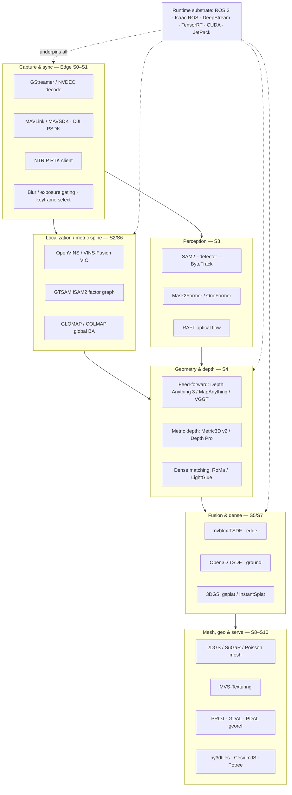

# DRISHTI — Technology Stack

**Purpose:** The concrete, buildable technology choices behind DRISHTI — every model, library, and piece of hardware, with versions, licenses, the single-pass rationale for each, and a named fallback. This is the "bill of materials" a team could procure and stand up.

**Audience:** National Technical Research Organisation (NTRO) technical evaluators, systems and procurement engineers, and the DRISHTI build team. Assumes you have skimmed the [Master Overview](00-MASTER-OVERVIEW.md); the pipeline itself is defined once in [`_internal/CANONICAL-ARCHITECTURE-SPEC.md`](_internal/CANONICAL-ARCHITECTURE-SPEC.md).

**TL;DR**

- DRISHTI **adopts, it does not invent**: the defensible intellectual property (IP) is the *orchestration* — prior-assisted geometry fusion, sensor-driven metric scale, confidence propagation, and the graceful-degradation spine — not any single third-party model. Every model is replaceable.
- The stack splits cleanly across the three tiers: a lean, quantized **Edge Tier** (NVIDIA Jetson Orin) runs the Live path (stages S0–S5); a **Ground Tier** (RTX-class GPU) runs the heavy Refine path (S6–S10); the **Cloud Tier** is optional.
- **Licensing is a first-class design constraint, not an afterthought.** Several state-of-the-art (SOTA) models are research-only or explicitly exclude military use (VGGT's commercial checkpoint, DUSt3R/MASt3R, UniDepth V2). DRISHTI therefore ships a **permissively-licensed default backbone** (Depth Anything 3, MapAnything, Pi3, Metric3D v2, gsplat, GLOMAP/COLMAP — all CC-BY / Apache / BSD) and keeps the research models only as a benchmark reference. See §5.
- Every learned component emits a **confidence/uncertainty** signal; every layer names a **classical fallback** so nothing hard-fails (the reliability spine, A4).
- The whole stack runs **fully offline / air-gapped on Indian soil**, supports **NavIC/IRNSS** in the positioning layer, and every third-party model can be retrained or replaced with an indigenous one — the sovereignty posture NTRO needs (§6).
- Numbers below marked *(design target)* are engineering goals to be measured on the event dataset; performance figures attributed to a method are **as reported by that method's authors**.

---

## 1. Stack philosophy

Four principles govern every choice in this document.

1. **Adopt, don't invent — orchestration is the IP.** The last three years (2024–2026) produced foundation models that solve pieces of this problem far better than we could rebuild from scratch: feed-forward geometry transformers, zero-shot metric depth, promptable segmentation. DRISHTI's job is to *fuse* them behind one metric spine and one reliability spine, tuned for the single-pass regime. Any single model can be swapped for its successor without touching the architecture — a deliberate hedge against a field that reshuffles its leaderboard every quarter.

2. **Confidence-first.** A model is only admitted to the stack if it (a) emits a usable confidence/uncertainty signal, or (b) can be wrapped in one (multi-view agreement, geometric residual, ensemble spread). Outputs without confidence cannot be trusted in a single-pass, no-second-look setting.

3. **Edge-lean, ground-heavy.** Billion-parameter feed-forward models cannot run in hard real time on a drone. So the Edge Tier runs *small, quantized* models for a near-real-time coarse preview; the *full-resolution, full-fidelity* models run on the Ground Tier against the recorded stream. Honest division of labor, not wishful thinking. See [Systems & Edge/Compute](roles/6-systems-edge-compute-optimization.md).

4. **License- and sovereignty-aware by default.** For an NTRO deployment, a model that forbids military use or commercial use is unusable no matter how accurate. The *default* build is permissive; the research SOTA is a reference we measure against, not what we ship.

---

## 2. The stack at a glance



The remaining sections give the per-layer detail, the hardware, and the licensing that decides which variant of each layer actually ships.

---

## 3. Per-layer technology tables

Each table: **Role · Adopted (default build) · Version/commit · License · Why (single-pass angle) · Alternatives**. Where the canonical spec (§7) names a research model as "adopted" that is not license-clean for defense, the **Adopted** column here gives the *permissive default* and the research model appears under Alternatives with a ⚠ flag; the licensing reconciliation is §5.

### (a) Real-time VIO, sensor fusion & global bundle adjustment

| Role | Adopted (default) | Version | License | Why (single-pass) | Alternatives |
|------|-------------------|---------|---------|-------------------|--------------|
| Real-time Visual-Inertial Odometry (VIO) | OpenVINS | 2.7.x | GPL-3.0 ⚠(copyleft) | Filter-based VIO gives metric, gravity-aligned pose live on the edge from one moving camera + Inertial Measurement Unit (IMU) — the single-pass pose backbone | VINS-Fusion (GPL-3.0), ORB-SLAM3 (GPL-3.0), Kimera, DROID-SLAM (GPU, robust to blur) |
| Sensor-fusion / factor graph | GTSAM (iSAM2) | 4.2 | BSD-3 ✓ | Tightly-coupled GNSS+IMU+visual+baro factor graph → metric scale & georeference without Ground Control Points (GCPs); permissive so we can build our own front-end on it | Ceres Solver (BSD), g2o (BSD) |
| Global bundle adjustment / SfM fallback | GLOMAP + COLMAP | GLOMAP 1.0 · COLMAP 3.9 | BSD ✓ | Deterministic, verifiable geometry when feed-forward confidence is low; the accuracy oracle for the report | Agisoft/Metashape (proprietary, offline reference only), hloc (matching) |

> GPL-3.0 note: OpenVINS/VINS-Fusion are usable for an on-prem/internal deployment, but their copyleft affects redistribution. If DRISHTI must ship as a closed binary, the mitigation is to run the VIO as an isolated process (no linking) or replace it with a permissively-licensed estimator built directly on GTSAM. Tracked in §5 and Open questions.

### (b) Feed-forward multi-view geometry (the single-pass core primitive)

| Role | Adopted (default) | Version | License | Why (single-pass) | Alternatives |
|------|-------------------|---------|---------|-------------------|--------------|
| Feed-forward geometry backbone | **Depth Anything 3 (DA3)** | Nov-2025 release | Public-data trained (confirm weight license) ✓ | Regresses camera pose + dense geometry from limited-angle video in one pass; current accuracy SOTA and licensing-friendlier than VGGT for defense | **VGGT / VGGT-Long** ⚠(commercial checkpoint excludes military use), Pi3 (CC BY 4.0 ✓), Fast3R |
| Prior-injectable metric geometry | **MapAnything** | 3DV-2026 | CC BY 4.0 ✓ | Ingests the drone's GPS pose, IMU, intrinsics, RTK/PPK and sparse depth *as priors* and outputs **metric** geometry — the cleanest GCP-free metric route; permissive | Pow3R ⚠(NAVER, likely CC BY-NC), CUT3R (streaming, metric) |
| Streaming / online geometry | CUT3R / StreamVGGT | 2025–26 | research (verify) | Per-frame recurrent 3D state for the near-real-time path; CUT3R virtual-view probing partially infers unseen regions | Point3R, Spann3R, VGGT-Long (batch + loop closure) |

> A *pointmap* is a per-pixel 3D-point prediction from a feed-forward network — the primitive that replaces triangulation where single-pass baselines are too short.

### (c) Metric monocular depth (the scale anchor)

| Role | Adopted (default) | Version | License | Why (single-pass) | Alternatives |
|------|-------------------|---------|---------|-------------------|--------------|
| Metric depth (primary) | **Metric3D v2** | TPAMI-2024 | CC BY 4.0 ✓ | Zero-shot metric depth across thousands of camera models; anchors absolute scale where triangulation starves; permissive | **UniDepth V2** ⚠(CC BY-NC-SA), MoGe-2 |
| Metric depth + focal estimation | Apple **Depth Pro** | ICLR-2025 | Apple license (verify) ~✓ | 2.25 MP depth in ~0.3 s and estimates focal length when intrinsics are missing; sharp edges | ZoeDepth, Marigold (diffusion, slow) |
| Fast relative-depth prior (edge) | Depth Anything V2 — **Small** | v2 | Apache-2.0 ✓ | Small model is permissive and >10× faster than diffusion depth; the edge preview depth | DA V2 Base/Large ⚠(CC BY-NC-4.0) |

### (d) Feature matching & optical flow

| Role | Adopted (default) | Version | License | Why (single-pass) | Alternatives |
|------|-------------------|---------|---------|-------------------|--------------|
| Sparse matching | LightGlue (+ detector) | 2023+ | Apache-2.0 (code) ✓ | Learned matcher survives narrow-baseline, blurred, compressed frames far better than hand-crafted | SuperPoint ⚠(weights non-commercial) → use **DISK/ALIKED/DeDoDe** (permissive) |
| Dense matching (hard pairs) | RoMa / DKM | 2024 | MIT / research (verify) | Dense correspondence on low-texture / artifact-heavy pairs where sparse matching fails | LoFTR (Apache-2.0 ✓) |
| Optical flow | RAFT | 2020 | BSD-3 ✓ | Motion reasoning for dynamic-object detection (flow vs epipolar residual) | GMFlow, SEA-RAFT |

### (e) Perception — dynamic-object & semantic masking

| Role | Adopted (default) | Version | License | Why (single-pass) | Alternatives |
|------|-------------------|---------|---------|-------------------|--------------|
| Instance segmentation (movers) | **SAM 2** | 2024 | Apache-2.0 ✓ | Promptable, high-recall masks for vehicles/humans/animals; an unmasked mover becomes a permanent ghost in single-pass | Cutie, Mask2Former-video |
| Object detector (to prompt SAM2 / track) | RT-DETR | v2 | Apache-2.0 ✓ | Permissive detector to seed tracks | **YOLO11-seg** ⚠(Ultralytics AGPL-3.0 / paid enterprise) |
| Multi-object tracking | ByteTrack | 2022 | MIT ✓ | Associates masks across frames for consistent removal | OC-SORT, BoT-SORT |
| Semantic segmentation | Mask2Former / OneFormer | 2022–23 | MIT (code) ✓ | building/roof, road/infra, vegetation, terrain, obstacle → the semantic-layer deliverable | SegFormer, InternImage |

### (f) Live volumetric fusion

| Role | Adopted (default) | Version | License | Why (single-pass) | Alternatives |
|------|-------------------|---------|---------|-------------------|--------------|
| Edge TSDF fusion | NVIDIA **nvblox** | 0.x (Isaac) | Apache-2.0 ✓ | GPU-accelerated Truncated Signed Distance Function (TSDF) on Jetson → live coarse map, dynamic-masked | Voxblox, VDBFusion |
| Ground TSDF / point fusion | **Open3D** | 0.18 | MIT ✓ | Scalable TSDF + point-cloud tooling on the ground tier | VDBFusion, custom CUDA |

### (g) Dense reconstruction — few-shot 3D Gaussian Splatting (3DGS)

| Role | Adopted (default) | Version | License | Why (single-pass) | Alternatives |
|------|-------------------|---------|---------|-------------------|--------------|
| 3DGS engine | **gsplat** (Nerfstudio) | 1.x | Apache-2.0 ✓ | **Permissive** rasterizer — critical: the original Inria 3DGS CUDA code is research-only ⚠ | Original 3DGS (Inria) ⚠ non-commercial |
| Few-shot init + regularization | InstantSplat-style init from feed-forward geometry + depth/normal/confidence reg | 2024–25 | research patterns (reimplement on gsplat) | Feed-forward init + depth/normal regularization fights single-pass under-constraint | FSGS, DNGaussian, MVSplat |
| Pose-free feed-forward GS | NoPoSplat / AnySplat | 2025 | CC BY 4.0 ✓ | Textured output directly from imperfect drone poses, no COLMAP pre-step | Splatt3R, pixelSplat |

### (h) Meshing & texturing

| Role | Adopted (default) | Version | License | Why (single-pass) | Alternatives |
|------|-------------------|---------|---------|-------------------|--------------|
| Surface extraction | 2DGS / SuGaR (on gsplat) | 2024 | research → reimplement permissive | Turns the Gaussian field into a measurable, view-consistent surface | Screened Poisson (Open3D, MIT ✓), Gaussian Opacity Fields |
| Watertight fallback mesh | Screened Poisson | — | MIT (Open3D) ✓ | Robust mesh from fused metric point cloud when 3DGS is under-constrained | Ball-pivoting, Delaunay |
| Texturing | MVS-Texturing | 1.0 | BSD-3 ✓ | Photometric best-view texture selection with seam levelling | nvdiffrast bake (NVIDIA license) |

### (i) Geospatial I/O, CRS & viewers

| Role | Adopted | Version | License | Why | Alternatives |
|------|---------|---------|---------|-----|--------------|
| Coordinate transforms | PROJ / pyproj | 9.x / 3.x | MIT / X-11 ✓ | WGS84 → UTM/EPSG, geoid (EGM2008) for orthometric height | — |
| Raster I/O (DSM/DTM/ortho) | GDAL | 3.9 | MIT ✓ | GeoTIFF / Cloud-Optimized GeoTIFF (COG) read/write | rasterio |
| Point-cloud processing | PDAL + LAStools/Entwine | 2.7 | BSD / mixed | LAS/LAZ pipelines, tiling | Entwine (indexing) |
| 3D Tiles / web viewer | py3dtiles + CesiumJS | — | Apache-2.0 ✓ | Streamable OGC 3D Tiles for the digital-twin viewer | Potree (point clouds) |

### (j) Middleware & runtime substrate

| Role | Adopted | Version | License | Why | Alternatives |
|------|---------|---------|---------|-----|--------------|
| Node graph / middleware | ROS 2 | Humble / Jazzy LTS | Apache-2.0 ✓ | Deterministic pub/sub with Quality-of-Service (QoS), the robotics-standard data plane across tiers | custom async + DDS |
| Accelerated perception nodes | NVIDIA Isaac ROS | 3.x | NVIDIA license (mixed) | GPU-accelerated ROS 2 nodes (nvblox, image pipeline) on Jetson | custom CUDA nodes |
| Video pipeline | DeepStream / GStreamer | 7.x / 1.24 | NVIDIA SDK / LGPL | Zero-copy NVDEC → inference on Jetson | GStreamer alone |
| Edge inference runtime | TensorRT | 10.x | NVIDIA (free deploy) | INT8/FP16 quantized inference within the Jetson power budget | ONNX Runtime (portable) |
| CUDA / edge OS | CUDA 12.x · JetPack 6.x | — | NVIDIA | Driver/runtime for Jetson & RTX | — |

### (k) Compute & hardware substrate

| Tier | Adopted | License/notes | Why |
|------|---------|---------------|-----|
| Edge (on-UAV) | NVIDIA Jetson **AGX Orin 64 GB** (or Orin NX 16 GB lighter) | COTS | 275 TOPS class; runs the quantized Live path (S0–S5) within a UAV power/thermal budget |
| Ground | RTX-class GPU (RTX 4090 / RTX 6000 Ada, ≥24 GB VRAM) laptop or rugged server | COTS | Runs the heavy Refine path (S6–S10): feed-forward geometry, 3DGS, meshing |
| Cloud (optional) | Any CUDA GPU fleet | — | Large-area tiling / 3D-Tiles serving; **never required** for a mission |

---

## 4. Hardware bill of materials (BOM)

Two procurement tracks — a fast COTS track and a sovereign/open track — described in [Drone & Sensor/Hardware Integration](roles/4-drone-sensor-hardware-integration.md). Cost bands are **indicative** (INR/USD vary by import/duty); power/weight are approximate.

| Subsystem | Primary (COTS track) | Open / sovereign track | Indicative cost band | Notes |
|-----------|----------------------|------------------------|----------------------|-------|
| UAV platform | DJI **Matrice 350 RTK** | Custom **PX4/ArduPilot** airframe | ₹₹₹ / ₹₹ | M350 has built-in RTK, PSDK access, IP-rated |
| Camera payload | Zenmuse **P1** (45 MP full-frame, mechanical shutter) or **L2** (LiDAR + RGB) | Global-shutter machine-vision cam (Sony IMX sensor) + lens | ₹₹₹ / ₹ | Global/mechanical shutter avoids rolling-shutter skew on a moving UAV |
| Positioning | M350 built-in RTK + D-RTK base / NTRIP | Survey GNSS module (multi-band, **NavIC/IRNSS**-capable) + NTRIP | ₹₹ / ₹ | RTK/PPK is the GCP-free metric anchor |
| IMU | Payload/airframe IMU | Tactical/industrial IMU (e.g. Analog Devices class) | included / ₹₹ | Grade sets metric-scale and gravity-alignment quality |
| Edge computer | Jetson AGX Orin 64 GB dev/production module | Same | ₹₹ | ~15–60 W configurable; needs active cooling on-frame |
| Comms | OcuSync / SRT video + MAVLink telemetry | SRT/RTSP + MAVLink + NTRIP uplink | included / ₹ | Store-and-forward to onboard NVMe so link loss loses nothing |
| Calibration gear | Checkerboard / AprilGrid target; Kalibr | Same | ₹ | Camera intrinsics + camera↔IMU extrinsics |
| Ground station | RTX laptop / rugged server | Same | ₹₹₹ | Runs the Refine path in the field, air-gapped |

Indicative Jetson AGX Orin power: **15–60 W** (configurable power modes); plan active cooling and vibration isolation on the airframe. These are engineering planning figures, not measured DRISHTI numbers.

---

## 5. Licensing & IP posture (read before choosing checkpoints)

This is where many otherwise-excellent models are disqualified for an NTRO deployment. The research confirms two hard facts:

- **VGGT's commercial checkpoint explicitly excludes military applications**, and **DUSt3R / MASt3R / MASt3R-SfM (NAVER) and UniDepth V2 are CC BY-NC / NC-SA (non-commercial).** For a defense deployment these are **blockers**, however accurate.
- Original **3D Gaussian Splatting (Inria) code is research-only**; the permissive path is the **gsplat (Apache-2.0)** reimplementation.

DRISHTI therefore ships a **permissive default backbone** and keeps the restricted models only as a *benchmark reference we measure against* (never in the shipped binary):

| Layer | Restricted SOTA (reference only) | License risk | Permissive default (shipped) | License |
|-------|----------------------------------|--------------|------------------------------|---------|
| Feed-forward geometry | VGGT / VGGT-Long | ⚠ excludes military | **Depth Anything 3**, MapAnything, Pi3 | public-data ✓ / CC BY 4.0 ✓ |
| Matching-SfM | MASt3R / MASt3R-SfM | ⚠ CC BY-NC-SA | **GLOMAP + COLMAP**, LoFTR | BSD ✓ / Apache ✓ |
| Metric depth | UniDepth V2 | ⚠ CC BY-NC-SA | **Metric3D v2**, DA V2-Small | CC BY 4.0 ✓ / Apache ✓ |
| Keypoints | SuperPoint (MagicLeap) | ⚠ non-commercial weights | **DISK / ALIKED / DeDoDe** | permissive ✓ |
| Detector | YOLO11 (Ultralytics) | ⚠ AGPL-3.0 / paid | **RT-DETR**, SAM 2 | Apache-2.0 ✓ |
| 3DGS engine | Inria 3DGS CUDA | ⚠ research-only | **gsplat**, NoPoSplat/AnySplat | Apache ✓ / CC BY 4.0 ✓ |
| VIO | OpenVINS/VINS-Fusion | ⚠ GPL-3.0 copyleft | isolated-process use, or GTSAM-native front-end | BSD ✓ |

**DRISHTI's own IP** — and what makes the permissive-default build defensible even though every model is off-the-shelf — is the orchestration layer: (1) prior-assisted fusion of feed-forward geometry with metric depth; (2) GNSS/IMU scale-alignment of learned depth (the metric spine); (3) confidence propagation end-to-end; (4) single-pass-specific tuning and regularization; and (5) the graceful-degradation + georeferenced-reporting layer. No single third-party model provides these for the single-pass constraint. See [Design Decisions](05-DESIGN-DECISIONS.md) ADR-01.

> This section refines the canonical spec's model registry (§7), which names VGGT/MASt3R as "adopted". They remain the *reference* backbone; the *shipped defense default* is permissive. This reconciliation is logged in Open questions and should be folded back into the spec.

---

## 6. Sovereignty, air-gap & made-in-India

NTRO data cannot leave sovereign control. DRISHTI is built so that **no mission ever requires the cloud**:

- **Fully offline.** All model weights, the CRS/geoid grids (EGM2008 and local geoid), and the entire toolchain are stored locally. The Ground Tier is a field laptop/server; the Cloud Tier is optional scale-out only.
- **No SaaS dependency.** This deliberately rules out the consumer/cloud NeRF-GS services (Luma, Polycam) and, for sensitive missions, vendor clouds — a data-residency violation would be fatal. See [Design Decisions](05-DESIGN-DECISIONS.md) ADR-12.
- **NavIC / IRNSS.** The positioning layer uses multi-constellation GNSS including India's NavIC/IRNSS, reducing reliance on foreign constellations in contested environments; RTK corrections come from a sovereign NTRIP base/CORS.
- **Replaceable models.** Because the architecture treats every model as a swappable block behind a confidence interface, any third-party model can be **retrained or replaced with an indigenous model** — important both for sovereignty and for domain-adapting to Indian terrain (see [AI/Deep Learning](roles/3-ai-deep-learning-research.md)).
- **Chain of custody.** The reproducible project bundle (§7) is signed and hash-verifiable for audit.

---

## 7. Versioning & reproducibility

Single-pass output is only trustworthy if it is *reproducible* — the same recording must yield the same model.

- **Pinned versions.** Every model checkpoint and library is version-pinned with a checksum in a **model registry** (a manifest of `name · version · sha256 · license`). No "latest" tags in a deployed build.
- **Containerized deployment.** The Ground Tier runs in a CUDA/TensorRT container so the environment is identical across machines and across the hackathon-vs-field configs.
- **Deterministic ground reprocess.** Monotonic frame IDs, fixed random seeds, and pinned versions let the Ground Tier re-run a mission from the recorded near-raw H.265 + telemetry and get the same result — the auditability story in [Integration](04-INTEGRATION.md) and [Systems & Edge/Compute](roles/6-systems-edge-compute-optimization.md).
- **Reproducible project bundle.** Deliverable #10: video reference, poses, calibration, logs, metadata, and the registry manifest — the artifact that makes an accuracy claim checkable.

---

## 8. Hackathon MVP subset

Not all of the above is stood up in the event. The **minimum viable pipeline** on the provided dataset (video + GPS + flight metadata):

```text
ingest (GStreamer/NVDEC) → keyframe QA (blur/exposure gating)
  → poses: Depth Anything 3 / MapAnything  (fallback: GLOMAP+COLMAP)
  → metric depth: Metric3D v2, scale-aligned to GPS trajectory (7-DoF Umeyama)
  → dynamic masking: SAM 2 + RT-DETR + ByteTrack
  → fused cloud / TSDF: Open3D   → few-shot 3DGS: gsplat (InstantSplat-style init)
  → mesh: 2DGS / screened Poisson  → texture: MVS-Texturing
  → georeference to UTM (PROJ/GDAL) → DSM/DTM + true orthomosaic
  → export LAS/LAZ + glTF + GeoTIFF + 3D Tiles
  → accuracy & confidence report vs COLMAP/Metashape reference (C2C/C2M)
  → web viewer (CesiumJS / Potree)
```

- **Live stretch goal:** stream a clip through an edge-emulated path with a live nvblox coarse preview to demonstrate the two output paths.
- **Robustness demo:** inject GPS noise / motion blur / a forced model failure to show the graceful-degradation ladder (L0–L6) rather than a crash.
- **Everything permissive:** the MVP uses only the shipped-default (permissive) models above, so the demo is itself license-clean.

The single-workstation hackathon config emulates the Edge/Ground split on one machine; the interfaces are identical to the real two-tier deployment (see [Integration](04-INTEGRATION.md)).

---

## Open questions / risks

- **Aerial out-of-distribution (OOD).** Almost every feed-forward and depth model is trained on object-centric / indoor / driving / ground-level data. High-altitude nadir/oblique aerial imagery is OOD and will likely need domain fine-tuning (UseGeo, WHU, ISPRS, UrbanScene3D) before metric claims hold. Owned with [AI/Deep Learning](roles/3-ai-deep-learning-research.md).
- **License confirmation.** Weight licenses for the newest models (Depth Anything 3, Depth Pro exact terms) must be confirmed in writing before shipping; the permissive-default table (§5) is the safe fallback if any confirmation fails.
- **Bleeding-edge maturity.** DA3 (Nov 2025), MapAnything (3DV 2026), StreamVGGT/Pi3 (2026) are months old with little independent aerial validation — we pin versions and keep the mature GLOMAP/COLMAP + Metric3D v2 fallback.
- **GPL in the VIO layer.** OpenVINS/VINS-Fusion copyleft; resolve via process isolation or a GTSAM-native estimator before any closed-binary distribution.
- **Spec reconciliation.** §5 changes the *shipped* backbone from the spec's VGGT/MASt3R to permissive equivalents; fold this into [`CANONICAL-ARCHITECTURE-SPEC.md`](_internal/CANONICAL-ARCHITECTURE-SPEC.md) §7.
- **Edge memory.** Billion-parameter models OOM on Orin; the edge runs only small quantized models — verify the INT8 accuracy-vs-latency trade on the event hardware.

## Further reading

- [Design Decisions](05-DESIGN-DECISIONS.md) — *why* each of these choices, with options and trade-offs.
- [Integration](04-INTEGRATION.md) — how these components wire together across tiers.
- Role docs: [3D Reconstruction](roles/1-3d-reconstruction-lead.md) · [AI/Deep Learning](roles/3-ai-deep-learning-research.md) · [Drone & Hardware](roles/4-drone-sensor-hardware-integration.md) · [Systems & Edge/Compute](roles/6-systems-edge-compute-optimization.md).
- Internal: [`CANONICAL-ARCHITECTURE-SPEC.md`](_internal/CANONICAL-ARCHITECTURE-SPEC.md) §7 (registry) & §8 (hardware); research dossiers `_internal/research/7-sota-currency.md`, `8-competitive-landscape.md`.
