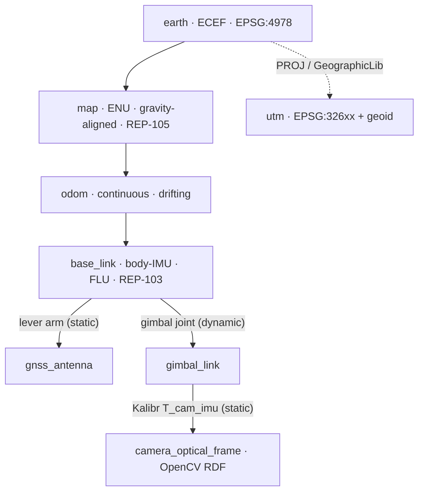

# DRISHTI — Integration: How the Components Work Together

**Purpose:** Show how DRISHTI's modules connect across the Edge, Ground, and Cloud
Tiers — the interfaces, coordinate frames, clocks, transports, and failure handling that make
the claim *"integrates with real hardware/software and never hard-fails"* concrete and auditable.

**Audience:** National Technical Research Organisation (NTRO) technical evaluators and systems
engineers, hackathon judges, and the DRISHTI build team wiring the pipeline together.

**TL;DR**
- DRISHTI is a **three-tier** system — Edge Tier (on-UAV NVIDIA Jetson AGX Orin) · Ground Tier
  (RTX-class workstation) · Cloud Tier (optional) — glued by **ROS 2** on each host and by a
  **store-and-forward Secure Reliable Transport (SRT)** link between tiers. Uncrewed Aerial Vehicle
  (UAV) is the drone.
- The integration honors the **two output paths (A3)**: a *Live path* (stages S0–S5, near-real-time
  coarse map on the edge) and a *Refine path* (stages S6–S10, minutes-scale metric textured model on
  the ground). The Live path stays up even if the link or the Refine path is interrupted.
- Every inter-module message carries a **timestamp on a GPS-disciplined clock**, a **confidence/
  covariance** field, and a **reliability-ladder level (L0–L6)** — so the **metric spine (A2)** and the
  **reliability spine (A4)** cross module boundaries, not just live inside one node.
- The **accurate model never depends on the live link**: near-raw H.265 plus full-rate telemetry is
  recorded to onboard Non-Volatile Memory express (NVMe) storage, and the Ground Tier reprocesses that
  recording **deterministically** (monotonic frame IDs, pinned versions, fixed seeds).
- Integration is real-hardware-first: camera→Jetson over Camera Serial Interface (CSI) / Gigabit
  Multimedia Serial Link (GMSL) / USB; telemetry and control over **MAVLink/MAVSDK** (PX4/ArduPilot)
  or the **DJI Payload SDK (PSDK)**; Real-Time Kinematic (RTK) corrections over **NTRIP**.
- **No mandatory cloud, air-gap-capable, chain-of-custody by design** — for defense use the whole
  mission runs on a field laptop with an encrypted, signed project bundle.

> The pipeline itself (tiers, stages, model choices) is defined once in
> [`_internal/CANONICAL-ARCHITECTURE-SPEC.md`](_internal/CANONICAL-ARCHITECTURE-SPEC.md). This
> document is the *systems-integration* view of that pipeline and conforms to it.

---

## 1. Component / module map

DRISHTI's modules map one-to-one onto the canonical stages S0–S10, wrapped by transport, recording,
and serving components. The Edge Tier runs the Live path (S0–S5); the Ground Tier runs the Refine
path (S6–S10); the Cloud Tier is optional scale-out. Solid arrows are continuous data flow; the bold
arrow is the tier-to-tier keyframe stream; dashed arrows are best-effort live streams or post-flight
backfill.

```mermaid
flowchart LR
  subgraph SENSORS["UAV sensors & flight stack"]
    CAM["Camera CSI/GMSL/USB"]
    IMUG["IMU + baro + mag"]
    GNSSR["GNSS + RTK rover"]
    FC["PX4/ArduPilot or DJI FC"]
    GIM["Gimbal encoders"]
  end
  subgraph EDGE["Edge Tier — Jetson AGX Orin"]
    S0["S0 Capture & Sync"]
    REC["NVMe recorder mcap"]
    S1["S1 Ingest & Frame QA"]
    S2["S2 Odometry & Loc"]
    S3["S3 Perception & Masking"]
    S4["S4 Depth & Geometry"]
    S5["S5 Live Fusion nvblox"]
    TX["SRT uplink + store-fwd"]
  end
  subgraph GROUND["Ground Tier — RTX workstation"]
    RX["Ingest + reconciler"]
    S6["S6 Global Optimization"]
    S7["S7 Dense Recon & 3DGS"]
    S8["S8 Meshing & Texturing"]
    S9["S9 Georef & Semantics"]
    S10["S10 Export & Serve"]
    APIS["APIs + web viewer"]
  end
  subgraph CLOUD["Cloud Tier — optional"]
    TILE["Scale-out tiling"]
    SERVE["3D Tiles serving"]
  end
  NTRIP["NTRIP caster / base"] -->|RTCM3| GNSSR
  CAM --> S0
  IMUG --> S0
  GNSSR --> S0
  GIM --> S0
  FC -->|MAVLink| S0
  S0 --> REC
  S0 --> S1 --> S2 --> S3 --> S4 --> S5
  S2 --> S4
  S5 -->|live map| TX
  S1 -->|keyframe pkg| TX
  REC -.->|post-flight backfill| TX
  TX ==>|"keyframes+poses+depth+masks+conf"| RX
  RX --> S6 --> S7 --> S8 --> S9 --> S10 --> APIS
  S10 -->|large-area| TILE --> SERVE
  TX -.->|live coarse stream| OP["Operator HUD"]
  APIS -->|final model + reports| OP
```



Two facts about this map matter for integration. First, **S2 (Odometry & Localization) and S4 (Depth
& Geometry) span the tier boundary** (`[E→G]` in the spec): they start on the edge for the live map
and are re-solved on the ground for accuracy, so their message contracts must be identical on both
tiers. Second, the **NVMe recorder sits directly off S0**, *upstream* of all lossy processing — it is
the mission's ground truth and is never gated by compute or link pressure.

---

## 2. Interfaces & message contracts

Within a tier, modules are **ROS 2 (Robot Operating System 2, Humble/Jazzy)** nodes exchanging typed
messages over Data Distribution Service (DDS), with NVIDIA **Isaac ROS NITROS** zero-copy for
GPU-to-GPU handoff on the Jetson's shared memory. Quality of Service (QoS) is chosen per topic:
`BEST_EFFORT`/`KEEP_LAST` for high-rate previews, `RELIABLE` for keyframe metadata, poses, and health.

### Topic graph (principal topics)

| Topic | Type | QoS | Rate | Producer → Consumers |
|-------|------|-----|------|----------------------|
| `/drishti/imu` | `sensor_msgs/Imu` | BEST_EFFORT, depth 50 | 100–400 Hz | S0 → S2 |
| `/drishti/gnss/fix` | `sensor_msgs/NavSatFix` | RELIABLE, depth 20 | 5–10 Hz | S0 → S2 |
| `/drishti/vio/odometry` | `nav_msgs/Odometry` | BEST_EFFORT, depth 10 | 30–60 Hz | S2 → S5, HUD |
| `/drishti/keyframes` | `drishti_msgs/Keyframe` | RELIABLE, depth 30 | 1–3 Hz | S1 → S2/S3/S4 → TX |
| `/drishti/pose_kf` | `geometry_msgs/PoseWithCovarianceStamped` | RELIABLE, depth 30 | 1–3 Hz | S2 → S4/S5 |
| `/drishti/map_update` | `drishti_msgs/MapUpdate` | RELIABLE, depth 5 | 1–5 Hz | S5 → HUD, TX |
| `/drishti/live_preview` | `sensor_msgs/CompressedImage` | BEST_EFFORT, depth 2 | 15–30 Hz | S5 → HUD |
| `/drishti/health/*` | `drishti_msgs/HealthStatus` | RELIABLE, depth 10 | 1–2 Hz | every node → supervisor |
| `/tf`, `/tf_static` | `tf2_msgs/TFMessage` | RELIABLE (static: transient-local) | on change | S0/S2 → all |

Large payloads (image, depth, masks, pointmaps) travel **by reference** — a content-addressed URI into
the mcap recording or a shared object store — not inline, so the metadata bus stays light and every
byte is deduplicated and integrity-checked. The three schemas below are the load-bearing contracts.

```
# drishti_msgs/msg/Keyframe.msg — the unit of work handed edge → ground
std_msgs/Header header            # stamp = GPS-disciplined capture time; frame_id = camera_optical_frame
uint64 keyframe_id                # monotonic, gap-free; primary key for deterministic reprocessing
uint64 source_pts                 # decoder presentation timestamp (I/P/B-aware)

# --- Pose in map (ENU) frame from the S2 metric spine ---
geometry_msgs/PoseWithCovariance pose_map   # 6-DoF, gravity-aligned ENU; 6x6 covariance, row-major
uint8   pose_tier                 # reliability-ladder level L0..L6 at solve time
float32 pose_confidence           # 0..1, derived from covariance trace

# --- Global georeference (S2 / S9) ---
float64[3] ecef_position          # WGS84 ECEF metres
float64 latitude                  # deg
float64 longitude                 # deg
float64 ellipsoidal_height        # h, metres
float64 orthometric_height        # H = h - N; geoid model named in meta
uint8   gnss_fix_type             # 0 none · 1 single · 2 float · 4 RTK-fix (mirrors GPS_RAW_INT)

# --- Camera intrinsics (fixed or self-calibrated), S1 / S6 ---
sensor_msgs/CameraInfo intrinsics # K, distortion model + coeffs, width/height
bool    intrinsics_fixed          # true = pre-calibrated and locked in bundle adjustment

# --- Payloads by reference (content-addressed), never inline ---
string image_uri                  # e.g. mcap://seg-0007#kf-000142
string image_encoding             # "h265-iframe" | "png" | "nv12"
string image_sha256               # integrity / dedup
string dynamic_mask_uri           # movers removed from geometry (S3)
string semantic_label_uri         # building/roof · road/infra · veg · terrain · obstacle (S3)
string depth_uri                  # metric depth, scale-aligned to trajectory (S4)
string depth_confidence_uri       # per-pixel confidence (S4)
string pointmap_uri               # optional VGGT / MASt3R pointmap (S4)
float32 sharpness_score           # variance-of-Laplacian (S1)
float32 exposure_score            # histogram-clip fraction (S1)
```

```
# drishti_msgs/msg/MapUpdate.msg — incremental live map (S5) and progressive LOD
std_msgs/Header header            # frame_id = "map"
uint32 update_seq                 # monotonic; consumers detect gaps
uint8  kind                       # 0 TSDF_BLOCKS · 1 POINT_SPLAT · 2 MESH_PATCH
string crs_epsg                   # e.g. "EPSG:32643" (UTM 43N)
string geoid_model                # e.g. "EGM2008"
geometry_msgs/Point origin_enu    # tile origin in map (ENU)
float32 voxel_size                # metres (0.05–0.10 live)
uint64[] touched_block_ids        # only the blocks changed this update
uint8  lod                        # progressive level of detail
float32 coverage_fraction         # 0..1 estimated surface seen
bool   is_georeferenced           # false => local ENU only (ladder L2/L3)
string payload_uri                # nvblox block bundle / splat / glTF patch
float32[] per_block_confidence    # per-voxel weight summarised per block
```

```
# drishti_msgs/msg/HealthStatus.msg — the reliability spine on the wire
std_msgs/Header header
string node_name                  # e.g. "s4_depth", "s2_vio"
uint8  stage                      # 0..10 for S0..S10
uint8  lifecycle_state            # ROS 2: UNCONFIGURED/INACTIVE/ACTIVE/FINALIZED
uint8  ladder_level               # currently-active L0..L6
uint8  status                     # 0 OK · 1 DEGRADED · 2 FALLBACK · 3 STALLED · 4 ERROR
float32 input_rate_hz
float32 output_rate_hz
float32 processing_latency_ms
uint32 queue_depth                # bounded-queue occupancy (backpressure signal)
uint32 dropped_msgs               # since last report (preview path only)
float32 gpu_util
float32 gpu_mem_used_mb
float32 soc_power_w               # from tegrastats
float32 soc_temp_c                # thermal; sustained rise -> throttle -> L6
uint8   gnss_fix_type
float32 gnss_hdop                 # horizontal dilution of precision
float32 clock_sync_residual_ms    # PPS/PTP offset; over budget -> degrade
string  message                   # human-readable
```

These three types carry the anchors across every boundary: `pose_map` + covariance + georeference
fields *are* the metric spine (A2); the `depth_uri`/`pointmap_uri`/`depth_confidence_uri` triplet
carries the prior-assisted geometry (A1) — learned depth and VGGT/MASt3R pointmaps with per-pixel
confidence — into the fusion stages; and `pose_tier`, `ladder_level`, and every `*_confidence` field
*are* the reliability spine (A4).

---

## 3. Coordinate frames & transforms

DRISHTI uses one **ROS transform (TF) tree** per the canonical conventions so that geometry, poses,
and georeference compose without ambiguity. Frames follow **ROS Enhancement Proposal (REP) 103**
(units, axis orientation) and **REP-105** (`earth`→`map`→`odom`→`base_link` semantics).



| Frame | Convention | Role | Source of transform |
|-------|-----------|------|---------------------|
| `earth` | Earth-Centered Earth-Fixed (ECEF), EPSG:4978 | Global datum anchor | WGS84 from GNSS |
| `utm` | Universal Transverse Mercator, EPSG:326xx | Projected delivery Coordinate Reference System (CRS) | PROJ pipeline (S9); orthometric height H = h − N via geoid |
| `map` | East-North-Up (ENU), gravity-aligned | Metric reconstruction frame | S2 factor graph aligns ENU to ECEF |
| `odom` | ENU, continuous | Smooth, drift-prone VIO output | S2 Visual-Inertial Odometry (VIO) |
| `base_link` | Forward-Left-Up (FLU), REP-103 | Body / Inertial Measurement Unit (IMU) frame | rigid airframe |
| `gnss_antenna` | — | Lever-arm endpoint | measured to ±1–2 cm |
| `gimbal_link` | — | Gimbal-mounted camera mount | gimbal encoders (dynamic) |
| `camera_optical_frame` | OpenCV Right-Down-Forward (RDF) | Image geometry | **Kalibr** camera↔IMU extrinsic |

**Extrinsic calibration handoff.** The camera↔IMU rigid transform `T_cam_imu` and time offset are
solved offline once with **Kalibr** (AprilGrid) and the IMU noise model with `allan_variance_ros`;
intrinsics come from a pre-flight OpenCV calibration or DJI EXIF/XMP DewarpData. These are emitted as
one YAML file consumed at boot by a `static_transform_publisher` (into `/tf_static`, transient-local
QoS so late joiners get it) and by S2/S6, which **fix** intrinsics rather than free-solve them — the
specific change that stabilizes weak single-pass bundle adjustment. The `map`→`earth` transform is not
static: it is published by S2 the moment the metric spine acquires a georeferenced solution, and it
re-anchors on GNSS re-acquisition after an outage (ladder L2).

---

## 4. Time synchronization

Metric accuracy is make-or-break on the clock: per-frame position error ≈ `sync_error × ground_speed`,
so 10 ms of desync at 8 m/s smears a frame by ~8 cm. DRISHTI targets **frame-to-GNSS sync < 2–3 ms**.
There is one monotonic clock per host, disciplined to **GPS time** as the global reference.

- **Custom PX4/ArduPilot rigs:** route the GNSS **Pulse-Per-Second (PPS)** into both the flight
  controller and the Jetson (`pps-gpio` + `gpsd` + `chrony`), and run **Precision Time Protocol (PTP,
  IEEE-1588)** with `linuxptp` (`ptp4l`/`phc2sys`) across compute nodes. A hardware camera trigger
  logs `CAMERA_FEEDBACK` (GPS time + pose) per exposure. PPS disciplines to <1 µs; PTP to <10 µs wired.
- **DJI PSDK path:** call **DjiTimeSync** to discipline the payload Jetson clock to aircraft GPS time
  over the E-Port PPS, and subscribe to RTK position and gimbal attitude. For zero-SDK ingest, the
  per-frame `.SRT` subtitle sidecar carries timestamp/GPS/altitude/gimbal at frame cadence.
- **Alignment.** S0 stamps every decoded frame with its GPS-disciplined capture time (correcting for
  decoder latency and B-frame reordering), then S2 spline-interpolates the RTK/PPK trajectory and
  gimbal/IMU attitude onto that exact epoch and applies the antenna→camera lever arm. IMU and GNSS are
  fused by timestamp inside the factor graph, not by arrival order.
- **Buffering.** Each sensor stream lands in a time-ordered ring buffer; a `message_filters`
  `ExactTime`/`ApproximateTime` synchronizer forms keyframe bundles. Buffers absorb jitter and let S2
  wait a bounded window for a late IMU or GNSS sample before emitting.
- **Fallback.** If PPS is absent, S0 drops to software timestamp interpolation and **raises the
  temporal-uncertainty flag** on affected samples; if sync is lost entirely, a post-hoc
  cross-correlation of IMU angular rate against frame optical flow recovers the offset offline. The
  `clock_sync_residual_ms` field in `HealthStatus` makes drift observable and feeds the degradation
  ladder.

---

## 5. Edge ↔ Ground protocol

The tier boundary is where the honesty policy is enforced in wire form: the **live link carries a
preview; the recording carries the truth.** *"Real-time"* here means a near-real-time edge preview plus
a minutes-scale ground refinement — never a full textured mesh in hard real-time on the UAV.

**Streamed live vs stored.**

| Data | Onboard NVMe (master) | Downlink (SRT) |
|------|----------------------|----------------|
| Video | near-raw H.265, 100–150 Mbps @ 4K | — (reconstruct from master) |
| Preview video | — | 1080p H.265 proxy, 2–10 Mbps |
| Telemetry | full-rate IMU/GNSS/baro/RTK, RINEX raw | keyframe poses only |
| Keyframe package | full-res image refs + depth + masks | downsampled depth + masks + confidence |
| Live map | — | `MapUpdate` incremental blocks, ~0.5–2 Mbps |

**Keyframe package contents** (the `/drishti/keyframes` payload, batched for uplink): the `Keyframe`
message plus downsampled metric depth, dynamic + semantic masks (run-length encoded), per-pixel
confidence, and the pose covariance. This fits a **few Mbps** — well inside a lossy 2–20 Mbps RF link —
versus 20–50 Mbps for raw 4K, which is why only keyframes (not full video) are streamed.

**Store-and-forward on link loss.** S0 writes near-raw H.265 + full-rate telemetry to an **NVMe
circular buffer** (rosbag2/mcap) with monotonic IDs and hardware timestamps, independent of the radio.
Uplink runs over **SRT** (Automatic Repeat reQuest + Forward Error Correction, AES-encrypted) with a
120–500 ms recovery buffer. On link loss the buffer persists and the live preview freezes, but
**recording never stops**; on reconnect or after landing the gap is backfilled so the Ground Tier sees
a complete stream (reliability ladder, `Always` row).

**Deterministic ground reprocessing.** The Ground Tier reconciler indexes the recording by
`keyframe_id` + hardware timestamp and re-runs S2/S4 and then S6–S10 with **pinned model versions,
fixed random seeds, and content-addressed inputs**, so the refined model is reproducible and auditable
and does not depend on whatever the edge managed under compute/thermal/link pressure. A mid-refine
crash resumes idempotently from the last checkpoint rather than restarting.

---

## 6. Hardware / software integration

DRISHTI integrates with two real, obtainable capture platforms — the COTS DJI path and an open
PX4/ArduPilot path — through the same edge software contract.

| Interface | DJI path | Open PX4/ArduPilot path |
|-----------|----------|-------------------------|
| Aircraft | Matrice 350 RTK + Zenmuse payload | Pixhawk 6X airframe + global-shutter camera |
| Camera → Jetson | payload video via PSDK / live 1080p stream | **CSI / GMSL / USB3-UVC** into Jetson |
| Compute mount | PSDK payload on E-Port (Manifold 3 / carrier) | Jetson companion, serial/UDP to autopilot |
| Telemetry | PSDK subscription; `.SRT` sidecar | **MAVLink** via MAVROS/MAVSDK/pymavlink |
| Control | PSDK / MSDK | MAVLink commands (MAVSDK) |
| Time sync | DjiTimeSync (PPS) | PPS + PTP + gpsd/chrony |
| RTK | built-in RTK + **NTRIP** | u-blox ZED-F9P-class rover + **NTRIP** |

**Camera → Jetson.** The companion Jetson decodes H.264/H.265 on **NVDEC** via GStreamer
(`nvv4l2decoder`) or DeepStream, zero-copy to CUDA/TensorRT. CSI and GMSL suit fixed global-shutter
machine-vision sensors (Sony IMX296/264-class) with hardware trigger; USB3/UVC suits quick-integration
cameras at the cost of unknown exposure latency (flagged in the sync budget).

**MAVLink/MAVSDK telemetry & control.** DRISHTI subscribes to `GLOBAL_POSITION_INT`, `GPS_RAW_INT`
(fix type + HDOP), `ATTITUDE_QUATERNION`, `HIGHRES_IMU`, altitude, and `CAMERA_FEEDBACK`, and
republishes them into ROS 2 (`/drishti/imu`, `/drishti/gnss/fix`). Control (mode, gimbal, mission) uses
MAVLink commands or PSDK — always on the **control plane** (§7), never mixed with the data plane.

**NTRIP RTK corrections.** An NTRIP client streams RTCM3 corrections from a national Continuously
Operating Reference Station (CORS) caster or a local base (Emlid Reach RS3) to the rover for cm-level
positions. Where no correction link exists (borders, disaster sites), DRISHTI logs raw GNSS
observations (RINEX) and post-processes with **RTKLIB PPK** after landing — the link-independent,
reprocessable accuracy anchor. Honesty note: *"metric without GCPs"* is sensor-fused scale with
**configuration-dependent** numbers — cm-class with RTK/PPK (ladder L0), sub-metre GPS-only (L1) — and
vertical typically needs one checkpoint to remove a ~10–30 cm geoid/lever-arm bias.

**Power / thermal integration.** The Jetson draws through the E-Port (24 V) or airframe rail and is
capped to a 15–25 W power mode with `nvpmodel` + `jetson_clocks`. A **thermal watchdog** reads
`tegrastats`; sustained throttle transitions the edge to ladder **L6** (point-splat preview, defer
meshing to ground) so heat degrades fidelity rather than crashing the node. Detection/segmentation
offload to the Deep Learning Accelerator (DLA) frees the GPU for depth + fusion.

---

## 7. Control plane vs data plane

DRISHTI separates a low-rate, reliable **control plane** from a high-rate, loss-tolerant **data
plane** so that a saturated data path can never starve command, health, or mode-transition traffic —
the classic real-time failure mode.

| Aspect | Control plane | Data plane |
|--------|--------------|------------|
| Carries | mission commands, mode/lifecycle transitions, config, health, calibration | video, keyframes, depth, masks, pose, point clouds, map updates |
| Transport | MAVLink; ROS 2 services/actions; `RELIABLE` DDS | NITROS zero-copy (intra-host); `BEST_EFFORT` DDS; SRT (inter-tier) |
| QoS | reliable, low-rate, bounded latency | best-effort where stale-tolerant, reliable for keyframe metadata |
| Backpressure policy | never drop; queue and acknowledge | **drop-oldest** on preview; **spill-to-disk** on the record path |
| Failure stance | must always flow (heartbeats, watchdogs) | may coarsen/thin under load |

Concretely: an operator "start/stop capture" or a supervisor "S4 → fall back to monocular" command
travels the control plane and is acknowledged; the 30 Hz depth stream travels the data plane and may
drop frames under thermal load without affecting command integrity. Health (`HealthStatus`) is control
plane so it survives exactly the congestion it is meant to report.

---

## 8. API surface

The Ground Tier (S10) exposes three stable interfaces so evaluators and downstream Geographic/CAD/
digital-twin tools can consume DRISHTI without bespoke glue. Every response carries CRS, geoid, and a
**confidence/provenance** field — measurement on low-confidence, once-seen geometry is always flagged.

```
# Measurement API (REST/JSON) — distances, areas, volumes, heights, slopes
GET  /v1/measure/point?lat&lon                 -> {enu, ecef, ortho_h, confidence, tier}
POST /v1/measure/distance   {points[]}         -> {length_m, ci_95, per_seg_confidence}
POST /v1/measure/volume     {polygon, base}    -> {volume_m3, ci_95, method, confidence}
POST /v1/measure/profile    {line}             -> {samples[], gsd_cm, low_conf_spans[]}

# Export API (asynchronous jobs) — open, georeferenced formats
POST /v1/export {product, format, crs, roi}    -> {job_id}
       product ∈ {pointcloud, mesh, gsplat, dsm, dtm, ortho, semantic, report, bundle}
       format  ∈ {las, laz, copc, ply, obj, glb, 3dtiles, cityjson, cog, geojson, pdf}
GET  /v1/export/{job_id}                        -> {state, progress, artifact_uri, sha256}
GET  /v1/project/{id}/bundle                    -> reproducible archive (video ref, poses, calib, logs)

# Live-map stream API — near-real-time situational awareness during flight
GET  /v1/map/live            (WebRTC/RTSP)      -> coarse georeferenced map + telemetry HUD
WS   /v1/map/updates                            -> MapUpdate deltas (seq, blocks, coverage, conf)
GET  /v1/health                                 -> aggregated HealthStatus + active ladder level
```

The export formats are exactly the Desired-Output deliverables (LAS/LAZ/COPC, OGC 3D Tiles, COG
DSM/DTM/ortho, glTF/GLB, CityJSON, GeoJSON, plus the accuracy & confidence report). The live-map stream
is the A3 *Live path* surfaced to the operator; the measurement/export APIs are the A3 *Refine path*.

---

## 9. Failure handling across module boundaries

*"Never fails"* means **graceful degradation with no single point of failure** — the system always emits
a best-effort model plus an explicit uncertainty/completeness report. That guarantee is engineered at
every module boundary, not patched with try/except, and it maps onto the canonical reliability ladder.

- **Backpressure.** Every inter-node queue is bounded. On the preview/data path the policy is
  *drop-oldest* (a slow consumer never stalls capture); on the record path it is *spill-to-disk, never
  drop*. `queue_depth` and `dropped_msgs` in `HealthStatus` expose the pressure.
- **Watchdogs.** Nodes are ROS 2 **lifecycle** nodes (`UNCONFIGURED→INACTIVE→ACTIVE`); a supervisor
  (behavior-tree/lifecycle manager) plus a hardware/`systemd` watchdog restarts a crashed node, which
  **resumes idempotently** from its last checkpoint using the recorded stream.
- **Health monitoring.** Heartbeats between edge and ground, per-node `HealthStatus`, and DDS
  deadline/liveliness QoS give bounded staleness detection. Threshold breaches (with **hysteresis** to
  avoid flapping) trigger ladder transitions in tens of milliseconds.
- **Reconnection.** SRT rides through packet loss and re-establishes automatically; DDS/Zenoh
  re-discover peers; edge↔ground uses exponential backoff. On reconnect the recorder backfills the gap.
- **Idempotent / resumable processing.** Monotonic frame IDs plus atomic (write-then-rename)
  checkpoints of the pose graph, TSDF, and processed-frame cursor bound rework to one interval and keep
  reprocessing deterministic.

| Boundary failure | Detection | Response | Ladder |
|------------------|-----------|----------|--------|
| No RTK/PPK correction | `gnss_fix_type` drops from 4 | Continue GNSS+IMU+VIO; flag reduced georef; defer to PPK | **L1** |
| GNSS dropout (canyon/denied) | fix=0, HDOP spikes | VIO+IMU dead-reckon; re-anchor `map`→`earth` on re-acquire | **L2** |
| Brief visual loss | VIO covariance blows up | IMU inertial propagation; short gap flagged high-uncertainty | **L3** |
| Blur/dark frames | sharpness/exposure gate | Widen keyframe spacing; mark coverage holes, not garbage | **L4** |
| Neural model OOM/fail | node error + watchdog | Fall back to classical MVS/monocular; lower LOD | **L5** |
| Edge compute/thermal saturated | `soc_temp_c`, `queue_depth` | Point-splat preview; defer meshing to ground | **L6** |
| Downlink lost | heartbeat timeout | Store-and-forward continues; preview freezes; recording never stops | Always |
| Clock sync lost | `clock_sync_residual_ms` over budget | Software interpolation; post-hoc IMU/flow correlation; flag | S0 fallback |

**Invariant:** no single point of failure. The Live path survives a Refine-path or link failure; the
accurate model survives any live failure via the recording; and every product ships with a confidence
map so a downstream measurement never silently trusts inferred geometry.

---

## 10. Deployment topologies

The same modules and contracts re-tile across four topologies; only *where* the tier boundary sits and
*which* ladder level is nominal changes.

| Topology | Edge | Ground | Cloud | Nominal ladder | Notes |
|----------|------|--------|-------|----------------|-------|
| **Field / air-gapped** | Jetson on UAV | rugged field laptop | none | L1 | Rapid recon/disaster; live coarse map first, full model in minutes; PPK anchor |
| **RTK survey-grade** | Jetson + RTK/NTRIP | RTX workstation | optional | L0 | cm accuracy; full deliverable set + accuracy certificate |
| **GPS-denied (urban/EW)** | Jetson (VIO-metric) | field laptop | none | L2 | Local metric map; georeference on GNSS re-acquire or known landmarks |
| **Hackathon single-workstation** | *emulated* | one RTX/laptop | none | L0/L1 | Edge/Ground split emulated in one host on the provided dataset |

In the **hackathon emulation** the edge and ground processes run on one workstation and the SRT link is
a loopback; the pipeline is otherwise identical — video+GPS+metadata → keyframe QA → poses
(VGGT/MASt3R or COLMAP) → metric depth scale-aligned to GPS → fused cloud/TSDF (Open3D) → few-shot 3DGS
(InstantSplat) → mesh (2DGS/Poisson) → georeference to UTM → export + accuracy report + web viewer,
with dynamic masking and a graceful-degradation demo (injected GPS noise/blur). This makes the "real
hardware" and "single-workstation" stories the **same code on a different topology**, not two systems.

---

## 11. Security & sovereignty

DRISHTI is built for a defense customer, so data control is an integration requirement, not an add-on.

- **Air-gap operation.** No mission step requires the Cloud Tier: capture, live map, refine, measure,
  and export all run on the on-UAV Jetson plus a field laptop. The cloud is opt-in scale-out only.
- **Chain-of-custody.** The recorder writes an append-only, hash-chained mcap (monotonic IDs + hardware
  timestamps); every exported product embeds its source `keyframe_id` range, sensor configuration,
  processing tier, model versions, and CRS/geoid in a **reproducible project bundle**, so any deliverable
  can be re-derived and audited. Content-addressed inputs make tampering detectable.
- **Confidentiality & integrity.** The downlink is SRT with AES encryption; at-rest recordings and
  bundles are encrypted; the project bundle carries a signed hash manifest. Data never leaves the
  operator's control by default — there is no mandatory telemetry exfiltration.
- **Access control.** The API surface (§8) sits behind Role-Based Access Control; measurement and export
  actions are logged to the same audit trail as the chain-of-custody record.
- **Licensing/sovereignty caveat.** Several strong research models carry non-commercial or
  no-military licenses (e.g. VGGT's commercial checkpoint excludes military use; MASt3R weights are
  non-commercial; Ultralytics YOLO is AGPL-3.0). A deployable build must be assembled from
  permissively-licensed components (GTSAM BSD, RoMa MIT, SuperPoint/LightGlue Apache, DROID-SLAM BSD)
  or licensed/retrained equivalents — tracked in [Open questions](#open-questions--risks).

---

## Open questions / risks

- **Time-sync on COTS cameras.** USB/CSI cameras without a hardware trigger have jittery, unknown
  exposure latency; hitting the <2–3 ms budget may require a global-shutter rig with strobe feedback,
  which the DJI SDKs do not fully expose. This bounds GNSS-denied VIO robustness on DJI platforms.
- **Onboard compute on the DJI Matrice 350.** The certified Manifold 3 targets the M400/M4-series, not
  the M350; onboard Jetson on the M350 needs a third-party PSDK carrier. Verify carrier + PSDK aircraft
  support before committing (see [`_internal/research/4-drone-sensor-hardware.md`](_internal/research/4-drone-sensor-hardware.md)).
- **Vertical accuracy without a checkpoint.** A systematic ~10–30 cm vertical bias (geoid/lever-arm/
  boresight) is common with zero GCPs; the honest budget for GPS-only is sub-metre, and one checkpoint
  or a precise local geoid is effectively required for sub-decimetre vertical.
- **Deterministic reprocessing vs GPU non-determinism.** Unpinned CUDA/library versions and float
  reductions can break bit-exact reproducibility; the chain-of-custody guarantee depends on locking
  these down and content-addressing inputs.
- **Message-contract versioning.** `Keyframe`/`MapUpdate`/`HealthStatus` are load-bearing across the
  tier boundary; a schema change must be versioned so an edge and ground on different builds interoperate
  or fail loudly, never silently.
- **Model licensing for deployment.** As above — the *orchestration* is DRISHTI's IP, but the adopted
  third-party models must be license-vetted for NTRO use; this is the single biggest realism risk and is
  flagged here rather than silently assumed away.
- **Spec conformance.** This document follows the canonical spec's tiers, stages, frames, and reliability
  ladder. No conflicts were found; the message schemas, topic graph, and API sketch are integration
  detail authored here and are proposals pending implementation, not measured results.

## Further reading

- [`_internal/CANONICAL-ARCHITECTURE-SPEC.md`](_internal/CANONICAL-ARCHITECTURE-SPEC.md) — authoritative
  tiers, stages S0–S10, model registry, metric & reliability spines, accuracy budget.
- [`_internal/PROBLEM_STATEMENT.md`](_internal/PROBLEM_STATEMENT.md) — problem, Desired Output &
  Evaluation tables, honesty guardrails.
- [`_internal/research/6-systems-edge-compute.md`](_internal/research/6-systems-edge-compute.md) —
  edge/cloud execution, transport, degradation ladder, observability.
- [`_internal/research/4-drone-sensor-hardware.md`](_internal/research/4-drone-sensor-hardware.md) —
  capture platforms, per-frame georeferencing, time sync, PSDK/MAVLink.
- [`_internal/research/5-geospatial-accuracy.md`](_internal/research/5-geospatial-accuracy.md) —
  factor-graph fusion, CRS/geoid handling, ASPRS accuracy assessment.
- [`_internal/research/2-computer-vision-video.md`](_internal/research/2-computer-vision-video.md) —
  video front-end, keyframing, dynamic masking, matching fallbacks.
```
