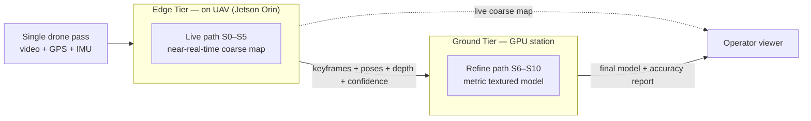

# DRISHTI — Pitch & Presentation Guide

**Purpose:** A ready-to-use kit for pitching DRISHTI before and at the hackathon — verbatim scripts, a slide-by-slide deck, a live-demo runbook, and honest answers to the hard questions.

**Audience:** The DRISHTI build team, as presenters. Written to persuade **National Technical Research Organisation (NTRO)** technical evaluators and hackathon judges without overclaiming.

**TL;DR**
- **DRISHTI** (Drone-based Real-time Imaging for Single-pass High-fidelity Terrain Intelligence) turns **one drone pass** into a georeferenced, measurable 3D model — a live coarse map *while flying*, a full metric textured model *minutes after landing*.
- The pitch rests on **three pillars** mapped to our design anchors: **A1 — prior-assisted geometry** (learned AI geometry beats missing views), **A2 — the metric spine** (sensor fusion gives scale + georeference without Ground Control Points), and **A3/A4 — two paths + a reliability spine** (streams live, never hard-fails).
- **Be honest, on purpose.** "Real-time" = near-real-time edge preview **plus** minutes-scale ground refinement, inside the official **< 15 min for a 10-minute video** ceiling. "Metric without GCPs" = sensor-fused, configuration-dependent accuracy against the official **≤ 1 m** bar (cm-class with RTK/PPK, sub-meter-to-≤ 1 m on plain GPS, **any region past 1 m flagged**). "Never fails" = graceful degradation **plus** an explicit uncertainty report.
- **Pitch to the scorecard.** The official rubric is reconstruction accuracy **30%** · model completeness **20%** · processing speed **20%** · innovation **15%** · scalability **10%** · user interface **5%** — 70% of the marks sit in the first three, which is exactly where A1/A2/A3 aim. Deliverables are the named set: **OBJ · PLY · LAS · GeoTIFF · .glb/.gltf · .fbx**, in a **web or desktop viewer**.
- **Only video + GPS + flight metadata are mandatory inputs** — IMU, barometer, camera intrinsics and RTK/PPK are optional, so every claim below holds with intrinsics **self-calibrated** and scale taken from GPS baselines + visual structure. Say this before a judge asks.
- **Defensible wedge** vs Pix4D / Metashape / DJI Terra / OpenDroneMap / COLMAP / SLAM / NeRF-SaaS: a genuine **single linear pass** + **live on-edge map** + **georeferenced metric output** + **graceful degradation** — air-gap-ready, made in India.
- Contents: 30-second and 3-minute scripts, a 15-slide deck, a 3–4 minute demo runbook (with fallback), 16 Q&A, and a closing "why us / why India / why NTRO" slide.

> **Presenter rules.** Always say **DRISHTI**, never "our app". State every capability with its envelope *and* its failure mode — evaluators trust presenters who name limits. Never claim a 4K textured mesh in hard real-time on the drone. Pair "live" with "coarse", and "metric" with the sensor configuration.

---

## 1. 30-second elevator pitch (verbatim)

> "Today, an accurate 3D map means flying a drone in a grid for an hour, then processing overnight. But in disaster response, border surveillance, or strike-damage assessment, you often get **one pass, one chance** — no second flight, sometimes no going back.
>
> **DRISHTI turns that single drone pass into a georeferenced, measurable 3D model — built live as the drone flies.** We fuse learned AI geometry with the drone's own satellite-positioning and inertial sensors, so we get metric accuracy *without* laying out ground control points. The operator sees a coarse 3D map in near-real-time; the full textured, survey-grade model lands minutes after touchdown — with an honest confidence report on every region.
>
> One pass. The whole picture. On the edge, offline-capable, made in India."

*(~90 words, ~30 s. Drop the last line for 25 s.)*

---

## 2. 3-minute pitch script (verbatim, with timing cues)

> **[0:00 — Hook]** Imagine a drone flying a single line over a flooded town, a collapsed bridge, or a stretch of border. It makes exactly **one pass**. There is no second flight — the light is fading, the airspace is contested, the situation is changing by the minute. From that one pass, a commander needs an accurate, measurable 3D model **now**.
>
> **[0:25 — The gap]** Every mapping tool on the market — Pix4D, Agisoft Metashape, DJI Terra, OpenDroneMap — was built for the *opposite* mission: fly a dense grid with 70–80% overlap, land, process for hours. Give them a single forward pass and they hole out or fail, because classical photogrammetry needs wide baselines to triangulate. Real-time SLAM systems track pose but give a sparse skeleton, not a survey-grade textured model. Nobody does single-pass, metric, and live at once.
>
> **[0:55 — The idea]** That gap is **DRISHTI**. It rests on three ideas.
>
> **[1:05 — Pillar 1]** First, **learned geometry beats missing views.** A single pass gives short baselines and limited angles. So instead of triangulation alone, we use feed-forward AI geometry — Depth Anything 3, MapAnything and Pi3, all permissively licensed and therefore actually deployable for you — plus metric monocular depth, to infer dense 3D exactly where triangulation is degenerate.
>
> **[1:30 — Pillar 2]** Second, **the sensors supply the metric truth that ground control points normally would.** One factor graph fuses the two things the brief guarantees us — satellite positioning and visual odometry — and folds in the inertial unit, the barometer and real-time-kinematic corrections whenever the aircraft actually carries them. That fixes true scale and georeference to the one-metre bar, with no control-point network, which a single pass could never even survey.
>
> **[1:55 — Pillar 3]** Third, **everything streams and degrades gracefully.** A live coarse map is built on the drone's onboard computer during flight — the **Edge Tier**. The full metric model is refined on a ground station in minutes — the **Ground Tier**. Every stage emits a confidence signal and has a fallback, so if satellite lock drops or a frame blurs, DRISHTI keeps going and *reports* the uncertainty instead of crashing or lying.
>
> **[2:25 — Honesty + proof]** We're deliberate about honesty, because you're NTRO. "Real-time" means a near-real-time live preview plus a full model well inside your fifteen-minute ceiling for a ten-minute video — not a 4K mesh on the drone. "Metric without control points" means centimeter-class with real-time-kinematic corrections and inside one metre on plain GPS alone — and where a region would miss that metre, we *flag* it rather than average it away. Occluded back-facing walls are *inferred and flagged*, never passed off as measured.
>
> **[2:45 — Close]** DRISHTI runs on an NVIDIA Jetson on the drone and a laptop GPU on the ground, works fully offline for defense use, and exports the whole format set you asked for — OBJ, PLY, LAS, GeoTIFF, glTF and FBX — straight into GIS, CAD, and digital-twin tools, viewable in a browser or on the desktop. One pass, the whole picture — and we'll show you a live demo right now."

*(~450 words, ~3:00 at a measured pace.)*

---

## 3. Slide-by-slide deck outline (15 slides)

Design cue: dark, high-contrast, one idea per slide. Every accuracy figure is a **design target to be measured** unless labelled otherwise, and honesty caveats stay *on the slide*.

### Slide 1 — Title / one-liner
- **DRISHTI** — Drone-based Real-time Imaging for Single-pass High-fidelity Terrain Intelligence.
- *"One pass. The whole picture — a georeferenced, measurable 3D model of everything the drone flew over, built while it flies."*
- Problem: Single-Pass Drone Video to Accurate 3D Model Generation System · NTRO · Robotics & Drones.
- Team name + "Made in India".
- **Note:** Say the one-liner slowly — it is the whole pitch compressed. Don't read the backronym aloud.

### Slide 2 — The mission problem
- Accurate 3D today = multi-pass grid, heavy overlap, flight planning, hours of post-processing.
- Many real missions give **one opportunity to capture**: disaster response, surveillance, reconnaissance, damage assessment.
- Result: teams accept slow multi-pass mapping, or get no model at all.
- The need: **near-real-time situational awareness** from a single flight.
- **Note:** Anchor in a concrete NTRO scenario (border strip, flood, damaged structure). The words to land: "one chance".

### Slide 3 — Why it is hard (single-pass vs multi-pass)
- Multi-pass gives wide baselines and cross-strips; single-pass gives short baselines and **limited viewing angles**.
- Classical Structure-from-Motion (SfM) triangulation is **near-degenerate** on a forward pass — depth error scales as ~1/baseline.
- Added enemies: motion blur, video compression, shadows, moving vehicles/people, GPS noise, occluded back-faces.
- Metric accuracy expected **without extensive Ground Control Points (GCPs)**.
- **Note:** This justifies why we did NOT clone photogrammetry, and sets up the three pillars as the answer.

### Slide 4 — The DRISHTI idea (3 pillars)
- **Pillar 1 · Prior-assisted geometry (A1):** feed-forward AI geometry (**Depth Anything 3, MapAnything, Pi3** — permissive, so deployable) + metric monocular depth fill in where triangulation fails.
- **Pillar 2 · Metric spine (A2):** one factor graph over the *mandatory* inputs — visual odometry + GNSS — folding in IMU, barometer and RTK/PPK **when the aircraft carries them** → metric, georeferenced trajectory, **no GCPs**, against the **≤ 1 m** bar.
- **Pillar 3 · Two paths + reliability spine (A3/A4):** *Live path* on the Edge Tier, *Refine path* on the Ground Tier; every stage has confidence + a fallback.
- Net effect: single pass in, georeferenced measurable model out — live, then refined.
- **Note:** These recur on every later slide. Memorize them as A1/A2/A3–A4.

### Slide 5 — System architecture (simplified)
- Three tiers: **Edge Tier** (on-UAV NVIDIA Jetson AGX Orin) · **Ground Tier** (GPU station/laptop) · **Cloud Tier** (optional, air-gap-friendly).
- **Live path = stages S0–S5** (capture, ingest/QA, odometry, perception, depth, live fusion) → coarse map on the edge.
- **Refine path = stages S6–S10** (global optimization, dense + 3D Gaussian Splatting, meshing/texturing, georeferencing/semantics, export) → metric model on the ground.
- Store-and-forward link: a dropped downlink loses the preview, never the mission data.
- **Note:** Trace one keyframe from drone to model. Stress the edge/ground split is *deliberate*, not a limitation.

### Slide 6 — Live demo (intro)
- "We'll run DRISHTI on a single-pass clip: ingest → live map → full model → measure → accuracy report → break it on purpose."
- Watch for: the coarse map growing live, then the textured georeferenced model.
- Watch for: a measured distance, and a **confidence report** that flags what we could *not* see.
- Then we inject GPS noise and blur to show it degrades, not dies.
- **Note:** Switch to the runbook (§4). If anything stalls, narrate over the pre-rendered fallback without apology.

### Slide 7 — What it outputs (condensed)
- **Every format the brief names:** **OBJ** · **PLY** · **LAS** · **GeoTIFF** · **.glb/.gltf** · **.fbx** — plus LAZ/COPC, OGC 3D Tiles and CityJSON as extras.
- **Georeferenced point cloud** (LAS/LAZ) · **textured multi-LOD mesh** (OBJ, glTF/GLB, FBX, OGC 3D Tiles) · **3D Gaussian-Splat scene**.
- **Digital Surface & Terrain Models (DSM/DTM)** + **true orthomosaic** (Cloud-Optimized GeoTIFF).
- **Semantic layers** (building/roof, road, vegetation, terrain, obstacle) + **measurements** (distance/area/volume/height).
- **Accuracy & confidence report** + **live coarse map** + **reproducible project bundle** — every artifact carries per-region confidence.
- **Viewer, both ways:** a **web viewer** (CesiumJS/Potree, streaming 3D Tiles) *and* a **desktop path** (QGIS/CloudCompare), each with measurement tools and a confidence overlay — the brief accepts either; we ship both.
- **Note:** Emphasize "open, interoperable, GIS/CAD/digital-twin-ready" — no lock-in, no DRISHTI-specific reader needed. Name `.fbx` explicitly; it is on the required list and it is the one most teams will skip.

### Slide 8 — How accurate / how we're evaluated (two regimes)
- **The official bar is ≤ 1 m spatial accuracy and < 15 minutes for a 10-minute video.** Everything below is stated against those two numbers.
- **The official weights:** reconstruction accuracy **30%** · model completeness **20%** · processing speed **20%** · innovation **15%** · scalability **10%** · user interface **5%**. A2 carries the 30%, A1 + the coverage report carry the 20%, A3 carries the speed 20%.
- Two regimes, because RTK/PPK is an *optional* input: **(A) RTK/PPK available**, **(B) GPS-only — the mandatory-input baseline, and therefore the number that actually matters**.

| Criterion | A: RTK/PPK | B: GPS-only |
|---|---|---|
| Absolute accuracy (H) | ~3–8 cm | target ≤ 1 m (0.5–2 m envelope by GPS quality) |
| Absolute accuracy (V) | ~5–12 cm | target ≤ 1 m; 0.8–2.5 m envelope — **flagged where it exceeds 1 m** |
| Relative / local | < 1% of distance | dm-level local |
| GSD @ ~80 m AGL | ~2 cm/px | ~2 cm/px |
| Latency | live ≈ 1–2 s/keyframe (edge) · full model in minutes (ground) | same — budgeted to **< 15 min / 10-min video** |
| vs the ≤ 1 m bar | clears it by ~20× | designed to meet it, with per-region flags where it would not |

- Validated against **ASPRS Positional Accuracy Standards Ed. 2** with independent checkpoints; coverage & occlusion reported.
- **Note:** These are **design targets to be measured** — say so. Vertical is the honest weak axis; one checkpoint removes a ~10–30 cm bias. The move that earns trust: state that regime B is the *guaranteed* configuration and that we **flag** rather than hide any region past 1 m.

### Slide 9 — Reliability: never hard-fails (the ladder)
- **L0** all sensors + RTK → cm accuracy. **L1** no RTK, or no IMU at all (the mandatory-only capture) → target ≤ 1 m, strong relative. *L1 is the default, not a degraded mode.*
- **L2** GNSS dropout → VIO+IMU dead-reckon, re-anchor on re-acquire (GPS-denied / jammed).
- **L3** brief visual loss → inertial propagation, flagged. **L4** bad frames → gate out, mark gaps.
- **L5** neural model fails → classical MVS/monocular fallback. **L6** edge saturated → point-splat preview, defer to ground.
- **Invariant:** always emits (a) a best-effort model + (b) an explicit uncertainty/coverage report. Never silent garbage.
- **Note:** This is A4 — our answer to "never fails". Frame it as an engineering ladder, not a slogan.

### Slide 10 — Real-world integration & hardware
- **Primary UAV:** DJI Matrice 350 RTK + Zenmuse payload (built-in RTK, mechanical shutter, PSDK access).
- **Open alternative:** PX4/ArduPilot airframe + global-shutter camera + survey GNSS + Jetson companion.
- **Metric contract:** per-frame GNSS-time stamping + trajectory interpolation + lever-arm correction (sync error × ground speed = position smear).
- **Compute:** Jetson AGX Orin (edge) · RTX-class GPU (ground); ROS 2 + TensorRT; NTRIP for RTK, RTKLIB for PPK.
- **Note:** Runs on obtainable, defensible hardware today. Dual-stream capture (full-res onboard + proxy downlink) means link loss never loses data.

### Slide 11 — Competitive edge (honest)

| Tool / class | Single linear pass | Live / on-edge | Metric georef, no GCP | Graceful degrade |
|---|---|---|---|---|
| Pix4D / Metashape / RealityCapture / ContextCapture | No (overlap grid) | No (offline) | Via GCP/RTK | No |
| DJI Terra | No (overlap) | No (offline) | RTK-friendly | No |
| OpenDroneMap (ODM) | No (overlap) | No (offline) | Partial | No |
| COLMAP / GLOMAP | No (overlap, slow) | No | No (not georef alone) | No |
| RTAB-Map / VINS-Fusion / ORB-SLAM3 | Partial | Yes (real-time) | Metric (VIO), not survey/georef | Partial |
| Luma / Polycam / Nerfstudio (NeRF/3DGS) | No (orbit capture) | No | No (not georef/metric) | No |
| **DRISHTI** | **Yes** | **Yes (near-real-time, edge)** | **Yes (sensor-fused, cm→sub-m)** | **Yes (ladder + report)** |

- **Our honest limits:** occluded back-faces are inferred + flagged; cm accuracy needs RTK/PPK; the full mesh is minutes-scale on the ground, not on the drone.
- **Note:** Don't trash competitors — they're excellent at multi-pass offline. We win in the single-pass / live / metric / degrade corner. Own it precisely.

### Slide 12 — NTRO applications & impact
All **eight** applications the brief names, each one a case where a second pass is expensive or impossible:
- **Border & strategic-area mapping** · **military reconnaissance & mission planning** — one pass, often one chance, frequently contested airspace.
- **Disaster damage assessment** — the scene changes hourly; a re-fly is a different scene.
- **Infrastructure inspection** (bridges, dams, transmission lines) · **construction progress monitoring** — repeatable, measurable, on a schedule.
- **Urban planning & smart cities** · **digital-twin generation** — georeferenced, semantically layered, GIS-ready.
- **Archaeological documentation** — non-contact recording where re-survey may not be permitted.
- Force-multiplier: cuts mission time, operator effort, and data-acquisition burden to a single flight.
- **Note:** Tie each to "one pass, one chance". Name all eight so judges see we read the brief; for NTRO, lead with border, recon, and GPS-denied resilience.

### Slide 13 — Roadmap
- **Now (hackathon MVP):** single-pass clip → poses → scale-aligned metric depth → fused cloud/TSDF → few-shot 3DGS → mesh → georeference → exports + accuracy report + degradation demo.
- **Next (live stretch):** edge-emulated live path with an NVIDIA **nvblox** coarse preview streamed to the operator.
- **Then (full system):** on-UAV Jetson deployment, RTK/NTRIP, ROS 2 pipeline, Cloud Tier tiling & 3D Tiles serving, hardened reliability spine.
- **Validation track:** aerial-domain fine-tuning + checkpoint-based accuracy certification (ASPRS Ed. 2).
- **Note:** Show we know the MVP-vs-product line, and that the hard risks (accuracy proof, domain gap, licensing) are scheduled, not ignored.

### Slide 14 — Team & roles
- **Systems / integration lead** — architecture, tier split, ROS 2 orchestration, demo.
- **Geometry & reconstruction** — feed-forward geometry (Depth Anything 3 / MapAnything / Pi3), 3DGS, meshing.
- **Metric spine & geospatial** — VIO/GNSS factor graph, georeferencing, CRS/geoid, accuracy report.
- **Perception** — dynamic masking, semantics · **Edge/streaming** — Jetson, NVDEC, live fusion · **Viz & UX** — Cesium/Potree viewer, measurement.
- **Note:** Replace with real names; map each teammate to a pillar so judges see the plan is staffed.

### Slide 15 — Ask / close
- Demonstrating: a single-pass, live-to-metric, degrade-gracefully pipeline on real drone data.
- Ask: dataset access, checkpoint/reference data for validation, and a path to on-UAV field trials.
- Restate the one-liner: *"One pass. The whole picture."*
- Made in India · air-gap-ready · standards-compliant outputs.
- **Note:** End on the one-liner and a direct ask, then invite questions (§5). Add the §6 positioning slide as a 16th if the format allows.

---

## 4. Live demo storyboard (3–4 minute runbook)

Run on the **provided single-pass dataset**. The point is the *journey* — live coarse map, then metric model, then honest limits, then graceful degradation — not the prettiest mesh. Pre-bake a full run to a **reproducible project bundle** on disk so results load instantly if live compute lags.

| Time | Step | What the audience sees | Maps to |
|---|---|---|---|
| **[0:00–0:30]** | **Ingest** | Load the single-pass clip + GPS/flight metadata. **S0 Capture & Sync** aligns frames to GNSS/IMU; **S1 Ingest & Frame QA** gates blurred frames and selects keyframes. | S0–S1 |
| **[0:30–1:15]** | **Live coarse map** | Run the edge-emulated **Live path (S2–S5)**. The **nvblox** Truncated Signed Distance Function (TSDF) map grows in the viewer "as the drone flies" — awareness before landing. | A3 live path, S2–S5 |
| **[1:15–2:15]** | **Full model** | Kick the **Refine path (S6–S10)**: global bundle adjustment, few-shot 3D Gaussian Splatting, textured mesh, georeferenced to the correct UTM zone. Load the pre-baked bundle if needed. | A1, S6–S10 |
| **[2:15–2:45]** | **Measure** | In-viewer, measure a distance/height against a known dimension (building edge, road width). Show it matches; show the DSM + true orthomosaic. | S9 |
| **[2:45–3:15]** | **Accuracy report** | Open the **accuracy & confidence report**: RMSE (H/V), GSD, coverage %, and the **occlusion map** — point at low-confidence back-faces flagged as *inferred*. | A4, honesty |
| **[3:15–3:45]** | **Break it on purpose** | Inject GPS noise + motion blur on a segment. The reliability ladder engages (L1→L2, L4): the map holds, uncertainty rises and is reported, nothing crashes. | A4, robustness |

**Talk track:** "One pass, no grid… here's the live map the operator sees in the field… now the ground station refines it to metric in minutes… we measure this span… and here's the part most tools hide — the confidence report tells you what we could *not* see… now watch it survive bad GPS and blur."

### Fallback plan (if compute or time is short)
1. **Pre-render everything.** Ship a screencast of the live map building and a pre-computed model + report on disk. Play the screencast; load the bundle.
2. **Keep only the cheap steps live:** the in-viewer measurement and the degradation toggle run on already-computed data and are near-instant — do those live for credibility.
3. **Dataset risk:** if the provided dataset is unusable in time, fall back to a pre-captured single-pass DJI clip we bring, clearly labelled as our own capture.
4. **Hard floor:** if all GPU compute fails, present the pre-baked model, the accuracy report, and the reliability ladder as slides — the story survives without a live render.

---

## 5. Anticipated judge / evaluator Q&A

Lead with the direct answer, then the caveat.

**Q1. How is this different from Pix4D / Metashape / DJI Terra?**
They are excellent **offline, multi-pass** tools that need 70–80% overlap and process for hours, so on a single forward pass their triangulation is near-degenerate and they hole out. DRISHTI is built for the single pass — feed-forward AI geometry instead of triangulation-first SfM — and produces a **live** map plus a metric model in minutes. We use those tools as an *offline accuracy oracle* to validate our output.

**Q2. How do you get metric accuracy without GCPs?**
The metric spine (A2): one factor graph aligns the camera-centre trajectory to the GNSS track — thousands of soft control points along the flight line, which substitutes for a control-point network. Its *required* factors are the two the brief guarantees, **visual odometry and GPS**; the inertial unit (scale from gravity/acceleration), barometer and RTK/PPK are folded in as extra factors when the aircraft carries them. Honest numbers against your ≤ 1 m bar: **cm-class with RTK/PPK, and on plain GPS alone we target ≤ 1 m** and report with confidence intervals, flagging any region that would exceed it. We do not claim survey accuracy from plain GPS.

**Q2b. Your brief says IMU, RTK and camera intrinsics are *optional*. What happens when we hand you a video, a GPS log and nothing else?**
That is exactly the configuration we designed for, and it is the one we quote our headline numbers in. Intrinsics are **self-calibrated** — solved in bundle adjustment, with the depth backbone supplying an initial focal-length estimate, so we never need a calibration file. Scale comes from **GNSS baselines between keyframes plus visual structure**, cross-checked per frame by metric monocular depth. No IMU means no gravity prior, so vertical uncertainty is wider and we report it wider. Nothing in the pipeline is skipped; the graph simply instantiates fewer factor types. The honest caveat: scale conditioning then depends on flight geometry, so a dead-straight constant-height pass is our hardest case, and we will say so with numbers rather than hide it.

**Q3. What about occluded / back-facing walls?**
A single viewpoint cannot see a building's back — that geometry is unrecoverable by measurement. We **complete** those regions with learned + geometric priors (planarity, symmetry) and **flag them as inferred, low-confidence**, excluded from measurement by default. We never present hallucinated geometry as measured.

**Q4. Does it *really* run in real time?**
Precisely: the **Edge Tier** produces a *near-real-time coarse* map (≈1–2 s/keyframe on a Jetson) during flight; the **Ground Tier** produces the *full metric textured model in minutes* after landing, budgeted against your stated ceiling of **under 15 minutes for a 10-minute video**. We do **not** claim a 4K textured mesh in hard real-time on the drone — not feasible on edge hardware today, and we won't pretend otherwise. What the live path buys you is that the operator sees coverage while there is still time to re-fly.

**Q5. What are the licensing constraints — deployable for defense?**
Vetted, and it rules out more than people expect. Military reconnaissance is on your own application list, so any checkpoint that forbids military or commercial use is **reference-only and never shipped**: VGGT's commercial checkpoint **excludes military use**, **DUSt3R/MASt3R and MASt3R-SfM are CC BY-NC**, UniDepth V2 is CC BY-NC-SA, and Ultralytics YOLO is AGPL-3.0. The shipped stack is permissive throughout — **Depth Anything 3, MapAnything, Pi3** for feed-forward geometry, **Metric3D v2** for metric depth, **gsplat** for splatting, **GLOMAP/COLMAP** as the classical oracle, **RT-DETR + SAM 2** for perception, and **BSD-licensed GTSAM** for the fusion core. OpenVINS / VINS-Fusion / ODM are GPL/AGPL and any GPL tool we need (headless Blender for `.fbx`, QGIS as the desktop viewer) runs **out-of-process, never linked**. We pay an accuracy cost for that discipline and we would rather measure it than ship something you cannot deploy. Our IP is the orchestration, which is license-clean.

**Q6. How does it degrade in GPS-denied or jammed areas?**
Ladder level **L2**: on GNSS dropout, VIO + IMU dead-reckoning holds a **metric local map** (drift-bounded), re-anchoring to absolute coordinates on GNSS re-acquire or via known landmarks. Raw-GNSS fusion can still contribute with fewer than four satellites, and robust kernels reject spoofed fixes. The map stays usable and labelled — just not cm-absolute until re-anchored.

**Q7. Isn't this just NeRF / Gaussian Splatting like Luma or Polycam?**
We use 3D Gaussian Splatting for the dense stage, but consumer NeRF/3DGS apps are **not georeferenced, not metric, and expect orbit captures**, not one linear pass. DRISHTI ties the splats to a metric georeferenced trajectory, regularizes them with depth priors to survive sparse views, and exports standards-compliant GIS/CAD formats.

**Q8. What's your novel IP — aren't you just gluing open-source models together?**
The defensible IP is the **orchestration**: scale-aligning learned depth to a GNSS/IMU factor graph, fusing classical geometry with feed-forward priors, propagating per-pixel confidence end-to-end, tuning for the single-pass regime, and the graceful-degradation + georeferenced-reporting layer. No single model does single-pass, live, metric, and degrade-gracefully — assembling them into that system is the contribution.

**Q9. What accuracy have you actually measured?**
Candidly: our slide numbers are **design targets** from the sensor budget and published RTK/PPK direct-georeferencing studies (~1–3 cm horizontal, ~2–7 cm vertical without GCPs). Our validation track measures against independent checkpoints (ASPRS Ed. 2) and cloud-to-cloud distance vs. a COLMAP/Metashape or LiDAR reference. We label measured vs. target explicitly.

**Q10. Feed-forward models hallucinate — how is that safe for measurement?**
Every learned output carries a **confidence/uncertainty** signal (per-pixel depth confidence, multi-view agreement, BA covariance, ray-convergence angle). Low-confidence and prior-completed regions render in a distinct layer and are **excluded from measurement by default**. The core invariant: never present inferred geometry as measured.

**Q11. How do you handle dynamic objects — cars, people?**
Stage **S3** runs instance segmentation + tracking (**RT-DETR / RTMDet + SAM 2 + ByteTrack**, all permissively licensed) plus motion-residual detection via optical flow. Movers are **masked out before fusion** so they don't corrupt static terrain, optionally kept as a separate layer. Conservative mask dilation avoids contaminating the map; residual movers are filtered by cross-view consensus.

**Q12. What hardware does this need — can it fly today?**
Edge Tier is an **NVIDIA Jetson AGX Orin** (or Orin NX) companion computer; Ground Tier is an RTX-class laptop or rugged server. Primary airframe: **DJI Matrice 350 RTK** + Zenmuse (RTK built-in, mechanical shutter), with a PX4/ArduPilot + Jetson open alternative. Caveat: onboard compute on the M350 needs a third-party PSDK carrier; full on-UAV deployment is on the roadmap, and the hackathon emulates the edge/ground split.

**Q13. Vertical accuracy is usually the weak axis — how do you handle it?**
Correctly and honestly. Without control, a ~10–30 cm systematic vertical bias (lever-arm / boresight / geoid) is common. We convert GNSS ellipsoidal height to orthometric with a proper geoid (EGM2008 or an Indian national geoid — undulation ~−100 m in southern India) and recommend **one checkpoint** to remove the residual. Vertical RMSE is reported separately, never averaged into one rosy number.

**Q14. Can this run fully air-gapped / offline?**
Yes. The **Cloud Tier is optional** — for an air-gapped mission the Ground Tier is a rugged field laptop and the cloud is omitted. RTK works via a local base over radio (no cellular), PPK needs no live link, and **store-and-forward** on the edge means a lost downlink costs only the preview, never the mission data. A core design stance, not an afterthought.

**Q15. What happens if the video/telemetry link drops mid-flight?**
Full-resolution video and raw GNSS are recorded **onboard**, independent of the radio; only a compressed proxy is streamed. A dropped link costs the live preview, the drone executes return-to-home, and after landing we reprocess the master recording deterministically to full quality. Link loss is a degradation level, never a mission failure.

---

## 6. Closing positioning — "why us / why India / why NTRO"

> **DRISHTI is the only approach in this problem space that does single-pass, live, metric, and degrade-gracefully — at once.**

- **Why us:** We reframed the problem instead of cloning photogrammetry. Our IP is the orchestration — prior-assisted geometry fused with a sensor-driven metric spine, confidence propagated end-to-end, and a reliability spine that never hard-fails. We know where we win and we state our limits.
- **Why India:** Built for Indian conditions — correct geoid/vertical-datum handling (undulation ~−100 m in the south), Indian UTM zones (EPSG:32642–32646), and standards-compliant outputs for QGIS/Cesium/digital-twin stacks. An indigenous, sovereign capability, not a foreign SaaS dependency.
- **Why NTRO:** Air-gap-ready, GPS-denied-resilient, license-clean for defense (permissive geometry + BSD fusion core), deployable on obtainable hardware. It directly serves border and strategic-area mapping, reconnaissance, mission planning, and rapid disaster assessment — the missions where you get **one pass, one chance**.
- **The line to leave them with:** *One pass. The whole picture.*

---

## Open questions / risks

- **Accuracy is unproven until measured.** All quoted figures are design targets from the sensor budget and published RTK/PPK studies. We must validate against independent checkpoints (ASPRS Ed. 2) before quoting numbers to NTRO — especially vertical, where a ~10–30 cm systematic bias typically needs one checkpoint.
- **Aerial domain gap.** Feed-forward geometry and metric-depth models are trained mostly on indoor/driving data; nadir/oblique drone imagery is out-of-distribution, so metric accuracy at altitude may need aerial fine-tuning. Flag hallucination risk in the demo.
- **Licensing must stay clean.** VGGT excludes military use, **and MASt3R/MUSt3R are CC BY-NC — so they are *not* a defense-safe substitute either**; the whole DUSt3R family, plus UniDepth V2 and Ultralytics YOLO, is reference-only. The shipping build relies on **Depth Anything 3 / MapAnything / Pi3 + Metric3D v2 + gsplat + GLOMAP/COLMAP + RT-DETR/SAM 2 + BSD GTSAM**, with GPL tools out-of-process. Never demo a build that would be undeployable for NTRO — and never repeat the older claim that MASt3R is the safe choice.
- **`.fbx` and the viewer are graded, not optional.** `.fbx` is on the required format list and `User Interface` is 5% of the rubric. Both are easy to under-build; check them off in the demo explicitly (see [Design Decisions](05-DESIGN-DECISIONS.md) ADR-17).

- **Onboard compute reality.** Full on-UAV Jetson deployment on the M350 depends on a third-party PSDK carrier; the hackathon emulates the split. Present the live path as edge-*emulated* if it is.
- **Demo fragility.** Live reconstruction can stall under time pressure — always have the pre-baked bundle and screencast ready (§4) and narrate over it without apology.
- **Team slide is a template.** Slide 14 roles must be filled with real names and mapped to pillars before presenting; `docs/roles/` is currently empty.

## Further reading

- Canonical architecture, tiers, stages S0–S10, model registry, reliability & metric spines, accuracy budget: [`_internal/CANONICAL-ARCHITECTURE-SPEC.md`](_internal/CANONICAL-ARCHITECTURE-SPEC.md)
- Problem statement + Desired Output and Evaluation tables: [`_internal/PROBLEM_STATEMENT.md`](_internal/PROBLEM_STATEMENT.md)
- Authoring contract (tone, naming, honesty policy): [`_internal/STYLE_GUIDE.md`](_internal/STYLE_GUIDE.md)
- Supporting research dossiers (3D reconstruction, drone/sensor hardware, geospatial accuracy): [`_internal/research/`](_internal/research/)
