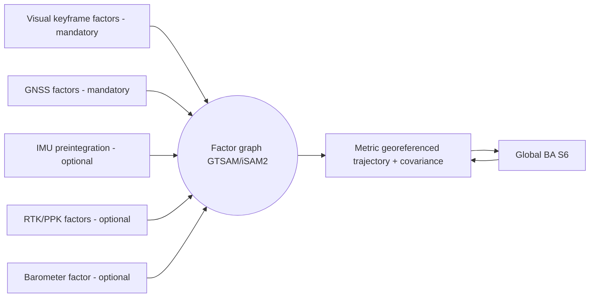

# DRISHTI — Canonical Architecture Spec (single source of truth)

> **Status:** v1.1 — reconciled with the authoritative problem-statement PDF (**PS-17 / SIH26158**):
> official targets (≤ 1 m, < 15 min/10-min, required formats incl. `.fbx`, viewer), the
> mandatory-vs-optional input contract (video+GPS+metadata mandatory; IMU/baro/intrinsics/RTK optional),
> and the permissive/military-cleared model set are folded in. **This file is authoritative** for tiers,
> stage names (S0–S10), model choices, interfaces, and the reliability/metric spines. All public
> documents must conform to it or raise a conflict in their "Open questions" section. Do not invent
> alternative names.

---

## 0. Thesis

Traditional drone mapping is **multi-pass photogrammetry**: fly a dense lawnmower grid with 70–80%
overlap, land, then run hours of Structure-from-Motion (SfM) + Multi-View Stereo (MVS). It fails the
NTRO scenario because there is **one pass, one chance**.

DRISHTI reframes the problem. A single pass gives **weak multi-view geometry** (short baselines,
limited angles) but a **strong GNSS + temporal signal** (and inertial, *when an IMU is present*) plus
**strong learned priors**. So DRISHTI is a **prior-assisted, sensor-fused, streaming reconstruction
system**, not a classical photogrammetry clone. Three ideas carry the whole design:

1. **Learned geometry beats missing views.** Feed-forward multi-view models and metric monocular depth
   supply dense geometry where triangulation baselines are too short — exactly the single-pass weakness.
   (Shipped backbones are the permissively-licensed ones in §7; military use is explicitly in scope, so
   non-commercial/military-excluded checkpoints are reference-only.)
2. **Sensors supply the metric truth GCPs normally would.** A tightly-coupled visual + GNSS factor
   graph (with **IMU / RTK-PPK / baro folded in when present**) fixes scale and georeference without
   control points. Because those extra sensors are *optional inputs*, the **baseline fuses GPS + visual
   structure with self-calibrated intrinsics** — IMU/RTK/baro are enhancers, not prerequisites.
3. **Everything streams and everything degrades gracefully.** A live coarse map is built on the edge
   during flight; a metric textured model is refined on the ground in minutes. Every stage emits
   confidence and has a fallback, so the system never hard-fails.

---

## 0a. Official targets & inputs (authoritative — from PS-17 / SIH26158)

These are the official bars from the problem-statement PDF. Every stage, budget and claim below
conforms to them. (Full verbatim tables live in `PROBLEM_STATEMENT.md` §1a.)

| Official Desired Output | Target |
|-------------------------|--------|
| Reconstruction Type | 3D Mesh / Point Cloud |
| Processing Time | **< 15 minutes for a 10-minute video** (end-to-end, ground tier) |
| Spatial Accuracy | **≤ 1 m** (absolute) |
| Coverage | Entire visible scene |
| Output Formats | **OBJ, PLY, LAS, GeoTIFF, .glb/.gltf, .fbx** (required set) |
| Visualization | Web-based or Desktop Viewer |

**Official evaluation weights (design must optimize toward these):** Reconstruction Accuracy **30%** ·
Model Completeness **20%** · Processing Speed **20%** · Innovation **15%** · Scalability **10%** ·
User Interface **5%**. → Accuracy = A2 metric spine; Completeness = coverage/occlusion (A1/A4);
Speed = two-path A3 + TensorRT; Innovation = prior-assisted single-pass orchestration; Scalability =
three tiers + swappable models + cloud tiling; UI = the viewer (S10).

**Input contract (the key constraint).** *Mandatory:* **video (1080p/4K) + GPS + flight metadata**.
*Optional:* **IMU, barometric altitude, camera intrinsics, RTK/PPK**. Therefore the **mandatory-only
baseline (video + GPS + metadata, no IMU/baro/intrinsics/RTK) is a first-class supported path**, not a
fallback: intrinsics are **self-calibrated**, and metric scale + georeference come from **GPS baselines
+ visual structure**. Every optional sensor, when present, only *tightens* accuracy.

---

## 1. Design principles (the four anchors — repeated across all docs)

- **A1 — Prior-assisted geometry.** Fuse classical multi-view constraints with learned depth/pointmap
  priors; never rely on triangulation alone.
- **A2 — Metric spine.** One factor graph fuses visual keyframe factors + GNSS → metric, georeferenced
  camera trajectory without GCPs, **with IMU pre-integration, RTK/PPK and baro folded in when present**.
  Because those three are *optional inputs*, the baseline runs on **GNSS + visual with self-calibrated
  intrinsics**; optional sensors only tighten accuracy.
- **A3 — Two output paths.** *Live path* (S0–S5, edge, near-real-time coarse map) and *Refine path*
  (S6–S10, ground, minutes-scale metric textured model). The live path is always available even if
  the refine path is interrupted.
- **A4 — Reliability spine.** Every stage emits a confidence/uncertainty signal and has a defined
  fallback; the system always emits a best-effort model **plus** an explicit uncertainty/completeness
  report. No single point of failure.

---

## 2. Three-tier topology

- **Edge Tier (on-UAV, Jetson AGX Orin 64GB / Orin NX 16GB):** runs the **live path** S0–S5. Produces
  the live coarse map for situational awareness and the compact keyframe package for the ground tier.
- **Ground Tier (laptop/workstation with RTX GPU, or rugged field server):** runs the **refine path**
  S6–S10. Produces the metric, textured, georeferenced deliverables in minutes.
- **Cloud Tier (optional):** large-area tiling, batch re-processing, 3D Tiles / digital-twin serving.
  Not required for a mission to succeed (air-gap friendly for defense use).

> Deployment flexes: for a **fully offline / air-gapped** mission the ground tier is a rugged laptop
> in the field; the cloud tier is omitted. For the **hackathon** everything can run on one
> workstation; the edge/ground split is emulated.

---

## 3. Canonical pipeline — stages S0–S10

Legend: **[E]** edge, **[G]** ground, **[E→G]** starts on edge, refined on ground.
Each stage lists: inputs → method/tools → outputs, plus **conf** (confidence signal) and **fallback**.

### S0 — Capture & Sync **[E]**
- **In:** camera frames (1080p/4K H.264/H.265) + GNSS + flight metadata (**mandatory**); IMU, baro,
  gimbal encoders, RTK stream, camera intrinsics (**all optional**).
- **Method:** hardware/PTP/PPS + GPS-time stamping; align every frame to available sensors on a common
  clock; **intrinsics are an optional input, so self-calibration is the default path**, EXIF/logged
  intrinsics used only as a prior when supplied.
- **Out:** time-synchronized streams with per-sample timestamps + quality flags + a **capability flag**
  recording which optional sensors are present (drives the reliability ladder, §5).
- **conf:** per-sensor validity flags. **fallback:** software timestamp interpolation if PPS absent;
  flag increased temporal uncertainty.

### S1 — Ingest & Frame QA **[E]**
- **In:** synced video + IMU.
- **Method:** NVDEC/GStreamer decode; **blur gating** (variance-of-Laplacian + IMU angular-rate);
  exposure/over-under gating; **keyframe selection** by parallax + sharpness + coverage; optional
  **IMU-aided / learned deblur** (NAFNet-class) on borderline frames.
- **Out:** clean keyframe set + per-frame quality scores.
- **conf:** sharpness/exposure score per keyframe. **fallback:** widen keyframe spacing when frames
  are poor; mark temporal gaps rather than forcing bad frames.

### S2 — Odometry & Localization (metric spine) **[E→G]**
- **In:** keyframes + GNSS + flight metadata (**mandatory**); IMU, baro, RTK/PPK (**optional**).
- **Method:** **when IMU present** — real-time **VIO** (OpenVINS / VINS-Fusion) on edge; **when IMU
  absent (baseline)** — visual odometry / incremental SfM with **GPS-constrained scale** from GNSS
  baselines. Either way a **tightly-coupled factor graph** (GTSAM/iSAM2) fuses visual + GNSS factors,
  adding IMU pre-integration + baro + (opt) RTK factors whenever those inputs exist; robust kernels
  (Huber/DCS) reject GNSS outliers. Global refinement continues in S6.
- **Out:** metric, gravity-aligned (gravity from IMU if present, else from GNSS-track + structure),
  georeferenced 6-DoF camera trajectory + covariance.
- **conf:** pose covariance. **fallback:** GNSS dropout → VIO/IMU dead-reckoning where IMU exists, else
  visual-odometry drift with rising uncertainty; visual loss → inertial propagation (if IMU) or flagged
  gap; re-anchor on GNSS re-acquire.

### S3 — Perception & Masking **[E]**
- **In:** keyframes + optical flow.
- **Method:** **dynamic-object** instance seg + tracking (RT-DETR / SAM2 + ByteTrack; permissive, §7) for
  vehicles/humans/animals; **motion detection** via RAFT flow vs epipolar/rigid-flow residual;
  **semantic** labels (Mask2Former/OneFormer) → building/roof, road/infra, vegetation, terrain,
  obstacle. Dynamic masks are removed from geometry; optionally kept as a separate moving-object layer.
- **Out:** per-keyframe dynamic masks + semantic label maps.
- **conf:** mask/segment confidence. **fallback:** if seg model fails, use motion-residual masking
  alone; conservative dilation to avoid contaminating the static map.

### S4 — Depth & Geometry **[E→G]**
- **In:** keyframes + poses + masks.
- **Method:** **metric monocular depth** (permissive shipped set in §7: Metric3D v2 / Depth Anything 3;
  UniDepth-class **reference-only**, non-commercial) **scale-aligned** to the metric trajectory;
  **feed-forward multi-view geometry** (permissive shipped set in §7: MapAnything / Pi3; VGGT/MASt3R
  **reference-only** — military use is excluded by their licenses) over local keyframe windows for
  cross-view consistency; optional learned **MVS** where baselines allow. Depth is predicted
  **without requiring known intrinsics** (self-calibrated / scale-from-trajectory), matching the
  mandatory-only input regime. All produce **per-pixel confidence**.
- **Out:** confidence-weighted metric depth/pointmaps per keyframe (edge: fast model; ground: full).
- **conf:** per-pixel depth confidence + multi-view agreement. **fallback:** disagreeing regions kept
  at low confidence; monocular-only where multi-view fails.

### S5 — Live Fusion **[E]**
- **In:** depth/pointmaps + poses + masks + confidence.
- **Method:** **incremental confidence-weighted TSDF** (NVIDIA **nvblox** on Jetson); dynamic-masked;
  progressive **LOD**; live colored coarse mesh/point cloud streamed to the operator.
- **Out:** live coarse georeferenced map (situational awareness) + compact keyframe package for ground.
- **conf:** per-voxel weight. **fallback:** if edge compute saturates, drop to point-splat preview and
  defer meshing to ground.

### S6 — Global Optimization **[G]**
- **In:** full keyframe package (frames, poses+cov, GNSS + flight metadata; IMU/RTK/PPK when present; depth, masks).
- **Method:** global **bundle adjustment** / pose-graph with **GNSS factors (+ IMU / RTK-PPK factors
  when those inputs exist)** and depth/pointmap constraints (GTSAM / COLMAP-style / feed-forward-consistent);
  camera **self-calibration** (the default path, since intrinsics are an optional input); loop/overlap
  closure where the single path self-intersects.
- **Out:** globally consistent metric camera set + refined sparse structure + accuracy covariance.
- **conf:** posterior covariance, reprojection RMSE. **fallback:** if BA diverges, keep odometry+GNSS
  prior poses and flag reduced global accuracy.

### S7 — Dense Reconstruction & 3DGS **[G]**
- **In:** optimized poses + keyframes + depth priors + masks.
- **Method:** **few-shot 3D Gaussian Splatting** initialized from feed-forward geometry
  (InstantSplat-style init from the permissive feed-forward models in §7) with **depth + normal +
  confidence regularization** to
  fight single-pass under-constraint; **per-image appearance embeddings** for illumination/shadow
  variation; **occlusion completion** via learned + geometric priors (planarity/symmetry for man-made
  structure), with completed regions flagged low-confidence.
- **Out:** dense 3DGS scene + dense fused point cloud.
- **conf:** per-Gaussian opacity/consistency + completion flag. **fallback:** if GS under-constrained,
  fall back to TSDF/MVS fused cloud at reduced fidelity.

### S8 — Meshing & Texturing **[G]**
- **In:** 3DGS / fused cloud.
- **Method:** surface extraction via **2DGS / SuGaR** or **screened Poisson**; watertighting +
  decimation → multi-**LOD** mesh; **texturing** by photometric best-view selection / MVS-Texturing;
  optional PBR-ish material split.
- **Out:** textured multi-LOD mesh.
- **conf:** per-face texture/geo confidence. **fallback:** vertex-colored mesh if texturing fails.

### S9 — Georeferencing & Semantics **[G]**
- **In:** mesh + cloud + poses + semantic labels.
- **Method:** transform to target **CRS** (WGS84 → UTM/EPSG, geoid model for orthometric height);
  propagate semantic labels to mesh/cloud; rasterize **DSM/DTM** and render **true orthomosaic**;
  compute **measurements** (areas/volumes/heights).
- **Out:** georeferenced classified mesh/cloud + DSM/DTM + orthomosaic + measurements.
- **conf:** georef residuals. **fallback:** local ENU frame + relative-only products if GNSS was poor.

### S10 — Export & Serve **[G/Cloud]**
- **In:** all products.
- **Method:** export the **official required set — OBJ, PLY, LAS, GeoTIFF, .glb/.gltf, .fbx** — plus
  our extras (LAZ, OGC 3D Tiles, CityJSON, COG DSM/DTM/ortho); generate **accuracy & confidence report**
  (RMSE/GSD/coverage/occlusion, incl. per-region **> 1 m flags** against the ≤ 1 m bar); publish to a
  **web or desktop viewer** (Cesium/Potree web; desktop viewer for air-gapped use) + measurement API;
  write **reproducible project bundle**.
- **Timing:** the ground refine path (S6–S10) is budgeted to complete **within < 15 min for a 10-min
  video** (official Processing-Speed bar); `.fbx`/`.obj`/`.gltf` are cheap serializations of the mesh
  produced in S8.
- **conf:** whole-model accuracy report. **fallback:** always emit at least point cloud + report.

---

## 4. The metric / georeferencing spine (A2, detail)

- **Mandatory vs optional:** only **visual + GNSS** factors are guaranteed present; IMU, RTK/PPK and
  baro join the graph **when supplied**. The graph is designed to stay well-posed on the mandatory pair
  alone.
- **Scale** comes from **GNSS baselines + visual structure** in the baseline (removing monocular scale
  ambiguity **without GCPs**); an IMU, when present, adds accelerometer + gravity constraints that
  further stabilize scale and gravity alignment.
- **Georeference** comes from GNSS(+RTK/PPK when present); we align the local metric solution to
  ECEF/WGS84 then project to UTM.
- **Robustness:** Huber/DCS robust kernels + GNSS outlier rejection; covariance is carried through to
  the accuracy report. Opportunistic GCPs (if any exist in-scene) can be added as extra factors but
  are **not required**.

## 5. Reliability spine (A4) — graceful-degradation ladder

| Level | Trigger | Behavior | Product impact |
|------|---------|----------|----------------|
| L0 | All sensors nominal (+RTK/PPK) | Full path | Best accuracy (cm) |
| L1 | No RTK/PPK (GPS + IMU) | GNSS+IMU+VIO scale | Sub-metre absolute, strong relative |
| L2 | GNSS dropout (canyon/denied) | VIO+IMU dead-reckon; re-anchor on re-acquire | Local metric map; georef on re-acquire |
| L3 | Brief visual loss | IMU inertial propagation | Short gap, flagged high-uncertainty |
| L4 | Bad frames (blur/dark) | Gate out; widen keyframes; mark gaps | Coverage holes flagged, not garbage |
| L5 | Neural model OOM/fail | Fall back to classical MVS/monocular; lower LOD | Reduced fidelity, still valid |
| L6 | Edge saturated | Point-splat preview; defer to ground | Live preview simpler; refine unaffected |
| — | Always | Store-and-forward raw stream; deterministic ground reprocess | Full quality recoverable post-mission |

> **Input-availability vs runtime degradation.** The ladder above is about *runtime* faults. Distinct
> from it is *which optional inputs exist at all*: mandatory inputs are **video + GPS + flight metadata**;
> **IMU, baro, camera intrinsics and RTK/PPK are optional**. The **mandatory-only baseline** (no IMU, no
> RTK, unknown intrinsics) is a first-class supported configuration — it runs on **self-calibrated
> intrinsics + GPS-scaled visual structure**, targeting the **≤ 1 m** bar, and simply cannot use the
> IMU-specific fallbacks (L2/L3 inertial dead-reckoning) — it flags gaps instead. Optional sensors move
> the mission *up* toward L0/L1 accuracy; their absence is expected, not a failure.

**Invariant:** the system always emits (a) a best-effort model and (b) an explicit
uncertainty/coverage report. It never crashes silently or emits unflagged garbage.

## 6. Coordinate frames & conventions

- **Camera:** OpenCV convention (x-right, y-down, z-forward), intrinsics `K`, distortion.
- **Body/IMU:** ROS REP-103 FLU (x-forward, y-left, z-up); camera↔IMU extrinsics from **Kalibr**.
- **Local map:** ENU, gravity-aligned (REP-105 `map` frame).
- **Global:** ECEF ↔ geographic WGS84 ↔ projected **UTM/EPSG**; orthometric height via geoid (e.g.
  EGM2008 / local geoid).
- Time: single monotonic clock; GPS-time as global reference; PPS/PTP where available.

## 7. Model & tool registry (adopted choices)

> **Licensing constraint (binding — military use is explicitly in scope per PS-17).** Shipped defaults
> must be **permissively licensed** (Apache-2.0 / MIT / BSD). Checkpoints that **exclude military use**
> (VGGT's commercial checkpoint) or are **non-commercial** (DUSt3R, MASt3R, UniDepth V2 — CC BY-NC) are
> **reference-only**: used to validate/benchmark, never shipped in the deliverable. Docs 03 & 05 carry
> the full license ledger; this table reflects the cleared shipped set.

| Role | Adopted (permissive, shipped) | Reference-only / alternatives |
|------|-------------------------------|-------------------------------|
| Real-time VIO | OpenVINS / VINS-Fusion | ORB-SLAM3, Kimera |
| Sensor fusion / BA | GTSAM (iSAM2) + COLMAP-style BA | Ceres, g2o |
| Feed-forward geometry | **MapAnything, Pi3** (permissive) | VGGT (military-excluded), MASt3R/DUSt3R (CC BY-NC), Fast3R, Spann3R, CUT3R |
| Metric mono depth | **Depth Anything 3, Metric3D v2** (permissive) | UniDepth V2 (CC BY-NC), ZoeDepth, Depth Pro, Marigold |
| Learned MVS (opt) | CasMVSNet / PatchmatchNet | Vis-MVSNet, MVSFormer |
| Dense matching (hard pairs) | RoMa / DKM; SuperPoint+LightGlue | LoFTR, ALIKED, DISK |
| Dynamic object seg+track | RT-DETR / YOLO-seg + SAM2 + ByteTrack | Mask2Former video, Cutie |
| Semantic segmentation | Mask2Former / OneFormer | SegFormer, InternImage |
| Optical flow | RAFT | GMFlow, SEA-RAFT |
| Live TSDF fusion | NVIDIA nvblox (edge), Open3D (ground) | Voxblox, VDBFusion |
| Few-shot 3DGS | **gsplat**-based InstantSplat-style (permissive feed-forward init) + depth/normal reg | FSGS, DNGaussian, MVSplat |
| Mesh from GS | 2DGS / SuGaR | Poisson (screened), GOF, Neuralangelo |
| Texturing | MVS-Texturing / best-view | nvdiffrast bake |
| SfM / global (classical) | GLOMAP / COLMAP | Theia, OpenMVG |
| Geospatial I/O | PROJ/pyproj, GDAL, PDAL, LAStools/Entwine | — |
| 3D Tiles / viewer | py3dtiles + CesiumJS; Potree | — |
| Middleware | ROS 2 (Humble/Jazzy) + Isaac ROS; DeepStream/GStreamer | custom async + DDS |
| Edge runtime | TensorRT (INT8/FP16), CUDA, JetPack | ONNX Runtime |
| Compute | Jetson AGX Orin 64GB (edge) · RTX-class GPU (ground) | Orin NX 16GB (lighter) |

## 8. Hardware reference

- **Primary UAV:** DJI **Matrice 350 RTK** + **Zenmuse** payload (mechanical shutter option, RTK
  built-in, PSDK/onboard access) — COTS, defensible, RTK-native.
- **Open alternative:** custom **PX4/ArduPilot** airframe + global-shutter machine-vision camera +
  survey GNSS (RTK) + tactical/industrial IMU + **Jetson** companion; **MAVLink/MAVSDK** control.
- **Positioning:** GNSS multi-constellation incl. **NavIC/IRNSS** (sovereign); **RTK via NTRIP**
  base/caster or **PPK** post-process (**optional** accuracy enhancers); barometer, magnetometer
  (**optional**). **Cam–IMU calibration:** Kalibr (only when an IMU is fitted). **Intrinsics:** an
  optional input — **self-calibration is the default**, EXIF/logged intrinsics used as a prior when
  present. GPS + flight metadata are the only mandatory positioning inputs.
- **Comms:** RTSP/SRT video + MAVLink telemetry downlink; **store-and-forward** on the edge so link
  loss never loses data.

## 9. Challenge → mechanism traceability matrix

| # | Key challenge | DRISHTI mechanism (stages) |
|---|---------------|-----------------------------|
| i | Limited viewing angles | Feed-forward multi-view priors + metric mono depth (S4); oblique-gimbal capture SOP; occlusion completion + honest flagging (S7) |
| ii | Motion blur & compression | Frame QA gating + IMU-aided/learned deblur (S1); artifact-tolerant dense matching RoMa (S4) |
| iii | Illumination & shadows | Exposure normalization (S1); per-image appearance embeddings + lighting-robust depth (S4/S7) |
| iv | Dynamic objects | Seg+track masking + motion-residual detection; excluded from fusion (S3/S5) |
| v | GPS inaccuracy & noise | Tightly-coupled factor graph, robust kernels, GNSS outlier rejection, optional RTK/PPK (S2/S6) |
| vi | Real-time need | Edge live path + ground refine path; TensorRT; incremental nvblox TSDF; LOD — budgeted to **< 15 min per 10-min video** end-to-end (S1–S5 live, S6–S10 within budget) |
| vii | Occluded surfaces | Learned + geometric completion priors, multi-view where possible, low-confidence flags (S7) |
| viii | Metric accuracy w/o GCP | GNSS baselines + visual scale (+ IMU/RTK/baro when present) + BA with GNSS factors + self-calibration + uncertainty report; targets **≤ 1 m** (S2/S6/S9) |

## 10. Deployment configurations

- **Rapid recon / disaster (mandatory-only: video+GPS+metadata, no IMU/RTK, self-calibrated
  intrinsics):** baseline accuracy targeting **≤ 1 m** (flag > 1 m); live coarse map first, full model
  on a field laptop within the < 15 min/10-min budget; no cloud.
- **Survey-grade (optional RTK/PPK + IMU present):** L0 accuracy (cm); full deliverable set with
  accuracy certificate.
- **GPS-denied (urban/EW):** L2; VIO-metric local map, georeferenced on GNSS re-acquire or via
  known landmarks.

## 11. Hackathon MVP vs full system

- **MVP (buildable in the event, on the provided dataset):** **mandatory-only inputs
  (video + GPS + flight metadata; intrinsics self-calibrated)** → keyframe QA → poses (GLOMAP/COLMAP or
  a permissive feed-forward model, §7) → metric mono depth scale-aligned to GPS → fused cloud/TSDF
  (Open3D) → few-shot 3DGS (gsplat InstantSplat-style) → mesh (2DGS/Poisson) → georeference to UTM →
  export the **required set (OBJ, PLY, LAS, GeoTIFF, .glb/.gltf, .fbx)** + DSM + ortho +
  **accuracy report vs COLMAP/Metashape reference (C2C/C2M), flagging any region > 1 m** + **web or
  desktop viewer**; **dynamic-object masking** (RT-DETR/SAM2) shown; **graceful-degradation** demoed by
  injecting GPS noise / blur. Target the official bars: **≤ 1 m** accuracy and **< 15 min for a 10-min
  video** end-to-end.
- **Live stretch:** stream a clip through an edge-emulated path with a live nvblox coarse preview.
- **Full system:** on-UAV Jetson deployment, optional RTK/NTRIP, ROS 2 pipeline, cloud tiling & 3D Tiles
  serving, hardened reliability spine.

**Our defensible IP** is the *orchestration*: prior+geometry fusion, GNSS/IMU scale-alignment of
learned depth, confidence propagation, single-pass tuning, and the graceful-degradation + georeferenced
reporting layer — not any single third-party model.

## 12. Accuracy budget (design targets, to be measured)

**Official bar: ≤ 1 m absolute spatial accuracy.** DRISHTI is designed to meet it across input regimes;
where positioning quality would push a region beyond 1 m, that region is **flagged** in the accuracy
report rather than silently reported.

| Config | Absolute H | Absolute V | vs ≤ 1 m bar | Relative / local | GSD (≈80 m AGL) |
|--------|-----------|-----------|--------------|------------------|------------------|
| RTK/PPK (L0) | 3–8 cm | 5–12 cm | ✅ comfortably | <1% of distance | ~2 cm/px |
| GNSS + IMU (L1) | 0.3–1 m (target ≤ 1 m) | 0.5–1.5 m | ✅ H; ⚠ V flagged where > 1 m | dm-level local | ~2 cm/px |
| GNSS-only baseline (mandatory inputs) | 0.5–2 m (target ≤ 1 m) | 0.8–2.5 m | ⚠ target ≤ 1 m; **flag > 1 m** | dm-level local | ~2 cm/px |
| GPS-denied (L2) | georef on re-acquire | — | relative-only until re-acquire | dm-level local | ~2 cm/px |

> The mandatory-only baseline's upper envelope (2–2.5 m) is the *degraded-GPS worst case*; with nominal
> GPS + self-calibrated intrinsics + BA the design targets sub-metre-to-≤ 1 m. Honesty rule: we report
> the measured value with confidence and flag any region exceeding the 1 m bar — we never claim ≤ 1 m
> unconditionally.

## 13. Glossary (shared)

VIO — Visual-Inertial Odometry · GNSS — Global Navigation Satellite System · RTK/PPK — Real-Time
Kinematic / Post-Processed Kinematic · GCP — Ground Control Point · GSD — Ground Sampling Distance ·
TSDF — Truncated Signed Distance Function · 3DGS — 3D Gaussian Splatting · MVS — Multi-View Stereo ·
SfM — Structure-from-Motion · BA — Bundle Adjustment · CRS — Coordinate Reference System · DSM/DTM —
Digital Surface/Terrain Model · LOD — Level of Detail · AGL — Above Ground Level · pointmap —
per-pixel 3D point prediction from a feed-forward network.
