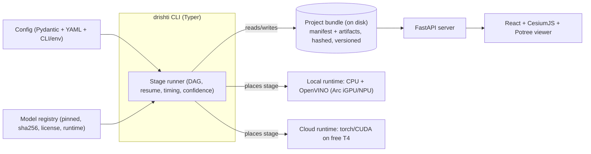

# DRISHTI — System Design

**Purpose:** Define *how the code is structured* to satisfy the [PRD](00-PRD.md) and execute the
[Implementation Plan](01-IMPLEMENTATION-PLAN.md): the repo layout, the **project-bundle** artifact
model, the config system, **compute tiering** (local Intel/OpenVINO + free cloud T4), the **no-hardcode**
enforcement, stage interfaces, and the model registry.

**Audience:** Engineers and AI agents writing DRISHTI code. Assumes the scope and constraints in
[`../../AGENTS.md`](../../AGENTS.md) and the authoritative pipeline in
[`../_internal/CANONICAL-ARCHITECTURE-SPEC.md`](../_internal/CANONICAL-ARCHITECTURE-SPEC.md).

**TL;DR**
- **One data contract — the project bundle.** Every stage reads inputs and writes outputs to an on-disk,
  versioned, content-hashed bundle. This makes stages **independent, resumable, and relocatable**
  (run one on Colab, the next locally).
- **Stages are typed and uniform.** Each S0–S10 stage implements the same `Stage` protocol; a DAG
  runner orders them, skips fresh ones, times them, and captures confidence.
- **Config is the only source of tunables.** Pydantic v2 + YAML profiles + CLI/env overrides — **no
  hardcoded values, no hardcoded CRS** (CRS derives from GPS).
- **Compute placement is policy, not wiring.** A stage declares what it needs (VRAM, CUDA, OpenVINO);
  the runner places it local or cloud per config. Defaults chosen for **16 GB T4** + **Intel iGPU/NPU**.
- **Model registry gates licensing & reproducibility.** Every model is pinned (version + sha256 +
  license + runtime); the shipped path refuses non-permissive models.

---

## 1. Architecture overview

DRISHTI is a **pipeline of typed stages over a shared on-disk bundle**, driven by a CLI + a stage runner,
with heavy stages tiered to free cloud GPU. This realizes the canonical S0–S10 pipeline **offline and
ground-only** (see the scope delta in [`../../AGENTS.md` §2](../../AGENTS.md)).



**Key idea:** because the **bundle is the only interface between stages**, no stage depends on another
stage's process or GPU memory. A stage can run on Colab, write to the bundle, sync the bundle, and the
next stage runs locally — no code change, only a placement policy.

---

## 2. Repository layout

```text
rtos/
├── AGENTS.md                       # living context (read first)
├── README.md
├── pyproject.toml                  # deps + tooling (ruff, mypy, pytest)
├── configs/
│   ├── default.yaml                # base values for every tunable
│   ├── profiles/
│   │   ├── fast.yaml               # speed-biased overrides
│   │   ├── balanced.yaml
│   │   └── max.yaml                # quality-biased overrides
│   └── datasets/
│       └── <name>.yaml             # per-dataset descriptor (paths, telemetry fmt, CRS hints)
├── src/drishti/
│   ├── cli.py                      # Typer entrypoint: run / resume / inspect / doctor / verify
│   ├── config/                     # pydantic models + loader + validation
│   ├── bundle/                     # bundle schema, manifest, hashing, resume, typed IO
│   ├── runtime/                    # compute selection (OpenVINO vs torch/CUDA), placement policy
│   ├── stages/                     # s0_ingest.py … s10_export.py (+ report), each a Stage
│   ├── models/                     # registry + loaders (OpenVINO/torch), license gate, cache
│   ├── geo/                        # CRS/UTM/geoid, georeferencing, DSM/DTM, ortho
│   ├── io/                         # video decode, telemetry adapters, exporters
│   └── report/                     # accuracy + confidence report builders
├── viewer/                         # React (Vite) + CesiumJS + Potree
├── server/                         # FastAPI app (serve artifacts + measurement/report API)
├── docker/
│   ├── local.Dockerfile            # CPU + OpenVINO image
│   └── cloud.Dockerfile            # CUDA image for T4
├── notebooks/                      # Colab/Kaggle runners for cloud stages
└── tests/                          # pytest over real small clips (no fabricated fixtures)
```

Keep this in sync with [`../../AGENTS.md` §7](../../AGENTS.md); if the tree changes, update both.

---

## 3. The project bundle (artifact model)

The bundle is a **directory** with a JSON **manifest** and per-stage artifact subdirectories. It is the
unit of reproducibility, resume, and local↔cloud transfer.

```text
<bundle>/
├── manifest.json                   # the run's spine (below)
├── inputs/                         # references + hashes of source video/telemetry (not copies unless configured)
├── s0_ingest/…  s1_frameqa/…  s2_poses/…  …  s10_export/…
├── logs/                           # structured per-stage logs
└── report/                         # accuracy + confidence report (HTML+JSON)
```

**`manifest.json` (spine):**

```json
{
  "bundle_version": "1",
  "drishti_version": "<git-sha>",
  "created_utc": "…",
  "config_snapshot": { "...": "resolved config actually used" },
  "seeds": { "global": 1234 },
  "inputs": [{ "path": "…", "role": "video|gps|imu|…", "sha256": "…", "bytes": 123 }],
  "crs": { "epsg": 32643, "derived_from": "gps_median_lonlat" },
  "stages": [
    {
      "name": "s2_poses", "status": "done", "started_utc": "…", "ended_utc": "…",
      "wall_seconds": 512.3, "environment": "local|cloud-t4",
      "inputs_hash": "…", "outputs_hash": "…",
      "params": { "...": "the config slice this stage used" },
      "confidence": { "summary": 0.82, "detail_ref": "s2_poses/confidence.json" },
      "metrics": { "gps_rmse_m": 0.7 }
    }
  ]
}
```

**Rules**
- **Content-addressed freshness:** a stage is re-run only if its `inputs_hash` or `params` changed
  (enables `resume`). Never skip on a wall-clock heuristic.
- **Provenance:** every stage records the exact params it used, its environment, **measured** wall time,
  confidence, and any metrics — this is what the accuracy/performance report reads.
- **No fabricated fields:** absent data is `null` or omitted, never a placeholder value.
- **Relocatable:** the bundle is self-describing; zipping it and moving it between local and Colab must
  lose nothing needed to resume.

---

## 4. Stage interface

Every S0–S10 stage (and the report) implements one protocol:

```python
class Stage(Protocol):
    name: str                      # e.g. "s2_poses"
    requires: list[str]            # stage names it depends on
    compute: ComputeNeed           # vram_gb, needs_cuda, openvino_ok, cpu_only …

    def is_fresh(self, bundle: Bundle, cfg: Config) -> bool: ...
    def run(self, bundle: Bundle, cfg: Config, rt: Runtime) -> StageResult: ...
    #   reads its inputs from `bundle`, writes outputs back to `bundle`,
    #   returns timing + confidence + metrics for the manifest.
```

- **Typed IO:** stages exchange **named bundle artifacts** with documented schemas (e.g. `s2_poses`
  writes `trajectory.json`, `sparse.ply`, `confidence.json`). No stage reaches into another's internals.
- **Confidence is mandatory** (N4/A4): a stage returns a confidence summary + detail; if a model has no
  native confidence, wrap it (multi-view agreement, geometric residual).
- **Deterministic:** seeds come from config; a stage must be reproducible given the same inputs+params.
- **Fail loudly:** on missing required input, raise a clear typed error — never emit a stub.

**The runner** builds the DAG from `requires`, runs stages in order, skips fresh ones, places each per
the compute policy ([§6](#6-compute-tiering)), records timing/confidence/metrics, and writes the manifest.

Stage roster (offline realization of S0–S10):

| Stage | Module | Does |
|-------|--------|------|
| S0 | `s0_ingest` | decode video, parse+align telemetry, detect optional streams |
| S1 | `s1_frameqa` | blur/exposure gating, keyframe selection |
| S2 | `s2_poses` | SfM poses + GTSAM metric spine + GPS georef + CRS derivation |
| S3 | `s3_masking` | dynamic + semantic masks |
| S4 | `s4_depth` | metric depth (+ optional feed-forward geometry) |
| S6 | `s6_global` | global BA / pose-graph refinement |
| S7 | `s7_dense` | TSDF fusion / few-shot 3DGS |
| S8 | `s8_mesh` | meshing + texturing + confidence/inferred flags |
| S9 | `s9_geo` | georeference, DSM/DTM, orthomosaic, semantic layers |
| S10 | `s10_export` | export all formats + 3D Tiles/Potree + report |

*(S5 "live fusion" from the canonical spec is intentionally absent — folded into S7 offline; see
[`../../AGENTS.md` §2](../../AGENTS.md).)*

---

## 5. Configuration system (no hardcoded values)

- **Layers (highest wins):** CLI flags > env vars > dataset descriptor (`configs/datasets/<name>.yaml`)
  > profile (`configs/profiles/<p>.yaml`) > `configs/default.yaml`.
- **Typed:** all config is Pydantic v2 models; unknown keys and type errors fail at load. The **resolved**
  config is snapshotted into the manifest.
- **Dataset descriptor** carries input paths, telemetry format, and optional hints — it is how a user
  points DRISHTI at a real clip:

```yaml
# configs/datasets/flood_site.yaml
video: data/flood_site/DJI_0001.MP4
telemetry:
  format: dji_srt            # dji_srt | csv | mavlink | exif
  path: data/flood_site/DJI_0001.SRT
optional:
  imu: null                  # present => used, absent => self-calibrated / skipped
  rtk: null
crs:
  mode: derive_from_gps      # NEVER a hardcoded epsg by default
```

**No-hardcode enforcement**
- **CRS:** default `derive_from_gps` — compute UTM zone from **median lon/lat**; a fixed EPSG is allowed
  only if a user *explicitly* sets it in a descriptor (and it's recorded as such).
- **Params:** every threshold/iteration-count/resolution lives in config; code reads `cfg.*`. CI greps
  for suspicious numeric literals in stage code.
- **Inputs:** only from the descriptor; missing mandatory fields → loud failure.
- **No fabricated outputs/metrics** anywhere (N8).

---

## 6. Compute tiering

The binding constraint: **no local dGPU**; **Intel Ultra 7 155H (CPU + Arc iGPU/NPU via OpenVINO)** +
**free cloud T4 (~16 GB)**. See [`../../AGENTS.md` §4](../../AGENTS.md).

**Placement policy.** Each stage declares a `ComputeNeed`; the runner places it:

| Need | Placed on |
|------|-----------|
| `cpu_only` or `openvino_ok`, ≤ local resources | 🖥️ **local** (CPU / Arc iGPU / NPU via OpenVINO) |
| `needs_cuda` or `vram_gb` beyond local | ☁️ **cloud T4** (torch/CUDA) |

**Default placement** (overridable in config):

| Stage | Default | Why |
|-------|---------|-----|
| S0, S1 | 🖥️ local | I/O + CPU; OpenVINO for any small nets |
| S2 (SfM + GTSAM) | 🖥️ local | COLMAP/GLOMAP + GTSAM are CPU-bound |
| S3 masking, S4 depth | ☁️ cloud T4 | heavy nets; local OpenVINO depth path for offline/small scenes |
| S4 feed-forward geom (optional) | ☁️ cloud T4 | large transformer, chunked; **optional** |
| S6 global BA | 🖥️ local | CPU optimization |
| S7 dense / 3DGS | ☁️ cloud T4 | GPU-bound; Open3D-TSDF local fallback |
| S8 mesh/texture | 🖥️ local (☁️ if learned) | Open3D/MVS-Texturing CPU; learned meshing → cloud |
| S9 geo, S10 export, report, viewer | 🖥️ local | GDAL/PDAL/py3dtiles/Blender/React are CPU/browser |

**Cloud execution model.** Cloud stages run in `notebooks/` (Colab/Kaggle): mount/sync the bundle
(Drive or zip), run the stage(s) with the CUDA image deps, write artifacts back into the bundle, sync
out. Because freshness is content-hashed, the local runner then continues from where cloud left off.
**16 GB discipline:** tile/chunk large scenes; cap 3DGS iterations; stream depth per-view.

**Runtime abstraction.** `runtime/` exposes a uniform inference API with two backends — **OpenVINO**
(local; converts/loads IR for iGPU/NPU) and **torch/CUDA** (cloud). Models declare which backends they
support in the registry.

---

## 7. Model registry (licensing + reproducibility)

A single registry pins every model and gates licensing (N5, N7).

```python
ModelSpec(
  name="depth_anything_v2_base",
  version="…", sha256="…",
  license="Apache-2.0",           # gate: shipped path requires permissive
  runtimes=["openvino", "torch"], # where it can run
  source="…", vram_gb=4,
)
```

- **License gate:** loading a model whose license isn't on the permissive allowlist **raises** in the
  shipped path. NC/military-excluded models (VGGT commercial ckpt, DUSt3R/MASt3R, UniDepth V2, YOLO) are
  registered **reference-only** and cannot be loaded by the pipeline. Ledger:
  [`../03-TECHNOLOGY-STACK.md` §5](../03-TECHNOLOGY-STACK.md).
- **Reproducibility:** the registry records version + sha256; the manifest records which specs a run
  used. Offline: models are cached locally; no run-time download is required.
- **Backend choice:** the runtime picks OpenVINO locally vs torch on cloud from `runtimes` + placement.

Default shipped models: **COLMAP/GLOMAP** (poses), **Depth Anything V2** + **Metric3D v2** (depth),
**RT-DETR + SAM 2 + ByteTrack + RAFT** (masking), **gsplat** (3DGS), **Open3D** (fusion/mesh),
**MVS-Texturing** (texture), **MapAnything/Pi3** (optional feed-forward). All permissive.

---

## 8. Serving & viewer

- **FastAPI** (`server/`) serves bundle artifacts (3D Tiles, Potree octree, GeoTIFF, report JSON) and a
  measurement/report API; runs locally, offline.
- **Viewer** (`viewer/`): React (Vite) + **CesiumJS** (georeferenced globe, 3D Tiles) + **Potree**
  (point clouds); layer/confidence toggles; distance/area/volume/height measurement in the model's CRS.

---

## 9. Testing & reproducibility

- **pytest** over **real small clips** (short real footage + telemetry); **no fabricated fixtures** that
  would masquerade as pipeline output. Mocks only isolate a unit (e.g. a telemetry parser), never stand
  in for a real artifact in an integration test.
- **Determinism:** fixed seeds + pinned versions; `drishti verify` recomputes manifest hashes to confirm
  a rebuilt bundle matches.
- **CI:** lint (ruff) + types (mypy) + unit + a smoke pipeline on a tiny real clip + a **no-hardcode
  grep** (suspicious literals, hardcoded EPSG) + a **license-gate** test.

---

## 10. Open questions / risks

- **Bundle sync friction** between local and Colab/Kaggle — zip/Drive is simple but manual; a thin
  sync helper in `notebooks/` mitigates. Revisit if it becomes the bottleneck.
- **OpenVINO coverage** — not every model has a clean IR path; where conversion fails, the stage falls
  back to CPU torch locally or defers to cloud. Track which models actually run on iGPU/NPU.
- **Bundle schema evolution** — versioned from day one; add a migration note when `bundle_version` bumps.
- **Placement defaults vs reality** — the [§6](#6-compute-tiering) table is a starting policy; the
  Phase 6 performance report may move stages between local and cloud. Update this doc when it does.
- **CRS edge cases** — UTM-zone-boundary flights or high latitudes may need a custom CRS; the descriptor
  allows an explicit EPSG override, recorded as user-set.
