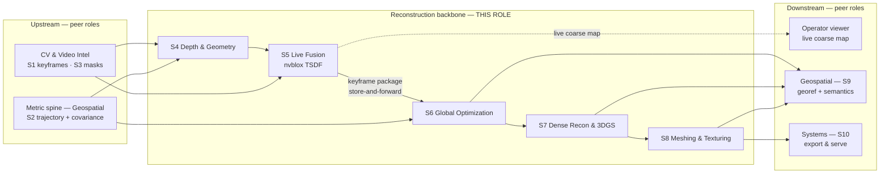

# DRISHTI — Role: 3D Reconstruction Research Lead

**Purpose:** Define the mandate, science, interfaces, and reliability contract for the person who owns
DRISHTI's **reconstruction backbone** — stages **S4 (Depth & Geometry), S5 (Live Fusion), S6 (Global
Optimization), S7 (Dense Reconstruction & 3D Gaussian Splatting), and S8 (Meshing & Texturing)** — so
the geometry that every deliverable is measured on is built correctly, honestly, and defensibly from a
single drone pass.

**Audience:** the 3D Reconstruction Research Lead (this role's owner) and their teammates; the peer
role leads who hand data in and take it onward — [Computer Vision & Video Intelligence](2-computer-vision-video-intelligence.md),
[AI / Deep Learning](3-ai-deep-learning-research.md), [Geospatial & Accuracy Research](5-geospatial-accuracy-research.md),
and [Systems & Edge/Compute](6-systems-edge-compute-optimization.md); and NTRO technical evaluators / hackathon judges who
want the mechanism, its operating envelope, and its failure modes.

## TL;DR

- This role owns the **geometry engine** of DRISHTI: S4→S5→S6→S7→S8, i.e. from per-keyframe depth to
  the final watertight, textured, multi-Level-of-Detail (LOD) mesh. It does **not** own capture,
  keyframing, masking, the metric spine front-end, georeferencing, or serving — those are peers.
- The organizing problem is **single-pass conditioning**: short baselines, a narrow angle cone, and a
  forward-motion epipole make classical triangulation ill-conditioned exactly where we need geometry.
  Every stage is regularized against this, per anchor **A1 — prior-assisted geometry** (see the
  [canonical architecture spec](../_internal/CANONICAL-ARCHITECTURE-SPEC.md)).
- **S4** fuses feed-forward multi-view geometry (**Depth Anything 3 / MapAnything / Pi3** pointmaps —
  permissively licensed, therefore shippable into a military-scope build) with **metric monocular depth**
  (**Metric3D v2**, Depth Pro for crisp edges), scale-aligned to the metric trajectory; every pixel
  carries confidence. The restricted DUSt3R/MASt3R/VGGT family and UniDepth V2 are **reference baselines
  only, never shipped** (§8, [Technology Stack §5](../03-TECHNOLOGY-STACK.md)).
- **S5** fuses that into an incremental confidence-weighted Truncated Signed Distance Function (TSDF)
  on the edge (nvblox) — the near-real-time coarse map and the system's reliability floor.
- **S6–S8** produce the accurate deliverable on the ground in minutes: global bundle adjustment,
  depth-regularized few-shot **3D Gaussian Splatting (3DGS)**, then surface extraction and texturing —
  and the whole S6→S8 tail has to fit inside the official ceiling of **< 15 minutes for a 10-minute
  video**, which is a design constraint on this role's algorithm choices, not a deployment detail.
- **The official numbers this role is graded on.** Spatial accuracy **≤ 1 m**, coverage of the *entire
  visible scene*, and the mesh/point-cloud deliverable in **OBJ · PLY · LAS · GeoTIFF · .glb/.gltf ·
  .fbx**. On the rubric, **reconstruction accuracy is 30%** and **model completeness 20%** — half the
  total marks land on the geometry this role owns, with a further 20% on the speed of producing it.
- **Camera intrinsics are an *optional* input**, so **S6 self-calibration is the default path**, not a
  fallback: the reference configuration is video + GPS + flight metadata with intrinsics solved in the
  bundle (ADR-16 in [Design Decisions](../05-DESIGN-DECISIONS.md)). An operator-supplied calibration is
  an upgrade that tightens the solve.
- Honesty is a hard constraint: "real-time" means **near-real-time edge preview + minutes-scale ground
  refinement**; occlusion-completed and back-facing surfaces are **inferred, flagged, and excluded from
  measurement by default**; every learned output emits a confidence/uncertainty signal (anchor **A4**).

---

## 1. Mandate & scope

**Mission (one line):** *Turn a single-pass video plus a metric camera trajectory into a georeferenced,
measurable 3D model — dense cloud, 3DGS scene, and textured multi-LOD mesh — that is accurate where it
is well-seen and honestly flagged where it is not.*

**Stages owned (the reconstruction backbone).**

| Stage | Name | Tier | This role delivers |
|-------|------|------|--------------------|
| **S4** | Depth & Geometry | Edge→Ground | Confidence-weighted metric depth / pointmaps per keyframe |
| **S5** | Live Fusion | Edge | Live coarse georeferenced TSDF map + compact keyframe package |
| **S6** | Global Optimization | Ground | Globally consistent metric camera set + refined structure + covariance |
| **S7** | Dense Recon & 3DGS | Ground | Dense 3DGS scene + dense fused point cloud (+ completion flags) |
| **S8** | Meshing & Texturing | Ground | Watertight, decimated, textured multi-LOD mesh |

**Explicitly NOT this role — handed to peers.**

- **S0 Capture & Sync, S1 Ingest & Frame QA, S3 Perception & Masking** → [Computer Vision & Video
  Intelligence](2-computer-vision-video-intelligence.md). We *consume* keyframes and masks; we do not
  select or segment them.
- **S2 Odometry & Localization (the metric spine, anchor A2)** → [Geospatial & Accuracy Research](5-geospatial-accuracy-research.md).
  We *consume* the metric, georeferenced trajectory and covariance; the Visual-Inertial Odometry (VIO)
  + Global Navigation Satellite System (GNSS) + Inertial Measurement Unit (IMU) factor-graph front-end
  is theirs. S6 is a **co-owned handshake** (see §5).
- **The learned model internals** (checkpoints, licensing, on-device export, confidence calibration) →
  [AI / Deep Learning](3-ai-deep-learning-research.md). We define *how geometry is fused and
  regularized*; they own *which network and which weights*.
- **S9 Georeferencing & Semantics, S10 Export & Serve** → [Geospatial & Accuracy Research](5-geospatial-accuracy-research.md)
  and [Systems & Edge/Compute](6-systems-edge-compute-optimization.md). We emit reconstruction products into a defined map
  frame; datum transforms, Digital Surface/Terrain Models (DSM/DTM), orthomosaics, and packaging are
  downstream.

---

## 2. Where you sit

The backbone is the middle of the pipeline: upstream peers supply conditioned frames, masks, and a
metric trajectory; this role turns them into geometry; downstream peers georeference and serve it. The
spine runs across both output paths (anchor **A3**) — S4/S5 on the **Live path** (Edge Tier), S6–S8 on
the **Refine path** (Ground Tier).



The full pipeline and the compact edge→ground keyframe package are defined once in
[How It Works](../02-HOW-IT-WORKS.md); this document does not re-derive them.

---

## 3. Technical deep-dive per owned stage

### 3.0 The single-pass conditioning problem (the through-line)

Every design choice below exists to fight one thing. A single flight line gives **short baselines**, a
**narrow convergence-angle cone**, and — in forward flight — an **epipole that sits inside the image**.
Triangulated depth uncertainty scales roughly as `σ_z ∝ z² / (f · B)` (depth `z`, focal length `f`,
baseline `B`), so as `B → 0` toward the epipole the uncertainty diverges *exactly* in the region the
drone is flying toward. There is no redundant overlap to average out, no loop closure unless the path
self-intersects, and no Ground Control Point (GCP) network to pin scale. Classical incremental
Structure-from-Motion (SfM) plus Multi-View Stereo (MVS) — COLMAP / Metashape / Pix4D — therefore holes
out or diverges on this input. DRISHTI's answer (anchor **A1**) is to **regress geometry from learned
priors** where parallax is thin and reserve triangulation for where real baseline exists. The math is
developed in [Theory](../01-THEORY.md); each stage below states its specific regularizer.

### 3.1 S4 — Depth & Geometry

**Job:** produce a confidence-weighted, metric depth map / pointmap per keyframe. **Method (two fused
sources):**

1. **Feed-forward multi-view geometry — Depth Anything 3 / MapAnything / Pi3 pointmaps over local
   keyframe windows.** This class of model regresses camera intrinsics/extrinsics, dense depth,
   pointmaps, and tracks in a single forward pass (sub-second per view-set for the ~1 B-parameter class —
   *as reported by those methods' authors*). Because it *learns* multi-view geometry rather than
   triangulating, it stays well-conditioned at the tiny baselines and narrow angles that break COLMAP —
   and because it also regresses intrinsics, it is what makes the **unknown-intrinsics default**
   (optional input, ADR-16) tractable: its focal estimate initializes S6 self-calibration. Windows are
   kept to tens of keyframes to fit Video RAM (VRAM); long corridors are chunked with overlap and
   stitched in S6. **Licensing is why this list reads the way it does:** VGGT's commercial checkpoint
   excludes military use and the DUSt3R/MASt3R family is CC BY-NC, so they are reference baselines we
   measure against and never ship (§8).
2. **Metric monocular depth — Metric3D v2 (BSD-2) as the shipped model, Depth Pro for crisp edges.** A
   per-frame absolute-scale prior fills the low-parallax regions where multi-view is degenerate, supplies
   an **independent scale check** — which matters more than usual on the GPS-only mandatory baseline —
   and, critically, is the regularizer that later stops sparse-view 3DGS collapsing into floaters.
   UniDepth V2 and Depth Anything V2 Base/Large are non-commercial and stay in the evaluation harness
   only. Detail on checkpoints, licenses, and native confidence heads lives in
   [AI / Deep Learning](3-ai-deep-learning-research.md).

**Scale alignment (why "metric without GCPs" holds here).** Pointmaps are up-to-scale; monocular metric
depth is metric-but-biased (5–10% domain-shifted at aerial altitudes — *reported*). Neither is trusted
frame-by-frame. Both are **scale-aligned to the S2 metric trajectory** from the [metric spine](5-geospatial-accuracy-research.md):
a per-keyframe median scale correction ties predicted depth to the GNSS-anchored camera centres, so
absolute scale comes from **GNSS baselines plus visual structure** — the two inputs the official brief
guarantees — with IMU, barometer and RTK/PPK folded in as extra constraints *when the aircraft carries
them*. Never from imagery alone. On the mandatory-only capture there is no gravity vector, so the frame
is levelled from the GNSS track and structure rather than from inertia, vertical uncertainty is wider,
and any region whose expected error would exceed the official **≤ 1 m** bar is **flagged** in the S10
report rather than averaged into a headline number.

**Confidence & fusion.** Every product emits **per-pixel confidence** (native to the pointmap models and
to Metric3D v2). The two sources are fused by confidence, and **cross-model disagreement** (monocular vs
multi-view) is a first-class signal flagging occlusion, dynamic residue, or domain-shift failure. The
integration weight passed to S5 is `w = f(model confidence, ray-incidence angle, blur score)`.

**Why this beats triangulation at single-pass baselines:** learned priors regress plausible metric
geometry from a single or few views where `1/B` uncertainty makes cost volumes flat; triangulation and
learned MVS (CasMVSNet / PatchmatchNet) are used only on frame subsets that *do* have usable baseline
(oblique passes, altitude changes) and are otherwise a fallback, not the primary engine.

### 3.2 S5 — Live Fusion

**Job:** the near-real-time coarse map **and** the reliability floor. **Method:** incremental,
**confidence-weighted TSDF fusion** via NVIDIA **nvblox** on the Jetson (Open3D ScalableTSDF on the
ground). Each keyframe's metric depth is integrated with weight from S4 confidence × ray geometry ×
blur, so weakly constrained single-pass regions are **down-weighted, not blindly meshed**. Dynamic
masks from S3 are subtracted before integration so a car seen once never becomes a permanent "ghost".
Output is a **progressive-LOD** colored coarse mesh / point cloud streamed to the operator, plus (from
nvblox) a Euclidean Signed Distance Field (ESDF) usable for obstacle clearance.

**Single-pass regularization:** confidence-weighting is the defense — the map grows only where evidence
supports it, and coverage gaps are left explicit rather than hallucinated. This is the **always-on
floor**: even if every heavy downstream stage stalls, the operator still has a usable georeferenced map
(anchor **A4**).

### 3.3 S6 — Global Optimization

**Job:** tie the whole pass into one globally consistent metric camera set. **Method:** global **bundle
adjustment (BA) / pose-graph optimization** (GTSAM / iSAM2, GLOMAP/COLMAP-style global mapper,
pointmap-consistent alignment) that jointly refines structure and poses using **GNSS factors (required)
plus IMU, barometric and RTK/PPK factors where those optional sensors exist** *and* depth / pointmap
constraints from S4. Camera **self-calibration is the default**: intrinsics are free parameters
initialized from the S4 pointmap model's focal estimate, and are held tightly constrained *only* when the
operator supplied a verified pre-flight calibration on locked optics. **Loop / overlap closure** fires
wherever the single path self-intersects; for kilometre-scale corridors a chunk + overlap-alignment +
loop-closure wrapper bounds drift and memory.


**Co-ownership handshake.** The metric spine (anchor **A2**) is the [Geospatial & Accuracy Research](5-geospatial-accuracy-research.md)
role's front-end (S2): it delivers the trajectory + covariance and models the GNSS/IMU factors. S6 is
where *reconstruction-side* visual, depth, and pointmap factors are folded into that same global
factor graph. We own the geometry residuals; they own the sensor factors; the interface is the factor
graph and its priors (see §5).

**Single-pass regularization:** with no redundant overlap, depth/pointmap priors enter BA as soft
constraints that keep the solve from wandering in the near-degenerate directions; GNSS factors pin
absolute position; the posterior covariance is propagated so weak regions are honestly reported, never
silently smoothed.

### 3.4 S7 — Dense Reconstruction & 3DGS

**Job:** the photorealistic, measurable dense scene. **Method:** **few-shot 3D Gaussian Splatting**
initialized directly from feed-forward geometry — **InstantSplat-style** init from the permissive
pointmaps of S4 (no COLMAP loop; reconstruction in seconds and >30× faster than COLMAP+3DGS with as few
as 3 views — *reported by the authors*), rasterized with **gsplat** (Apache-2.0). The single-pass
under-constraint is fought with **depth + normal +
confidence regularization** (FSGS / DNGaussian techniques): the metric-depth prior and predicted
normals suppress the floaters and geometry collapse that plain 3DGS suffers from with limited angles.
**Per-image appearance embeddings** absorb illumination and shadow variation over the flight so a
moving sun does not smear albedo into geometry.

**Occlusion completion — honest by construction.** Surfaces never imaged from one direction (building
backs, undersides, shadowed canyons) are **completed** from learned priors plus geometric priors
(planarity / symmetry for man-made structure, footprint extrusion). This is **inference, not
measurement**: completed regions are written to a **distinct low-confidence layer, flagged, and
excluded from measurement by default**. This is a correctness requirement for defense/measurement use,
per the honesty policy in the [Problem Statement](../_internal/PROBLEM_STATEMENT.md), not a stylistic
choice.

**Confidence:** per-Gaussian opacity / multi-view consistency + a completion flag. Output is a dense
3DGS scene plus a dense fused point cloud.

### 3.5 S8 — Meshing & Texturing

**Job:** the watertight, textured, multi-LOD mesh that measurement and visualization need. **Method:**
surface extraction via **2D Gaussian Splatting (2DGS)** or **SuGaR** (surfel / level-set surfaces with
view-consistent normals → clean TSDF/Poisson meshing; minutes, not hours — *reported*), with **screened
Poisson** on the fused cloud as the model-agnostic alternative. The raw surface is **watertighted and
decimated into a multi-LOD mesh**. **Texturing** uses photometric **best-view selection /
MVS-Texturing** to project the sharpest observation onto each face; an optional physically-based
material split is available. **Fallback:** a vertex-colored mesh if texturing fails.

**Single-pass regularization:** mesh quality follows GS density, so textureless façades and thin
vegetation stay hard; 2DGS's normal-consistency terms and the S7 planar priors give the cleanest
watertight surface achievable from the available angles, and per-face confidence records where the
surface is interpolated rather than observed.

---

## 4. Adopted stack & key decisions for this role

Adopted choices come from the [canonical spec's model registry](../_internal/CANONICAL-ARCHITECTURE-SPEC.md);
the full rationale, versions, and licenses live in [Technology Stack](../03-TECHNOLOGY-STACK.md) and the
trade-offs in [Design Decisions](../05-DESIGN-DECISIONS.md).

| Stage | Adopted (primary) | Fallback | Why |
|-------|-------------------|----------|-----|
| **S4 multi-view** | Depth Anything 3 / MapAnything / Pi3 (windowed), all permissive | CasMVSNet / PatchmatchNet MVS; monocular-only | Feed-forward geometry stays conditioned at thin baselines where triangulation diverges — *and* regresses intrinsics for the unknown-calibration default |
| **S4 metric depth** | Metric3D v2 (BSD-2) | Depth Pro / ZoeDepth | Absolute per-frame scale + normals + native confidence; the anti-floater regularizer for S7 and the independent scale check against the ≤ 1 m bar |
| **S5 fusion** | nvblox TSDF (edge) | Open3D / VDBFusion (ground); point-splat preview | GPU real-time on Jetson; always-on situational-awareness floor + ESDF |
| **S6 optimization** | GTSAM/iSAM2 + GLOMAP/COLMAP-style BA with **self-calibrated intrinsics**; chunk+overlap wrapper for corridors | Keep S2 odometry+GNSS prior poses, flag reduced global accuracy | Global metric consistency; loop closure bounds drift on long strips |
| **S7 dense** | InstantSplat-style init + FSGS/DNGaussian depth/normal reg (gsplat, Apache-2.0) | TSDF / MVS fused cloud at reduced fidelity | Few-shot, depth-regularized 3DGS gives textured, measurable output from sparse views |
| **S8 surface** | 2DGS primary; SuGaR / GOF | Screened Poisson on fused cloud | Watertight, view-consistent surfaces in minutes |
| **S8 texture** | MVS-Texturing / photometric best-view | Vertex-colored mesh | Sharp, artifact-tolerant texture from the best observation per face |

**Defensible IP is the orchestration**, not any single third-party model: prior+geometry fusion,
GNSS-anchored scale-alignment of learned depth, confidence propagation, single-pass regularization, and
the graceful-degradation layer. Every primary entry above is **permissively licensed and therefore
actually deployable** for a customer whose own application list includes military reconnaissance — a
constraint that removed several higher-scoring models from the shortlist, at a cost we intend to measure
rather than assume away (§8).

**Time budget for this role.** The official ceiling is **< 15 minutes for a 10-minute video**, end to
end, including the S9/S10 tail we do not own. The working allocation this role designs against: S4 depth
over the keyframe set ~2–4 min, S6 global solve ~2–3 min, S7 3DGS ~3–5 min, S8 meshing + texturing ~2–3
min — with each stage carrying a **quality dial** (window size, Gaussian budget, LOD depth, texture
resolution) that the orchestrator turns down rather than letting the budget be missed. Overrunning the
budget is a failure of this role, not of the hardware; **degrading fidelity and saying so is the correct
response**, per the reliability ladder.

---

## 5. Interfaces & contracts

All coordinate conventions follow spec §6: **camera = OpenCV** (x-right, y-down, z-forward, intrinsics
`K` + distortion); **local map = ENU, gravity-aligned** (East-North-Up, REP-105 `map` frame). Full
message schemas are in [Integration](../04-INTEGRATION.md); the compact keyframe package is defined in
[How It Works §6](../02-HOW-IT-WORKS.md).

**Consumed.**

| From (role · stage) | Fields | Frame / units | Confidence |
|---------------------|--------|---------------|------------|
| CV & Video Intel · S1 | Clean keyframe set (pointer into recorded master) + per-frame sharpness/exposure scores | OpenCV camera | QA score per keyframe |
| CV & Video Intel · S3 | Dynamic masks (run-length encoded) + semantic label maps | Per-keyframe image space | Mask / segment confidence |
| Metric spine · S2 | Metric 6-DoF trajectory `T_map_cam` + 6×6 covariance; intrinsics (OpenCV model) | ENU@EPSG map; metres | Pose covariance |

**Emitted.**

| Product (stage) | Fields | Frame / units | Per-element confidence | To |
|-----------------|--------|---------------|------------------------|-----|
| Metric depth / pointmaps (S4) | `float16` depth + `uint8` confidence per keyframe | Camera / metric | Per-pixel depth confidence + multi-view agreement | S5, S6, S7 |
| Live coarse map + keyframe package (S5) | Colored TSDF mesh/cloud; compact per-keyframe package | ENU@EPSG; metric | Per-voxel weight | Operator viewer; S6 (store-and-forward) |
| Global camera set + structure (S6) | Optimized poses + refined sparse points + covariance | ENU@EPSG; metric | Posterior covariance, reprojection RMSE | S7, S9 |
| Dense 3DGS scene + fused cloud (S7) | `.ply` / `.splat` Gaussians; dense point cloud | ENU@EPSG; metric | Per-Gaussian opacity/consistency + completion flag | S8, S9 |
| Textured multi-LOD mesh (S8) | Mesh + texture atlas + LOD chain, ready for the official export set (**OBJ · PLY · glTF/GLB · .fbx**; LAS/GeoTIFF derive from the cloud/DSM in S9–S10) | ENU@EPSG; metric | Per-face texture/geometry confidence | S9, S10 |

**Contract invariants.** (1) **Confidence travels with every artifact** — nothing is emitted without an
uncertainty signal. (2) Products are delivered in the **ENU metric map frame**; datum/CRS transforms
are S9's job, not ours. (3) **Inferred (completed/back-facing) regions are tagged** so downstream never
mistakes them for measured geometry.

---

## 6. Reliability & confidence

The backbone implements its slice of the reliability spine (anchor **A4**) and the graceful-degradation
ladder **L0–L6** from the [canonical spec §5](../_internal/CANONICAL-ARCHITECTURE-SPEC.md). The
invariant: **always emit a best-effort model plus an explicit uncertainty/coverage report; never crash
silently or emit unflagged garbage.**

| Stage | Confidence propagated | Degradation trigger | Fallback behavior | Ladder |
|-------|-----------------------|---------------------|-------------------|--------|
| S4 | Per-pixel depth confidence + cross-model agreement | Neural model out-of-memory (OOM) / fail | Classical MVS, else monocular-only; disagreeing regions kept low-confidence | **L5** |
| S5 | Per-voxel TSDF weight | Edge compute saturated | Point-splat preview; defer meshing to ground; recording continues | **L6** |
| S6 | Posterior covariance, reprojection RMSE | BA diverges | Keep S2 VIO+GNSS prior poses; flag reduced global accuracy | L5 |
| S7 | Per-Gaussian opacity/consistency + completion flag | 3DGS under-constrained | Fall back to TSDF/MVS fused cloud at reduced fidelity | L5 |
| S8 | Per-face texture/geometry confidence | Texturing fails | Vertex-colored mesh | L5 |

**Confidence-gated fusion** is the common mechanism: integration and optimization weights are functions
of learned confidence, ray-incidence angle, and blur, so single-pass weak regions are down-weighted
rather than trusted. **Completed and back-facing surfaces are rendered in a distinct layer, flagged
inferred, and excluded from measurement by default** — the correctness rule that keeps DRISHTI usable
for infrastructure and mission planning. Per-region confidence (from BA covariance, ray convergence
angle, observation count, Ground Sampling Distance (GSD), and per-pixel confidence) is propagated all
the way into the S8 mesh and onward into the S10 accuracy report.

---

## 7. Hackathon MVP responsibilities

For the event, everything runs on **one workstation** with the edge/ground split emulated. This role
must stand up the **minimal reconstruction path** on the provided dataset (per spec §11):

```
keyframes (CV) + GPS trajectory (metric spine)
  → S4  metric mono depth (Metric3D v2) scale-aligned to GPS + permissive pointmaps
        (Depth Anything 3 / MapAnything / Pi3), intrinsics self-calibrated — no calibration file assumed
  → S5  fused cloud / TSDF (Open3D)
  → S6  light global solve: pointmap poses + GPS Sim(3)/SE(3) alignment, free intrinsics
        (GLOMAP/COLMAP as fallback baseline)
  → S7  few-shot 3DGS (InstantSplat-style init, gsplat)
  → S8  mesh (2DGS or screened Poisson) + best-view texture
  → hand to Geospatial (S9) for UTM georeference + export
```

**Minimum bar to demo:** a metric, textured mesh + dense cloud + 3DGS scene from a single-pass clip,
with per-region confidence and flagged occlusion-completed regions — produced from **video + GPS +
flight metadata alone** (no IMU, no RTK, no calibration file), inside the **< 15 min / 10-min video**
budget, and measured against the **≤ 1 m** bar with a stopwatch reading and an accuracy table, not an
assertion.

**Validation this role owns.** Run **COLMAP / Metashape offline as an independent reference** on the
same clip, then quantify our reconstruction against it in CloudCompare:

- **Cloud-to-cloud (C2C)** distance: our dense cloud vs the reference cloud — report mean/median and
  percentiles (e.g. 68/95%).
- **Cloud-to-mesh (C2M)** distance: reference cloud vs our mesh — report the same, plus a Chamfer
  summary.
- **Graceful degradation demo:** inject GPS noise and motion blur and show the accuracy/coverage curve
  degrades monotonically with **no hard failure** (the always-on TSDF floor still returns a map).
- **Dynamic-object rejection:** show residual "ghost" density drops to near-zero with S3 masks on vs
  off.

All MVP figures are **design targets to be measured on the event dataset**; reference-tool numbers are
labeled as such, and any borrowed benchmark number is "reported by the method's authors".

---

## 8. Open questions / risks

- **Aerial domain gap.** The permissive pointmap models (Depth Anything 3 / MapAnything / Pi3) and the
  metric-depth models are trained mostly on ground-level, automotive, and indoor data; high-altitude
  nadir/oblique imagery is out-of-distribution, so metric accuracy at flight altitude is **unproven**
  against the ≤ 1 m bar and may need fine-tuning on aerial data (UseGeo, ISPRS Vaihingen/Potsdam,
  synthetic renders). Published KITTI/NYU numbers will not transfer directly, and every external figure
  in this doc is *as reported by that method's authors*.
- **Scale conditioning with no IMU.** On the mandatory-only capture (ADR-16) there is no inertial scale
  observability and no gravity prior; scale rests on GNSS-baseline geometry, and self-calibrated focal
  length can trade against depth on a straight, constant-height pass. Whether S4/S6 hold ≤ 1 m in that
  configuration is **the single biggest unmeasured risk touching this role**, and the first thing to test
  on the provided dataset. Mitigations in hand: metric-depth cross-checks on scale, focal priors from the
  pointmap model, parallax-aware keyframing, and honest per-region flagging.
- **Hallucination in low-confidence regions.** Feed-forward geometry and generative occlusion-completion
  produce plausible-but-wrong surfaces where unseen — dangerous for measurement unless rigorously
  flagged and excluded, as designed. Learned confidence is often **poorly calibrated** on textureless
  façades and OOD content and needs empirical recalibration on drone footage.
- **Scale drift over long corridors.** Reference-frame-anchored feed-forward models accumulate scale/pose
  drift; loop closure (the chunk + overlap-alignment wrapper) helps only if the flight self-intersects,
  which a pure single pass may not. Per-keyframe scale correction against the metric spine is the
  mitigation and must be validated.
- **VRAM / compute headroom vs the 15-minute ceiling.** The ~1 B-parameter pointmap class OOMs beyond a
  few hundred views and needs chunking (tens of GiB scratch per few-thousand frames); the heavy backbone
  stays on the Ground Tier by design, adding datalink dependence for any live use of it. The open
  question is not whether it runs but whether the S4→S8 tail fits **< 15 min for a 10-minute video** on
  one RTX-class GPU at the fidelity we want — the quality dials in §4 are the designed answer, and they
  need measuring.
- **Textureless façades & thin structures** (vegetation, railings, wires) remain hard for GS-based
  surfaces regardless of regularization — expect holes flagged by per-face confidence, not silent fill.
- **Licensing for a defense deployment — settled, and it cost us something.** Military reconnaissance is
  on the brief's own application list, so anything forbidding military or commercial use is reference-only
  and never shipped: VGGT's commercial checkpoint excludes military use, **DUSt3R/MASt3R/MASt3R-SfM are
  CC BY-NC**, UniDepth V2 is CC BY-NC-SA, Depth Anything V2 Base/Large are CC BY-NC, and Ultralytics YOLO
  is AGPL-3.0. The shipped backbone for this role is therefore **Depth Anything 3 / MapAnything / Pi3 +
  Metric3D v2 (BSD-2) + gsplat (Apache-2.0) + GLOMAP/COLMAP + GTSAM (BSD) + RoMa (MIT)**; any GPL tool we
  need (headless Blender for `.fbx`) runs **out-of-process, never linked**. What remains open is the
  **accuracy cost** of that substitution on aerial data — measure it, do not assume it is negligible.
  Registry in [Technology Stack](../03-TECHNOLOGY-STACK.md) and
  [spec §7](../_internal/CANONICAL-ARCHITECTURE-SPEC.md).
- **S6 boundary with the metric spine.** S6 is co-owned; the factor-graph interface (which residuals we
  contribute vs which sensor factors the [Geospatial & Accuracy Research](5-geospatial-accuracy-research.md) role
  owns) must be pinned early to avoid double-counting constraints.
- **Rolling shutter** is under-modeled by most learned feed-forward nets; a global-/mechanical-shutter
  sensor or rolling-shutter-aware BA is preferred for metric video.
- **Peer-doc filenames** for the Geospatial and Systems roles are assumed to follow the roles/ naming
  convention; reconcile links once the full roles set is finalized.

---

## 9. Further reading

- [Canonical Architecture Spec](../_internal/CANONICAL-ARCHITECTURE-SPEC.md) — authoritative stages
  S0–S10, model registry, reliability ladder, accuracy budget.
- [How It Works](../02-HOW-IT-WORKS.md) — the operational pipeline and the worked bridge/building example
  (S4–S8 in context).
- [Theory](../01-THEORY.md) — the single-pass conditioning math, feed-forward depth, 3DGS, and TSDF.
- [Technology Stack](../03-TECHNOLOGY-STACK.md) · [Design Decisions](../05-DESIGN-DECISIONS.md) — tools,
  versions, licenses, and trade-off rationale.
- [Integration](../04-INTEGRATION.md) — message contracts, coordinate frames, and the edge↔ground
  protocol.
- Peer role docs: [Computer Vision & Video Intelligence](2-computer-vision-video-intelligence.md),
  [AI / Deep Learning](3-ai-deep-learning-research.md), [Geospatial & Accuracy Research](5-geospatial-accuracy-research.md),
  [Systems & Edge/Compute](6-systems-edge-compute-optimization.md).
- Key methods (see the dossier bibliography for full citations). **Shipped:** **Depth Anything 3**,
  **MapAnything**, **Pi3**, **Metric3D v2**, **InstantSplat** (technique) + **gsplat**, **FSGS /
  DNGaussian**, **2DGS / SuGaR**, **NVIDIA nvblox**, **GLOMAP / COLMAP**, **CasMVSNet /
  PatchmatchNet**. **Reference-only, never shipped (licence):** **VGGT** (CVPR 2025), **MASt3R /
  MASt3R-SfM / DUSt3R**, **CUT3R**, **UniDepth V2**, **Depth Anything V2 Base/Large**.

