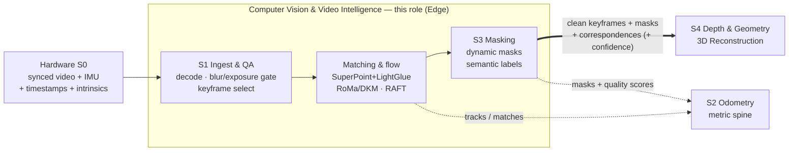

# DRISHTI — Role: Computer Vision & Video Intelligence

**Purpose:** Define the charter, owned stages, methods, interfaces, and reliability contract for the
Computer Vision (CV) & Video Intelligence role — the **front-end** that turns one compressed,
motion-blurred, dynamically-cluttered flight video into clean, geometry-ready observations for the
rest of DRISHTI.

**Audience:** NTRO technical evaluators and hackathon judges who want the front-end mechanism, and the
DRISHTI build team who need one shared picture of what this role owns and hands off.

## TL;DR

- This role **owns the front-end**: **S1** ingest, frame Quality-Assurance (QA) and keyframe selection;
  **feature matching and optical flow**; and **S3** dynamic-object plus semantic masking. It hands
  **clean keyframes + masks + correspondences — each with a confidence signal** — to the 3D
  Reconstruction role (Depth & Geometry, **S4**) and to the metric spine (Odometry, **S2**).
  **S0** capture and sync belongs to the [Drone & Sensor/Hardware](4-drone-sensor-hardware-integration.md)
  role; we **consume** its synced streams.
- Single-pass **inverts** keyframing: instead of removing redundant overlap, we deliberately *harvest*
  the scarce parallax one trajectory offers, and gate blur and exposure first so only sharp,
  well-exposed frames enter geometry (challenge ii — motion blur and video compression artifacts).
- **Learned matching beats classical** for narrow-baseline, blurry, compressed drone video:
  SuperPoint + LightGlue is the sparse default; RoMa/DKM dense matching is escalated only on hard,
  low-texture, artifact-heavy pairs; LoFTR is an alternative; RAFT optical flow supplies the motion cue.
- Dynamic masking is deliberately **belt-and-suspenders** — semantic instance segmentation + tracking
  (YOLO11-seg / SAM2 + ByteTrack) plus a class-agnostic geometric motion test — because a single
  un-masked mover becomes a **permanent ghost** in single-pass (challenge iv — dynamic objects).
- **Reliability spine (anchor A4):** every output carries confidence and every stage has a fallback
  (segmentation fails → motion-residual masking only; poor frames → widen keyframe spacing and flag
  gaps, ladder level **L4**). We never emit an empty keyframe set and never contaminate the static map.
- Honest framing: **"real-time" = near-real-time edge preview + minutes-scale ground refinement.**
  External performance figures are **reported by their authors**; DRISHTI figures are **design targets
  (to be measured)** on the event dataset.

This document conforms to the [canonical architecture spec](../_internal/CANONICAL-ARCHITECTURE-SPEC.md)
and introduces no new stages, tiers, or model choices; it **cites** the pipeline rather than
re-deriving it. The full stage walkthrough lives in [How It Works](../02-HOW-IT-WORKS.md).

---

## 1. Mandate & scope

**Mission.** Convert a single compressed flight video — plus the synced inertial and positioning
streams the Hardware role delivers — into a sparse set of sharp, well-exposed, wide-parallax
**keyframes**, reliable inter-frame **correspondences**, and clean **dynamic + semantic masks**.
Everything downstream (the metric spine, feed-forward geometry, Multi-View Stereo, meshing) inherits
these observations, and single-pass gives **no second flight to average out** our errors — so the
front-end is disproportionately load-bearing.

**Owned stages (per the canonical spec).**

- **S1 — Ingest & Frame QA [Edge].** NVIDIA-Decoder (NVDEC) / GStreamer hardware decode of
  H.264 / H.265 (High Efficiency Video Coding, HEVC); blur and exposure gating; parallax-aware
  keyframe selection; optional restraint-first deblur on borderline frames.
- **Feature matching & optical flow.** The correspondence layer feeding the metric spine and
  reconstruction: SuperPoint + LightGlue sparse matching, RoMa/DKM dense matching for hard pairs, and
  RAFT (Recurrent All-Pairs Field Transforms) optical flow for motion reasoning and overlap scoring.
- **S3 — Perception & Masking [Edge].** Dynamic-object instance segmentation + tracking, a geometric
  motion-residual test, and semantic labeling into the five required output classes.

**Explicitly not owned.** **S0** capture, time-stamping, and sensor sync belong to the
[Drone & Sensor/Hardware](4-drone-sensor-hardware-integration.md) role — we consume its synchronized
streams and trust its clock. The learned depth priors and feed-forward multi-view models (Metric3D v2,
UniDepth V2, VGGT, MASt3R) belong to the [AI/Deep Learning](3-ai-deep-learning-research.md) role and run
inside **S4** onward; we do **not** run them — we supply the clean keyframes, masks, and matches they
need. The metric spine (**S2** factor graph, Visual-Inertial Odometry) consumes our correspondences but
is owned outside this role.

**The clean handoff to 3D Reconstruction.** The contract with the
[3D Reconstruction Lead](1-3d-reconstruction-lead.md) is strict: **we deliver clean keyframes + masks +
matches; they build geometry.** A keyframe crossing our boundary is (a) sharp and well-exposed or
explicitly flagged low-confidence, (b) carries dynamic pixels masked out and semantic pixels labeled,
and (c) has inter-keyframe correspondences with per-match confidence. We do **not** triangulate,
estimate poses, fuse depth, or mesh — those are S2/S4–S8. A crisp boundary lets the reconstruction role
assume its inputs are trustworthy or honestly flagged, never silently corrupt.

---

## 2. Where you sit

The role is the second processing block on the Edge Tier, immediately downstream of Hardware's S0 and
upstream of both the metric spine (S2) and reconstruction (S4). Matching and optical flow sit between
ingest and masking, and their products fan out to S2/S6 as well as S4.



Legend: **==>** primary handoff to reconstruction; **-.->** correspondences and QA feeding the metric
spine. See the whole eleven-stage picture in [How It Works](../02-HOW-IT-WORKS.md#1-overview--three-tiers-and-two-paths).

---

## 3. Technical deep-dive

DRISHTI runs across **three tiers** — Edge (on-Unmanned Aerial Vehicle, NVIDIA Jetson Orin), Ground
(station/server GPU), Cloud (optional) — over **two output paths**: the *Live path* (S0–S5, edge,
near-real-time coarse map) and the *Refine path* (S6–S10, ground, minutes-scale metric model). This role
lives entirely on the Edge Tier's Live path, but its correspondences and masks are also consumed by the
ground Refine path (global bundle adjustment in S6, dense reconstruction in S7).

### 3.1 S1 — ingest & frame QA

**Decode.** Drone links deliver compressed H.264 / H.265 over Real-Time Streaming / Transport Protocol
(RTSP/RTP). We decode in hardware via **NVDEC through GStreamer** (`nvv4l2decoder`) or the NVIDIA
DeepStream Software Development Kit (SDK), zero-copy into CUDA/TensorRT buffers so the whole front-end
stays on-GPU for near-real-time throughput; PyAV/FFmpeg is the CPU fallback. Group-of-Pictures (GOP)
structure and Presentation Time Stamp (PTS) jitter are handled explicitly — B-frame reordering and
packet loss over the Radio-Frequency (RF) link corrupt frames, which we **detect and skip** rather than
feed forward.

**Handling motion blur and compression artifacts (challenge ii) without discarding coverage.** This is
the single-pass hazard: redundancy-for-denoising is gone, so a bad frame is not outvoted by neighbors —
it must be kept out of geometry, yet the *coverage* it represents cannot simply be discarded. Our
policy:

- **Blur gating** — a variance-of-Laplacian (VoL) sharpness score (Pech-Pacheco focus measure)
  **cross-checked against the IMU angular rate**: high gyro rate during the exposure window corroborates
  motion blur and separates genuine blur from a legitimately low-texture but sharp scene (water, sand,
  uniform rooftops), which a naive global VoL threshold would wrongly reject. Thresholds are
  content-adaptive per window.
- **Exposure gating** — histogram-clip fractions flag over- and under-exposed frames.
- **Keyframe selection** (see below) prefers the sharpest, best-exposed frame in each window rather than
  emitting a marginal one.
- **Optional restoration** — borderline (not heavily) blurred frames may be lightly restored using an
  IMU/gyro-derived blur kernel (a Point Spread Function from angular velocity during exposure) or a
  **NAFNet-class** learned deblur network. The policy is **reject-first, not restore-first**: heavy
  learned deblur hallucinates edges and texture that create false matches and biased geometry, so
  heavily-restored frames are **never promoted to metric keyframes**. The load-bearing acceptance metric
  is downstream match-inlier count, **not** benchmark Peak Signal-to-Noise Ratio (PSNR).
- **Coverage preservation** — where an entire window is blurry or blown out, we pass the
  *best-available* frame flagged low-confidence and **mark a temporal gap** rather than emit nothing;
  this is reliability ladder level **L4**.

**Keyframe selection.** Multi-pass photogrammetry *removes* redundant overlapping frames; single-pass
must *maximize* the little parallax one trajectory offers while holding a minimum overlap floor. We
select keyframes to maximize baseline/parallax subject to a **60–80% inlier overlap** band (design
target) and a minimum GNSS/IMU-implied translation, scored by **parallax + sharpness + coverage**. The
parallax and overlap signals reuse the optical-flow magnitude or matcher inlier count already computed
downstream, so scoring is effectively free. Too little baseline yields degenerate triangulation; too
much loses overlap — this stage walks that line deliberately.

### 3.2 Feature matching & flow

**Why learned matching beats classical for single-pass narrow-baseline video.** Learned sparse features
survive the motion blur, compression blocking, and moderate illumination change of drone video far
better than SIFT, and single-pass leaves wide-baseline, oblique pairings where classical detectors thin
out. We adopt a **tiered** strategy:

- **Sparse default — SuperPoint + LightGlue.** Learned keypoints matched by LightGlue, an
  adaptive-depth/width Graph Neural Network (GNN) matcher, exported to TensorRT. LightGlue's adaptive
  pruning gives the FPS headroom needed for near-real-time and low VRAM; authors report ~150 FPS at
  1024 keypoints on an RTX 3080 (reported by authors). This is the real-time backbone that feeds visual
  factors to the metric spine (S2) and tracks to global bundle adjustment (S6). Alternatives: DISK or
  ALIKED keypoints with the same matcher.
- **Dense escalation — RoMa / DKM.** Detector-free dense matchers estimate a pixel-dense warp with
  **per-pixel confidence**, recovering correspondences on low-texture surfaces and across
  illumination/shadow change. They are GPU- and latency-heavy, so they are **triggered selectively** —
  only on pairs whose sparse inlier count falls below threshold — to control cost. **LoFTR** (or
  Efficient LoFTR) is the alternative detector-free option.
- **Optical flow — RAFT.** Dense flow is used two ways: as the class-agnostic motion signal for S3
  masking (flow inconsistent with the epipolar/ego-motion field flags a mover) and as the cheap
  inter-frame overlap/parallax measure for keyframe selection. RAFT is the accuracy baseline; SEA-RAFT
  and NeuFlow v2 are faster edge-oriented alternatives when the compute budget is tight.

Every matcher emits a confidence signal — LightGlue match scores, RoMa per-pixel confidence — that
propagates downstream as fusion weight.

### 3.3 S3 — dynamic-object masking

**Why one un-masked mover is fatal in single-pass (challenge iv).** With multiple passes a moving car
appears in few frames and is outvoted; single-pass has no such redundancy, so **any un-masked dynamic
pixel becomes a permanent ghost or streak** in the mesh and simultaneously corrupts pose estimation.
Masking must therefore be **high-recall** and use two independent cues that cover each other's blind
spots — a belt-and-suspenders design:

- **Semantic cue — instance segmentation + tracking (YOLO11-seg / SAM2 + ByteTrack).** Per-keyframe
  instance masks for vehicles, humans, and animals; the Segment Anything Model 2 (SAM2) propagates masks
  across the sequence with streaming video memory (keeping masks temporally consistent and filling
  frames the detector misses), and ByteTrack maintains identities. This catches known movable classes
  even when parked-versus-moving is ambiguous.
- **Geometric cue — motion-residual detection.** Pixels whose RAFT optical-flow vector violates the
  epipolar constraint (residual to the estimated epipolar line), or whose reprojection is inconsistent
  with the rigid static-scene flow, are flagged as movers. This is **class-agnostic** and catches
  unknown or animal movers the detector misses.

**The two cues are complementary: geometry catches movers the detector misses, and the detector catches
movers the geometry misses.** The geometric test is degenerate for objects moving *along* the epipolar
/ flight direction and near the epipole in forward flight; the semantic net misses camouflaged, small,
or unusual targets — so neither alone suffices, and the union is far safer than either.

**Conservative dilation.** Masks are dilated conservatively (and extended to attached moving shadows)
so a mover's fringe pixels and its cast shadow do not leak into the static map. The trade is explicit:
it is better to lose a little real coverage than to keep a ghost, because a ghost is unrecoverable in
single-pass while a small coverage hole is honestly flaggable.

### 3.4 Semantic labeling

We run panoptic/semantic segmentation (**Mask2Former / OneFormer**; SegFormer as a lighter alternative)
to label every keyframe pixel into the five required output classes — **building/roof, road/infra,
vegetation, terrain, obstacle** — mapping directly to the problem statement's five reconstruction
targets. These label maps **feed the Semantic layers deliverable** (deliverable #6: GeoJSON/Shapefile +
labeled cloud & mesh) and let the reconstruction role apply category-specific treatment downstream
(planar/Manhattan regularization on façades and roofs, point-cloud modeling for vegetation). Dynamic
classes are removed from geometry and optionally retained as a separate moving-object layer. Each label
carries a per-pixel confidence.

### 3.5 Illumination & shadows (challenge iii) — and the boundary

Over a single continuous flight the sun angle and camera auto-exposure shift. This role owns the
**front-end** portion of the illumination problem and hands the rest downstream:

- **What we do:** per-frame exposure/white-balance **normalization at ingest** (so matching and later
  texturing are not seamed by changing light), and **masking of moving shadows** so they are not
  reconstructed as fake geometry — a single-pass-specific hazard, since a moving shadow cannot be
  averaged out.
- **What we hand downstream:** the **static** appearance/illumination variation is handled in
  reconstruction (S7) via **per-image appearance embeddings** in the 3D Gaussian Splatting stage, owned
  jointly by the [3D Reconstruction Lead](1-3d-reconstruction-lead.md) and
  [AI/Deep Learning](3-ai-deep-learning-research.md) roles. We deliberately do **not** perform
  aggressive learned shadow-removal or relighting on keyframes destined for geometry, since that erases
  real radiometric information and can hallucinate ground texture under shadow.

**The boundary is explicit:** we normalize and mask; downstream absorbs residual appearance variation
per-image — keeping hallucination-prone photometric edits out of the metric path.

---

## 4. Adopted stack & key decisions

Choices below conform to the canonical spec's model registry (§7). "Adopted" is the DRISHTI default;
"Fallback" is the graceful-degradation path. Full versions, licenses, and hardware live in
[Technology Stack](../03-TECHNOLOGY-STACK.md); rationale and trade-offs in
[Design Decisions](../05-DESIGN-DECISIONS.md).

| Task | Adopted | Fallback | Why |
|------|---------|----------|-----|
| Video decode / ingest | NVDEC via GStreamer (`nvv4l2decoder`) / DeepStream, zero-copy to CUDA | PyAV / FFmpeg CPU decode; I-frame-only extraction on severe RF loss | Hardware H.264/H.265 decode keeps the front-end on-GPU for near-real-time on Jetson Orin; handles RTSP/RTP and GOP structure |
| Frame QA gate | Variance-of-Laplacian blur + IMU angular-rate cross-check + histogram exposure gate | Best-available-in-window (never empty), flagged low-confidence | Near-free, deterministic; only sharp, well-exposed frames enter geometry |
| Keyframe selection | Parallax + sharpness + coverage, 60–80% overlap band | Widen spacing and flag temporal gaps (L4) | Single-pass must harvest scarce baseline, not remove redundancy |
| Deblur | IMU/gyro-PSF light restoration; NAFNet-class on borderline frames only, reject-first | Skip frame; rely on neighboring sharp keyframes | Physically-grounded mild restoration; avoids hallucinated texture poisoning matches |
| Sparse matching | SuperPoint + LightGlue (TensorRT) | DISK / ALIKED + LightGlue | Real-time, low-VRAM, blur/compression-robust backbone for tracks and BA |
| Dense matching (hard pairs) | RoMa / DKM, triggered on low sparse-inlier count | LoFTR / Efficient LoFTR | Detector-free dense rescues low-texture / wide-baseline / illumination-change pairs |
| Optical flow | RAFT | SEA-RAFT / NeuFlow v2 (edge real-time); GMFlow | Motion-segmentation cue + overlap scoring |
| Dynamic object seg + track | YOLO11-seg / SAM2 + ByteTrack | Motion-residual masking only, conservative dilation | Two independent cues give high-recall masking of known and unknown movers |
| Semantic segmentation | Mask2Former / OneFormer | SegFormer / InternImage | Labels the five required output classes for the semantic-layers deliverable |
| Edge runtime | TensorRT (INT8/FP16), CUDA, JetPack | ONNX Runtime | Near-real-time inference on Jetson Orin; NVDEC frees the GPU for models |

---

## 5. Interfaces & contracts

### 5.1 Inputs consumed (from Hardware S0)

- **Synced video frames** — decoded H.264/H.265, as NV12/RGB CUDA buffers.
- **IMU** — angular rate (for blur cross-check and rigid-flow prediction) and pre-integrated motion.
- **Per-sample timestamps** — GPS-time on a single monotonic clock; every frame is aligned to
  IMU/GNSS/baro by S0 (Pulse-Per-Second / Precision Time Protocol where available). We **trust and
  propagate** these timestamps; we do not re-time.
- **Camera intrinsics** — matrix `K` + distortion, from EXIF/XMP or S0 self-calibration; used to
  undistort before matching and to form the epipolar geometry for the motion test.
- **GNSS/IMU-implied translation** — the minimum-baseline gate for keyframe selection.

### 5.2 Outputs emitted (each with a confidence signal)

Our products populate the **compact keyframe package** defined in
[How It Works §6](../02-HOW-IT-WORKS.md#6-data-flow--formats-between-stages) and detailed in
[Integration](../04-INTEGRATION.md); we own the `qa` and `masks` fields and the correspondence records.
We do **not** duplicate the full schema here — the fields this role writes are:

```jsonc
// Fields written by the CV front-end into the per-keyframe package
{
  "kf_id": 1042,
  "qa":    { "sharpness": 0.86, "exposure_ok": true, "tier": "L0",
             "restored": false, "gap_before": false },   // per-frame quality scores
  "masks": { "dynamic":  "kf1042.dyn.rle",               // Run-Length-Encoded dynamic mask
             "dyn_conf": "kf1042.dynconf.u8",             // per-instance mask confidence
             "semantic": "kf1042.sem.png",                // 5-class label map
             "sem_conf": "kf1042.semconf.u8" }
}
```

```jsonc
// Correspondence record between two keyframes → feeds S2 factor graph and S6 bundle adjustment
{
  "pair": [1042, 1043],
  "matcher": "superpoint+lightglue",        // or "roma" when escalated on a hard pair
  "kpts_a": "kf1042.kpts.f32",              // Nx2 pixel coords, OpenCV frame, undistorted
  "matches": "pair_1042_1043.idx.i32",      // Mx2 index pairs
  "match_conf": "pair_1042_1043.conf.u8",   // per-match confidence 0..1
  "inliers": 812, "mean_parallax_px": 27.4
}
```

Summary of emitted artifacts: **keyframe set** (ids + pointers into the recorded master), **per-frame
quality scores** (sharpness, exposure, reliability tier, restoration/gap flags), **dynamic masks** +
**semantic label maps** (with confidence), and **correspondences** (sparse matches, dense warps on hard
pairs, optical-flow fields, each with confidence). Consumers: **S2/S6** (correspondences, QA), **S4/S7**
(keyframes, masks, semantic labels), **S9** (semantic labels for propagation to the mesh/cloud).

### 5.3 Coordinate & time conventions (per canonical spec §6)

- **Camera:** OpenCV convention (x-right, y-down, z-forward); intrinsics `K` + distortion. Keypoints and
  masks are expressed in **original-frame pixel coordinates**, undistorted before matching.
- **Body/IMU:** Robot Operating System REP-103 Forward-Left-Up; camera↔IMU extrinsics from Kalibr
  (owned by Hardware).
- **Time:** single monotonic clock, GPS-time as the global reference. Every keyframe carries `t_gps`;
  masks and correspondences inherit it. We change no frames or clocks — we annotate.

---

## 6. Reliability & confidence

The reliability spine (**anchor A4**) requires **confidence on every output and a fallback for every
stage**; nothing hard-fails. This role's contributions to the graceful-degradation ladder (L0–L6,
defined in the [canonical spec §5](../_internal/CANONICAL-ARCHITECTURE-SPEC.md#5-reliability-spine-a4--graceful-degradation-ladder)):

| Failure | Fallback | Ladder | Product impact |
|---------|----------|--------|----------------|
| Corrupt / dropped frames (RF loss) | Detect and skip; I-frame-only extraction on severe loss | — | Frame gaps flagged, not garbage |
| Blurry / blown-out window | Best-available frame, low-confidence; **widen keyframe spacing + mark gap** | **L4** | Coverage hole flagged, never empty set |
| Sparse matcher inliers below threshold | Escalate that pair to RoMa/DKM dense; if still degenerate, mark link weak and lean on IMU/GNSS + depth prior | L5 | Reduced connectivity, honestly weighted |
| Segmentation model fails / OOM | **Motion-residual masking only**, conservative dilation | L5 | Static map still protected from movers |
| Edge compute saturated | Skip dense matching, reduce resolution/rate; defer heavy work to ground | L6 | Simpler live preview; refine unaffected |

**What we propagate downstream.** Confidence travels with every artifact so it reaches the final tiles
and the S10 accuracy report: **per-keyframe sharpness/exposure scores and reliability tier**,
**per-mask (dynamic and semantic) confidence**, **per-correspondence confidence** (LightGlue match
score / RoMa per-pixel confidence), and **temporal-gap flags** marking thinned coverage. These become
fusion weights in S4/S5 (Truncated Signed Distance Function integration weight is a function of
confidence, ray-incidence angle, and blur score) and covariance inputs to S6.

**Invariants.** (1) The keyframe set is never empty — a poor window yields a flagged best-available
frame plus a gap marker. (2) The static map is never contaminated — if masking degrades, we fall back to
the geometric cue and dilate conservatively. (3) Hallucination-prone edits (heavy learned deblur,
shadow removal) are kept out of the metric path; where used for visualization they are down-weighted and
flagged. We slow and coarsen rather than hard-fail.

---

## 7. Hackathon MVP responsibilities

The Minimum Viable Product (MVP) is buildable in the event on the provided dataset and demonstrates the
front-end end-to-end. Our slice of the canonical MVP (spec §11):

**Minimal path — ingest → keyframe → match → mask.**
1. **Decode** the provided drone video with NVDEC (PyAV fallback).
2. **Gate** frames by variance-of-Laplacian + exposure histogram; **select keyframes** by
   parallax + sharpness + coverage.
3. **Match** with SuperPoint + LightGlue, exporting a COLMAP-compatible model; escalate low-inlier pairs
   to RoMa.
4. **Mask** movers with YOLO11-seg + SAM2 + ByteTrack **and** the RAFT motion-residual test; **label**
   the five semantic classes with Mask2Former/OneFormer.
5. **Hand off** clean keyframes + masks + correspondences to the reconstruction path (S4).

**Demoing dynamic-object rejection (evaluation criterion #9).** Show masked-mover overlays on keyframes;
quantify **precision/recall of masked movers** against hand-labeled ground truth on the dataset clips;
and measure **residual "ghost" density** in the fused point cloud with masking **on vs. off** — the
on/off comparison is the most legible proof, because un-masked ghosts are visually obvious streaks.

**Demoing blur & illumination robustness (evaluation criterion #8).** Inject synthetic motion blur and
illumination/exposure shifts and plot the **degradation curve** — keyframe yield, match-inlier count,
and coverage — showing it is **graceful and monotonic** with **no hard failure**: coverage is preserved
via the best-available fallback and gaps are flagged rather than silently dropped.

**Stretch.** Emulate the edge/ground split by streaming a clip through the Live path so the front-end
runs near-real-time while the ground tier refines — but the front-end MVP does not depend on it.

---

## 8. Open questions / risks

- **Licensing for a defense/NTRO build.** The canonical spec adopts **YOLO11-seg**, which is AGPL-3.0
  (copyleft); several strong checkpoints elsewhere are non-commercial (MASt3R CC-BY-NC-SA; Depth
  Anything V2 Base/Large CC-BY-NC; VGGT's commercial checkpoint excludes military use). A deployable
  build should assemble the front-end from **permissively-licensed** components — SuperPoint/DISK/
  LightGlue (Apache-2.0), RoMa (MIT), and Apache-2.0 detectors such as **RT-DETR / RTMDet / YOLOX** in
  place of Ultralytics YOLO — or license/retrain equivalents. *Flagged against the spec's adopted
  YOLO11-seg per the style guide, not a silent substitution.* Tracked in
  [Technology Stack](../03-TECHNOLOGY-STACK.md).
- **Motion-segmentation blind spots.** Objects moving **along** the epipolar/flight direction and near
  the epipole in forward flight evade the geometric test; camouflaged, small, or animal movers evade the
  semantic net. The belt-and-suspenders union shrinks but does not eliminate the residual gap —
  worst-case is a slow mover moving radially in forward flight.
- **Deblur hallucination.** Even reject-first, borderline restoration can inject false texture; the
  load-bearing acceptance metric must remain downstream inlier count, not PSNR, and restored frames must
  stay out of the metric keyframe set.
- **Compression floor.** Below some RF bitrate, texture is quantized away and no matcher can recover
  reliable features. Mitigation is to reconstruct from the **near-raw onboard master**, not the lossy
  downlink — a dependency on the Hardware role's store-and-forward.
- **Rolling shutter.** Continuous forward motion induces rolling-shutter distortion; learned matchers and
  flow assume global shutter. A global/mechanical-shutter sensor or rolling-shutter-aware handling
  downstream is preferred; we flag suspect frames.
- **Aerial domain gap & confidence calibration.** Matchers and segmentation nets are trained largely on
  ground-level/automotive data; high-altitude nadir/oblique views are out-of-distribution, and learned
  confidence is often over-confident on textureless façades — thresholds need empirical recalibration on
  drone footage.
- **Time-sync is a consumed dependency.** Our correspondences and masks are only as good as S0's
  frame-to-telemetry sync; a sub-100 ms desync becomes metres of downstream georeferencing error. Owned
  by [Drone & Sensor/Hardware](4-drone-sensor-hardware-integration.md), but it surfaces here.
- **Real-time budget on Orin.** Running decode + matching + flow + segmentation concurrently at 4K on a
  Jetson Orin is tight; it likely needs resolution/rate reduction, TensorRT INT8, and disciplined
  drop-latest-keyframe backpressure. Numbers above are **design targets to be measured**.

## 9. Further reading

- [Canonical architecture spec](../_internal/CANONICAL-ARCHITECTURE-SPEC.md) — authoritative stages,
  model registry, reliability and metric spines.
- [How It Works](../02-HOW-IT-WORKS.md) — the full S0–S10 walkthrough and data-flow contracts.
- [Technology Stack](../03-TECHNOLOGY-STACK.md) — concrete versions, licenses, and hardware.
- [Design Decisions](../05-DESIGN-DECISIONS.md) — rationale and trade-offs behind the adopted choices.
- [Integration](../04-INTEGRATION.md) — message contracts, coordinate frames, and the edge↔ground
  protocol.
- [Problem Statement + Output/Evaluation tables](../_internal/PROBLEM_STATEMENT.md) — deliverables and
  the evaluation criteria this role is scored against.
- Peer roles: [3D Reconstruction Lead](1-3d-reconstruction-lead.md) ·
  [AI/Deep Learning](3-ai-deep-learning-research.md) ·
  [Drone & Sensor/Hardware](4-drone-sensor-hardware-integration.md).
