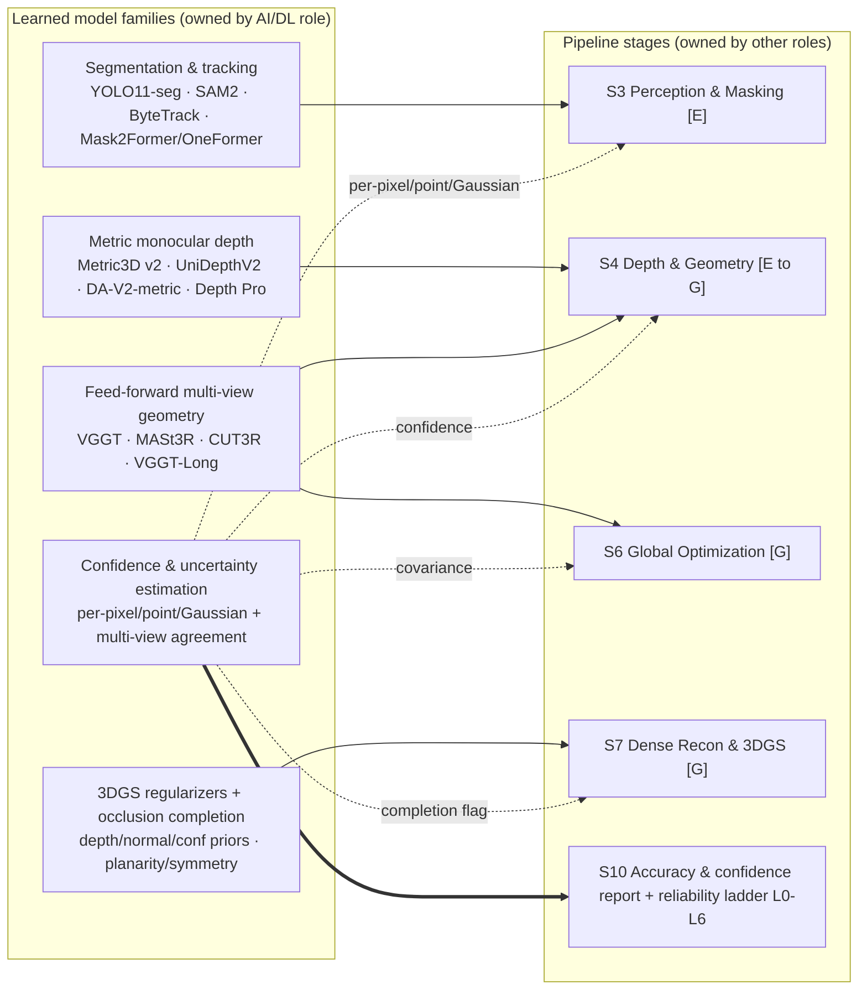

# DRISHTI — Role: AI / Deep Learning Research

**Purpose:** Define the horizontal "model science + machine-learning (ML) engineering" role that
selects, adapts, quantizes, validates, and hardens every learned model in DRISHTI, and owns the
confidence/uncertainty machinery and on-device optimization that make those models trustworthy on a
single pass.

**Audience:** NTRO (National Technical Research Organisation) technical evaluators and hackathon
judges; the DRISHTI build team — specifically the peers who consume this role's neural components:
the [3D Reconstruction Lead](1-3d-reconstruction-lead.md), the
[Computer Vision & Video Intelligence](2-computer-vision-video-intelligence.md) role, and the
[Systems & Edge/Compute](6-systems-edge-compute-optimization.md) role.

## TL;DR

- This role is the **model owner**, not a pipeline owner: it supplies and hardens the learned
  components that other stages call — **metric depth (S4)**, **feed-forward pointmaps (S4/S6)**,
  **segmentation & tracking (S3)**, **3D Gaussian Splatting (3DGS) regularizers + occlusion
  completion (S7)** — and it owns **confidence/uncertainty estimation everywhere**.
- **Every learned output ships a confidence/uncertainty signal.** This is the role's signature
  discipline and the reason DRISHTI can degrade gracefully instead of emitting confident garbage; no
  neural prediction is trusted blindly by any downstream stage.
- It explicitly **does not own** the classical geometry — bundle adjustment (BA), the factor graph,
  georeferencing math — which belong to the Reconstruction and Geospatial roles. It hardens the
  neural pieces those stages consume and scale-aligns them to the **metric spine (anchor A2)**.
- **On-device optimization is this role's job:** TensorRT INT8/FP16, quantization-aware vs
  post-training quantization, distillation to edge students, pruning, and the accuracy-vs-latency
  trade curve on NVIDIA Jetson Orin — handed to the [Systems & Edge/Compute](6-systems-edge-compute-optimization.md)
  role to run.
- **Honesty is built into the model layer.** "Real-time" means a **near-real-time edge preview**
  (Live path, S0–S5) plus **minutes-scale ground refinement** (Refine path, S6–S10); heavy
  transformers stay on the Ground Tier by design.
- **Licensing and aerial domain gap are first-order risks.** The strongest checkpoints are
  non-commercial or exclude military use; the deployable, sovereignty-friendly build is assembled
  from permissively-licensed, locally-hosted, replaceable weights.
- All external accuracy numbers here are **reported by the methods' authors**; all DRISHTI numbers
  are **design targets (to be measured)** on the event dataset.

This document conforms to the [canonical architecture spec](../_internal/CANONICAL-ARCHITECTURE-SPEC.md)
and cites it for the pipeline; it introduces no new stages, tiers, or model choices. The operational
walkthrough lives in [How It Works](../02-HOW-IT-WORKS.md).

---

## 1. Mandate & scope

**Mission.** Make single-pass metric reconstruction possible by injecting **learned priors** exactly
where a single flight path denies classical photogrammetry the geometry it needs — thin baselines,
narrow angles, permanent occlusion — and to do so **honestly**, so that every learned prediction
carries a calibrated confidence that gates its use downstream. Single-pass reconstruction is
prior-assisted (anchor **A1**) precisely because triangulation alone is ill-conditioned on one pass;
this role owns those priors end to end: **select → adapt → distill → quantize → validate →
calibrate**.

**Models this role stewards, by stage.** The stage definitions are the spec's; this role owns the
learned model inside each, not the stage:

| Stage | Learned component this role stewards | Where it plugs in |
|-------|--------------------------------------|-------------------|
| **S3 — Perception & Masking** | Dynamic-object instance segmentation + tracking; semantic labeling | Supplies masks/labels the CV role and fusion consume |
| **S4 — Depth & Geometry** | Metric monocular depth; feed-forward multi-view pointmaps | Scale-aligned to the metric spine by the Reconstruction role |
| **S6 — Global Optimization** | Pointmap/depth constraints feeding BA (as factors) | BA itself is owned by the Reconstruction role |
| **S7 — Dense Recon & 3DGS** | 3DGS depth/normal/confidence regularizers; occlusion/hole completion | Feeds the dense-scene stage; completed regions flagged low-confidence |
| **Everywhere** | Per-pixel / per-point / per-Gaussian confidence & multi-view agreement | Propagates into the accuracy & confidence report and the reliability ladder |

**Boundary — what this role does NOT own.** The classical geometry/optimization spine is owned
elsewhere and this role must not duplicate or contradict it:

- **Bundle adjustment, the GTSAM/iSAM2 factor graph, pose-graph optimization, self-calibration** →
  [3D Reconstruction Lead](1-3d-reconstruction-lead.md) and the metric-spine owner. This role
  *supplies* depth/pointmap constraints and their covariances as factors; it does not solve them.
- **Georeferencing, Coordinate Reference System (CRS) transforms, geoid/datum, Digital Surface/
  Terrain Model (DSM/DTM) rasterization** → the Geospatial role. This role provides the *scale-anchor
  priors* (metric depth, pointmaps) but does not do the Sim(3)/SE(3) alignment.
- **Runtime orchestration, ROS 2 wiring, thermal/power management, store-and-forward** →
  [Systems & Edge/Compute](6-systems-edge-compute-optimization.md). This role delivers optimized
  TensorRT engines and the accuracy-vs-latency trade curve; Systems runs them.
- **Frame QA gating, deblur policy, optical-flow motion residual, keyframe selection** →
  [Computer Vision & Video Intelligence](2-computer-vision-video-intelligence.md). This role supplies
  the *learned* segmentation/tracking nets S3 uses; the CV role owns the classical cues and the
  masking policy that combines them.

In one line: **this role is the neural-component supplier and confidence authority; the geometry and
systems roles are its consumers.**

---

## 2. Model portfolio

The portfolio maps model *families* to the stages that consume them and to this role's responsibility
verb for each. "Stewards" means the full lifecycle: pick the checkpoint, adapt/finetune if needed,
distill/quantize for the edge, validate on aerial data, and calibrate its confidence output.

| Model family | Stage(s) | This role's responsibility |
|--------------|----------|-----------------------------|
| Metric monocular depth | S4 | **Select · finetune (aerial) · distill · quantize · validate · calibrate** |
| Feed-forward pointmaps | S4, S6 | **Select · chunk/stream · validate · calibrate** (heavy — Ground Tier) |
| Segmentation & tracking | S3 | **Select · quantize (INT8) · validate · calibrate** (real-time edge) |
| 3DGS regularizers + occlusion completion | S7 | **Adapt · integrate priors · flag-and-calibrate** completed regions |
| Confidence & uncertainty | S3–S7 → S10 | **Own end to end** — extract, cross-check, calibrate, propagate |

---

## 3. Technical deep-dive by model family

### 3.1 Metric monocular depth (the scale-anchor family)

**Members:** Metric3D v2 (permissive BSD-2 license), UniDepthV2, Depth Anything V2 (DA-V2) metric
variants, and Depth Pro for crisp edges. **Role in S4:** supply an absolute-scale, per-pixel depth
prior for *every* keyframe — the single most important reason single-pass metric reconstruction is
possible without Ground Control Points (GCPs), because it provides scale where a thin baseline cannot
triangulate it.

**How metric scale is obtained.** These models are trained to regress absolute (metric) depth
zero-shot. Metric3D v2 maps any camera into a canonical camera space to make metric output
camera-agnostic; UniDepthV2 predicts a metric point cloud *and* the camera intrinsics/field-of-view
(FOV) directly from red-green-blue (RGB), covering the "intrinsics optional" input case. Depth Pro
estimates focal length with no metadata. Reported zero-shot accuracy (by the methods' authors):
Metric3D v2 ViT-L reaches KITTI AbsRel 0.044 / δ1 0.985; UniDepthV2 reports δ1 of ~98.9 on KITTI and
strong ETH3D/IBims gains. **These are the authors' numbers on automotive/indoor benchmarks — not
DRISHTI results, and not obtained on aerial imagery.**

**Why it still must be scale-aligned to the metric spine (A2).** A per-frame metric prediction is
biased and noisy under domain shift: aerial nadir/oblique rooftops and terrain are out-of-distribution
for models trained mostly on ground-level/driving data, so absolute scale error is typically 5–10%
and drifts frame-to-frame (reported behavior). DRISHTI therefore **never trusts per-frame metric
depth as truth.** The [3D Reconstruction Lead](1-3d-reconstruction-lead.md) re-anchors it globally:
metric depth seeds local scale, IMU pre-integration + barometer constrain inter-frame scale and
gravity, and a 7-DoF Sim(3) (or SE(3) with RTK) alignment of the visual trajectory to the GNSS track
fixes absolute scale and georeference. With these priors, scale drift over a straight corridor is
reducible to ~1–2% versus ~5–15% for pure monocular VIO (externally reported) — a **design target to
be measured** for DRISHTI. Metric depth is thus a *prior into the spine*, not a substitute for it.

**Per-pixel confidence heads.** Metric3D, UniDepthV2, and MoGe-class models emit a native per-pixel
confidence/uncertainty map at no extra network cost. This role's job is to (a) surface that head, (b)
calibrate it on aerial data, and (c) hand it to fusion so textureless façades and out-of-domain
regions are down-weighted rather than blindly integrated.

### 3.2 Feed-forward multi-view geometry / pointmaps

**Members:** VGGT (Visual Geometry Grounded Transformer) for batch keyframe chunks; MASt3R and
CUT3R for streaming; VGGT-Long for kilometre-scale corridors. **Role in S4/S6:** regress camera
poses *and* dense geometry directly, replacing the Structure-from-Motion (SfM) + Multi-View Stereo
(MVS) loop with one network pass.

**What a pointmap is.** A pointmap is a per-pixel 3D-point prediction: for each pixel the network
outputs an (X, Y, Z) coordinate in a shared frame, so a pointmap is a dense, already-corresponded 3D
reconstruction of the view — not a 2D depth map that still needs a pose to be lifted. VGGT emits
intrinsics + extrinsics + depth + pointmaps + tracks in a single feed-forward pass (reported: scene
reconstruction in under one second; ~1.2B parameters; CVPR 2025 Best Paper).

**Why feed-forward beats triangulation at single-pass baselines.** Classical triangulation error
scales as roughly 1/baseline, and forward flight puts the epipole inside the image where parallax is
near-zero — exactly where a single pass is weakest, the cost volume goes flat and COLMAP-style SfM
diverges or holes out. Feed-forward models *learn* multi-view geometry priors instead of triangulating,
so they stay well-conditioned at the thin baselines and narrow angles that break classical methods.
This is the core single-pass change (anchor A1). The Reconstruction role decides how these pointmaps
enter the global solve; this role guarantees they are well-conditioned, chunked to fit memory, and
carry confidence.

**How their confidence is used.** VGGT and MASt3R emit per-point confidence. Because feed-forward
models can hallucinate plausible-but-wrong geometry in unseen/low-confidence regions — a real hazard
for measurement — DRISHTI treats that confidence as load-bearing: low-confidence points are
down-weighted in Truncated Signed Distance Function (TSDF) fusion and BA, and **cross-model
disagreement** between the monocular metric depth (§3.1) and the multi-view pointmap is itself used as
an independent occlusion/dynamic/domain-shift flag. Memory scales with view count, so long flights are
tiled into overlapping keyframe windows (VGGT-Long-style chunk + overlap-align + loop closure); this
is a Ground Tier workload by design (see §4).

### 3.3 Segmentation & tracking

**Members:** YOLO11-seg and SAM2 (Segment Anything Model 2) with ByteTrack for dynamic-object
instance segmentation + tracking; Mask2Former / OneFormer for semantic labeling. **Role in S3:** the
*learned* side of dynamic and semantic masking.

A mover seen once on a single pass has no redundant views to average it out, so it bakes into the map
as a permanent "ghost" — masking is mandatory, not optional. This role supplies the learned masks; the
[Computer Vision & Video Intelligence](2-computer-vision-video-intelligence.md) role owns the
class-agnostic motion-residual cue (optical flow vs epipolar/rigid-flow) and the policy that fuses the
two. YOLO11-seg runs real-time on Jetson Orin via TensorRT (reported >30 FPS at 640 px) to mask
movable classes; SAM2 propagates temporally coherent masks; Mask2Former/OneFormer produce the five
semantic classes the deliverable needs (building/roof, road/infrastructure, vegetation, terrain,
obstacle). Every mask and label carries a **segment confidence**; low-confidence masks are
conservatively dilated so the static map is never contaminated, and if the segmentation net fails the
CV role's motion-residual cue alone carries S3 (an L-ladder fallback, §7).

### 3.4 Occlusion / hole completion

**Role in S7:** generate plausible geometry for surfaces a single pass never imaged — building
backsides, undersides (a bridge deck between piers), shadowed canyons — using **learned generative
priors + geometric priors** (planarity/symmetry/Manhattan-world for man-made structure, footprint
extrusion where available). Predicted surface normals (from Metric3D v2 / MoGe) and semantic labels
drive category-specific regularization so façades and rooftops snap to planes rather than staying
noisy.

**The completion honesty rule (non-negotiable).** Completed regions are **generated *and*
simultaneously flagged low-confidence** — rendered in a distinct layer, tagged "inferred", and
**excluded from measurement by default.** Inferred geometry is never presented as measured. This is a
correctness requirement for defense/measurement use, not a stylistic choice: over-regularization can
erase real detail (ornamentation, curved roofs) and generative completion can be confidently wrong, so
the completion flag travels with the geometry into the S10 accuracy & confidence report. The role
provides the completion; the flag is what makes it safe.

### 3.5 Confidence & uncertainty estimation (the cross-cutting discipline)

This is the role's signature theme and the connective tissue of the reliability spine (**A4**). The
principle: **no learned output is trusted blindly — each is a value plus a calibrated uncertainty.**

- **Per-pixel / per-point / per-Gaussian confidence.** Depth (per-pixel), pointmaps (per-point), and
  3DGS (per-Gaussian opacity/consistency) each expose a native confidence signal; this role extracts
  and standardizes them into a common `[0,1]` confidence channel that rides with every artifact (the
  `conf` field in the keyframe package).
- **Multi-view agreement as an external check.** Native model confidence is often poorly *calibrated*
  — overconfident on textureless/repetitive façades and out-of-domain aerial content. So the role
  adds model-agnostic proxies: multi-view depth-agreement variance, test-time augmentation
  (flip/scale), and photometric/geometric reprojection consistency. TSDF integration weight is a
  function of `(model confidence, ray-incidence angle, blur score)`.
- **Calibration.** Because confidence ≠ correctness under systematic domain bias, the role's
  deliverable includes an **empirical recalibration** step (reliability diagrams, threshold tuning)
  on real aerial frames — planned work, not a solved benchmark.
- **How it flows to deliverables.** Per-region confidence is fused from BA covariance (from the
  Reconstruction role), ray convergence angle, observation count, GSD, and learned per-pixel
  confidence, then propagated into the final tiles and the **accuracy & confidence report** (Desired
  Output #8). It also drives the graceful-degradation ladder: confidence is the trigger that moves the
  system between levels **L0–L6** instead of hard-failing.

---

## 4. On-device optimization

This role produces the optimized engines; the [Systems & Edge/Compute](6-systems-edge-compute-optimization.md)
role runs them inside the ROS 2 / DeepStream runtime. The goal is to make the *light* end of the
learned stack run near-real-time on the Edge Tier (Jetson Orin), while the *heavy* transformers stay on
the Ground Tier — consistent with the two-path honesty framing.

**Quantization.** Export to ONNX (Open Neural Network Exchange, opset 17+) → build per-model TensorRT
engines. Default **FP16** for transformers (VGGT/MASt3R need bf16/fp16); **INT8** for the ViT-Small
depth and segmentation nets. INT8 gives roughly 2–4× throughput over FP16 with minor accuracy loss
(reported) — *but only with representative calibration data.* The role's rule: **calibrate INT8 on
real aerial frames, never on COCO/automotive**, or metric depth accuracy degrades. Choose between:

- **Post-training quantization (PTQ):** fast, no retraining; the default for the hackathon. Risk:
  accuracy drop on out-of-domain content if calibration data is unrepresentative.
- **Quantization-aware training (QAT):** simulate quantization during a short finetune; reserved for
  the depth student where PTQ costs too much accuracy. This is a **planned** hardening step, framed as
  future work — not a completed result.

**Distillation & pruning.** Distill heavy depth teachers into ViT-Small edge students (Depth
Anything's teacher→student design is built for exactly this path); apply structured pruning where the
op set allows. The student runs on the edge for the Live path; the teacher runs on the ground for the
Refine path.

**Batching / streaming & memory budgets.** Feed-forward transformers scale VRAM with view count, so
the role budgets keyframes into overlapping windows and uses streaming variants (CUT3R's linear-memory
persistent state) for bounded-memory operation over a long pass. Representative vendor-reported
capacity: Jetson AGX Orin 64 GB (~248–275 sparse-INT8 TOPS, dual Deep Learning Accelerators) can host
the ViT-S depth + segmentation nets; Orin NX 16 GB (~117 TOPS) runs a reduced subset. VGGT (~1.2B
params) and ViT-L backbones exceed the Orin NX budget and are near-real-time at best even on AGX Orin —
hence the deliberate **edge-server split**: lightweight nets on the drone, heavy backbone on the
Ground Tier over the datalink. Detailed module specs and the runtime belong to the Systems role.

**The accuracy-vs-latency trade curve (design targets, to be measured).** The role's core artifact is
a curve, not a point — per model, plotted so Systems can pick an operating point per tier:

| Model tier | Example config | Reported reference latency | DRISHTI edge target (to be measured) |
|-----------|----------------|----------------------------|--------------------------------------|
| Depth ViT-S (INT8) | 518 px, edge | ViT-S 3 ms on RTX 4090 FP16 (author-reported) | ~15–30 FPS at reduced res on AGX Orin |
| Depth ViT-B/L | full res, ground | ViT-B 6 ms / ViT-L 12 ms on RTX 4090 FP16 | full-res on Ground Tier only |
| YOLO11-seg (INT8) | 640 px, edge | >30 FPS on Orin (reported) | real-time movable-class masks |
| VGGT (FP16) | keyframe chunk, ground | <1 s / scene (reported) | near-real-time on chunks, Ground Tier |

Every figure above is either **reported by the method's authors** or a **DRISHTI design target
pending measurement** on the event hardware and dataset — never a measured DRISHTI result.

---

## 5. Data & training strategy

The event provides the dataset **in real time**, and aerial imagery is out-of-distribution for almost
every checkpoint, so the strategy is adaptation-light and staged:

1. **Zero-shot first.** Stand up pretrained checkpoints as-is. Every model in the portfolio is chosen
   to work zero-shot; this is the hackathon baseline and the fallback for the deployable build. No
   claim is made that DRISHTI trained a model to any benchmark — we *use* published checkpoints and
   report their authors' numbers as such.
2. **Optional domain finetuning on aerial data (planned).** If time and data allow, finetune the
   depth student and segmentation nets on aerial datasets (e.g. UseGeo, ISPRS Vaihingen/Potsdam, WHU,
   Mill-19/UrbanScene3D) to close the nadir/oblique domain gap. This is framed as a **plan**, with
   success measured by reduced scale bias on aerial validation — not as an achieved result.
3. **Synthetic & self-supervised augmentation.** Where labeled aerial ground truth is scarce, use
   synthetic renders (AirSim/Blender-class) for scale/altitude coverage and self-supervised
   photometric/geometric consistency (multi-view reprojection) as a label-free signal. Synthetic data
   also seeds INT8 calibration sets that match aerial statistics.
4. **Validation is a first-class deliverable.** Because metric accuracy without GCPs is unverifiable
   without an independent check, the role plans validation against a reference (a few survey points,
   RTK, or a COLMAP/Metashape/LiDAR baseline) using Cloud-to-Cloud (C2C) / Cloud-to-Mesh (C2M) /
   Chamfer distance, and reports per-region error honestly.

**The sovereignty angle.** All model weights are **hosted locally** — the pipeline is air-gap friendly
and never depends on a cloud model API. The architecture treats every model as a **swappable module
behind a stable interface**, so a foreign or non-commercial checkpoint can be replaced by an
indigenous or permissively-licensed equivalent without touching the geometry or systems layers. This
is both a licensing hedge (see §6) and a defense-deployment requirement.

---

## 6. Adopted stack & key decisions

The choices below conform to the spec's model & tool registry (§7 of the
[canonical spec](../_internal/CANONICAL-ARCHITECTURE-SPEC.md)); alternatives are flagged as such per
the style guide. Full versions and licenses are tracked in [Technology Stack](../03-TECHNOLOGY-STACK.md);
the rationale trail is in [Design Decisions](../05-DESIGN-DECISIONS.md).

| Model family | Adopted | Fallback | Why | License note |
|--------------|---------|----------|-----|--------------|
| Metric mono depth | Metric3D v2 (ViT-S/L) | DA-V2-Small (Apache-2.0); Depth Pro for edges | Zero-shot metric + normals + intrinsics; deployable license | Metric3D **BSD-2 (deployable)**; UniDepthV2 CC-BY-NC (R&D only); Depth Pro sample license |
| Feed-forward pointmaps | VGGT (batch chunks) | CUT3R / MASt3R (streaming); GLOMAP/COLMAP classical | Replaces SfM+MVS; stable at thin single-pass baselines | **Verify VGGT checkpoint** — commercial one excludes military use; MASt3R CC-BY-NC-SA (R&D) |
| Temporal video depth | Video Depth Anything-Small | Per-frame metric depth | Flicker-free depth for clean multi-frame fusion | Small **Apache-2.0**; Base/Large CC-BY-NC |
| Dynamic seg + track | YOLO11-seg + SAM2 + ByteTrack | Motion-residual masking (CV role) | Real-time movable-class masks on Orin | Ultralytics YOLO **AGPL-3.0 (replace for shipping)**; SAM2 Apache-2.0 |
| Semantic segmentation | Mask2Former / OneFormer | SegFormer | Five deliverable classes | Verify weight license per checkpoint |
| 3DGS regularizers | Depth/normal/confidence reg + InstantSplat-style init | FSGS/DNGaussian; TSDF/MVS fused cloud | Fights single-pass sparse-view floaters | Inherits init-model license |
| Occlusion completion | Learned + geometric (planarity/symmetry) priors | Leave as confidence-flagged holes | Plausible completion, always flagged low-confidence | — |
| Edge inference runtime | TensorRT (INT8/FP16) | ONNX Runtime | Near-real-time on Jetson Orin | NVIDIA SDK (see Systems role) |

**Key decision — licensing drives selection.** For an NTRO/defense build, the strongest checkpoints
are disqualified: VGGT's commercial checkpoint **explicitly excludes military use**, and
MASt3R/UniDepthV2/DA-V2 Base-Large are non-commercial. The deployable spine is therefore built on
**Apache-2.0 (DA-V2-Small, Video-DA-Small) and BSD-2 (Metric3D v2)** weights, with non-commercial
models confined to R&D/benchmarking, and every model kept swappable (§5). This is the single most
important model-layer decision and is made **up front**, not retrofitted.

---

## 7. Reliability & confidence

The role's contribution to the reliability spine (**A4**) is twofold: it makes neural failure a
*graceful* transition, and it guarantees no learned output is trusted blindly.

**Mapping model failure to the ladder — L5.** When a neural model runs out of memory (OOM) or the GPU
saturates, DRISHTI does not crash; it drops to **level L5** of the graceful-degradation ladder:

> **L5 — Neural model OOM/fail → fall back to classical MVS/monocular; lower Level of Detail (LOD) →
> reduced fidelity, still valid.**

Concretely, this role defines the neural fallback chain that realizes L5: full path (feed-forward
backbone + metric depth + MVS refinement) → if the backbone OOMs, drop to **monocular metric depth
(Metric3D-S) + VIO-only pose**, tiling/downscaling frames to fit VRAM rather than crashing → if a
segment's feed-forward confidence is low, hand it to the classical **GLOMAP/COLMAP** path owned by the
Reconstruction role. The role also feeds the adjacent levels: **L4** (bad frames) is informed by the
learned quality signals the CV role combines; **L6** (edge saturated) is why the heavy transformers
live on the Ground Tier. The Systems role owns the health monitors and hysteresis that trigger
transitions; this role owns the *model-side* behavior at each level.

**No learned output trusted blindly.** Every prediction is confidence-gated before it influences
geometry: low-confidence depth pixels, high-reprojection-error pointmap points, and low-confidence
masks are down-weighted or rejected; completed/occluded regions are flagged and excluded from
measurement by default; cross-model disagreement flags domain-shift failure. The invariant the role
upholds inside the model layer mirrors the system invariant: **DRISHTI always emits a best-effort
model plus an explicit uncertainty/coverage report — never unflagged garbage.**

---

## 8. Hackathon MVP responsibilities

Scoped to what is buildable at the event on the provided dataset, emulating the edge/ground split on
one workstation (per spec §11).

**Checkpoints to stand up zero-shot (day one):**

- **Poses + pointmaps:** VGGT (or MASt3R) over keyframe chunks — the feed-forward geometry backbone,
  no COLMAP loop required. Keep GLOMAP/COLMAP wired as the classical fallback/verification baseline.
- **Metric depth:** Metric3D v2 (deployable BSD-2) as the scale anchor, with DA-V2-Small as the fast
  edge student; scale-aligned to the GPS track by the Reconstruction role.
- **Masking:** YOLO11-seg + SAM2 + ByteTrack for dynamic objects; a semantic net for the five classes.
- **Dense/texture:** InstantSplat-style few-shot 3DGS initialized from the VGGT/MASt3R pointmaps,
  with depth/normal/confidence regularization.

**What to demo (the role's showcase):**

1. **Confidence maps as a first-class output.** Render the per-pixel depth confidence, per-point
   pointmap confidence, and the occlusion/completion layer as visible overlays — showing the judges
   that DRISHTI *knows what it does not know*. Fold per-region confidence into the accuracy &
   confidence report.
2. **Graceful degradation under injected noise/blur.** Inject motion blur and GPS noise into the clip
   and show the system degrade **monotonically**: frame QA gates the blur (L4), confidence drops on
   affected regions and they are down-weighted, and a forced neural OOM triggers the L5 fallback to
   monocular depth + classical geometry — always producing a labeled best-effort model, never a crash.
   This is the concrete demonstration of "never fails."

**Live stretch:** stream a clip through the edge-emulated Live path with a near-real-time nvblox TSDF
coarse preview and a coverage heads-up display.

---

## 9. Open questions / risks

- **Aerial domain gap.** Every checkpoint is trained mostly on ground-level/automotive/indoor data;
  nadir/oblique aerial content is out-of-distribution, so published KITTI/NYU numbers will not
  transfer and metric scale bias is expected. Mitigation: aerial finetuning (planned, §5) and honest
  per-region validation — not an assumption that benchmark accuracy holds.
- **Confidence miscalibration.** Learned confidence is often overconfident on textureless façades and
  out-of-domain content, so uncertainty-driven degradation needs empirical recalibration on drone
  data or the system risks emitting confident-but-wrong geometry. Calibration is a required
  deliverable, not an afterthought.
- **Hallucination.** Feed-forward geometry and generative completion can produce plausible-but-wrong
  surfaces in unseen regions — dangerous for measurement. Mitigated only by the flag-and-exclude
  discipline (§3.4); the discipline must be enforced, not optional.
- **Licensing for defense.** Non-commercial / no-military licenses disqualify several strongest
  checkpoints; the deployable build must stay on permissive, locally-hosted, swappable weights (§6).
  This constrains achievable quality and must be decided up front.
- **Edge compute headroom & INT8 portability.** Heavy transformers exceed the Orin NX budget (kept on
  the Ground Tier by design); transformer attention and dynamic shapes can hit unsupported/slow
  TensorRT ops needing custom plugins, and INT8 needs representative aerial calibration data — a real
  engineering-time risk on the hackathon-to-product path.
- **Metric drift and verification.** Per-frame metric depth is 5–10% off (reported); without careful
  IMU+GNSS anchoring and per-keyframe scale correction (owned by the metric-spine role) drift violates
  the metric requirement, and proving accuracy without GCPs needs an independent reference to
  validate against.
- **Spec conformance.** This document conforms to the
  [canonical architecture spec](../_internal/CANONICAL-ARCHITECTURE-SPEC.md); it introduces no new
  stages, tiers, or model choices. All latencies and accuracies are design targets or externally
  reported values pending measurement on the event dataset.

## Further reading

- [Canonical Architecture Spec](../_internal/CANONICAL-ARCHITECTURE-SPEC.md) — authoritative stages,
  tiers, model registry, and the L0–L6 reliability ladder.
- [How It Works](../02-HOW-IT-WORKS.md) — the operational stage-by-stage walkthrough that consumes
  these models.
- [3D Reconstruction Lead](1-3d-reconstruction-lead.md) — the geometry/BA/factor-graph owner that
  scale-aligns and solves with this role's priors.
- [Computer Vision & Video Intelligence](2-computer-vision-video-intelligence.md) — the frame-QA,
  optical-flow, and masking-policy owner that combines this role's learned segmentation.
- [Systems & Edge/Compute](6-systems-edge-compute-optimization.md) — the runtime that executes this
  role's TensorRT engines and owns thermal/memory budgets.
- [Technology Stack](../03-TECHNOLOGY-STACK.md) and [Design Decisions](../05-DESIGN-DECISIONS.md) —
  concrete versions, licenses, and the rationale trail.
- [Problem statement + Output/Evaluation tables](../_internal/PROBLEM_STATEMENT.md) — deliverables and
  evaluation criteria this role's confidence outputs feed.
