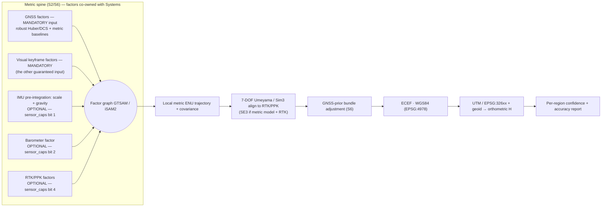
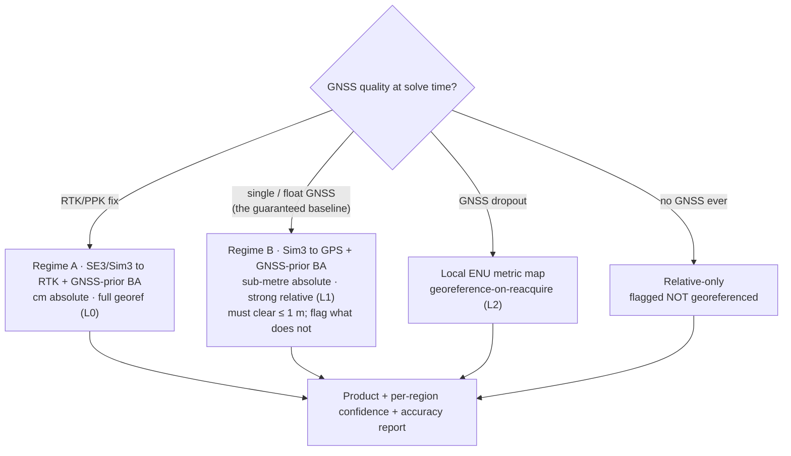

# DRISHTI — Role: Geospatial & Accuracy Research

**Purpose:** Define the mandate, methods, and honest accuracy contract for the person who owns
DRISHTI's **geospatial correctness and its accuracy story** — the Global Navigation Satellite System
(GNSS) / Real-Time Kinematic / Post-Processed Kinematic (RTK/PPK) factors and trajectory-to-world
alignment that feed stages **S2/S6**, stage **S9** georeferencing and the Digital Surface / Terrain
Model (DSM/DTM) and orthomosaic products, the accuracy-validation methodology on which the National
Technical Research Organisation (NTRO) evaluation turns, and Coordinate Reference System (CRS) / format
correctness.

**Audience:** the Geospatial & Accuracy Research owner and their teammates; the peers who hand data in
and take it onward — the [3D Reconstruction Lead](1-3d-reconstruction-lead.md), the
[Drone & Sensor / Hardware Integration](4-drone-sensor-hardware-integration.md) role, the
[AI / Deep Learning](3-ai-deep-learning-research.md) and
[Systems & Edge / Compute](6-systems-edge-compute-optimization.md) roles; and NTRO technical evaluators
and hackathon judges who need to know exactly *how* a "metric, georeferenced model without extensive
Ground Control Points (GCPs)" is measured, where it holds, and where it does not.

## TL;DR

- This role owns **geospatial correctness + the accuracy story**: the GNSS/RTK/PPK factors and
  trajectory-to-world alignment contributing to S2/S6, S9 georeferencing + DSM/DTM/orthomosaic +
  measurements, the accuracy-validation methodology, and CRS/geoid/format correctness. The metric-spine
  *software* (factor-graph runtime, edge execution) is **co-owned with Systems**; the raw GNSS
  *hardware* (receiver, antenna, lever-arm, RTK link, time sync) belongs to the **Hardware** role.
- **"Metric without GCPs" is honest, not magic.** Scale comes from **GNSS baselines plus visual
  structure** — the two things the official input contract actually guarantees — with the Inertial
  Measurement Unit (IMU) and barometer folded in as *optional* reinforcements where the aircraft carries
  them; the datum comes from GNSS(+RTK/PPK). We report **two regimes**: **(A) RTK/PPK ≈ centimetre-level**
  and **(B) GPS-only ≈ sub-metre**, and **regime B is the guaranteed baseline**, because RTK/PPK is an
  optional input (ADR-16 in [Design Decisions](../05-DESIGN-DECISIONS.md)) — never GCP-grade survey
  accuracy for free from plain GPS (see the honesty guardrails in
  [`PROBLEM_STATEMENT`](../_internal/PROBLEM_STATEMENT.md) §4).
- **The official bar this role is accountable for is ≤ 1 m spatial accuracy**, produced inside
  **< 15 minutes for a 10-minute video**, over the *entire visible scene*. Regime B has to clear ≤ 1 m on
  plain GPS; regime A clears it with margin. Any region whose expected error exceeds 1 m is **flagged in
  the accuracy report**, never averaged into a headline number — that flagging *is* part of the
  deliverable, not an excuse for missing the bar.
- **On the official rubric this role carries the heaviest single weight:** reconstruction accuracy **30%**
  and model completeness **20%** are measured by the methodology in §4, and the accuracy & confidence
  report is how those fifty marks get evidenced rather than asserted.
- **The exports are a checklist, not a preference.** LAS · GeoTIFF · OBJ · PLY · glTF/GLB · `.fbx`, each
  CRS-tagged and datum-checked, plus **both** a web viewer and a desktop viewer (§6) — the brief names all
  of it, so all of it ships.
- **Every elevation is converted ellipsoidal → orthometric** via a geoid model (H = h − N), and **every
  product is tagged with its European Petroleum Survey Group (EPSG) code, vertical datum, geoid, and
  sensor regime**. Mishandling this silently injects tens-of-metres of error — the Indian geoid
  undulation reaches roughly −100 m in the south.
- **Accuracy is validated, not asserted:** American Society for Photogrammetry and Remote Sensing
  (ASPRS) Edition-2 checkpoint Root-Mean-Square Error (RMSE), scale-bar relative accuracy, Ground
  Sampling Distance (GSD), coverage %, and cloud-to-cloud / cloud-to-mesh / Chamfer distance against a
  COLMAP / Metashape / LiDAR reference. Our figures are **design targets to be measured**; external
  figures are quoted **as reported**.
- **Every product carries per-region confidence + an accuracy & confidence report** (PDF + JSON). The
  honest uncertainty report is itself a **differentiator** — no consumer photogrammetry tool exposes
  per-region trust.
- **Graceful degradation:** georeference-on-reacquire after GNSS dropout (reliability ladder **L2**); a
  clearly-labelled local East-North-Up (ENU) frame with relative-only products when GNSS was poor —
  never silent wrong coordinates.

> The pipeline (tiers, stages S0–S10, model choices, the metric and reliability spines) is defined once
> in [`CANONICAL-ARCHITECTURE-SPEC`](../_internal/CANONICAL-ARCHITECTURE-SPEC.md). This document is the
> geospatial-and-accuracy view of that pipeline and conforms to it; it does not re-derive it.

---

## 1. Mandate & scope

**Mission (one line):** *Turn the fused camera trajectory and reconstruction into a correctly
georeferenced, measurable product — and prove, with numbers against independent checkpoints, exactly how
accurate it is and where it is not.*

This role is the guardian of anchor **A2 — the metric spine** as it touches the ground truth of the
Earth, and of the accuracy-reporting half of anchor **A4 — the reliability spine**. It converts a
reconstruction that is internally metric into one that is *externally correct* in a named datum, and it
is accountable for the accuracy claims DRISHTI makes to NTRO.

**Owned by this role.**

| Area | Stage(s) | This role delivers |
|------|----------|--------------------|
| GNSS/RTK/PPK factors + trajectory-to-world alignment | S2 / S6 (contributing) | Georeferenced, datum-aligned trajectory with covariance; the alignment math (Sim3/SE3 + GNSS-prior bundle adjustment) |
| Georeferencing & geospatial products | **S9** | Target-CRS transform, orthometric heights via geoid, DSM/DTM, true orthomosaic, measurements, semantic-layer propagation |
| Accuracy validation | S9 → report | Checkpoint RMSE, relative/scale-bar, GSD, coverage, cloud-to-cloud/mesh vs reference, georef correctness |
| Formats / CRS correctness | S9 / S10 (contributing) | EPSG + vertical datum + geoid embedded in every LAS/LAZ, Cloud-Optimized GeoTIFF (COG), 3D Tiles, CityJSON, GeoJSON |
| The **accuracy & confidence report** | S10 | PDF + JSON deliverable (§5) |

**Boundaries — what this role does *not* own.**

- **The metric-spine software** — the Visual-Inertial Odometry (VIO) front-end, the GTSAM/iSAM2
  factor-graph runtime, edge deployment and real-time scheduling — is **co-owned with**
  [Systems & Edge / Compute](6-systems-edge-compute-optimization.md). This role owns *which geospatial
  factors and alignment transforms* enter the graph and *how covariance flows to the report*; Systems
  owns *how that graph runs* on the Edge Tier. S6 is a co-owned handshake with the
  [3D Reconstruction Lead](1-3d-reconstruction-lead.md), whose bundle adjustment we constrain with GNSS
  priors.
- **The raw GNSS hardware** — receiver, antenna, RTK-via-NTRIP link, PPK raw-observation logging, the
  camera-to-antenna lever arm and boresight, and frame-to-GNSS-time synchronisation — belongs to the
  [Drone & Sensor / Hardware Integration](4-drone-sensor-hardware-integration.md) role. We *consume* a
  time-stamped, lever-arm-corrected position stream with a fix-quality flag; we do not build the sensor
  or measure the lever arm. Their sync-error budget (position error ≈ sync_error × ground_speed) is an
  input assumption to our accuracy budget.
- **Semantic labels** are produced upstream by [Computer Vision & Video
  Intelligence](2-computer-vision-video-intelligence.md); we *propagate and rasterise* them into
  georeferenced layers, we do not classify pixels.

---

## 2. The metric spine, geospatial view

This section is the honest core of the whole submission: how a single pass becomes metric and
georeferenced **without a GCP network**. It cites the spine defined in
[`CANONICAL-ARCHITECTURE-SPEC`](../_internal/CANONICAL-ARCHITECTURE-SPEC.md) §4 and §6.

**Where scale comes from.** A single monocular pass is scale-ambiguous — one flight line gives short
baselines, a forward-motion epipole, and near-degenerate triangulation, so scale cannot be solved from
imagery alone. It is *injected* from sensors — and the official input contract decides which sensors we
are allowed to count on. **GNSS baselines are the mandatory, always-present metric ruler:** consecutive
camera centres separated by a known distance in a known datum fix the scale of the visual structure
between them. Where the aircraft also carries an IMU — an **optional** input — on-manifold pre-integration
(Forster et al.) adds a second, independent scale observation *and* a gravity direction, which tightens
the solve and levels the frame for free. Where it does not, there is **no gravity vector at all**: the
frame is levelled from the GNSS track and the structure itself, vertical uncertainty is correspondingly
wider, and the accuracy report says which of the two happened. Either way, this is what removes the
monocular scale ambiguity that photogrammetric self-calibration cannot resolve on one strip — and it is
why keyframing is asked to harvest heading and altitude variation
([Computer Vision](2-computer-vision-video-intelligence.md) §3.1): a perfectly straight, constant-height
pass weakens the GNSS-baseline geometry and the self-calibrated focal length together.

**Where the datum comes from.** The local metric solution is aligned to the Earth via GNSS(+RTK/PPK).
The camera-centre trajectory is fit to the RTK/PPK positions with a **7-degree-of-freedom (7-DOF)
Umeyama / Sim3** alignment (rotation, translation, scale) — or a rigid **SE3** when a metric
feed-forward model plus RTK already fixes scale — and then tightened with **GNSS-prior bundle
adjustment**, where GNSS positions enter the bundle adjustment as soft (or hard) pose priors that keep
the otherwise ill-conditioned single-pass network stable. Classical free-network bundle adjustment,
which relies on 70–80% cross-strip overlap, would drift or collapse here.

**Robustness.** GNSS is noisy and can be spoofed or multipath-corrupted, so the graph uses **robust
kernels (Huber / Dynamic Covariance Scaling, DCS)** and explicit **GNSS outlier rejection**; RTK *float*
(as opposed to *fix*) is detected from the fix-quality flag and down-weighted or deferred to PPK. The
posterior **covariance** from the graph is not discarded — it is carried through S6 into the per-region
confidence and the accuracy report (§4, §5).

**How this replaces GCPs — and where it falls short.** Direct georeferencing from RTK/PPK camera
centres plus the lever arm substitutes for both the missing multi-view constraints *and* the GCP
network: each frame's projection centre is known in an absolute CRS to centimetres. External no-GCP
studies (Forlani et al. 2018; Taddia et al. 2019; Stroner et al. 2020) report **≈1–3 cm horizontal and
≈2–7 cm vertical RMSE** *as reported*, on RTK aircraft. But the honesty policy is non-negotiable:

- **Vertical is the weak axis.** A systematic vertical bias of **10–30 cm** from residual
  boresight/lever-arm and geoid error is common with zero GCPs. One ground checkpoint, or a precise
  local geoid plus a calibrated boresight, is effectively required to reach sub-decimetre vertical. We
  say so, and we budget for it.
- **GPS-only is regime B — and regime B is the default, because RTK/PPK is an optional input.** With
  plain single-frequency GPS the alignment degrades to a Sim3 fit against metre-level positions:
  **sub-metre absolute** (design target H 0.5–2 m, V 0.8–2.5 m per spec §12), with decimetre-level
  *relative/local* accuracy preserved by the visual geometry — and by the IMU where one is fitted. Read
  that against the official **≤ 1 m** bar: the horizontal target sits inside it, the vertical target's
  upper end does **not**, which is exactly why per-region flagging and the vertical-bias line above are
  load-bearing rather than decorative. This is useful and honest — it is not centimetre survey accuracy,
  and we never label it so.
- **Video, not survey stills.** Rolling shutter and H.264/H.265 compression cap sub-pixel feature
  accuracy, so centimetre claims transferred from still-photo studies must be re-validated on the actual
  codec and sensor.

---

## 3. S9 georeferencing & products

S9 (see [`CANONICAL-ARCHITECTURE-SPEC`](../_internal/CANONICAL-ARCHITECTURE-SPEC.md) §3, §9) takes the
optimized poses, cloud, mesh, and semantic labels and produces the georeferenced, measurable
deliverables.

**Transform to the target CRS.** Geometry is solved in a gravity-aligned local ENU `map` frame, anchored
to Earth-Centered Earth-Fixed (ECEF, EPSG:4978) and geographic World Geodetic System 1984 (WGS84,
EPSG:4326), then projected to the correct **Universal Transverse Mercator (UTM)** zone. India spans
**EPSG:32642–32646 (WGS84 / UTM 42N–46N)**; UTM keeps scale distortion below 1:1000 within a 6-degree
zone. Transforms use PROJ 9 / pyproj with the full Well-Known-Text (WKT2) CRS string preserved. For
centimetre work the datum *realisation and epoch* matter — an International Terrestrial Reference Frame
(ITRF) realisation versus a plain WGS84 label, plus plate motion, can differ at the centimetre level, so
the epoch is recorded, not assumed.

**Ellipsoidal versus orthometric height (why it matters).** GNSS returns **ellipsoidal** height `h`;
every deliverable and every volume/slope measurement needs **orthometric** height `H` (height above the
geoid, i.e. mean-sea-level-like). The conversion is **H = h − N**, where `N` is the geoid undulation from
a geoid model — **EGM2008** globally, or a **national Indian geoid grid** where available (better,
few-cm to decimetre regionally). Skipping this is the single most catastrophic silent error in naive
pipelines: Indian geoid undulation ranges from roughly +85 m to **−100 m** in the south, so an
uncorrected model is wrong in Z by tens of metres — dwarfing any centimetre target. GeographicLib
`GeoidEval` / PROJ pipelines perform the conversion; the geoid model name is embedded in every product.

**NavIC / IRNSS note.** In the Indian theatre, multi-constellation GNSS should include **NavIC
(Navigation with Indian Constellation) / IRNSS (Indian Regional Navigation Satellite System)** alongside
GPS/GLONASS/Galileo/BeiDou. NavIC improves satellite availability and geometry over India and adds a
sovereign, harder-to-deny signal source — relevant for border/strategic missions and for anti-jamming
resilience — provided the receiver (Hardware role) exposes it.

**What S9 produces.**

- **Propagate semantic labels** (building/roof, road/infra, vegetation, terrain, obstacle) from the
  keyframe label maps onto the mesh and cloud, and out to vector layers.
- **Rasterise DSM and DTM.** The DSM is the top-surface elevation (roofs, canopy); the DTM is
  bare-earth after filtering vegetation and structures (PDAL ground classification). Both are float32
  COG GeoTIFFs with embedded CRS and vertical datum.
- **Render a true orthomosaic** — an orthorectified, top-down basemap using the DSM (not a simple
  nadir mosaic), so building tops and terrain are correctly placed.
- **Compute measurements** — distances, areas, volumes (with a defined base plane), heights, slopes,
  and clearances — each returned with a confidence interval and flagged if it touches low-confidence,
  once-seen, or occlusion-completed geometry.

---

## 4. Accuracy validation methodology

This is the crux of the NTRO evaluation: DRISHTI must **quantify and certify** GCP-free accuracy against
a recognised standard rather than assert it. Everything here maps to the **official weighted evaluation
criteria** — reconstruction accuracy **30%**, model completeness **20%**, processing speed **20%**,
innovation **15%**, scalability **10%**, user interface **5%** — quoted verbatim in
[`PROBLEM_STATEMENT`](../_internal/PROBLEM_STATEMENT.md) §1a, to the hard targets of **≤ 1 m spatial
accuracy** and **< 15 minutes for a 10-minute video**, and to the accuracy budget in
[`CANONICAL-ARCHITECTURE-SPEC`](../_internal/CANONICAL-ARCHITECTURE-SPEC.md) §12. The first two rubric
lines — half the total marks — are measured by this section, which is why the methodology is specified
before the numbers are.

**Absolute accuracy — checkpoint RMSE (ASPRS Edition 2, 2023).** Horizontal radial RMSE (RMSEr) and
vertical RMSE (RMSEz) are computed against **independent, higher-accuracy checkpoints** — points *not*
used in the solution, ideally ≥20–30 well-distributed and ~3× more accurate than the product. Accuracy
is reported at the **95% confidence level**: horizontal 95% = RMSEr × **1.7308**, vertical 95% = RMSEz ×
**1.96**. RMSE assumes systematic bias has been removed, so any residual bias (the vertical offset of
§2) is estimated and reported separately, and H and V are always reported separately with the CRS,
geoid, and epoch documented.

**Relative accuracy — known-distance / scale-bar.** Independent of the datum, we measure error over
known distances (a surveyed scale bar or two checkpoints of known separation) and report local RMSE and
percentage-of-distance error. This isolates the *shape* correctness (regime B can be poor absolute but
strong relative).

**GSD — from AGL and sensor geometry.** GSD ≈ (Above-Ground-Level altitude × pixel pitch) / focal
length; it is computed per region and reported, since it bounds the finest resolvable detail (design
target ≈1.5–3 cm/px, ~2 cm/px at 80 m AGL).

**Completeness / coverage.** We report the **percentage of target surface reconstructed above a
confidence threshold**, plus the **occlusion-flagged area** (backsides, grazing-angle facades, holes).
Per-region confidence is derived from bundle-adjustment covariance, ray convergence angle (flag <5–10°),
observing-ray count (flag <3), and local GSD — the same fields the report exposes. Single-pass accuracy
is intrinsically heterogeneous, so uniform coverage is never claimed.

**Quality versus a reference model.** Against an independent reference (COLMAP / GLOMAP, Agisoft
Metashape, or LiDAR) we compute **cloud-to-cloud (C2C)**, **cloud-to-mesh (C2M)**, and **Chamfer
distance** (CloudCompare, including M3C2 for signed distances), and report distance percentiles rather
than a single number. This is the "quality vs reference" criterion the judges will run.

**Georeferencing correctness.** Absolute position error of known features, plus an automated check that
the **EPSG code, vertical datum, and geoid model** are correct and consistent across every product —
the class of error that silently costs tens of metres.

**Criterion → measurement → target (regimes A vs B).**

| # | Criterion | Official weight it evidences | How measured | Target — A: RTK/PPK · B: GPS-only |
|---|-----------|------------------------------|--------------|-----------------------------------|
| 1 | **Absolute geometric accuracy — the official ≤ 1 m bar** | **30%** — reconstruction accuracy | H & V RMSE vs independent checkpoints; ASPRS Ed.2 95% (H×1.7308, V×1.96) | A: H 3–8 cm, V 5–12 cm (+1×GSD) · B: H 0.5–2 m, V 0.8–2.5 m, with CI — **every region projected above 1 m is flagged, never averaged away** |
| 2 | Relative accuracy | 30% (same rubric line) | Known-distance / scale-bar error; local RMSE | A: <1% of distance · B: report measured dm-level value |
| 3 | GSD | 30% (it bounds 1 and 2) | cm/px from AGL & sensor geometry | ~1.5–3 cm/px (~2 cm/px @ 80 m AGL), both regimes |
| 4 | Completeness / coverage — *entire visible scene* | **20%** — model completeness | % surface above confidence threshold; occlusion-flagged area | Maximise; **explicitly report** unseen, low-confidence and occlusion-*inferred* regions |
| 5 | Reconstruction fidelity | 20% (same rubric line) | Point density (pts/m²), hole ratio, texture sharpness | Quantitative + qualitative panel (feeds report; geometry owned by Recon Lead) |
| 6 | Quality vs reference | evidence for both 30% and 20% | C2C, C2M, Chamfer / M3C2 vs COLMAP / Metashape / LiDAR | Minimise distance; report percentiles |
| 7 | End-to-end processing time | **20%** — processing speed | Stopwatch on a 10-minute clip plus the per-stage breakdown, printed in the report | **< 15 min**; report the measured number even when we miss it (co-owned with [Systems](6-systems-edge-compute-optimization.md)) |
| 8 | Georeferencing + export correctness | 5% — usability of the outputs | Position error of known features; automated EPSG + vertical datum + geoid check across **every** exported product | Within budget; correct EPSG + geoid in every LAS / GeoTIFF / OBJ / PLY / glTF / `.fbx` / 3D-Tiles / CityJSON payload, both regimes |

All figures in the A/B columns are **design targets to be measured against checkpoints**, consistent
with spec §12 and always read against the official ≤ 1 m bar; external comparisons are quoted **as
reported** by their authors.

---

## 5. The accuracy & confidence report deliverable

The report is a first-class deliverable (Desired Output #8), owned end-to-end by this role, and it is
where the honesty policy becomes a concrete artifact rather than a slogan.

**Contents.**

- **Absolute accuracy:** horizontal and vertical RMSE and 95% values, per checkpoint and aggregate,
  with the estimated systematic bias called out separately.
- **Relative accuracy:** scale-bar / known-distance results.
- **GSD** map/summary from AGL and sensor geometry.
- **Coverage %** above the confidence threshold, and the **occlusion / low-confidence map**.
- **Per-region confidence** raster (from covariance, convergence angle, ray count, GSD).
- **Quality-vs-reference** distances (C2C/C2M/Chamfer percentiles) when a reference is available.
- **CRS / datum / geoid used** (EPSG, WKT2, vertical datum, geoid model, epoch/ITRF realisation).
- **Sensor regime A/B** and reliability-ladder level (L0–L6) at solve time, plus GNSS fix quality and
  any RTK-float spans.
- **Which sensors were actually present** — the `sensor_caps` set handed up by S0 (IMU · barometer ·
  RTK/PPK · operator intrinsics) and whether intrinsics were *measured* or *self-calibrated*. Two runs
  with the same headline RMSE are not comparable if one flew with an IMU and the other did not, so the
  report states which configuration produced the number.
- **Conformance against the official targets** — a short verdict block: measured accuracy **against the
  ≤ 1 m bar** including the percentage of surface above it, coverage of the visible scene, end-to-end
  wall-clock **against the < 15 min / 10-minute-video ceiling** with the per-stage breakdown, and the list
  of formats exported. This is the page an evaluator scoring the rubric reads first.

**Format.** A human-readable **PDF** (the certificate an evaluator reads) and a machine-readable
**JSON** (the same numbers, consumable by the measurement API and by downstream Geographic Information
System / digital-twin tooling). Both are emitted by S10 and referenced in the reproducible project
bundle so any figure can be re-derived.

**Why this is a differentiator.** Off-the-shelf photogrammetry (Pix4D, DJI Terra, Metashape,
OpenDroneMap) reports a *single global accuracy number* — or none — and typically needs GCPs to certify
it. On single-pass video those tools either fail to converge or return a plausible-looking but
*unvalidated* model. An **ASPRS-compliant, per-region, self-reported confidence** product tells a
measurement user *which parts to trust* — the difference between a model an analyst can safely act on for
infrastructure inspection or mission planning and one that hides its own uncertainty. An honest
uncertainty report is not a weakness we disclose; it is the capability we sell.

---

## 6. Geospatial formats & interoperability

Every output is open, georeferenced, and directly consumable in QGIS, CesiumJS, and digital-twin
platforms — with the CRS, vertical datum, and geoid embedded, never implied.

| Product | Format | Notes |
|---------|--------|-------|
| Dense point cloud | **LAS 1.4 / LAZ / COPC** (Cloud-Optimized Point Cloud) | CRS in the georeference VLR; COPC streams; classified (ground/veg/building) |
| DSM / DTM | **COG GeoTIFF** (float32) | Embedded CRS + vertical datum; streamable to web clients |
| True orthomosaic | **COG GeoTIFF** | Orthorectified via DSM |
| Textured mesh (multi-LOD) | **glTF/GLB, OBJ+MTL, PLY, `.fbx`, OGC 3D Tiles 1.1** | 3D Tiles boundingVolume + metadata carry CRS; PLY carries per-vertex confidence; `.fbx` is written by **headless Blender out-of-process**, so its GPL never links into our binary (ADR-17) |
| Building models | **CityJSON 2.0** (CityGML 3.0 data model) | LOD building layers for planning / twins |
| Semantic vector layers | **GeoJSON / Shapefile** | building/roof, road/infra, vegetation, terrain, obstacle |
| Visualization | **Web viewer** — CesiumJS + Potree over 3D Tiles / COPC; **desktop viewer** — QGIS for the geospatial layers, CloudCompare for cloud/mesh inspection | The brief asks for "web-based **or** desktop viewer"; we ship **both**, because an air-gapped deployment cannot assume a browser stack and a tile server are reachable |

**The official required format set is a checklist, not a preference.** The brief names **OBJ, PLY, LAS,
GeoTIFF, .glb/.gltf and .fbx**, and this role owns the georeferenced half of it: **LAS 1.4 / LAZ** for
the cloud, **COG GeoTIFF** for DSM/DTM/ortho, and CRS-correct **glTF/GLB · OBJ · PLY · `.fbx`** for the
mesh. All six are exported for the demo and swept by the datum-conformance test; the richer formats above
(COPC, 3D Tiles 1.1, CityJSON, GeoJSON) are additions on top of that set, never substitutes for it.

**Toolchain (adopted).** PROJ 9 + pyproj and GeographicLib for CRS transforms and geoid evaluation; GDAL
for raster (COG) I/O; PDAL for point-cloud reproject/classify/tile; LAStools / Entwine for LAS/LAZ
tiling; py3dtiles + CesiumJS and Potree for 3D Tiles and point-cloud web serving; **QGIS + CloudCompare
as the desktop viewer pair**; and **headless Blender (`bpy`) invoked as a subprocess** for `.fbx`. The
last two are GPL, so both run **out-of-process and are never linked** — the mechanism ADR-17 in
[Design Decisions](../05-DESIGN-DECISIONS.md) adopts to ship a required format without taking on its
licence. These match the Geospatial I/O and viewer choices in
[`CANONICAL-ARCHITECTURE-SPEC`](../_internal/CANONICAL-ARCHITECTURE-SPEC.md) §7 — no alternative names are
introduced.

---

## 7. Adopted stack & key decisions

Compact view of the tools this role owns or co-owns; rationale and trade-offs live in
[Technology Stack](../03-TECHNOLOGY-STACK.md) and [Design Decisions](../05-DESIGN-DECISIONS.md).

| Concern | Adopted | Notes / alternatives |
|---------|---------|----------------------|
| Geodesy / CRS / geoid | PROJ 9 + pyproj, GeographicLib; geoid = EGM2008 or Indian national grid | WKT2 CRS + vertical datum embedded everywhere |
| Trajectory-to-world alignment | Umeyama 7-DOF (Sim3) / SE3 via evo/scipy; GNSS-prior bundle adjustment | Sim3 for GPS-only, SE3 for metric model + RTK |
| Geospatial factors in fusion | GTSAM 4.2 (BSD) + iSAM2 — **GNSS and visual factors are always instantiated; IMU, barometric and RTK/PPK factors only when `sensor_caps` says that sensor exists** — **co-owned with Systems** | Ceres / g2o; robust Huber / DCS |
| PPK post-processing | RTKLIB (demo5 fork) against base/CORS RINEX | link-independent metric anchor (Hardware logs raw obs) |
| Point clouds / tiling | PDAL + Entwine; LAStools → LAS 1.4 / LAZ / COPC | classification, reproject, cloud-optimize |
| Rasters (DSM/DTM/ortho) | GDAL → Cloud-Optimized GeoTIFF | float32; embedded CRS |
| Accuracy validation | CloudCompare (C2C / C2M / M3C2); custom ASPRS-Ed.2 checkpoint RMSE; QGIS | percentile reporting; checkpoint management |
| 3D / web delivery | py3dtiles + CesiumJS (OGC 3D Tiles 1.1); Potree; CityJSON 2.0 | digital-twin ingestion |

**Key decisions.** (1) *Inject scale and datum from sensors, never solve them from single-pass imagery* —
with **GNSS as the required source and IMU / baro / RTK as optional reinforcements** (ADR-16), because
that is the input contract the brief actually guarantees. (2) *Report two regimes (A/B) and a per-region
confidence, never one global number* — both read against the official **≤ 1 m** bar, with every region
that exceeds it flagged. (3) *Always convert to orthometric height and always embed CRS + geoid* — datum
safety is validated at startup and the pipeline refuses to silently mix datums. (4) *Ship the official
format set and both viewers* (ADR-17): LAS · GeoTIFF · OBJ · PLY · glTF/GLB · `.fbx`, with the GPL writer
and the desktop viewer running **out-of-process**. (5) *Favour permissive licensing* — GTSAM is BSD;
RTKLIB, PROJ, GDAL, PDAL and Entwine are permissive — so nothing in this role's own stack is a
deployability problem for a customer whose application list includes military reconnaissance; the model
licensing story is tracked with the [AI / Deep Learning](3-ai-deep-learning-research.md) role.

---

## 8. Reliability & confidence

Georeferencing degrades gracefully along the reliability ladder in
[`CANONICAL-ARCHITECTURE-SPEC`](../_internal/CANONICAL-ARCHITECTURE-SPEC.md) §5; this role owns the
geospatial half of that ladder and the residual reporting.

- **Georeference-on-reacquire (L2).** On GNSS dropout (urban canyon, jamming, denied environment) the
  factor graph bridges the gap and holds a **local metric ENU** map. *With* an IMU it dead-reckons on
  pre-integrated inertial motion plus VIO — the strong case. *Without* one — the mandatory-only capture —
  it dead-reckons on **visual odometry plus the metric-depth scale prior alone**, which drifts faster and
  has no gravity anchor, so the bridged span carries a visibly wider uncertainty envelope and a long
  dropout forces the L3/L4 rungs sooner. When GNSS returns, the `map`→`earth` transform re-anchors via new
  global factors and the trajectory is re-georeferenced — in both cases no data is discarded and the gap
  is flagged as higher-uncertainty rather than smoothed over.
- **Poor GNSS → relative-only, clearly labelled.** If GNSS was never good enough, products ship in a
  local ENU frame with `is_georeferenced = false` and an explicit **"relative scale, not
  georeferenced"** label, so a downstream tool shows *relative* measurements rather than silently
  presenting wrong absolute coordinates.
- **How georef residuals are reported.** Alignment residuals (Sim3/SE3 fit RMS), GNSS-factor residuals
  after robust rejection, RTK-float spans, and the estimated systematic vertical bias are all written to
  the accuracy report and to the per-product provenance — the operator sees *trust*, not a bare number.

---

## 9. Hackathon MVP responsibilities

On the dataset provided at the event, this role delivers the georeferencing-and-accuracy slice of the
MVP defined in [`CANONICAL-ARCHITECTURE-SPEC`](../_internal/CANONICAL-ARCHITECTURE-SPEC.md) §11 and
[Integration](../04-INTEGRATION.md) §10:

1. **Georeference the reconstructed model to UTM.** Take the fused poses/cloud/mesh from the
   [3D Reconstruction Lead](1-3d-reconstruction-lead.md), align the trajectory to the GPS track
   (Sim3/SE3 + GNSS-prior bundle adjustment), project to the correct UTM zone, and convert to
   orthometric height with EGM2008 — with EPSG + geoid embedded in every output.
2. **Produce DSM + true orthomosaic** (COG GeoTIFF) and a classified LAS/LAZ cloud, plus basic
   measurements (area/volume/height).
3. **Run the accuracy report versus a COLMAP / Metashape reference** on the provided dataset —
   C2C/C2M/Chamfer percentiles, checkpoint RMSE where checkpoints exist, GSD, and coverage % — emitted
   as PDF + JSON.
4. **Demo both accuracy regimes** by toggling RTK versus GPS-only (inject GPS noise), showing regime A
   (centimetre) versus regime B (sub-metre) side by side with the per-region confidence map — the
   graceful-degradation and honesty story made visible to judges. **Regime B is the one to run first**,
   because video + GPS + flight metadata is the only configuration the event dataset is guaranteed to
   have; state its measured error against the **≤ 1 m** bar explicitly, with the over-1 m regions
   highlighted on the map rather than buried in an average.
5. **Export the full official format set and open it in both viewers.** LAS/LAZ, COG GeoTIFF (DSM +
   ortho), OBJ, PLY, glTF/GLB and `.fbx` — each loaded once in the web viewer (CesiumJS / Potree) and once
   on the desktop (QGIS + CloudCompare) as a conformance check, with the EPSG/datum/geoid test swept over
   all of them.
6. **Put a stopwatch on it.** Record wall-clock end-to-end on the 10-minute clip with the per-stage
   breakdown, and print it in the report beside the **< 15 min** ceiling — including when we miss it.

---

## Open questions / risks

- **Vertical accuracy without a checkpoint.** A systematic ~10–30 cm vertical bias
  (geoid/lever-arm/boresight) is the single biggest metric risk with zero GCPs; one checkpoint or a
  precise local geoid + calibrated boresight is effectively required for sub-decimetre vertical. The
  honest GPS-only budget stays sub-metre horizontally, but its **vertical upper bound (2.5 m) sits above
  the official ≤ 1 m bar** — vertical is therefore where that bar is won or lost, and where the flagging
  has to be most aggressive.
- **No IMU means no gravity prior, and vertical is what pays for it.** On the mandatory-only capture the
  frame is levelled from the GNSS track and the structure rather than from inertia, so a slow tilt in the
  solved frame turns directly into a height ramp across the scene — and GNSS height is itself the weakest
  GNSS component (roughly 1.5–2× the horizontal error). Mitigations in hand: barometric height where a
  baro exists, the metric-depth prior as an independent vertical scale check, ground-plane fitting over
  detected terrain, and honest per-region vertical confidence. Whether that holds ≤ 1 m vertically with no
  IMU is **unmeasured**, and it is the first thing to test on the provided dataset.

- **Geoid quality in Indian border/strategic regions.** EGM2008 versus a national geoid can differ by
  decimetres; a local grid should be sourced where the theatre demands it. Datum realisation/epoch (ITRF
  vs WGS84) matters at the centimetre level.
- **Video-derived accuracy.** Rolling shutter + H.264/H.265 compression cap sub-pixel accuracy, so
  centimetre claims from still-photo studies must be re-validated on the actual codec/sensor — a
  measurement task, not an assumption.
- **Checkpoint availability at the event.** ASPRS RMSE needs independent, higher-accuracy checkpoints;
  if the provided dataset lacks them, we fall back to scale-bar/known-distance relative accuracy and
  cloud-to-reference distances, and say so explicitly rather than over-claiming absolute accuracy.
- **NavIC receiver exposure.** NavIC/IRNSS benefits depend on the Hardware role's receiver exposing the
  constellation and raw observables; if unavailable, we note the reduced sovereign-signal resilience.
- **GNSS spoofing/jamming in contested areas** can silently corrupt georeferencing; robust/switchable
  GNSS factors plus the VIO-only local-frame fallback are mandatory, and RTK float must be detected and
  down-weighted — flagged here rather than assumed away.
- **Spec conformance.** This document follows the canonical spec's stages, frames, reliability ladder,
  and accuracy budget (§12). No conflicts were found; all A/B accuracy figures are stated as design
  targets to be measured, and external figures as reported.

## Further reading

- [`CANONICAL-ARCHITECTURE-SPEC`](../_internal/CANONICAL-ARCHITECTURE-SPEC.md) — authoritative tiers,
  stages S0–S10, metric spine (§4), coordinate frames (§6), model registry (§7), accuracy budget (§12).
- [`PROBLEM_STATEMENT`](../_internal/PROBLEM_STATEMENT.md) — Desired Output & Evaluation Criteria tables;
  honesty guardrails (§4).
- [Integration](../04-INTEGRATION.md) — coordinate-frame TF tree, time synchronisation, `Keyframe` /
  `MapUpdate` georeference fields, failure handling across boundaries.
- [Theory](../01-THEORY.md) — why single-pass geometry is weak and why sensors supply the metric truth.
- [Technology Stack](../03-TECHNOLOGY-STACK.md) · [Design Decisions](../05-DESIGN-DECISIONS.md) —
  tool choices and rationale.
- Peer roles: [3D Reconstruction Lead](1-3d-reconstruction-lead.md) (S6 co-owned handshake; geometry we
  georeference), [Drone & Sensor / Hardware Integration](4-drone-sensor-hardware-integration.md) (GNSS
  hardware, lever-arm, time sync, PPK logging), [Systems & Edge / Compute](6-systems-edge-compute-optimization.md)
  (metric-spine runtime, co-owned), [Computer Vision & Video
  Intelligence](2-computer-vision-video-intelligence.md) (semantic labels we propagate).
- Standards: ASPRS Positional Accuracy Standards for Digital Geospatial Data, Edition 2 (2023); OGC 3D
  Tiles 1.1; CityJSON 2.0; LAS 1.4 / LAZ / COPC; EGM2008. RTK no-GCP studies (Forlani et al. 2018;
  Taddia et al. 2019; Stroner et al. 2020).
