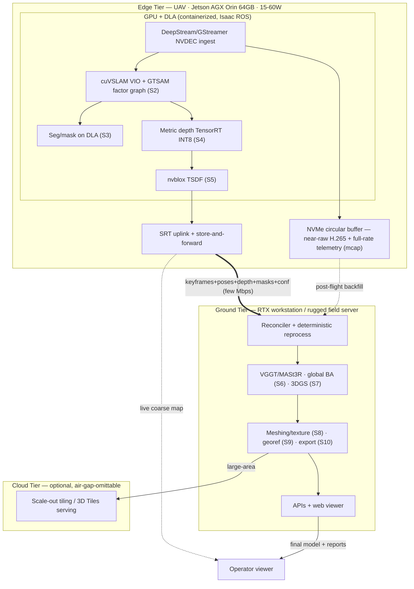
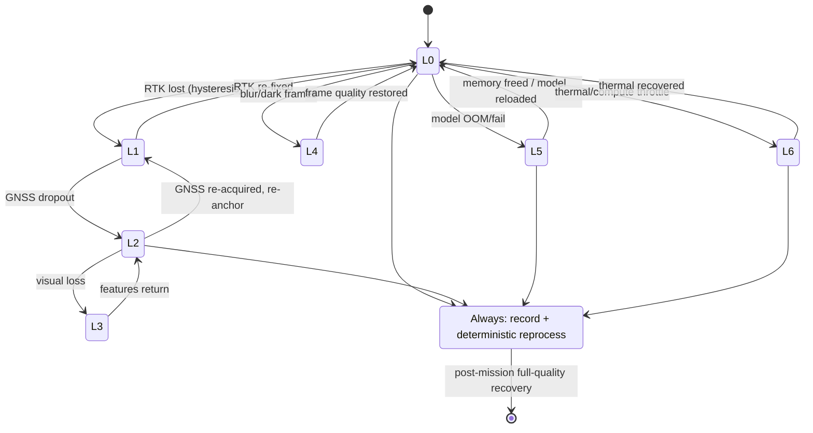

# DRISHTI — Role: Systems & Edge / Compute Optimization

**Purpose:** Define how DRISHTI's architecture becomes a running system — the three-tier runtime, the
middleware and data plane, inference optimization on the edge, streaming transport, and the
reliability spine that makes *"never hard-fails"* a mechanism rather than a slogan.

**Audience:** National Technical Research Organisation (NTRO) technical evaluators and systems
engineers, hackathon judges, and the DRISHTI build team standing up the runtime.

**TL;DR**
- This role owns the **runtime**: realizing the three tiers — Edge Tier (on-Uncrewed-Aerial-Vehicle
  (UAV) NVIDIA Jetson Orin) · Ground Tier (station/server GPU) · Cloud Tier (optional) — plus
  middleware, inference optimization, transport, scheduling, deterministic reprocess, and deployment
  provisioning. It is the **primary owner of the reliability spine (A4) and the tiering**.
- The split is honest about *"real-time"*: the Edge Tier runs the **Live path (S0–S5)** for a
  near-real-time coarse preview; the Ground Tier runs the **Refine path (S6–S10)** for the
  minutes-scale metric textured model. A full 4K textured mesh is **never** produced in hard real-time
  on the UAV.
- The engine is **ROS 2 + Isaac ROS** as the node graph and **DeepStream/GStreamer** as the video
  pipeline (NVDEC → inference → fusion), with **zero-copy** GPU handoff on the Jetson.
- Learned models are made to fit the power/thermal/memory envelope via **TensorRT INT8/FP16**, layer
  fusion, CUDA streams, batching, and **Deep Learning Accelerator (DLA)** offload; a scheduler decides
  which model runs per keyframe versus deferred to ground.
- The **reliability spine (L0–L6)** is engineered from watchdogs, health monitors, timeouts, bounded
  queues, and confidence-gated fallback routing — the system always emits a best-effort model **plus**
  an explicit uncertainty report, and never emits unflagged garbage.
- The **accurate model never depends on the live link**: near-raw recording to onboard Non-Volatile
  Memory express (NVMe) plus **deterministic** ground reprocess (monotonic frame IDs, pinned versions,
  fixed seeds, containerized environment) means nothing is lost and every result is reproducible.
- All latency/throughput figures here are **design targets (to be measured)**, not benchmarked
  results.

> The pipeline (tiers, stages S0–S10, model registry, metric and reliability spines) is defined once
> in [`../_internal/CANONICAL-ARCHITECTURE-SPEC.md`](../_internal/CANONICAL-ARCHITECTURE-SPEC.md).
> This document cites that spec and describes the **runtime engineering** behind it; the
> **interface-level contracts** (message schemas, coordinate frames, API surface) live in
> [Integration](../04-INTEGRATION.md), which this doc references rather than repeats.

---

## 1. Mandate & scope

**Mission.** Turn the DRISHTI architecture into software that runs fast enough on a power-constrained
UAV to be useful in flight, fast enough on the ground to be useful in minutes, and robust enough that
a single-pass mission — where there is no second chance — always yields a usable, honestly-labelled
product. This role is the **runtime and reliability engineer** for the whole system.

**Owns.**
- **Three-tier topology realization** — provisioning the Edge/Ground/Cloud split defined in
  [spec §2](../_internal/CANONICAL-ARCHITECTURE-SPEC.md) as actual hosts, containers, and processes.
- **Middleware & data plane** — the ROS 2 (Robot Operating System 2) node graph, Isaac ROS packages,
  the DeepStream/GStreamer video pipeline, Quality-of-Service (QoS) tuning, and backpressure policy.
- **Inference optimization** — compiling and scheduling the learned models to fit the edge envelope.
- **Streaming & store-and-forward transport** — the live downlink and the guaranteed onboard recording.
- **The reliability spine (L0–L6)** — the graceful-degradation ladder from
  [spec §5](../_internal/CANONICAL-ARCHITECTURE-SPEC.md), realized as watchdogs, health monitors,
  timeouts, and fallback routing. This is the role's signature responsibility.
- **Scheduling & latency budgets, deterministic reprocess, deployment configs, observability.**

**Boundary with the AI / Deep Learning role.** They **supply the models** — architectures, trained
weights, accuracy envelopes, per-pixel confidence heads; this role **makes those models run fast**
under the Jetson's power, thermal, and memory limits (quantization, precision selection, batching,
memory placement, per-keyframe scheduling) and decides *where* each one executes. The dividing line is
"model quality" (theirs) versus "model throughput/latency/placement" (this role's). See
[AI/Deep Learning](3-ai-deep-learning-research.md).

**Boundary with the Drone & Sensor / Hardware role.** They **own the physical box** — aircraft, camera,
gimbal, GNSS/Inertial Measurement Unit (IMU) sensors, the Jetson module selection and its Payload SDK
(PSDK) carrier, power rails, and time-sync wiring; this role **owns what runs on it** — the operating
system image, container stack, node graph, power-mode policy, and thermal watchdog behavior. Physical
lever-arm and clock hardware are theirs; the software that reads a disciplined clock and reacts to
throttling is this role's. See [Drone & Sensor/Hardware](4-drone-sensor-hardware-integration.md).

**Boundary with Integration.** [Integration](../04-INTEGRATION.md) is the *contract* view — the exact
message schemas, topic graph, coordinate-frame tree, time-sync alignment, edge↔ground wire format, and
Application Programming Interface (API) surface. This document is the *engine* view — how the runtime
meets those contracts fast and without failing. Where the two touch, this doc defers to Integration
for the schema and focuses on runtime behavior.

---

## 2. Three-tier runtime realization

The tiers are not abstract layers — they are distinct hosts with distinct power budgets running
distinct workloads. The **Edge Tier** runs everything that must happen while the drone flies; the
**Ground Tier** runs everything that trades latency for accuracy; the **Cloud Tier** is opt-in
scale-out that no mission depends on (air-gap-friendly for defense use, per
[spec §2](../_internal/CANONICAL-ARCHITECTURE-SPEC.md)).

**Edge Tier (on-UAV, NVIDIA Jetson Orin).** Primary target is the **Jetson AGX Orin 64 GB** (248
sparse-INT8 Tera-Operations-per-Second (TOPS), 204.8 GB/s memory bandwidth, 2× DLA, 15–60 W); the
endurance variant is the **Orin NX 16 GB** (117 TOPS, 102.4 GB/s, 1× DLA, 10–40 W). It runs the **Live
path S0–S5**: capture and sync (S0), ingest and frame Quality Assurance (QA) (S1), Visual-Inertial
Odometry (VIO) plus the metric factor graph (S2), lightweight perception/masking (S3), a fast metric
depth model (S4), and incremental Truncated Signed Distance Function (TSDF) fusion via **nvblox** (S5).
Its two products are the live coarse map for the operator and the compact keyframe package for ground.

**Ground Tier (RTX-class workstation or rugged field server).** Runs the **Refine path S6–S10**: global
bundle adjustment with GNSS factors (S6), dense reconstruction and few-shot 3D Gaussian Splatting (3DGS)
(S7), meshing and texturing (S8), georeferencing and semantics (S9), and export/serve (S10). It runs
the heavy feed-forward geometry transformers (VGGT / MASt3R) that do not fit the edge latency budget,
and it reprocesses the recorded stream deterministically.

**Cloud Tier (optional).** Large-area tiling, batch re-processing, and 3D Tiles / digital-twin serving.
Omitted entirely for air-gapped missions.

**Compute / latency budget (design targets, to be measured).** The budget is what forces the two-path
split: the edge must keep pace with capture at low fidelity; the ground earns accuracy with time.

| Tier / host | Stages | Nominal power | Key workloads | Latency target |
|-------------|--------|---------------|---------------|----------------|
| Edge · AGX Orin 64 GB | S0–S5 (Live) | 15–25 W in-flight cap | NVDEC decode; VIO 30–60 Hz; seg on DLA; depth ViT-S INT8 ~15–30 FPS reduced res; nvblox TSDF >30 Hz @ 5–10 cm voxels | Glass-to-glass live preview ~1–3 s/keyframe |
| Edge · Orin NX 16 GB | S0–S5 (Live) | 10–20 W | Same, ~⅓–½ throughput; wider keyframe spacing | Coarser preview; recording unaffected |
| Ground · RTX workstation | S6–S10 (Refine) | wall power | VGGT/MASt3R chunks; GNSS-constrained global BA; 3DGS; meshing/texturing | Minutes after landing (or mid-flight head-start) |
| Cloud · GPU node | tiling / serving | elastic | Batch reprocess, 3D-Tiles LOD | Non-blocking; no mission dependency |

The invariant behind the table: the edge exists to give the pilot in-flight coverage feedback and a
situational-awareness map; the **accurate deliverable is produced on the ground from the recording**,
never from whatever the edge managed under pressure.

---

## 3. Middleware & data plane

DRISHTI's runtime is a **ROS 2 (Humble/Jazzy)** node graph on every host, with NVIDIA **Isaac ROS**
providing the GPU-accelerated perception nodes (cuVSLAM VIO, nvblox TSDF) and **NITROS** negotiated
**zero-copy** transport for GPU-to-GPU handoff on the Jetson's shared memory. Video is a
**DeepStream/GStreamer** pipeline: hardware **NVDEC** decode (`nvv4l2decoder`) → `nvvideoconvert` →
`nvinfer` (TensorRT detector/segmenter on DLA) → `appsink` into the fusion node. Because Jetson has
unified CPU/GPU memory, avoiding host↔device copies is not an optimization but a correctness
requirement for real-time — a single stray memcpy per frame can blow the per-keyframe budget.

**Node graph shape.** Sensor drivers (S0) publish onto the bus; S1–S5 are a chain of nodes with S2
(odometry) and S4 (depth) marked `[E→G]` — they run on both tiers against an **identical message
contract** so the ground can re-solve them at full fidelity. All perception nodes are ROS 2
**lifecycle** nodes (`UNCONFIGURED → INACTIVE → ACTIVE → FINALIZED`) so a supervisor can configure,
pause, restart, and fall back deterministically.

**Message / QoS design (runtime rationale).** The full topic graph and schemas are owned by
[Integration §2](../04-INTEGRATION.md); the runtime concern is *reliability class* and *backpressure*.
High-rate previews use `BEST_EFFORT`/`KEEP_LAST` (a dropped preview frame is harmless); keyframe
metadata, poses, and health use `RELIABLE`. Every inter-node queue is **bounded**, with two policies:
**drop-oldest** on the preview/data path (a slow consumer must never stall capture) and
**spill-to-disk, never drop** on the record path (the recording is the mission's ground truth). Large
payloads — images, depth, masks, pointmaps — travel **by reference** (content-addressed URIs into the
recording), keeping the metadata bus light. This separation of a reliable low-rate control plane from
a loss-tolerant high-rate data plane is detailed in [Integration §7](../04-INTEGRATION.md).

**Time.** All nodes share one monotonic clock per host, disciplined to **GPS time** via `chrony` +
`pps-gpio` (Pulse-Per-Second, PPS) and `linuxptp` (Precision Time Protocol, PTP) across compute nodes,
or **DjiTimeSync** on the DJI path. The runtime's job is to run these as supervised services and to
surface the sync residual as a health signal; the alignment math and the <2–3 ms budget are covered in
[Integration §4](../04-INTEGRATION.md).

**Why ROS 2 over a custom async stack.** ROS 2 gives lifecycle management, typed QoS, a mature Data
Distribution Service (DDS) transport, and — decisively — the Isaac ROS ecosystem (cuVSLAM, nvblox,
NITROS zero-copy) already tuned for Jetson, so this role integrates rather than re-invents real-time
GPU perception. For lossy Wide-Area-Network legs, `rmw_zenoh` bridges drone↔ground↔cloud far better
than DDS multicast discovery. The trade-off analysis (versus a bespoke async + raw-DDS stack) is
recorded in [Design Decisions](../05-DESIGN-DECISIONS.md).

---

## 4. Inference optimization

The learned stack is the reason single-pass reconstruction works (see
[AI/Deep Learning](3-ai-deep-learning-research.md)); making it run inside a UAV power/thermal budget
and Orin's shared 16/64 GB memory is this role's core optimization problem.

**Compilation & precision.** Every model is exported to ONNX and compiled to a **TensorRT** engine with
**layer/tensor fusion** and precision chosen per model: **INT8** for the ViT-S depth and segmentation
nets (≈2–4× throughput over FP16, calibrated on real aerial frames — never on COCO — to bound accuracy
loss), **FP16/BF16** for transformer backbones whose attention is precision-sensitive. INT8 calibration
data quality is a first-class risk: a bad calibration set silently degrades metric depth.

**Parallelism & scheduling on-chip.** **CUDA streams** overlap decode, inference, and fusion;
**batching** groups keyframes where latency allows; **CUDA-graph capture** cuts per-frame launch
overhead. Detection and segmentation are **offloaded to the DLA** (≈40 TOPS on Orin NX, ≈92 across the
AGX's two DLAs) so the main GPU is free for depth and TSDF fusion — the two most latency-critical live
stages. Unsupported layers fall back to the GPU, so DLA op-coverage is validated per model at build.

**Memory management.** On the shared-memory System-on-Chip, NITROS zero-copy avoids multi-GB/s of
redundant host↔device copies; models are sized to co-reside (a ViT-S depth net, a seg net, cuVSLAM, and
nvblox must fit alongside decode buffers within 16 GB on Orin NX). Heavy transformers (VGGT ~1.2 B
params; MASt3R ViT-L) **do not fit the edge latency/VRAM budget** and are deferred to ground or run on
keyframe chunks — long flights are tiled into overlapping windows to bound peak memory.

**Model scheduling — per keyframe vs deferred.** A scheduler assigns each model a cadence so the edge
keeps pace with capture:

| Runs per keyframe (Edge, Live) | Runs deferred (Ground, Refine) |
|--------------------------------|--------------------------------|
| cuVSLAM VIO (frame rate) · blur/exposure QA · light seg on DLA · **metric depth ViT-S INT8 (reduced res)** · nvblox TSDF integration | **VGGT/MASt3R full pointmaps** · global bundle adjustment (BA) with GNSS factors · learned Multi-View Stereo (MVS) where baseline allows · 3DGS · meshing/texturing |

**Accuracy-vs-latency trade curve (design targets, to be measured).** The same geometry problem is
solved twice at two points on the curve; the edge trusts nothing it cannot re-derive.

| Operating point | Model / precision | Resolution | Latency target | Accuracy posture |
|-----------------|-------------------|-----------|----------------|------------------|
| Edge fast | Metric3D-S / DA-V2 ViT-S, INT8 | reduced | ~15–30 FPS (AGX); ~⅓ on NX | Coarse metric depth; confidence-gated into TSDF |
| Edge fallback (L5) | monocular-only, lower LOD | reduced | degrades gracefully | Reduced fidelity, still valid + flagged |
| Ground full | VGGT/MASt3R + INT8→FP16 depth + MVS | full res | seconds/chunk, minutes/mission | Best fidelity; feeds accuracy report |

Precision is dialed per stage against the accuracy envelopes the AI role publishes; this role does not
choose model *architecture*, only its *runtime realization*.

---

## 5. Streaming & store-and-forward transport

The transport layer enforces the honesty policy in wire form: **the live link carries a preview; the
recording carries the truth.** The interface-level wire contract is owned by
[Integration §5](../04-INTEGRATION.md); this section is the transport engineering behind it.

**Live stream to the operator.** A 1080p H.265 proxy plus incremental live-map blocks are streamed over
**SRT (Secure Reliable Transport)** — chosen over plain **RTSP/RTP** because its Automatic Repeat
reQuest + Forward Error Correction (ARQ+FEC) and tunable 120–500 ms recovery buffer ride the lossy
2–20 Mbps Radio-Frequency downlink that RTSP/RTP cannot; AES encryption protects the link. Target
glass-to-glass latency is sub-second to ~1–3 s per keyframe (design target). RTSP remains available as
a low-latency Local-Area-Network fallback for bench and hackathon use.

**Guaranteed onboard recording.** S0 writes **near-raw H.265 (100–150 Mbps @ 4K) plus full-rate
IMU/GNSS/baro/RTK telemetry** to an **NVMe circular buffer** (rosbag2/mcap) with monotonic keyframe IDs
and hardware timestamps, **upstream of all lossy processing** and independent of the radio. Recording
uptime target is 100% regardless of link or compute state. The buffer is sized to the mission and
evicts only after a segment is confirmed forwarded.

**Edge→ground handoff package.** Rather than stream full 4K (20–50 Mbps, infeasible on the RF link),
the edge uplinks a compact **keyframe package**: keyframe image reference, 6-Degree-of-Freedom pose +
covariance, downsampled metric depth, run-length-encoded dynamic + semantic masks, and per-pixel
confidence. This fits a **few Mbps**, well inside the link budget. The package schema is the
`Keyframe` message in [Integration §2](../04-INTEGRATION.md).

**Behavior across an unreliable link.** On link loss the SRT session drops but the **NVMe buffer
persists and recording never stops**; the live preview freezes. On reconnect or after landing, the
recorder **backfills the gap** so the Ground Tier receives a complete, ordered stream. This is the
`Always` row of the reliability ladder — store-and-forward guarantees the accurate model is
recoverable even when the live tier was degraded or dark.

**Transport budget (design targets, to be measured).**

| Path | Payload | Bitrate | Loss posture |
|------|---------|---------|--------------|
| Onboard master (NVMe) | near-raw H.265 + full-rate telemetry | 100–150 Mbps | never lost; spill-to-disk |
| Live proxy (SRT) | 1080p H.265 preview | 2–10 Mbps | ARQ+FEC, freeze-on-loss |
| Keyframe package (SRT) | pose+depth+masks+conf | few Mbps | reliable; backfilled on reconnect |
| Live map (SRT) | incremental TSDF/splat blocks | ~0.5–2 Mbps | best-effort deltas |

---

## 6. The reliability spine (this role's signature)

*"Never fails"* is engineered as an explicit, **monitored graceful-degradation ladder** — not
try/except patching. Every stage emits a confidence signal and has a defined fallback; the system
always emits **(a)** a best-effort model and **(b)** an explicit uncertainty/completeness report, and
**never** crashes silently or emits unflagged garbage (invariant from
[spec §5](../_internal/CANONICAL-ARCHITECTURE-SPEC.md)). This role owns the mechanisms that make the
ladder real: **lifecycle nodes, watchdogs, health monitors, per-stage timeouts, bounded queues,
confidence gating, and fallback routing** — all with **hysteresis** so the system does not flap between
levels.

**How a level transition happens at runtime.** Each node publishes a `HealthStatus` heartbeat (rate,
latency, queue depth, GPU/thermal, GNSS fix, clock residual — see
[Integration §2](../04-INTEGRATION.md)). A supervisor (a behavior-tree/lifecycle manager) watches these
plus DDS deadline/liveliness QoS. When a monitored signal crosses a threshold (held past a hysteresis
window), the supervisor commands the affected nodes to a fallback lifecycle configuration and updates
the active ladder level, which is stamped onto every downstream product. Lifecycle transitions target
tens of milliseconds. A crashed node is restarted by the supervisor plus a hardware/`systemd` watchdog
and **resumes idempotently** from its last checkpoint using the recorded stream.

**The ladder, level by level (from [spec §5](../_internal/CANONICAL-ARCHITECTURE-SPEC.md)).**

| Level | Trigger | Runtime mechanism | Product impact |
|-------|---------|-------------------|----------------|
| **L0** | All sensors nominal, RTK fixed | Full path; confidence gating admits all inputs | Best accuracy (cm-class) |
| **L1** | No RTK/PPK (`gnss_fix_type` < 4) | Continue GNSS+IMU+VIO scale; defer to Post-Processed Kinematic (PPK); flag reduced georef | Sub-metre absolute, strong relative |
| **L2** | GNSS dropout (canyon/denied) | Health monitor sees fix=0 / HDOP spike → VIO+IMU dead-reckon; re-anchor `map`→`earth` on re-acquire | Local metric map; georef on re-acquire |
| **L3** | Brief visual loss | VIO covariance blows up → IMU inertial propagation for the gap | Short gap flagged high-uncertainty |
| **L4** | Bad frames (blur/dark) | S1 sharpness/exposure gate → widen keyframe spacing; mark temporal gaps | Coverage holes flagged, not garbage |
| **L5** | Neural model Out-Of-Memory (OOM)/fail | Watchdog catches node error → fall back to classical MVS / monocular depth; lower Level-of-Detail (LOD) | Reduced fidelity, still valid + flagged |
| **L6** | Edge compute/thermal saturated | Thermal watchdog reads `tegrastats` throttle → point-splat preview; defer meshing to ground | Live preview simpler; refine unaffected |
| **Always** | — | Store-and-forward recording + deterministic ground reprocess | Full quality recoverable post-mission |

**Confidence gating everywhere.** Independently of the ladder, every fusion input is thresholded: low-
confidence depth pixels (from the model's own uncertainty head), high-reprojection-error poses, and
poor-HDOP GNSS are rejected or down-weighted; nvblox per-voxel weighting down-weights once-seen
single-pass surfaces. Each output tile carries a confidence/provenance flag so measurement tools
distinguish trusted from inferred geometry. This is why the system cannot emit *unflagged* garbage — a
weakly-constrained region is emitted **as low-confidence**, not as truth.

**No single point of failure.** The Live path survives a Refine-path or link failure; the accurate
model survives any live failure via the recording; the two tiers fail independently. The failure-mode
mapping across module boundaries is tabulated in [Integration §9](../04-INTEGRATION.md); the state
machine below is the runtime realization.

---

## 7. Deterministic reprocess

Because there is exactly one flight, the accurate model must be **reproducible from the recording**,
not a one-shot artifact of live conditions. This role guarantees that the Ground Tier can **exactly
re-run the mission** from the onboard master.

**Mechanisms.**
- **Monotonic, gap-free frame IDs + hardware timestamps.** Every keyframe is indexed by a monotonic
  `keyframe_id` and its GPS-disciplined capture time, so the reconciler can order and address any frame
  content-addressably.
- **Pinned versions.** Model weights, CUDA/TensorRT/library versions, and pipeline code are pinned and
  recorded in the project bundle; a re-run uses the exact same binaries.
- **Fixed seeds.** Random Number Generator seeds are fixed for every stochastic step (3DGS init,
  RANSAC, sampling) so results are repeatable.
- **Containerized environment.** The whole stack ships as version-pinned containers (Isaac ROS / L4T
  base images on edge; matching CUDA on ground), eliminating "works-on-my-host" drift between the live
  and refine tiers.
- **Idempotent, resumable checkpoints.** Atomic (write-then-rename) checkpoints of the pose graph,
  TSDF, and processed-frame cursor bound a mid-refine crash's rework to one interval; the re-run
  reproduces the same model rather than restarting hours of work.

**Why it matters.** For NTRO this is **auditability and chain-of-custody**: any deliverable can be
re-derived from the signed, hash-chained recording and shown to be a deterministic function of the
captured data plus the pinned pipeline — no hidden live-tuning, no unrepeatable results. It is also an
**accuracy** mechanism: the refine tier is decoupled from the compute/thermal/link pressure the edge
was under, so it always runs at full fidelity. The honest caveat — GPU floating-point non-determinism
and unpinned reductions can break bit-exactness — is tracked in Open questions and mitigated by locking
versions and content-addressing inputs.

---

## 8. Deployment configurations

The same code and contracts re-provision across the deployment configs from
[spec §10](../_internal/CANONICAL-ARCHITECTURE-SPEC.md); only *where the tier boundary sits*, *which
ladder level is nominal*, and *how the runtime is tuned* change.

| Config | Runtime provisioning | Ground | Cloud | Nominal ladder |
|--------|----------------------|--------|-------|----------------|
| **Rapid recon / disaster (GPS-only, air-gapped)** | Edge on UAV; PPK logged (no correction link needed); SRT to a field laptop; power mode capped for endurance | rugged field laptop | none | **L1** |
| **Survey-grade (RTK/PPK)** | Edge + RTK via NTRIP; full-rate recording; higher edge power mode where thermal allows | RTX workstation | optional | **L0** (cm; accuracy certificate) |
| **GPS-denied (urban / Electronic-Warfare)** | Edge in VIO-metric mode; GNSS factors down-weighted; re-anchor on re-acquire or known landmarks | field laptop | none | **L2** |

**Power / thermal on the UAV.** In-flight, the Jetson is capped to a **15–25 W power mode** with
`nvpmodel` (power/clock envelope) and `jetson_clocks` (clock lock for determinism). A **thermal
watchdog** reads `tegrastats`; sustained throttle transitions the edge to **L6** (point-splat preview,
defer meshing to ground) so heat degrades fidelity rather than crashing a node — thermal state is a
first-class input to the reliability spine, not an afterthought. Detection/segmentation on the DLA
keeps the GPU thermal load focused on depth + fusion.

**Hackathon single-workstation config.** For the event, the Edge and Ground tiers run as **separate
processes on one workstation**, with the SRT link as a **loopback** — the pipeline is otherwise
byte-identical to the field topology. This makes "real hardware" and "single-workstation demo" the same
code on a different topology, not two systems. Nominal ladder L0/L1 on the provided dataset. This
emulation is the shared reference in [Integration §10](../04-INTEGRATION.md) and drives the MVP below.

---

## 9. Observability & ops

You cannot manage graceful degradation without measuring health, and you cannot *prove* reliability to
an evaluator without evidence. This role instruments every stage and maps the telemetry directly onto
the NTRO evaluation criteria (see [`../_internal/PROBLEM_STATEMENT.md`](../_internal/PROBLEM_STATEMENT.md) §3).

**What is instrumented.**
- **Edge health:** `tegrastats`/`jtop` for GPU/DLA utilization, VRAM, System-on-Chip power and
  temperature, and clock throttle — feeding the L6 trigger.
- **Pipeline health:** ROS 2 diagnostics + per-stage latency histograms, input/output rates,
  bounded-queue depth (the backpressure signal), and dropped-frame counters.
- **Estimation health:** GNSS fix quality/HDOP, VIO/pose covariance, clock sync residual — feeding
  L1/L2/L3 triggers.
- **Export:** metrics exported to Prometheus/Grafana or OpenTelemetry; runs and model versions tracked
  (MLflow/DVC + content-addressed inputs) for reproducibility.

**Proving the criteria to NTRO.**

| Evaluation criterion | Evidence this role produces |
|----------------------|-----------------------------|
| **#7 Processing latency** | Per-keyframe live-preview latency histogram (edge); time-to-final-model per minute of video (ground) |
| **#8 Robustness** | The degradation-curve harness of §10 — monotonic quality vs injected blur / illumination / GPS noise / dynamic density; **no hard failure** |
| **#11 Real-world deployability** | Runs demonstrated on Jetson Orin + ground GPU; power/thermal telemetry within the 15–25 W in-flight cap; DJI/PX4 integration |
| **#12 Reliability / availability** | Recovery logs from tracking/link/sensor-dropout injection; % of missions yielding a usable model; the documented L0–L6 ladder with recorded transitions |

The observability layer is what turns "we degrade gracefully" into a **replayable, quantified
demonstration** — the recorded stream plus the health telemetry lets any claimed transition be re-run
and shown, not merely asserted.

---

## 10. Hackathon MVP responsibilities

This role's concrete deliverables for the event, on the provided dataset:

1. **Stand up the emulated two-tier pipeline on one workstation.** Edge and Ground as separate
   processes over a loopback SRT link (§8), running the ROS 2 + DeepStream node graph: video + GPS +
   metadata → keyframe QA → poses (VGGT/MASt3R or COLMAP) → metric depth scale-aligned to GPS → fused
   cloud/TSDF (Open3D on ground; nvblox if a Jetson is on hand) → few-shot 3DGS (InstantSplat) → mesh
   (2DGS/Poisson) → georeference to Universal Transverse Mercator → export + accuracy report + web
   viewer.
2. **Demo the two output paths.** Show the **live coarse preview** appearing at near-real-time cadence
   during playback, then the **minutes-scale refined** metric textured model — making the honest
   "real-time" story concrete and visible.
3. **Demo graceful degradation.** Inject **GPS noise**, **motion blur**, and a **model failure/OOM**
   into the stream and show the ladder respond: L1/L2 on GPS corruption, L4 on blur, L5 on model
   failure — each producing a still-valid, confidence-flagged output rather than a crash, with the
   active ladder level and confidence overlay visible in the viewer.
4. **Show the telemetry** (§9): latency and health dashboards, and a re-run of the recording proving
   deterministic reprocess (§7).

**Live stretch goal.** Stream a clip through a real edge-emulated path with a live **nvblox** coarse
preview on a Jetson if hardware is available. The MVP boundary and the full-system target are defined in
[spec §11](../_internal/CANONICAL-ARCHITECTURE-SPEC.md); the defensible IP is the **orchestration** —
confidence propagation, scheduling, and the degradation + deterministic-reprocess layer — not any
single third-party model.

---

## Open questions / risks

- **Thermal throttling is silent.** On a sealed, power-constrained UAV, sustained load cuts Jetson
  clocks without an explicit error; if the thermal watchdog is mis-tuned, live capability degrades
  before L6 fires. Must be validated on the real airframe enclosure, not on a bench.
- **On-Orin performance of 2024–2025 research models is unproven.** VGGT, MASt3R-SLAM, and metric-depth
  nets are benchmarked on RTX-4090-class GPUs; their real edge throughput and INT8 accuracy on aerial
  data are hackathon-to-product risks. The heavy transformers almost certainly stay on the ground tier,
  adding a network dependency for highest fidelity.
- **Deterministic reprocess vs GPU non-determinism.** Unpinned CUDA/library versions and floating-point
  reduction order can break bit-exact reproducibility; the chain-of-custody guarantee depends on locking
  versions and content-addressing inputs, which must be enforced in CI, not by convention.
- **Ladder flapping.** Without well-chosen hysteresis and dwell times, the supervisor can oscillate
  between levels under marginal conditions; thresholds need empirical tuning on real degraded data.
- **INT8 calibration data.** Quantized depth accuracy hinges on a representative aerial calibration set;
  a poor set silently biases the metric model — an accuracy risk owned jointly with
  [AI/Deep Learning](3-ai-deep-learning-research.md).
- **NVMe sizing on long missions.** The circular buffer must be sized (and its evict-after-forward
  policy validated) so recording never stalls the encoder on endurance flights.
- **Onboard-compute availability on DJI M350.** The certified Manifold 3 targets the M400/M4-series,
  not the M350; onboard Jetson needs a third-party PSDK carrier — a hardware-integration risk owned with
  [Drone & Sensor/Hardware](4-drone-sensor-hardware-integration.md).
- **Spec conformance.** This document follows the canonical spec's tiers, stages, and L0–L6 ladder; no
  conflicts were found. All latency/throughput figures are **design targets pending measurement**, and
  the runtime specifics (scheduler cadences, power caps, container layout) are engineering proposals
  authored here, not measured results.

## Further reading

- [`../_internal/CANONICAL-ARCHITECTURE-SPEC.md`](../_internal/CANONICAL-ARCHITECTURE-SPEC.md) —
  authoritative tiers, stages S0–S10, model registry, metric & reliability spines, deployment configs.
- [`../_internal/PROBLEM_STATEMENT.md`](../_internal/PROBLEM_STATEMENT.md) — problem, Desired Output &
  Evaluation tables, honesty guardrails.
- [`../_internal/research/6-systems-edge-compute.md`](../_internal/research/6-systems-edge-compute.md) —
  this role's primary dossier: edge/cloud execution, transport, degradation ladder, observability.
- [Integration](../04-INTEGRATION.md) — the interface/contract view: message schemas, coordinate
  frames, time-sync alignment, edge↔ground wire format, control/data plane, API surface, failure map.
- [Design Decisions](../05-DESIGN-DECISIONS.md) — options-and-trade-offs record, incl. ROS 2 vs a custom
  async stack.
- [AI/Deep Learning](3-ai-deep-learning-research.md) — the models this role optimizes and schedules.
- [Drone & Sensor/Hardware](4-drone-sensor-hardware-integration.md) — the physical box this role runs on.
- [3D Reconstruction Lead](1-3d-reconstruction-lead.md) — the reconstruction stages this runtime hosts.
